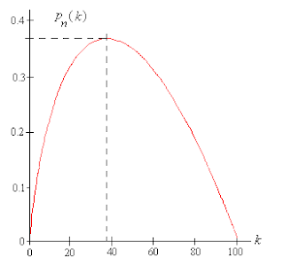

Algorithmic trading requires strategic decision-making to achieve optimal financial outcomes in a competitive environment. Optimal stopping theory serves as an essential mathematical framework tailored for making pivotal trading decisions. It is a branch of mathematics that involves deciding the best time to take a particular action to optimize rewards or minimize costs. This concept is instrumental in guiding traders when to execute trades, thereby maximizing their expected returns or minimizing potential losses.

In the context of algorithmic trading, optimal stopping theory provides traders with the tools to evaluate and determine the best moments for buying or selling assets. By applying this theory, traders can make informed decisions that align with their strategic objectives. The theory utilizes a structured approach, incorporating statistical and probabilistic elements, to address fundamental questions regarding the timing of trades.

Moreover, the advancement of technology, particularly the integration of artificial intelligence and computational algorithms, plays a significant role in implementing these strategies effectively. Cutting-edge technologies facilitate the application of optimal stopping rules in real-time, allowing traders to react swiftly to market changes. Through these innovative methods, traders can enhance their ability to manage risk and capitalize on market opportunities, thereby optimizing their overall trading performance.

This article will explore the significance, key concepts, and practical applications of optimal stopping theory within algorithmic trading, providing insights into how technology enables the deployment of these sophisticated strategies. Understanding and strategically implementing optimal stopping mechanisms can significantly elevate trading efficacy and outcome success.

## Table of Contents

## Understanding Optimal Stopping Theory

Optimal stopping theory is a mathematical discipline that focuses on determining the optimal time to take a specific action to maximize rewards or minimize costs. This branch of mathematics is pivotal in areas such as finance and trading, where strategic timing can significantly influence outcomes.

Central to the theory is the integration of [statistics](/wiki/bayesian-statistics) and probability, which provides the foundation for making informed decisions in trading environments. By applying statistical methods, traders can assess the likelihood of various outcomes, thereby optimizing decision-making processes. Through probability theory, traders evaluate different scenarios and potential payoffs, allowing for a structured approach to forecasting and managing risks.

A fundamental aspect of optimal stopping theory is addressing the question of when to execute a trade to achieve the best possible financial result. This involves the critical concepts of stopping rules and optimal stopping times. A stopping rule is a predefined set of criteria that determines when an action should be taken. This rule is integral for guiding trading decisions, ensuring actions are taken at the most opportune moments.

Optimal stopping time refers to the calculated point at which executing a trade will yield the highest expected value. Determining this time involves analyzing multiple factors such as current market conditions, asset [volatility](/wiki/volatility-trading-strategies), and potential future market movements.

Mathematically, optimal stopping problems are often expressed through objective functions that model the expected value of decisions over time. Solving these involves state processes that represent the evolution of relevant variables, as well as stopping times when actions should optimally occur. Solutions to these problems frequently invoke Bellman equations, which provide a recursive method for determining the maximum expected return obtainable by making decisions at different possible stopping times.

In summary, optimal stopping theory equips traders with a methodical approach to decision-making by utilizing mathematical models and probabilistic assessments. Its components, ranging from stopping rules to optimal stopping times, form the core strategies employed in [algorithmic trading](/wiki/algorithmic-trading) to enhance profitability and mitigate risks.

## Key Concepts of Optimal Stopping

Stopping rules are essential criteria that dictate when a trader should perform a buy or sell action. These rules are based on specific conditions within the market or an asset's performance, ensuring decisions are made at optimal points to maximize gains or minimize losses. In the framework of algorithmic trading, stopping rules are used to take advantage of data-driven insights, thus allowing traders to act on predefined signals.

The optimal stopping time is a key element, representing the precise moment to execute a trade to achieve maximum expected value. This requires a comprehensive analysis of market conditions and trends to determine when the benefits of a trade outweigh its risks. Calculating this optimal time involves continuous monitoring and analysis to assess when certain criteria are met, guiding traders towards maximizing their return on investment.

Mathematical formulation is integral to optimal stopping theory. At its core, it involves defining objective functions that signify the goals of a trading strategy, such as maximizing profit or minimizing risk. State processes, such as the price evolution of an asset, are modeled to predict and react according to market changes. The theory utilizes stopping time, which is mathematically defined as a random variable representing the time at which certain conditions are fulfilled to justify making a transaction. Bellman equations play a crucial role by offering a recursive method to determine the optimal value function and the best stopping strategy. This approach helps in mapping out the conditions and strategies necessary to identify the ideal points for trade actions.

These concepts collectively provide a structured approach to strategizing in algorithmic trading. Implementing stopping rules and calculating optimal stopping times using mathematical models allows traders to operationalize their strategies effectively. By leveraging objective functions and solutions to Bellman equations, the trading algorithms are better equipped to navigate volatile markets and reinforce trading decisions aligned with optimal financial outcomes.

## Applications in Algorithmic Trading

Optimal stopping theory plays a significant role in algorithmic trading by aiding market timing decisions, which are crucial for maximizing returns or minimizing risks. The application of this theory allows traders to determine the optimal times to enter or [exit](/wiki/exit-strategy) market positions. This is especially valuable in volatile markets, where precise timing can make a significant difference in profitability.

In the context of financial options, optimal stopping theory is used to identify the best time to exercise options to maximize financial gains. The timing of option exercises can dramatically impact pricing strategies and potential profits. By leveraging objective functions that [factor](/wiki/factor-investing) in market variables and using stopping rules, traders can ascertain the ideal moments to act.

Real-time trading algorithms frequently integrate optimal stopping rules to facilitate instantaneous decision-making. These algorithms assess current market conditions, forecast potential price movements, and employ stopping rules to execute trades at opportune moments. For instance, if a trading algorithm detects a favorable price trend, it can use optimal stopping criteria to decide whether to hold a position or take profits.

Stochastic processes are integral to these applications, providing a mathematical framework to evaluate and predict asset price trends. By modeling asset prices as stochastic processes, traders can simulate various scenarios and outcomes, helping them establish more effective trading patterns. This mathematical modeling supports the development of strategic patterns that anticipate market fluctuations and capitalize on them.

Overall, optimal stopping theory enhances algorithmic trading strategies by refining market timing and decision-making processes, making it a valuable tool for traders and financial institutions seeking to optimize their trading performance.

## Practical Implementations

Financial institutions and trading platforms leverage optimal stopping theory extensively in their sophisticated algorithmic trading systems. Renowned firms such as Optiver, Jane Street, and Renaissance Technologies have adopted these frameworks to enhance the precision and effectiveness of their trading operations. These firms utilize the theory to determine the most opportune moments for executing trades, thereby optimizing their strategies for maximum profitability.

Optimal stopping theory aids in refining trading systems by incorporating advanced mathematical models, including stochastic models and predictive analytics. Stochastic models, in particular, are vital as they allow these firms to manage and predict market volatility and asset price movements. By utilizing these models, traders can develop stopping rules that effectively balance potential rewards and risks, ensuring that trades are made at the optimal time.

Trading platforms integrate computational power, enabling real-time data analysis and decision-making. For example, the integration of high-frequency trading systems allows for the swift execution of trades based on complex algorithms that continuously assess market conditions and asset price changes. These systems often employ [backtesting](/wiki/backtesting) to refine algorithms, ensuring optimal performance in live trading environments.

Additionally, algorithmic platforms use predictive analytics to forecast future market trends and asset values. Through [machine learning](/wiki/machine-learning) and advanced statistical methods, these platforms can generate predictive models that inform stopping rules, ultimately guiding traders in executing well-timed market entries and exits. This approach enhances the accuracy of trading decisions and increases the potential for profit while mitigating associated risks.

Implementing optimal stopping rules within algorithmic trading frameworks also involves solving complex mathematical formulations, such as Bellman equations. These equations are used to determine optimal stopping points by evaluating the expected future value of holding versus executing a trade at each decision point. The solution to these equations provides a robust decision-making mechanism that aligns with traders' risk and return preferences.

By leveraging optimal stopping theory, trading systems can adapt to rapidly changing market conditions, allowing firms to remain competitive. The implementation of this theory not only improves the strategic aspect of trades but also contributes to a more efficient utilization of resources, further reinforcing the value of this mathematical approach in the dynamic landscape of algorithmic trading.

## Conclusion

Optimal stopping theory serves as a comprehensive mathematical structure vital for the success of algorithmic trading. By offering traders a reliable method for making crucial decisions about when to enter or exit trades, the theory fundamentally enhances the ability to make informed, data-driven decisions. Real-time data processing is crucial in trading, and optimal stopping theory empowers traders with the capability to utilize this information effectively.

The integration of [artificial intelligence](/wiki/ai-artificial-intelligence) and computational algorithms into optimal stopping frameworks significantly bolsters the management and refinement of trading strategies. Algorithms can process large volumes of market data faster than human traders, identifying optimal stopping times by evaluating complex stochastic models instantaneously. This enables traders to respond rapidly to market fluctuations, maximizing potential returns or minimizing losses.

Furthermore, a deep understanding and implementation of optimal stopping mechanisms can considerably elevate trading performance and strategy efficacy. For instance, employing stopping rules and calculating optimal stopping times allows for the strategic timing of trades based on calculated expectations, ultimately improving financial outcomes. 

In conclusion, mastery of optimal stopping theory not only aids in perfecting trading strategies but also provides a competitive edge in the fast-paced environment of algorithmic trading. Through strategic use of this theory, traders can optimize their trading actions effectively, thereby achieving superior financial performance.

## References & Further Reading

[1]: Peskir, G., & Shiryaev, A. (2006). ["Optimal Stopping and Free-Boundary Problems"](https://link.springer.com/book/10.1007/978-3-7643-7390-0) Oxford University Press.

[2]: Lopez de Prado, M. (2018). ["Advances in Financial Machine Learning"](https://www.amazon.com/Advances-Financial-Machine-Learning-Marcos/dp/1119482089) John Wiley & Sons.

[3]: Øksendal, B. (2003). ["Stochastic Differential Equations: An Introduction with Applications"](https://link.springer.com/book/10.1007/978-3-642-14394-6) Springer.

[4]: Shang, P. J., & Shen, A. J. (2018). ["Optimal Stopping for Financial application"](https://onlinelibrary.wiley.com/doi/abs/10.1002/adfm.201804170) Procedia Computer Science.

[5]: Hull, J. C. (2014). ["Options, Futures, and Other Derivatives"](https://elibrary.pearson.de/book/99.150005/9781292410623) Pearson.