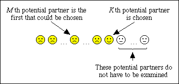

## Table of Contents

## What is optimal stopping?

Optimal stopping is a decision-making strategy where you try to find the best time to stop looking for something and make a choice. Imagine you're looking for the best apple in a basket. You don't want to pick the first one you see, because there might be better ones deeper in the basket. But you also don't want to keep looking forever, because you might miss out on a good apple. Optimal stopping helps you figure out when to stop looking and pick an apple that's good enough.

This strategy is used in many real-life situations, like hiring employees or buying a house. For example, when hiring, you might interview a few candidates first to get a sense of the quality of applicants. Then, you stop looking and hire the next person who is better than all the ones you've seen so far. The key is to balance the time spent looking with the risk of missing out on the best option. By using optimal stopping, you can make better decisions and feel more confident about your choices.

## Can you provide a simple example of an optimal stopping problem?

Imagine you're at a job fair and you want to find the best job offer. You can only interview a certain number of companies, say 10, and you have to decide on the spot whether to accept an offer or keep looking. The goal is to find the best job without missing out on good opportunities.

Here's how you might use optimal stopping: First, you interview the first 3 or 4 companies just to get a feel for what's out there. You don't accept any offers from these companies. After that, you start accepting the first offer that's better than any of the ones you've seen so far. This way, you give yourself a chance to see what's available without waiting too long and missing out on a good job.

## What are the key elements of an optimal stopping problem?

The key elements of an optimal stopping problem are the decision to stop or continue and the criteria for making that decision. Imagine you're trying to find the best apple in a basket. You need to decide when to stop looking and pick an apple. The criteria could be that you've seen enough apples to know what a good one looks like, and you'll pick the next one that's better than all the others you've seen.

Another important element is the trade-off between waiting for a better option and the risk of missing out on a good one. If you wait too long, you might miss the best apple. But if you stop too soon, you might not get the best one. The goal is to find a balance that gives you a good chance of getting a great apple without spending too much time looking.

## How does the Secretary Problem illustrate optimal stopping?

The Secretary Problem is a classic example of optimal stopping. Imagine you're hiring a secretary and you interview 100 candidates one by one. You can only hire a candidate right after their interview, and once you pass on someone, you can't go back. The goal is to pick the best candidate. To solve this, you first interview about 37 of the candidates without hiring anyone. This helps you get a sense of what a good candidate looks like. After that, you hire the first candidate who is better than all the ones you've seen so far.

This strategy works because it balances the risk of choosing too early with the risk of waiting too long. By looking at the first 37 candidates, you get a good idea of the quality of applicants. Then, by hiring the first person better than those 37, you increase your chances of getting the best candidate without missing out on good ones. The number 37 comes from math that shows it's the best way to balance these risks. This approach can be used in many real-life situations where you need to make a choice from a series of options.

## What are some common strategies used in optimal stopping?

One common strategy in optimal stopping is the "look-then-leap" approach. This means you spend some time looking at options without choosing any, just to get a feel for what's out there. For example, if you're buying a car, you might visit a few dealerships first without buying anything. Once you have a good idea of what's available, you then start choosing the first option that's better than all the ones you've seen so far. This strategy helps you make a better choice without spending too much time looking.

Another strategy is setting a threshold. This means you decide on a certain level of quality or value that you're looking for, and you stop looking as soon as you find something that meets that threshold. For instance, if you're looking for a job, you might decide you'll take the first job offer that pays at least $50,000 a year. This approach can be useful when you have a clear idea of what you want and don't want to spend too much time searching. Both strategies help you balance the time spent looking with the risk of missing out on a good option.

## How can optimal stopping be applied in real-life scenarios?

Optimal stopping can be used in everyday life when you're trying to make a choice from a bunch of options. Imagine you're looking for a new apartment. You don't want to pick the first one you see because there might be better ones out there. But you also don't want to keep looking forever because you might miss out on a good apartment. So, you might look at a few apartments first without deciding on any. This helps you get a feel for what's available. Then, you can choose the next apartment that's better than all the ones you've seen so far. This way, you increase your chances of finding a great apartment without spending too much time looking.

Another example is when you're buying a used car. You can't look at every car in the city, so you need to decide when to stop looking and buy one. You might visit a few dealerships first just to see what's out there. After that, you can buy the first car that's better than all the ones you've seen so far. This strategy helps you find a good car without missing out on other good options. By using optimal stopping, you can make better decisions in many parts of your life, like choosing a job, buying a house, or even [picking](/wiki/asset-class-picking) a restaurant for dinner.

## What is the role of probability and statistics in optimal stopping?

Probability and [statistics](/wiki/bayesian-statistics) play a big role in optimal stopping. They help you figure out the best time to stop looking and make a choice. For example, in the Secretary Problem, math shows that looking at about 37% of the options without choosing any gives you the best chance of picking the top candidate. This number comes from probability calculations that balance the risk of choosing too early with the risk of waiting too long. By using these calculations, you can make better decisions and feel more confident about your choices.

In real life, you might not always have exact numbers, but you can still use probability and statistics to guide your decisions. For instance, if you're buying a car, you might not know the exact quality of every car out there, but you can use what you've seen so far to estimate the chances of finding a better one. By understanding these probabilities, you can decide when it's worth keeping looking and when it's time to stop and choose. This way, you can make smarter choices without spending too much time searching.

## Can you explain the concept of the 'optimal stopping rule'?

The 'optimal stopping rule' is a way to decide when to stop looking for something and make a choice. Imagine you're trying to find the best apple in a basket. You don't want to pick the first apple you see because there might be better ones deeper in the basket. But you also don't want to keep looking forever because you might miss out on a good apple. The optimal stopping rule helps you figure out when to stop looking and pick an apple that's good enough. It's like a guide that tells you when you've looked enough and it's time to choose.

This rule uses math and probability to help you make the best decision. For example, if you're hiring a new employee, you might interview a few people first without hiring anyone. This helps you get a feel for what a good candidate looks like. Then, you can hire the next person who is better than all the ones you've seen so far. The math behind this rule shows that looking at about 37% of your options without choosing any gives you the best chance of picking the top choice. By following the optimal stopping rule, you can make better decisions in many parts of your life, like buying a house, choosing a job, or even picking a restaurant for dinner.

## How do you calculate the expected value in an optimal stopping problem?

Calculating the expected value in an optimal stopping problem helps you figure out the best time to stop looking and make a choice. Imagine you're trying to find the best apple in a basket. You want to know how good the apple you pick will be on average if you follow a certain strategy. To do this, you look at all the possible outcomes of your strategy and how likely each one is. For example, if you decide to look at the first few apples without picking any, and then choose the next apple that's better than all the ones you've seen, you can calculate the average quality of the apple you'll end up with.

To calculate the expected value, you add up the value of each possible outcome multiplied by how likely it is to happen. In the apple example, you might find that if you follow your strategy, you have a 20% chance of picking the best apple, a 30% chance of picking the second-best apple, and so on. You multiply the value of each apple by its chance of being picked, and then add all those numbers together. This gives you the expected value, which is the average quality of the apple you'll pick if you use your strategy many times. By comparing the expected values of different strategies, you can choose the one that gives you the best average result.

## What advanced mathematical techniques are used to solve complex optimal stopping problems?

Advanced mathematical techniques used to solve complex optimal stopping problems often involve dynamic programming and stochastic processes. Dynamic programming helps break down a big problem into smaller, easier parts. Imagine you're trying to find the best apple in a basket. Instead of thinking about the whole basket at once, you can think about each apple one at a time. You make a choice at each step based on what you've seen so far and what you think you might see next. This way, you can figure out the best strategy step by step. Stochastic processes, on the other hand, help you understand how things change over time when there's some randomness involved. For example, if the quality of apples in the basket changes as you look, you can use these processes to predict how likely it is that the next apple will be better than the ones you've seen.

Another important technique is the use of martingale theory, which helps you understand how to make decisions when you're dealing with uncertain outcomes. Martingales are like a special kind of betting game where, over time, your expected winnings stay the same. In optimal stopping, this can help you figure out when it's worth keeping looking for a better option and when it's time to stop. By using these advanced techniques, you can solve complex problems where the best choice isn't always clear. These methods help you make better decisions by considering all the possible outcomes and their probabilities, even when things are changing and uncertain.

## How does the theory of optimal stopping relate to decision theory?

The theory of optimal stopping is a big part of decision theory. Decision theory is all about making choices when you don't know everything. Optimal stopping helps you figure out when to stop looking for more information and make a choice. Imagine you're trying to find the best apple in a basket. You don't want to pick the first one you see because there might be better ones deeper in the basket. But you also don't want to keep looking forever because you might miss out on a good apple. Optimal stopping gives you a way to decide when you've looked enough and it's time to choose. This is really helpful in decision theory because it helps you balance the time you spend looking with the risk of missing out on a good option.

In decision theory, you often have to make choices based on what you know and what you think might happen. Optimal stopping helps you use what you've learned so far to make the best choice. For example, if you're buying a car, you might visit a few dealerships first without buying anything. This helps you get a feel for what's out there. Then, you can buy the first car that's better than all the ones you've seen so far. By using optimal stopping, you can make better decisions in many parts of your life, like choosing a job, buying a house, or even picking a restaurant for dinner. It's all about finding the right time to stop looking and make a choice that you feel good about.

## What are the current research trends and open problems in the field of optimal stopping?

Researchers are always looking for new ways to solve optimal stopping problems. One big trend is using computers to help solve these problems. Computers can look at a lot of data and find patterns that people might miss. This is called [machine learning](/wiki/machine-learning). Researchers are trying to use machine learning to make better decisions in optimal stopping problems. Another trend is looking at how people actually make choices in real life. Sometimes, people don't follow the math perfectly. Researchers want to understand why and how to help people make better choices.

There are also some open problems in optimal stopping that researchers are still trying to figure out. One big question is how to solve optimal stopping problems when the information keeps changing. Imagine you're trying to find the best apple in a basket, but the apples keep getting moved around. It's hard to know when to stop looking and pick an apple. Another open problem is how to solve optimal stopping problems when you have to make choices quickly. Sometimes, you don't have a lot of time to think about your choices. Researchers are trying to find ways to make good decisions even when time is short. These are just a few of the things that researchers are working on in the field of optimal stopping.

## References & Further Reading

[1]: Peskir, G., & Shiryaev, A. (2006). ["Optimal Stopping and Free-Boundary Problems"](https://link.springer.com/book/10.1007/978-3-7643-7390-0) Oxford University Press.

[2]: Lopez de Prado, M. (2018). ["Advances in Financial Machine Learning"](https://www.amazon.com/Advances-Financial-Machine-Learning-Marcos/dp/1119482089) John Wiley & Sons.

[3]: Øksendal, B. (2003). ["Stochastic Differential Equations: An Introduction with Applications"](https://link.springer.com/book/10.1007/978-3-642-14394-6) Springer.

[4]: Shang, P. J., & Shen, A. J. (2018). ["Optimal Stopping for Financial application"](https://onlinelibrary.wiley.com/doi/abs/10.1002/adfm.201804170) Procedia Computer Science.

[5]: Hull, J. C. (2014). ["Options, Futures, and Other Derivatives"](https://elibrary.pearson.de/book/99.150005/9781292410623) Pearson.