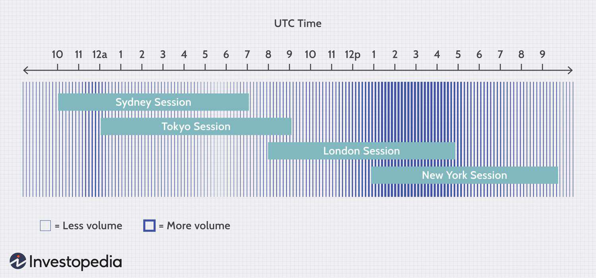

Stock market timing refers to the strategic decision-making process that involves selecting optimal moments to buy or sell stocks to maximize returns and minimize risks. It holds significant importance in the field of investing, as choosing the best times to trade can greatly influence an investor's success. Market timing requires a keen understanding of various factors that impact stock prices, including market volatility and liquidity. Volatility represents the rate at which the price of a security increases or decreases, affecting the predictability and risk of stock movements. High volatility often leads to rapid price changes, presenting both opportunities and threats to traders seeking precise entry and exit points. Liquidity, on the other hand, refers to the ease with which an asset can be bought or sold in the market without affecting its price. Higher liquidity ensures smoother transactions and less price slippage, making timing decisions crucial to leverage favorable market conditions.

Algorithmic trading, commonly known as algo trading, plays a significant role in stock market timing. By utilizing computer algorithms to execute trades based on pre-defined criteria, algo trading enhances the speed and efficiency of trading activities. It aids traders in rapidly responding to market changes, exploiting short-lived price discrepancies, and executing large volumes of trades with minimal market impact. The advent of algorithmic trading has transformed the timing landscape, allowing traders to capitalize on market inefficiencies that might be imperceptible through manual trading.



The purpose of this article is to explore the intricate world of stock market timing, considering various factors that influence trading decisions. From analyzing market hours to understanding the role of economic calendar events, this article aims to provide a comprehensive understanding of the strategies and tools available for optimizing trade timing. Furthermore, it highlights the rise of algorithmic trading and its profound impact on timing strategies. Through a thorough examination of these topics, the article seeks to equip traders with knowledge and insights needed to effectively engage in market timing, while also acknowledging the risks and challenges inherent in such an approach.

## Table of Contents

## Understanding Stock Market Timing

Stock market timing refers to the strategic decision-making process used by investors and traders to determine when to buy or sell stocks, based on predictions about future market movements. The goal is to enhance returns by entering and exiting the market at advantageous times, rather than holding a stock for an extended period. This practice involves analyzing various factors, including market trends, economic indicators, and sometimes individual stock performance.

Historically, stock market timing has evolved significantly. In the early 20th century, market timing was primarily dominated by fundamental analysis, where the focus was on a company's financial health and market position. Over the years, with the advent of technology, technical analysis, which involves evaluating statistical trends from trading activities such as price movement and volume, has become increasingly popular. The incorporation of computer algorithms in recent decades, known as algorithmic trading, has further revolutionized market timing by enabling high-frequency trades, sometimes executing trades in milliseconds.

Key factors influencing stock market timing include macroeconomic announcements such as interest rates, employment data, and inflation reports, which can cause significant market movement. Geopolitical events and company-specific news, such as earnings releases, also play crucial roles, as they can create volatility and affect investor sentiment. Additionally, technical indicators like moving averages and relative strength index (RSI) are commonly used tools that help traders make informed timing decisions.

The decision to time the market comes with both advantages and disadvantages. On the one hand, successful market timing can lead to enhanced returns by capturing high-value trades, reducing exposure during market downturns, and capitalizing on short-term price [volatility](/wiki/volatility-trading-strategies). On the other hand, it carries significant risks. Market timing requires accurate forecasts, which can be challenging given the market's inherent unpredictability and susceptibility to sudden changes. This complexity increases the risk of mistimed trades, potentially leading to substantial financial losses. Furthermore, frequent trading can result in higher transaction costs and increased tax liabilities due to short-term capital gains.

Contrastingly, long-term investing focuses on holding investments over extended periods, typically disregarding short-term market fluctuations. This strategy benefits from the overall growth trajectory of the market, known as the "compound growth effect," where reinvested earnings generate additional earnings. Long-term investing requires less active management, thereby reducing transaction costs and generally resulting in more favorable tax treatment for long-term capital gains.

In conclusion, stock market timing is a sophisticated trading approach that can generate significant rewards but carries high risks. Investors must weigh these factors against the benefits of long-term investing, which, while generally offering steadier returns, may not capitalize on short-term market inefficiencies.

## Best Times to Trade Stocks

Stock trading requires an understanding of market hours, which vary across global exchanges. Knowing the optimal times to trade can significantly impact trade [volume](/wiki/volume-trading-strategy), volatility, and potential returns. This section provides an overview of global market hours, analyzes their influence on trading dynamics, and identifies the best days and times to engage in stock trading, emphasizing the role of economic calendar events and earnings reports.

### Markets' Opening and Closing Times Globally

Stock exchanges operate according to local business hours. For instance, the New York Stock Exchange (NYSE) and the Nasdaq operate from 9:30 AM to 4:00 PM Eastern Time. In London, the London Stock Exchange (LSE) runs from 8:00 AM to 4:30 PM GMT. Asian markets, like the Tokyo Stock Exchange, operate between 9:00 AM and 3:00 PM Japan Standard Time. These hours dictate when traders can execute buy or sell orders, making them critical to any trading strategy.

### Impact of Market Hours on Trade Volume and Volatility

Market hours coincide with periods of heightened trading activity. Opening hours generally see high volume as traders react to overnight news and data. Similarly, the closing hours can experience spikes in activity as traders finalize positions before the market closes. Higher trade volumes during these periods often result in increased volatility, presenting both opportunities and risks for traders.

To quantify volatility, the standard deviation of price changes is often used:

$$
\sigma = \sqrt{\frac{\sum_{i=1}^{n} (x_i - \bar{x})^2}{n}}
$$

where $\sigma$ is the standard deviation, $x_i$ represents individual price changes, and $\bar{x}$ is the mean of those changes.

### Identifying the Best Days and Times to Trade Stocks

Research suggests that certain days and times yield better trading results. Historical market data indicates that Mondays tend to have lower volatility, possibly due to traders assimilating news from the weekend. Midweek trading, particularly on Wednesdays and Thursdays, often sees increased activity and [liquidity](/wiki/liquidity-risk-premium). Research by the Federal Reserve and other institutions indicates that the first and last hours of trading each day, known as the opening and closing auctions, are critical times when significant price movements and opportunities can occur.

### Role of Economic Calendar Events and Earnings Reports

Economic indicators such as gross domestic product (GDP) reports, employment figures, and [interest rate](/wiki/interest-rate-trading-strategies) announcements significantly impact market movement. Earnings reports from major companies also cause price fluctuations due to investor reactions to financial results and forecasts. Being aware of these events is crucial for traders aiming to maximize their timing strategies.

By monitoring economic calendars and setting alerts for key events, traders can anticipate periods of market volatility and adjust their strategies accordingly. Platforms like Bloomberg or Reuters provide comprehensive schedules of these events, aiding traders in decision-making.

In conclusion, understanding global market hours and their impact on trade volume and volatility is pivotal for successful stock trading. By exploiting the most favorable times and days to trade, and by being cognizant of influential economic events, traders can enhance their strategies, aligning their actions with market dynamics.

## Impact of Timing on Stock Trading Strategies

Stock market timing plays a crucial role in a variety of trading strategies, each of which depends heavily on selecting optimal moments for buying and selling assets. Among the most prevalent strategies are [day trading](/wiki/day-trading-spy), swing trading, and long-term investing, and each interacts uniquely with time-based market fluctuations.

Day trading is highly sensitive to timing as it requires executing trades within a single trading day. Traders primarily rely on market volatility and liquidity to capitalize on short-term price movements. The timing of trades is often based on technical indicators such as moving averages, stochastic oscillators, or candlestick patterns. A common tactic is to enter trades during the morning session when market activity and price movements are most pronounced. For instance, during the first hour after the market opens, also known as the "power hour," traders can find increased volatility, which can create profitable trading opportunities. Timely market entries and exits are vital, and successful day traders often utilize high-frequency trading strategies driven by complex algorithms to optimize the timing of their trades.

Swing trading, on the other hand, spans a longer duration, from a few days to several weeks, allowing traders to capitalize on medium-term market fluctuations. Timing in swing trading revolves around recognizing patterns and trends that indicate potential upswings or downtrends. Technical analysis, along with chart patterns such as head and shoulders or flag patterns, aids traders in making informed decisions about when to open or close a position. Swing traders often pay attention to economic calendar events, as major announcements can cause significant price swings. By timing their trades around these events, swing traders can optimize their chances of capturing sizable price movements.

In contrast, long-term investing is less reliant on precise market timing. Instead, investors focus on the fundamentals of the companies they invest in and hold onto their stocks for extended periods, often years. The concept of "time in the market" rather than "timing the market" is emphasized here. Long-term strategies benefit from compound growth and are particularly effective when investors can resist the temptation to act on short-term market trends or news. However, strategic timing can still play a role when initially entering or exiting positions, with some investors adopting a dollar-cost averaging strategy to mitigate timing risks.

Several case studies illustrate the impact of timing on trading success. One notable example involves Warren Buffett's investment in Coca-Cola. While his strategy was fundamentally driven, Buffett timed his purchase during a market downturn, securing a significant position at a lower valuation. Meanwhile, high-profile day trading successes often involve trading on earnings announcements or geopolitical developments, where trades are executed with precision timing to exploit rapid price changes.

Overall, timing is a fundamental component of stock trading strategies, affecting how traders react to market conditions and adapt their approaches to maximize profitability.

## The Rise of Algorithmic Trading (Algo Trading)

Algorithmic trading, or algo trading, encompasses the use of complex algorithms in the form of software to perform trading decisions at unparalleled speeds and volumes. It has gained significant popularity over recent decades due to advancements in technology and the increasing need for precision and speed in financial markets.

Algorithmic trading optimizes trading times and execution speed by utilizing computational power to analyze market conditions and execute trades at the most opportune moments. By employing sophisticated mathematical models and processing vast amounts of data, algo trading systems can identify trends and patterns that may not be visible to human traders. This capability allows algorithms to execute trades in fractions of a second, leveraging market-moving information instantaneously. For example, high-frequency trading ([HFT](/wiki/high-frequency-trading-strategies)) strategies continuously scan order [books](/wiki/algo-trading-books) in search of [arbitrage](/wiki/arbitrage) opportunities, executing trades in milliseconds to capture small price differentials.

Comparing human trading to [algorithmic trading](/wiki/algorithmic-trading) reveals distinct advantages for the latter in terms of timing and execution. While human traders rely on experience and intuition, their responses are often slower and influenced by emotions. Algorithms, however, can operate on predefined criteria without emotional interference, allowing them to make rapid and consistent decisions. While human traders may take several seconds to process information and place trades, algorithms can execute hundreds of trades in the same timeframe, optimizing profits and minimizing the impact of market volatility.

Several algorithmic trading strategies have showcased success by focusing on market timing. One such strategy is [statistical arbitrage](/wiki/statistical-arbitrage), which involves identifying price discrepancies between correlated assets and executing trades based on mean-reversion principles. By leveraging historical data and statistical models, this strategy identifies temporary price deviations and exploits them for profit. Another notable strategy is trend-following, where algorithms detect and capitalize on sustained market trends. These strategies demonstrate the effectiveness of algorithmic trading in precisely timing market entries and exits, thereby enhancing profitability and reducing the risks associated with manual trading.

In conclusion, the rise of algorithmic trading has revolutionized financial markets by optimizing trading times and execution speed. Through advanced computational techniques and the minimization of human error, algo trading has proven to be a formidable tool in enhancing trading efficiency and accuracy. As technology continues to develop, the role of algorithmic trading in shaping market dynamics is likely to expand further, offering traders new opportunities to harness the power of algorithms in their investment strategies.

## Tools and Techniques for Optimal Stock Market Timing

In the world of stock trading, timing is a crucial aspect that can significantly affect the profitability of trades. Various software tools and techniques are available to help traders optimize their timing strategies.

### Software and Tools

1. **Trading Platforms**: Platforms like MetaTrader, E*TRADE, and Interactive Brokers offer sophisticated tools for charting and analysis, allowing traders to execute trades efficiently. These platforms often include features such as real-time data feeds, customizable charting tools, and automated trading scripts, which can be programmed using languages like Pine Script or Python to develop custom indicators or strategies.

2. **Technical Analysis Software**: Software tools such as TradeStation and NinjaTrader provide extensive technical analysis capabilities. They allow traders to analyze historical data, identify patterns, and backtest strategies. These tools often support various technical indicators, including moving averages, MACD, RSI, and Bollinger Bands, aiding traders in identifying potential entry and exit points.

3. **Algorithmic Trading Systems**: These systems are designed for automating trading strategies using predefined algorithms. They take advantage of speed and precision, enabling traders to execute trades based on complex strategies faster than manual methods. For instance, QuantConnect and Qubole provide platforms for developing, testing, and deploying algorithmic strategies using Python.

### Techniques for Stock Market Timing

1. **Technical Analysis**: This technique involves analyzing price charts and using technical indicators to forecast future market movements. Traders look for patterns such as head and shoulders, triangles, and flags, which can signal potential market reversals or continuations. The goal is to identify trends and reversals early to capitalize on price movements.

2. **Trend Following**: As a strategy, trend following involves identifying asset price trends and making buy or sell decisions based on their direction. Techniques like moving averages and the Average Directional Index (ADX) help traders discern the strength and direction of trends. This strategy relies on the assumption that prices tend to move in familiar patterns and that trends will persist for a period.

3. **News Feeds and Sentiment Analysis**: News events can cause significant market volatility. Tools that provide real-time news feeds, such as Bloomberg Terminal or Thomson Reuters Eikon, are crucial for staying informed about market-moving events. Sentiment analysis, often powered by natural language processing algorithms, helps traders gauge market sentiment by analyzing social media, forums, and news articles. This analysis can provide insights into the general mood of the market, which can be used to anticipate market reactions to specific news.

4. **Data Analytics**: Advanced analytics tools process large datasets to identify correlations, trends, and patterns that may not be immediately obvious. Machine learning techniques are increasingly used in this context to build predictive models that can forecast future price movements based on historical data.

### Example of Technical Analysis in Python

Technical analysis can be performed using libraries such as Pandas and TA-Lib. Here is a simple example using Python to compute a moving average:

```python
import pandas as pd
import yfinance as yf  # For more datasets, visit: https://paperswithbacktest.com/datasets

# Fetch historical data for a stock
data = yf.download('AAPL', start='2023-01-01', end='2023-10-01')

# Calculate a 20-day moving average
data['MA20'] = data['Close'].rolling(window=20).mean()

# Print the data with the moving average
print(data[['Close', 'MA20']].tail())
```

This script uses the `yfinance` library to obtain historical stock data and calculates a 20-day moving average on the closing prices, providing a visual indicator of the trend direction.

Overall, by leveraging a combination of sophisticated software tools and analytical techniques, traders can optimize their timing strategies and improve their chances of successfully navigating the stock market's complexities.

## Risks and Challenges of Timing the Stock Market

Timing the stock market presents several risks and challenges, making it a complex endeavor even for experienced traders. One of the most significant hurdles is the psychological factors and decision-making biases that can cloud judgment and lead to suboptimal trading decisions. Cognitive biases such as overconfidence, where traders overestimate their knowledge or ability to predict market movements, can lead to excessive risk-taking. Confirmation bias is another common issue, where traders focus on information that supports their preconceived ideas while disregarding evidence to the contrary. Such biases can result in traders making irrational decisions, rather than decisions based on objective market analysis.

Market timing is further complicated by the inherent unpredictability of market movements. Despite technological advances and the availability of vast amounts of data, accurately predicting short-term market fluctuations remains extremely challenging. Factors such as geopolitical events, unexpected economic reports, or sudden shifts in investor sentiment can rapidly alter market dynamics, often without warning. This unpredictability means that even well-researched timing strategies can be rendered ineffective by unforeseen market changes.

The financial risks involved in attempting to time the market cannot be overstated. Incorrect timing can lead to substantial financial losses, as traders may buy high and sell low, contrary to the fundamental trading principle of buying low and selling high. The introduction of leverage in trading strategies, often used to amplify potential returns, can magnify these losses, sometimes resulting in positions being liquidated.

Moreover, the costs associated with frequent trading, such as transaction fees and taxes, can erode potential profits and exacerbate losses. High-frequency trading strategies, which depend on capitalizing on short-lived opportunities, may lead to high transaction costs that can diminish the net gains from successful trades.

In conclusion, while attempting to time the stock market may offer the allure of enhanced returns, it is fraught with challenges and risks. Traders must be aware of the psychological traps that can impair judgment and the difficulty of forecasting market movements accurately. This awareness is crucial in mitigating the nuanced risks involved in market timing.

## Conclusion

Stock market timing is crucial for traders seeking to maximize their returns. By identifying the optimal times to execute trades, investors can take advantage of periods with higher liquidity and volatility, which often lead to better price movements and opportunities. Understanding market timing helps traders to align their strategies with periods of expected market activity, thereby increasing the likelihood of successful trades.

The rise of algorithmic trading has notably enhanced the ability to optimize market timing. Algorithms leverage vast amounts of data to make precise, rapid trading decisions that would be challenging for human traders to achieve. Algo trading systems harness advanced computational techniques to analyze patterns, execute trades at optimal times, and reduce latency. This speed and efficiency are particularly advantageous in markets where minute delays can impact profitability. The effectiveness of algo trading is evident as it allows for a systematic approach to market timing that mitigates emotional decision-making, a common pitfall among human traders.

Traders are encouraged to continuously learn and adapt in response to evolving market conditions. With the accessibility of digital resources, traders can remain informed about market trends, new trading strategies, and technological advancements. Engaging in ongoing education helps in refining timing strategies and adapting to the dynamic nature of financial markets. 

However, timing the stock market comes with inherent risks and challenges. The unpredictable nature of market movements means that even the most sophisticated timing strategies can encounter unforeseen events. Traders must therefore consider both the potential rewards and the associated risks. A comprehensive understanding of these factors is essential before implementing any trading strategy focused on market timing. Balancing calculated risks with strategic decision-making can ultimately lead to more informed and effective trading.

## Additional Resources

### Additional Resources

When aspiring to better understand stock market timing, numerous resources provide valuable insights and learning opportunities. Below is a selection of recommended books, articles, online courses, webinars, and trader communities that can aid in refining one’s skills and knowledge about market timing strategies.

#### Recommended Books and Articles
1. **"A Random Walk Down Wall Street" by Burton G. Malkiel** - This classic investment book provides insights into various investment strategies, including market timing, backed by historical analyses and empirical evidence.
2. **"Quantitative Trading: How to Build Your Own Algorithmic Trading Business" by Ernie Chan** - This book covers algorithmic and statistical strategies for trading, providing a solid foundation for building and understanding trading algorithms that can optimize timing.
3. **"Market Wizards" by Jack D. Schwager** - A collection of interviews with successful traders where market timing is often discussed as a crucial element of profitable trading strategies.
4. **Research Articles on JSTOR and SSRN** - Academic articles on platforms like JSTOR and SSRN often provide rigorous analyses of market timing strategies, discussing their viability across different market conditions.

#### Online Courses and Webinars
1. **Coursera - "Financial Markets" by Yale University** - This course offers a comprehensive overview of financial markets, including lectures on factors influencing market timing and decision-making in trading.
2. **Udemy - "Algorithmic Trading and Stocks Essential Training"** - Focusing on algorithmic trading, this course breaks down automated trading systems and the importance of timing the market accurately for enhanced trading performance.
3. **Investopedia Academy - "Become a Day Trader"** - This course provides practical knowledge necessary for day trading, with substantial content on market timing strategies tailored for short-term trading.
4. **Webinars hosted by the CME Group** - The CME Group frequently hosts webinars that touch on various subjects, including market trends, timing strategies, and algorithmic trading innovations.

#### Popular Forums and Communities
1. **r/algotrading on Reddit** - A subreddit dedicated to algorithmic trading, where traders share insights, strategies, and experiences about market timing and other trading components.
2. **Elite Trader Forum** - A community of traders ranging from novices to seasoned professionals, discussing market timing strategies and sharing tips on maximizing trading efficiency.
3. **Trade2Win Forum** - A global community where traders exchange ideas on market timing, discuss trade setups, and dissect economic events impacting the markets. 
4. **QuantConnect Community** - An active community focused on quantitative trading where market timing strategies are frequently discussed alongside algorithm development.

These resources should provide a broad array of insights and practical knowledge on stock market timing, catering to traders interested in improving their understanding and application of timing strategies in trading. Whether through reading, online courses, or engaging with trading communities, traders are offered comprehensive means to enhance their skills and judgment.

## References & Further Reading

[1]: Malkiel, B. G. (2019). ["A Random Walk Down Wall Street: The Time-Tested Strategy for Successful Investing."](https://www.amazon.com/Random-Walk-Down-Wall-Street/dp/1324002182) W. W. Norton & Company.

[2]: Chan, E. P. (2008). ["Quantitative Trading: How to Build Your Own Algorithmic Trading Business"](https://github.com/ftvision/quant_trading_echan_book) John Wiley & Sons.

[3]: Jansen, S. (2020). ["Machine Learning for Algorithmic Trading"](https://github.com/stefan-jansen/machine-learning-for-trading) Packt Publishing.

[4]: Schwager, J. D. (2012). ["Market Wizards: Interviews with Top Traders."](https://www.amazon.com/Market-Wizards-Jack-D-Schwager/dp/0887306101) Wiley.

[5]: Aronson, D. R. (2007). ["Evidence-Based Technical Analysis: Applying the Scientific Method and Statistical Inference to Trading Signals"](https://onlinelibrary.wiley.com/doi/book/10.1002/9781118268315) Wiley.

[6]: Lopez de Prado, M. (2018). ["Advances in Financial Machine Learning"](https://www.amazon.com/Advances-Financial-Machine-Learning-Marcos/dp/1119482089) Wiley.

[7]: "Trading and Exchanges: Market Microstructure for Practitioners" by Larry Harris discusses the intricacies of market structure which can affect timing strategies.