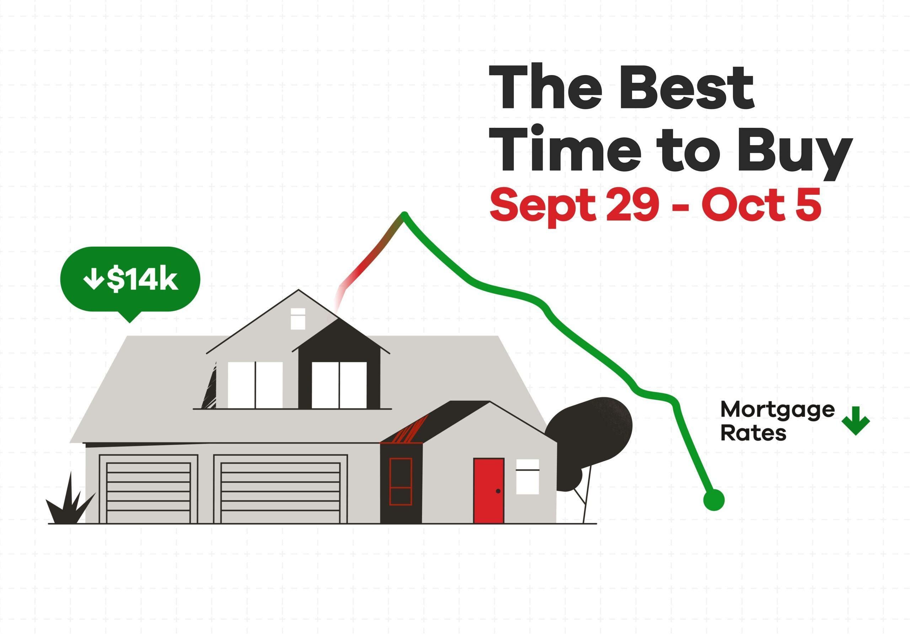

## Table of Contents

## What are the basic considerations for timing a house purchase?

When thinking about buying a house, one of the first things to consider is your personal situation. Are you planning to stay in the same place for a long time? Buying a house is a big commitment, so it's important to be sure you'll be there for a while. Also, think about your job and if you can afford the monthly payments. It's good to have a stable job and enough savings for a down payment and other costs like moving and fixing up the house.

Another important thing to think about is the market. House prices can go up and down, and it can be hard to know the best time to buy. Sometimes, it's better to buy when prices are low, but you also need to think about interest rates. If interest rates are low, it might be a good time to get a mortgage because your monthly payments will be smaller. But remember, trying to time the market perfectly can be risky, so it's often better to buy when you're ready and the house is right for you.

## How does the current economic climate affect the decision to buy a house?

The current economic climate plays a big role in deciding whether to buy a house. Right now, things like interest rates, job security, and the overall health of the economy can make a big difference. For example, if interest rates are low, it might be a good time to buy because your monthly mortgage payments will be smaller. But if the economy is shaky and there's a lot of uncertainty, you might want to wait. Job security is also important because you need to be sure you can keep making those payments every month.

Another thing to think about is what's happening with house prices. In some places, prices might be going up because a lot of people want to buy, while in other places, prices might be going down because fewer people are buying. If you think prices are going to keep going up, it might make sense to buy now before they get even higher. But if you think prices might go down, you might want to wait and see if you can get a better deal later. It's all about trying to figure out what's going to happen next, but nobody can predict the future perfectly, so it's important to make a decision based on what's best for you right now.

## What role does personal financial stability play in choosing the right time to buy a house?

Personal financial stability is really important when you're thinking about buying a house. It's all about making sure you have a steady job and enough money saved up. You need to be able to pay for the down payment, which can be a lot of money, and also cover other costs like moving and fixing up the house. If you're not sure about your job or if you don't have enough savings, it might be better to wait until you're more stable.

Another thing to think about is your monthly budget. When you buy a house, you'll have to make mortgage payments every month, and these can be pretty big. You need to make sure you can afford these payments along with all your other bills and expenses. If you're feeling good about your money situation and you know you can handle the payments, then it might be a good time to buy a house. But if you're worried about money, it's probably better to wait until you feel more secure.

## How can seasonal trends influence the timing of a house purchase?

Seasonal trends can affect when you decide to buy a house. In the spring and summer, a lot of people want to buy houses because the weather is nice and kids are out of school. This means there are more buyers, and prices might go up because everyone is competing. If you buy during these busy times, you might have to act fast and maybe pay more than you wanted.

On the other hand, fall and winter can be quieter times for buying houses. Fewer people are looking to move when it's cold or during the holidays. This means there might be fewer houses to choose from, but sellers might be more willing to lower their prices to sell their homes. If you're okay with looking at houses when it's not as busy, you might get a better deal. It's all about what works best for you and your family.

## What are the key interest rate indicators to watch before buying a house?

When you're thinking about buying a house, it's a good idea to keep an eye on interest rates. The most important one to watch is the Federal Funds Rate, which is set by the Federal Reserve. This rate affects other interest rates, like the ones for mortgages. If the Federal Funds Rate goes up, mortgage rates usually go up too, which means your monthly payments will be higher. If it goes down, mortgage rates might go down, making your payments smaller.

Another key indicator is the 10-Year Treasury Yield. This is the interest rate the government pays on its 10-year bonds, and it's a big deal because it influences long-term interest rates, including mortgage rates. When the 10-Year Treasury Yield goes up, mortgage rates often follow, making it more expensive to borrow money for a house. When it goes down, borrowing can become cheaper. Keeping an eye on these rates can help you decide if it's a good time to buy a house based on how much you'll have to pay each month.

## How does the real estate market cycle impact the optimal timing for purchasing a house?

The real estate market goes through cycles that can affect when it's best to buy a house. These cycles have different stages like recovery, expansion, hyper-supply, and recession. During the recovery stage, house prices start to go up slowly because more people want to buy. If you buy a house during this time, you might get a good deal before prices go up too much. The expansion stage is when prices keep going up because a lot of people want to buy, and it can be harder to find a good deal. If you wait until the hyper-supply stage, there might be more houses for sale, and sellers might lower their prices to sell them faster. But if you wait too long and get into the recession stage, prices might drop a lot, but it could also be hard to get a loan because the economy is not doing well.

It's important to think about where the market is in its cycle when you're deciding to buy a house. Nobody can predict the future perfectly, so it's a good idea to look at what's happening now and what experts think will happen next. If you think the market is in the early stages of recovery or expansion, it might be a good time to buy before prices go up too much. But if you think it's getting close to the hyper-supply or recession stage, you might want to wait for better deals or until the economy gets better. In the end, the best time to buy a house depends a lot on your own situation and what you think will happen with the market.

## What are the benefits and risks of buying during a buyer's market versus a seller's market?

Buying a house during a buyer's market can be a good thing because there are more houses for sale than people who want to buy them. This means you might be able to get a lower price on a house because sellers are trying harder to sell. You could also have more time to think about your decision and maybe even get the seller to fix things or pay for some of your closing costs. But there are risks too. If the market is a buyer's market because the economy is not doing well, it might be hard to get a loan. Also, if you think the market might get worse, the value of your house could go down after you buy it.

On the other hand, buying during a seller's market means there are more people who want to buy than there are houses for sale. This can be tough because you might have to pay more than you wanted to get the house you like. You might also have to make quick decisions and not have as much time to think things over. But if you think the market will keep getting better, buying in a seller's market could mean your house goes up in value quickly. The risk is that if you pay too much and the market changes, you could end up losing money if you need to sell the house later.

In the end, whether you buy in a buyer's market or a seller's market depends a lot on your own situation and what you think will happen in the future. It's important to look at the big picture and think about how long you plan to stay in the house. If you're planning to stay for a long time, the short-term ups and downs of the market might not matter as much. But if you think you might need to sell the house soon, the market conditions at the time of purchase can make a big difference.

## How can demographic shifts help in determining the best time to buy a house?

Demographic shifts can really help you figure out when it might be a good time to buy a house. For example, if a lot of young people are moving into an area because of new jobs or a cool new neighborhood, it could mean that house prices will go up soon. These young people will want to buy houses, and when a lot of people want to buy, prices usually go up. So, if you see this happening, it might be smart to buy a house before everyone else starts bidding on them and the prices get too high.

On the other hand, if an area is getting older and a lot of people are retiring or moving away, it could mean that fewer people want to buy houses there. When there are fewer buyers, house prices might go down. If you think this is happening, it could be a good time to buy because you might get a better deal. But you need to think about if the area will stay less popular or if it might get better in the future. Understanding these demographic changes can help you make a smarter choice about when to buy a house.

## What advanced financial tools or models can be used to predict optimal buying times?

One advanced financial tool that can help predict the best time to buy a house is a real estate market forecasting model. These models use a lot of data, like past house prices, interest rates, and even things like how many people are moving into an area. They try to guess what will happen to house prices in the future. By looking at this data, the model can tell you if prices might go up or down soon. This can help you decide if it's a good time to buy or if you should wait a little longer.

Another tool is something called a regression analysis. This is a way of looking at a bunch of different things that might affect house prices, like the economy, interest rates, and how many houses are for sale. By studying these things, a regression analysis can help you see patterns and predict what might happen next. It's like trying to see into the future, but it's not perfect. Still, it can give you a good idea of whether house prices will go up or down, which can help you choose the best time to buy.

## How do local government policies and zoning laws affect the timing of a house purchase?

Local government policies and zoning laws can really change when it's a good time to buy a house. If the government is planning to build new schools, parks, or roads in an area, it can make that place more popular. More people might want to move there, which could make house prices go up. Also, if the government changes zoning laws to allow more houses to be built, it could mean more homes for sale. This might make prices go down because there are more choices for buyers. So, it's a good idea to keep an eye on what the local government is doing before you decide to buy.

Zoning laws can also affect what you can do with a house after you buy it. For example, if you want to add a room or start a small business from home, you need to check if the zoning laws will let you do that. If the laws change and suddenly allow more things, it could make the house more valuable. But if they get stricter, it might make the house less useful for what you want. Knowing about these laws and how they might change can help you pick the right time to buy a house in a place that fits your plans.

## What are the long-term economic forecasts that should be considered when planning a house purchase?

When you're thinking about buying a house, it's good to look at what experts think will happen to the economy in the future. One big thing to watch is interest rates. If experts think interest rates will stay low for a long time, it might be a good time to buy because your monthly payments will be smaller. But if they think rates will go up, you might want to buy before they do. Another thing to think about is how the economy is doing overall. If people think the economy will keep getting better, house prices might go up because more people will want to buy. But if they think it might get worse, prices could go down, and it might be harder to get a loan.

Another important long-term forecast to consider is what's happening with jobs and people moving around. If experts think a lot of new jobs will come to an area, it could make house prices go up because more people will want to live there. Also, if a lot of young people are moving into an area, it might mean prices will go up soon because they'll want to buy houses. But if an area is getting older and people are moving away, house prices might go down because fewer people want to buy. Keeping an eye on these long-term trends can help you decide if it's a good time to buy a house that fits your plans for the future.

## How can an expert use predictive analytics to time a house purchase for maximum financial benefit?

An expert can use predictive analytics to time a house purchase by looking at a lot of data to guess what will happen to house prices in the future. They use tools like real estate market forecasting models and regression analysis to see patterns in things like past house prices, interest rates, and how many people are moving into an area. By studying this data, the expert can predict if house prices will go up or down soon. If they think prices will go up, it might be a good time to buy before they get too high. But if they think prices will go down, it might be better to wait for a better deal.

Predictive analytics also helps experts look at long-term trends, like what's happening with the economy and jobs. If they think the economy will get better and more jobs will come to an area, house prices might go up because more people will want to buy. On the other hand, if they think the economy might get worse or people will move away, prices could go down. By keeping an eye on these trends, an expert can choose the best time to buy a house to get the most financial benefit. It's all about using data to make smart guesses about the future and making a decision that fits with your own plans.

## What is the Role of Algorithmic Trading in Real Estate?

Algorithm-based trading in real estate, commonly known as 'iBuying', is revolutionizing traditional methods of buying and selling homes. iBuyers use sophisticated algorithms to evaluate property values and provide instant offers, significantly streamlining the transaction process. This approach aims to eliminate the usual complexities associated with home buying, such as prolonged negotiations and extended waiting periods. iBuying leverages data analytics and [machine learning](/wiki/machine-learning) models to quickly assess a property's worth by analyzing various factors, including location, market trends, and property features.

The iBuying process involves analyzing vast amounts of data to predict the fair market value of a property. Statistical models, such as regression analysis and decision trees, are implemented to estimate property prices. Supervised machine learning techniques are employed to refine these estimates based on historical data and current market conditions. For example, a linear regression model may be used to predict property prices based on features like square footage, number of bedrooms, and neighborhood characteristics, represented as:

$$
\text{Price} = \beta_0 + \beta_1 \times \text{Area} + \beta_2 \times \text{Bedrooms} + \cdots + \beta_n \times \text{Feature}_n + \epsilon
$$

where:
- $\beta_0$ is the intercept,
- $\beta_1, \beta_2, \ldots, \beta_n$ are coefficients for each feature,
- $\epsilon$ is the error term.

While iBuying is gaining popularity for its efficiency and speed, it raises concerns regarding the depersonalization of real estate transactions. Traditional home buying involves personal interactions between buyers, sellers, and [agents](/wiki/agents), which iBuying replaces with algorithmic assessments and online platforms. This shift may lead to a lack of personal touch and potential misunderstandings about the unique qualities of a home that algorithms might overlook.

Assessing the accuracy of algorithmic predictions is crucial for homebuyers who rely on iBuying services. Algorithms are not infallible; they depend on the quality and quantity of the input data and the robustness of the models used. Limitations arise when algorithms fail to incorporate qualitative factors, such as the emotional appeal or community ambiance of a property, which are not easily quantifiable.

In summary, iBuying represents a significant evolution in the real estate sector by offering a seamless and rapid approach to buying and selling homes. However, prospective homebuyers must consider the potential drawbacks, such as reduced personal interaction and the inherent limitations of algorithmic valuations. Understanding how these algorithms function and their boundaries can empower buyers to make informed decisions while benefiting from the convenience that iBuying provides.

## How can one balance financial readiness with market conditions?

Balancing financial readiness with prevailing market conditions is pivotal for making a well-informed home-buying decision. Personal financial readiness involves a comprehensive assessment of one's financial situation to ensure affordability and sustainability of homeownership. This includes evaluating income stability, savings for a down payment, and the ability to meet ongoing financial obligations such as insurance, taxes, and maintenance costs.

A crucial component of financial readiness is understanding and managing access to credit and loan options. Potential homebuyers should review their credit scores and histories, as these are significant factors that lenders consider when determining mortgage eligibility and interest rates. A robust credit score can lead to more favorable loan terms, potentially reducing the overall cost of borrowing. Additionally, exploring various loan types, such as fixed-rate versus adjustable-rate mortgages, enables buyers to select the option that best fits their financial situation and market expectations.

Mortgage rates play a central role in determining the ultimate cost of a home, as they affect monthly payments and the total interest paid over the life of the loan. A 1% increase in mortgage rates can substantially elevate the cost of homeownership. For example, the monthly payment (M) for a fixed-rate mortgage can be calculated using the formula:

$$
M = \frac{P \times r (1 + r)^n}{(1 + r)^n - 1}
$$

where $P$ is the principal loan amount, $r$ is the monthly interest rate, and $n$ is the total number of payments. As interest rates fluctuate with economic conditions, buyers should monitor these trends while also considering their long-term affordability.

While market predictions can offer guidance, they [carry](/wiki/carry-trading) inherent uncertainties due to economic variables and unforeseen events. As a result, overreliance on these forecasts for timing home purchases may lead to missed opportunities or rushed decisions. Instead, prospective buyers should prioritize their financial stability, focusing on establishing a solid financial foundation.

In conclusion, aligning personal financial readiness with market conditions involves a holistic approach to home buying. By carefully assessing affordability, credit options, and mortgage rates, and by understanding the limitations of market predictions, buyers can navigate the complexities of real estate with greater confidence. Prioritizing financial stability provides a buffer against market [volatility](/wiki/volatility-trading-strategies), contributing to a more secure and satisfying homeownership experience.

## References & Further Reading

[1]: Luther, William J., White, Lawrence H. (2014). ["Can Bitcoin Become a Major Currency?"](https://papers.ssrn.com/sol3/papers.cfm?abstract_id=2446604) Journal of Financial Stability, Volume 17, December 2015, Pages 56-63.

[2]: Molloy, Raven. "The Effect of Housing Supply on House Price Fluctuations." In Handbook of Regional and Urban Economics, vol. 5, pp. 715-769. Elsevier, 2015.

[3]: Mayer, Christopher J., and Todd Sinai. "U.S. house price dynamics and behavioral finance." In Handbook of the Economics of Finance, vol. 2, pp. 753-791. Elsevier, 2013.

[4]: ["High-Frequency Trading: A Practical Guide to Algorithmic Strategies and Trading Systems"](https://www.amazon.com/High-Frequency-Trading-Practical-Algorithmic-Strategies/dp/1118343506) by Irene Aldridge

[5]: Montgomery, Douglas C., and George C. Runger. ["Applied statistics and probability for engineers."](https://www.amazon.com/Applied-Statistics-Probability-Engineers-Montgomery/dp/1119746353) John Wiley & Sons, 2010.