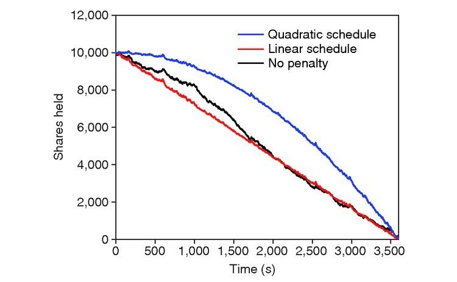

## Table of Contents

## What is trade scheduling and why is it important?

Trade scheduling is when businesses plan out when they will buy or sell things. It's like making a calendar for when to do trades. This helps businesses know exactly when they need to have money ready or when they will get paid. It also helps them make sure they have enough of what they need, like materials or products, at the right times.

It's important because it makes everything run smoother. When businesses know when trades will happen, they can plan better. This means they can avoid running out of things they need or having too much of something they don't need right away. It also helps them save money by buying things when they are cheaper or selling things when they can get a better price. Good trade scheduling can make a big difference in how well a business does.

## What are the basic principles of trade scheduling?

The first basic principle of trade scheduling is timing. This means figuring out the best times to buy and sell things. Businesses look at when prices are low to buy, and when prices are high to sell. They also think about when they need things and when they can get paid. Good timing helps save money and make sure everything is ready when it's needed.

Another important principle is planning ahead. Businesses make schedules to know what trades will happen in the future. This helps them prepare for what they will need and when. By planning, they can avoid problems like running out of stock or having too much of something. Planning also helps them use their money wisely and keep their business running smoothly.

The last principle is flexibility. Even with good planning, things can change. Prices might go up or down suddenly, or there might be delays. Being flexible means being ready to change the schedule if needed. This helps businesses react quickly to changes and keep their trade schedule working well, even when things don't go as planned.

## How can beginners start optimizing their trade schedules?

Beginners can start optimizing their trade schedules by first understanding their own needs. They should look at what they need to buy and when they need it, and also think about what they want to sell and the best times to do that. Keeping track of these needs and wants will help them see patterns and make a basic schedule. They can start by using a simple calendar or a spreadsheet to write down when they plan to make trades. This helps them see the big picture and plan better.

Next, beginners should learn about the market. They need to know when prices are usually low or high for the things they trade. This can help them buy when things are cheaper and sell when they can get more money. They can use the internet to find this information or talk to people who know more about trading. As they learn more, they can start to change their schedule to take advantage of these price changes. It's also important to be ready to change plans if something unexpected happens, like a sudden price change or a delay in getting what they need. Being flexible and willing to adjust the schedule will help them do better in trading.

## What common tools or software are used for trade scheduling?

One common tool for trade scheduling is a spreadsheet program like Microsoft Excel or Google Sheets. These programs are easy to use and let people make their own trade schedules. They can write down when they plan to buy or sell things and see all their trades in one place. They can also use formulas to help them figure out the best times to trade and keep track of their money. Many beginners start with spreadsheets because they are simple and can be changed easily.

Another tool that people use is special software made just for trade scheduling. Programs like TradeGecko or Odoo are made to help businesses plan their trades better. These programs can do things like remind people when it's time to buy or sell, keep track of what they have, and even suggest the best times to make trades based on past data. They are more advanced than spreadsheets but can be really helpful for businesses that do a lot of trading.

## What are the key factors to consider when scheduling trades?

When scheduling trades, one key factor to consider is timing. You need to know when prices are low to buy things and when prices are high to sell them. This can help you save money and make more profit. Another important thing is to think about when you need the things you are buying and when you can get paid for the things you are selling. Planning your trades around these times can help you avoid running out of what you need or having too much of something you don't need right away.

Another factor is planning ahead. You should make a schedule that shows when you will make trades in the future. This helps you prepare for what you will need and when. By planning, you can avoid problems like not having enough stock or having too much of something. It also helps you use your money wisely and keep your business running smoothly. Good planning can make a big difference in how well your trades go.

The last factor is being flexible. Even with good planning, things can change. Prices might go up or down suddenly, or there might be delays in getting what you need. Being ready to change your schedule if needed is important. This helps you react quickly to changes and keep your trade schedule working well, even when things don't go as planned. Flexibility can help you handle surprises and keep your trading on track.

## How does market volatility affect trade scheduling?

Market volatility means prices can change a lot and quickly. This can make trade scheduling harder because you might plan to buy something when it's cheap, but then the price goes up before you can buy it. Or you might plan to sell something when the price is high, but then the price drops before you can sell. Because of this, you need to watch the market closely and be ready to change your plans if prices start to move a lot.

To deal with market volatility, you can use tools like stop-loss orders. These are orders that automatically sell your things if the price drops to a certain level, which can help you avoid losing too much money. You can also try to spread out your trades over time instead of doing them all at once. This way, if the market moves a lot, you won't lose everything on one big trade. Being flexible and ready to change your schedule is really important when the market is volatile.

## What advanced strategies can be used to optimize trade scheduling?

One advanced strategy to optimize trade scheduling is using algorithmic trading. This means using computer programs to make trades automatically based on certain rules. These programs can look at a lot of data very quickly and make trades at the best times. They can help you buy things when prices are low and sell them when prices are high, even if the market is moving fast. Using algorithmic trading can take a lot of the guesswork out of when to make trades and help you make better decisions.

Another strategy is to use hedging. This means making trades that can protect you from losing money if the market moves against you. For example, if you think the price of something you own might go down, you can make a trade that will make money if the price does go down. This can help you balance out any losses from your other trades. Hedging can make your trade schedule safer and help you avoid big losses when the market is volatile.

A third strategy is to use data analytics. This means looking at a lot of data from the past to find patterns and predict what might happen in the future. By using data analytics, you can make a trade schedule that takes advantage of these patterns. For example, if you see that prices usually go up at a certain time of year, you can plan to sell at that time. Data analytics can help you make more informed decisions and improve your trade schedule over time.

## How can one integrate risk management into trade scheduling?

To integrate risk management into trade scheduling, you need to think about what could go wrong and plan for it. One way to do this is by using stop-loss orders. These are orders that automatically sell your things if the price drops to a certain level. This can help you avoid losing too much money if the market moves against you. Another way is to spread out your trades over time. Instead of doing all your trades at once, you can do them a little at a time. This way, if the market moves a lot, you won't lose everything on one big trade.

Another important part of risk management is hedging. This means making trades that can protect you from losing money if the market moves against you. For example, if you think the price of something you own might go down, you can make a trade that will make money if the price does go down. This can help you balance out any losses from your other trades. By using hedging, you can make your trade schedule safer and help you avoid big losses when the market is volatile.

## What role does algorithmic trading play in optimal trade scheduling?

Algorithmic trading helps make trade scheduling better by using computer programs to decide when to buy and sell things. These programs can look at a lot of information very quickly and make trades at the best times. They follow certain rules that you set up, so they can buy things when prices are low and sell them when prices are high. This takes a lot of the guesswork out of when to make trades and helps you make better decisions. Algorithmic trading can be really helpful when the market is moving fast because the computer can react quickly to changes.

Using algorithmic trading can also help you manage risk better. The computer programs can watch the market all the time and make trades to protect you from losing too much money. For example, they can use stop-loss orders to sell things automatically if the price drops too much. This means you don't have to watch the market all the time yourself. By using algorithmic trading, you can make your trade schedule safer and more reliable, even when the market is unpredictable.

## How do regulatory requirements impact trade scheduling strategies?

Regulatory requirements can change how businesses make their trade schedules. These rules can tell businesses when they can buy or sell things, and sometimes they have to wait until certain times to make trades. For example, some markets have rules about when trading can happen, so businesses need to plan their trades around these times. Also, there might be rules about how much of something a business can buy or sell at one time. This means businesses have to think about these limits when they make their schedules.

Because of these rules, businesses need to be careful and make sure they follow them. If they don't, they could get in trouble and have to pay fines. So, when making a trade schedule, businesses need to check the rules and plan their trades to fit within them. This might mean they can't always trade at the best times, but they need to balance following the rules with trying to make the most money. By understanding and following the regulatory requirements, businesses can make their trade schedules work better and stay out of trouble.

## What are the latest trends in trade scheduling technology?

One of the latest trends in trade scheduling technology is the use of artificial intelligence (AI) and machine learning. These technologies help businesses make better trade schedules by looking at a lot of data and finding patterns. They can predict when prices might go up or down and suggest the best times to buy or sell things. This makes trade scheduling easier and more accurate because the computer can do a lot of the work and make smart decisions based on the data it sees.

Another trend is the use of blockchain technology. Blockchain can make trade scheduling more secure and transparent. It keeps a record of all trades that can't be changed, so everyone can see what happened and trust that the trades were done fairly. This is really helpful for businesses that trade with others around the world because it makes it easier to keep track of everything and make sure everyone follows the rules. Using blockchain can help businesses plan their trades better and feel more confident about their schedules.

## How can one measure the effectiveness of a trade scheduling strategy?

To measure how well a trade scheduling strategy is working, you can look at how much money you are making. If your strategy is good, you should be making more money than you were before. You can also check if you are buying things when they are cheaper and selling them when they are more expensive. This shows that your timing is good. Another way to measure effectiveness is by seeing if you are avoiding big losses. If your strategy helps you not lose a lot of money when the market changes, that's a good sign.

Another thing to consider is how well your strategy is helping you manage your stock. If you are not running out of things you need or having too much of something you don't need, your trade schedule is working well. You can also look at how much time and effort you are spending on making your trade schedule. If using a certain strategy makes it easier and faster to plan your trades, that's another way to know it's effective. By looking at these different things, you can tell if your trade scheduling strategy is helping you do better in your business.

## What are the strategies for optimal trade scheduling?

Optimal trade scheduling in algorithmic trading involves the deployment of systematic strategies to execute trades in a manner that seeks to maximize profitability while minimizing market impact. Among the prevalent strategies are the Volume Weighted Average Price (VWAP) and the Time Weighted Average Price (TWAP).

### Volume Weighted Average Price (VWAP)

VWAP is a trading benchmark used to ensure the average price paid for a security is in line with its [volume](/wiki/volume-trading-strategy)-weighted average over a specified time period. The formula for VWAP is:

$$
\text{VWAP} = \frac{\sum (\text{Price} \times \text{Volume})}{\sum \text{Volume}}
$$

**Pros:**
- VWAP is highly effective in liquid markets where the volume data is reliable and can serve as a benchmark for execution performance.
- It helps in reducing market impact by spreading the execution over time, aligning with periods of higher liquidity.

**Cons:**
- In less liquid or volatile markets, VWAP may lead to suboptimal execution as large trades could distort the price.
- Real-time calculation of VWAP requires substantial computational resources and access to reliable market data.

### Time Weighted Average Price (TWAP)

TWAP aims to execute trades evenly over a specified time period. It is calculated by averaging the price over a time interval.

**Pros:**
- TWAP is straightforward and easy to implement, making it useful when price levels fluctuate around a stable median.
- It can be particularly beneficial in markets with consistent trading patterns, as it avoids the issues of skewed volume distributions.

**Cons:**
- TWAP does not account for volume, potentially leading to higher market impact during periods of low liquidity.
- It might not be ideal in volatile market conditions where price volatility can disrupt evenly-scheduled trade executions.

### Role of Algorithms in Strategy Implementation

In algorithmic trading, the use of algorithms is crucial for the effective implementation of VWAP and TWAP strategies. Algorithms enable traders to:
- Automate the calculation and execution of trades, ensuring adherence to the selected strategy.
- Continuously monitor market conditions and dynamically adjust execution parameters in real-time.

Typical algorithmic implementations might look like this in Python:

```python
def calculate_vwap(prices, volumes):
    total_volume = sum(volumes)
    vwap = sum(p * v for p, v in zip(prices, volumes)) / total_volume
    return vwap

def execute_twap(trade_amount, time_intervals):
    orders = [trade_amount / len(time_intervals)] * len(time_intervals)
    return orders
```

In summary, the choice between VWAP and TWAP strategies should consider the specific market conditions and trading objectives. VWAP is often preferred in liquid markets to minimize the trading impact, while TWAP may be suited for stable, predictable trading environments. The role of algorithms lies in their ability to manage these strategies efficiently by providing access to real-time data and adaptive decision-making capabilities.

## References & Further Reading

[1]: Kissell, R. (2013). ["The Science of Algorithmic Trading and Portfolio Management."](https://www.sciencedirect.com/book/9780124016897/the-science-of-algorithmic-trading-and-portfolio-management) Academic Press.

[2]: Almgren, R., & Chriss, N. (2000). ["Optimal Execution of Portfolio Transactions."](https://smallake.kr/wp-content/uploads/2016/03/optliq.pdf) The Review of Financial Studies, 12(4), 1131-1156.

[3]: Lopez de Prado, M. (2018). ["Advances in Financial Machine Learning."](https://www.amazon.com/Advances-Financial-Machine-Learning-Marcos/dp/1119482089) Wiley.

[4]: Chan, E. (2009). ["Quantitative Trading: How to Build Your Own Algorithmic Trading Business."](https://github.com/justinchou/books-quantitative-trading) Wiley.

[5]: Kissell, R. (2006). ["Optimal Trading Strategies: Quantitative Approaches for Managing Market Impact and Trading Risk."](https://archive.org/details/optimaltradingst0000kiss) AMACOM.