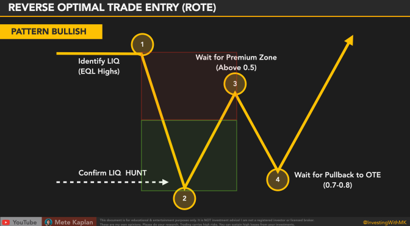

Algorithmic trading, often referred to as algo trading, is a method of executing orders using automated and pre-programmed trading instructions. This approach leverages advanced mathematical models, algorithms, and technology to make high-speed trading decisions that were traditionally performed by human traders. The significance of algorithmic trading in financial markets stems from its ability to process vast amounts of market data more quickly and efficiently than human traders, thereby improving market efficiency, reducing transaction costs, and providing liquidity.

At the core of algorithmic trading lies optimal trade scheduling, a critical aspect that determines the timing and size of trades. Optimal trade scheduling aims to efficiently execute large orders by breaking them down into smaller pieces, thus reducing the impact on market prices and minimizing execution costs. This is crucial in maintaining the delicate balance between execution speed and market impact, especially in highly liquid and volatile markets.



Optimal trade scheduling is designed to achieve two primary objectives: maximizing profitability and minimizing adverse market impact. Profit maximization is attained by capturing the best possible prices, while minimizing market impact involves strategically timing trades to prevent significant shifts in asset prices caused by substantial buy or sell orders. Proper scheduling ensures that transactions are executed in a manner that mitigates the risks associated with price slippage and market volatility.

The importance of trade scheduling extends beyond performance enhancement; it is equally vital for risk management. By ensuring that trades are executed at optimal times and prices, traders can shield their strategies from unpredictable market movements and adverse conditions. This proactive approach helps preserve capital and stabilize returns, thereby offering a competitive edge in the fast-paced domain of financial markets.

## Table of Contents

## Understanding Optimal Trade Scheduling

Optimal trade scheduling is a critical component of algorithmic trading, enabling the efficient execution of large orders while minimizing adverse effects on the market. At its core, optimal trade scheduling focuses on determining the best possible sequence and structure for executing trades to achieve specific financial objectives. These objectives typically include maximizing profit and minimizing market impact, which is the effect that executing a trade has on the market price of the security being traded.

**Key Components of Optimal Trade Scheduling**

Optimal trade scheduling involves several key components that collectively determine the effectiveness of the trading strategy. Among these components are timing, order size, and market conditions.

1. **Timing:** The timing of trade execution is crucial in algorithmic trading. This involves selecting the optimal moments to enter and exit trades based on market activity and price movements. Effective timing minimizes opportunity costs and enhances returns while limiting exposure to unfavorable price movements.

2. **Order Size:** The size of the order is another critical factor. Large orders, if executed improperly, can cause significant market impact by moving the price against the trader. The optimal trade schedule aims to divide these large orders into smaller, more manageable pieces that disrupt the market as little as possible.

3. **Market Conditions:** Current market conditions, including liquidity levels, volatility, and trading volumes, significantly influence optimal trade scheduling. Algorithms often adjust their strategies based on these dynamic factors to reduce their market footprint and ensure that trades are executed at the most favorable prices.

**Objectives of Optimal Trade Scheduling**

The primary objectives of optimal trade scheduling are maximizing profit and minimizing market impact.

- **Maximizing Profit:** By precisely timing trades and adjusting order sizes, traders can exploit favorable market conditions, capture price movements, and enhance profitability. Algorithms play a crucial role in analyzing market data to identify these optimal conditions and execute trades accordingly.

- **Minimizing Market Impact:** Market impact is the alteration of a security's price due to a trader's own orders. Effective trade scheduling mitigates this impact, preventing significant shifts in prices that could erode potential profits. This involves discretizing large trades, using advanced algorithms that execute based on predefined market conditions, and continuously adjusting strategies in response to real-time data.

In summary, optimal trade scheduling in [algorithmic trading](/wiki/algorithmic-trading) is a complex yet vital process that ensures trades are executed in a manner that enhances profitability while minimizing their influence on market prices. This requires the integration of advanced technologies, strategic planning, and a deep understanding of the market dynamics at play.

## Strategies for Optimal Trade Scheduling

Optimal trade scheduling in algorithmic trading involves the deployment of systematic strategies to execute trades in a manner that seeks to maximize profitability while minimizing market impact. Among the prevalent strategies are the Volume Weighted Average Price (VWAP) and the Time Weighted Average Price (TWAP).

### Volume Weighted Average Price (VWAP)

VWAP is a trading benchmark used to ensure the average price paid for a security is in line with its [volume](/wiki/volume-trading-strategy)-weighted average over a specified time period. The formula for VWAP is:

$$
\text{VWAP} = \frac{\sum (\text{Price} \times \text{Volume})}{\sum \text{Volume}}
$$

**Pros:**
- VWAP is highly effective in liquid markets where the volume data is reliable and can serve as a benchmark for execution performance.
- It helps in reducing market impact by spreading the execution over time, aligning with periods of higher liquidity.

**Cons:**
- In less liquid or volatile markets, VWAP may lead to suboptimal execution as large trades could distort the price.
- Real-time calculation of VWAP requires substantial computational resources and access to reliable market data.

### Time Weighted Average Price (TWAP)

TWAP aims to execute trades evenly over a specified time period. It is calculated by averaging the price over a time interval.

**Pros:**
- TWAP is straightforward and easy to implement, making it useful when price levels fluctuate around a stable median.
- It can be particularly beneficial in markets with consistent trading patterns, as it avoids the issues of skewed volume distributions.

**Cons:**
- TWAP does not account for volume, potentially leading to higher market impact during periods of low liquidity.
- It might not be ideal in volatile market conditions where price volatility can disrupt evenly-scheduled trade executions.

### Role of Algorithms in Strategy Implementation

In algorithmic trading, the use of algorithms is crucial for the effective implementation of VWAP and TWAP strategies. Algorithms enable traders to:
- Automate the calculation and execution of trades, ensuring adherence to the selected strategy.
- Continuously monitor market conditions and dynamically adjust execution parameters in real-time.

Typical algorithmic implementations might look like this in Python:

```python
def calculate_vwap(prices, volumes):
    total_volume = sum(volumes)
    vwap = sum(p * v for p, v in zip(prices, volumes)) / total_volume
    return vwap

def execute_twap(trade_amount, time_intervals):
    orders = [trade_amount / len(time_intervals)] * len(time_intervals)
    return orders
```

In summary, the choice between VWAP and TWAP strategies should consider the specific market conditions and trading objectives. VWAP is often preferred in liquid markets to minimize the trading impact, while TWAP may be suited for stable, predictable trading environments. The role of algorithms lies in their ability to manage these strategies efficiently by providing access to real-time data and adaptive decision-making capabilities.

## Tools and Technologies in Algo Trading

In algorithmic trading, sophisticated tools and technologies play a critical role in ensuring optimal trade scheduling. These resources are instrumental in analyzing market conditions, executing trades with precision, and managing risks effectively.

Data analytics and [machine learning](/wiki/machine-learning) are vital components in enhancing scheduling precision. By employing advanced analytical techniques, traders can process vast amounts of historical and real-time data to identify trends and patterns that influence trade timing and size. For example, data analytics can facilitate the calculation of metrics like historical [volatility](/wiki/volatility-trading-strategies) or expected future returns, which inform optimal trade scheduling decisions. Meanwhile, machine learning algorithms can be trained on historical data to predict price movements, allowing for more informed decision-making. Techniques such as regression analysis, neural networks, and [reinforcement learning](/wiki/reinforcement-learning) are commonly employed to forecast market conditions and optimize the timing and size of trades.

Advanced platforms play a crucial role in supporting real-time market data analysis and trade execution. These platforms are equipped with high-frequency trading capabilities, providing the infrastructure needed to process market data at lightning speeds and execute trades almost instantaneously. For instance, executing a simple order in Python might look as follows:

```python
import requests

def place_order(symbol, quantity, order_type, api_key):
    url = "https://api.brokerage.com/v1/orders"
    payload = {
        "symbol": symbol,
        "quantity": quantity,
        "order_type": order_type,
        "side": "buy"
    }
    headers = {
        "Content-Type": "application/json",
        "Authorization": f"Bearer {api_key}"
    }

    response = requests.post(url, json=payload, headers=headers)
    return response.json()

# Example usage
api_key = "your_api_key_here"
order_response = place_order("AAPL", 100, "limit", api_key)
print(order_response)
```

Platforms such as these integrate real-time data feeds and employ complex algorithms to determine the best execution strategies based on market conditions. Systems with capabilities for dynamic adjustment of trade parameters in real-time allow traders to react to market events swiftly, minimizing potential slippage and adverse price movements. Additionally, these platforms often incorporate risk management tools that continuously assess the performance of trading strategies and adjust them as necessary to mitigate risks.

In summary, the combination of data analytics, machine learning, and advanced trading platforms provides the necessary framework for enhancing precision in trade scheduling. These tools and technologies allow for the seamless integration of market insights and execution capabilities, driving efficient and effective operations in algorithmic trading environments.

## Case Studies

Optimal trade scheduling is an integral aspect of algorithmic trading, enhancing both efficiency and profitability by strategically determining when and how to execute trades. By examining case studies of successful implementations, we can gain critical insights into effective strategies and technologies.

One illustrative case study is from a large investment bank that employed Volume Weighted Average Price (VWAP) strategies combined with advanced machine learning algorithms to execute substantial buy and sell orders throughout the trading day. By leveraging historical price and volume data, the algorithm could predict intra-day price movements, allowing the bank to disperse large trades into smaller, market-friendly chunks. This not only minimized market impact but also achieved execution prices close to the VWAP benchmark. The success of this implementation hinged on the algorithm's adaptability to real-time market conditions and its ability to adjust order parameters dynamically based on predictive analytics.

A second case study involves a [hedge fund](/wiki/hedge-fund-trading-strategies) utilizing Time Weighted Average Price (TWAP) strategies to manage the execution of orders over a specified time window. This approach minimizes exposure to price volatility and unexpected market fluctuations. The fund implemented a proprietary algorithm that adjusted order placement based on [liquidity](/wiki/liquidity-risk-premium) assessments derived from [order book](/wiki/order-book-trading-strategies) data and historical transaction patterns. This methodology provided a steady execution flow, reducing the risk of slippage and ensuring trades were executed under optimal conditions. Key to their success were sophisticated data analysis tools that enabled real-time assessment and adjustments to their trade scheduling strategies.

In both cases, several factors were pivotal to their success. Primarily, the integration of real-time data analytics allowed for accurate market condition assessments, enabling responsive order execution strategies. Moreover, the use of sophisticated algorithms capable of adaptive learning improved their predictive accuracy, making their scheduling more effective. 

The lessons learned from these case studies highlight the importance of flexibility and adaptability in trade scheduling. Algorithms must be capable of processing vast amounts of data quickly and should be equipped with mechanisms to adjust to market changes instantaneously. Moreover, machine learning can enhance trade execution by providing continuously improving predictions of market conditions, which is vital for maintaining competitive advantage.

In conclusion, effective trade scheduling demands not only robust algorithmic strategies but also advanced data processing capabilities. Continuously evolving technologies and methodologies will further refine these strategies, making optimal trade scheduling a cornerstone of successful algorithmic trading.

## Challenges and Future Trends

Algorithmic trading continues to transform the financial markets, yet implementing optimal trade scheduling is not without its obstacles. One of the primary challenges is the dynamic nature of financial markets, which are influenced by a blend of deterministic and stochastic processes. The unpredictable nature of these markets often leads to significant variability, making it difficult to devise a trade schedule that consistently performs well across different scenarios.

Market fragmentation is another challenge, as trades are executed across multiple exchanges and platforms, each with its own set of rules and liquidity conditions. This fragmentation complicates the task of obtaining a real-time, comprehensive view of market conditions, potentially leading to suboptimal scheduling decisions.

Latency is a persistent concern, as delays between decision-making and execution can impact the effectiveness of trade scheduling. High-frequency trading demands minimal latency, and any delays can result in missed opportunities or unfavorable trade execution.

To address these challenges, several potential solutions and innovations have been proposed. Machine learning algorithms are increasingly being utilized to predict market trends and optimize trade scheduling. By analyzing historical and real-time data, these algorithms can adapt to changing market conditions and refine trade schedules accordingly. Such adaptability can be crucial in reducing market impact and optimizing execution costs.

Data analytics tools are also emerging to enhance precision in scheduling. These tools can process vast amounts of market data to identify patterns and trends that might not be apparent through traditional analysis. By integrating these insights into algorithmic models, traders can achieve more accurate scheduling decisions.

Looking toward future trends, quantum computing holds the potential to revolutionize algorithmic trading. Quantum computers could solve complex optimization problems faster than classical computers, enabling more efficient trade scheduling. While still in its early stages, this technology could dramatically increase the computational power available for managing and executing trades.

Blockchain technology is another innovation that could impact trade scheduling. By providing a secure and transparent ledger of transactions, blockchain could facilitate more efficient trade execution, reduce latency, and ensure trustworthy data sharing across fragmented markets.

In conclusion, while challenges exist in optimal trade scheduling, advancements in technology and innovative solutions offer promising avenues for improvement. As these technologies continue to evolve, they will likely play a pivotal role in shaping the future landscape of algorithmic trading.

## Conclusion

Optimal trade scheduling within algorithmic trading is a critical facet that greatly influences the performance and risk management of trades. By managing the timing, order size, and adapting to varying market conditions, algorithmic trading systems can significantly enhance profitability while minimizing market impact. Strategies such as VWAP (Volume Weighted Average Price) and TWAP (Time Weighted Average Price) have been widely employed, proving effective across diverse market environments. These methods rely on sophisticated algorithms and real-time data analytics to execute trades in a manner that aligns with predetermined objectives.

The continual improvement and adaptation of trade scheduling strategies are vital to sustaining competitive advantage. As financial markets evolve, so do the complexities involved in executing optimal trades. This necessitates ongoing research and development to refine existing strategies and develop innovative solutions that address emerging market challenges. By leveraging advancements in data analytics, machine learning, and trading platforms, practitioners can enhance the precision and effectiveness of their trade executions.

Furthermore, case studies highlight the successful implementation of optimal trade scheduling, offering valuable insights into effective practices and strategies. These real-world applications underscore the importance of a nuanced understanding of market dynamics and the integration of cutting-edge technologies.

In conclusion, the dynamic nature of financial markets requires that trade scheduling practices remain agile and responsive. The quest for optimal trade scheduling is an ongoing journey that demands commitment to innovation and a willingness to adapt to new market realities. Embracing a culture of continuous improvement and research is paramount in achieving sustained success in algorithmic trading.

## References & Further Reading

[1]: Kissell, R. (2013). ["The Science of Algorithmic Trading and Portfolio Management."](https://www.sciencedirect.com/book/9780124016897/the-science-of-algorithmic-trading-and-portfolio-management) Academic Press.

[2]: Almgren, R., & Chriss, N. (2000). ["Optimal Execution of Portfolio Transactions."](https://smallake.kr/wp-content/uploads/2016/03/optliq.pdf) The Review of Financial Studies, 12(4), 1131-1156.

[3]: Lopez de Prado, M. (2018). ["Advances in Financial Machine Learning."](https://www.amazon.com/Advances-Financial-Machine-Learning-Marcos/dp/1119482089) Wiley.

[4]: Chan, E. (2009). ["Quantitative Trading: How to Build Your Own Algorithmic Trading Business."](https://github.com/justinchou/books-quantitative-trading) Wiley.

[5]: Kissell, R. (2006). ["Optimal Trading Strategies: Quantitative Approaches for Managing Market Impact and Trading Risk."](https://archive.org/details/optimaltradingst0000kiss) AMACOM.