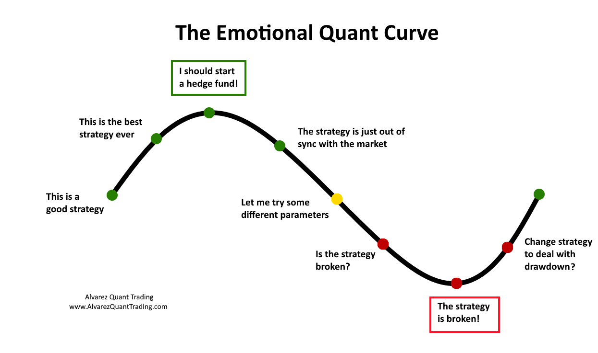

In algorithmic trading, optimal trading curves are crucial for executing large orders while minimizing market impact. These curves help determine the best execution plan by balancing impact costs and price volatility. By doing so, they provide a systematic approach to breaking down large trades into smaller orders, reducing slippage, and avoiding significant price disturbances. This article explores the concept of optimal trading curves, highlighting their benefits to trading strategies and their significance in algorithmic trading. It reviews key methods and models used to derive these curves and discusses their practical implications. Further, the article examines the challenges associated with optimizing trading curves and emerging trends in this dynamic market environment.

Optimal trading curves are designed to improve decision-making in trade execution. They achieve this by assessing various factors such as market conditions, volatility, and liquidity, enabling algorithms to execute trades more efficiently. By leveraging historical data and mathematical models, traders can anticipate favorable execution strategies, enhancing execution quality and profitability while managing risks effectively. Additionally, optimal trading curves are integral in automating trade execution, optimizing strategies for dividing orders into multiple smaller trades, and mitigating market impact.



The development of optimal trading curves relies on various mathematical frameworks and algorithms. Prominent models, such as the Almgren-Chriss framework and the Volume Weighted Average Price (VWAP) strategy, incorporate market impact models and optimization techniques to craft effective trading strategies. The integration of machine learning and artificial intelligence in model development further enhances predictive accuracy, enabling models to adapt to evolving market conditions.

Challenges in optimizing trading curves include accurate prediction of market impact and price movements, adapting to changing market conditions, and ensuring data quality. Balancing execution speed against the risk of adverse price movements remains a persistent issue. Therefore, adaptable modeling techniques and dynamic updates to trading models are essential for maintaining trading performance. Emerging trends, such as the use of big data analytics, real-time data analysis, and alternative data sources, are reshaping how optimal trading curves are developed, providing new opportunities to enhance model robustness.

In conclusion, optimal trading curves are essential tools for algorithmic traders, offering a strategic framework for efficient trade execution. As markets grow increasingly complex, the precision and adaptability of trading curves will be critical for maintaining trading success. Ongoing advancements in computational methods and data analysis will further expand the capabilities of trading algorithms, equipping them to adapt to rapidly changing markets. Understanding these curves and their implementation remains a key component of successful algorithmic trading strategies.

## Table of Contents

## Understanding Optimal Trading Curves

Optimal trading curves are integral to efficiently managing the trade-off between execution speed and cost within algorithmic trading frameworks. These curves are carefully crafted to minimize the financial expense of executing large trades by establishing a well-balanced execution schedule that accounts for both market impact and price risk. The core objective is to delineate a strategy that divides a large order into several smaller transactions. This fragmentation helps to mitigate slippage and reduces the likelihood of causing significant disturbances in the market.

The process of constructing optimal trading curves involves a detailed analysis of historical data coupled with sophisticated mathematical models. Traders use these data-driven insights to forecast the most advantageous execution strategies, ensuring that they align with prevailing market conditions. By examining past trade outcomes and developing predictive models, traders can estimate elements such as market impact, price movement, and [volatility](/wiki/volatility-trading-strategies).

Key to this process is the formulation of execution schedules that consider both the temporal distribution of trades and the dynamic conditions of the market. The goal is to achieve an optimal balance, ensuring that the trades are spaced out in a manner that minimizes the risk of significant price movement while also not extending the execution time unnecessarily.

Mathematical models often used include cost models that represent how the market impact cost varies with the execution speed and order size. For example, the Almgren-Chriss framework is a commonly used mathematical model that aids in calculating the trade-off between market impact cost and execution risk. The model utilizes parameters such as volatility, [liquidity](/wiki/liquidity-risk-premium), and risk aversion, enabling traders to devise curves that specify an optimal trading pace.

Python, with libraries such as NumPy and pandas, is frequently used to perform the necessary calculations and simulations to derive these curves. Here's an example of a simple Python script using NumPy that could help calculate a basic execution schedule based on modeled cost:

```python
import numpy as np

def calculate_optimal_schedule(order_size, market_volatility, liquidity, risk_aversion):
    # This function uses a simplified version of the Almgren-Chriss model for demonstration
    execution_time = np.linspace(0, 1, 100) # Normalize execution time from 0 to full duration
    execution_speed = order_size / (1 + risk_aversion * market_volatility * execution_time) * liquidity

    return execution_speed

# Example parameters: these would be determined based on actual market analysis
order_size = 1000  # Number of shares to be traded
market_volatility = 0.2 # Example market volatility factor
liquidity = 1.15  # Liquidity factor of the asset
risk_aversion = 0.1 # Risk aversion parameter

optimal_schedule = calculate_optimal_schedule(order_size, market_volatility, liquidity, risk_aversion)
```

Through careful application of such models and the strategic deployment of smaller, calculated trades, traders can optimize their executions, thereby achieving minimal slippage and preserving the integrity of their trading capital. Understanding these dynamic interactions and leveraging them effectively can significantly influence trading outcomes and market efficiency.

## Importance in Algorithmic Trading

Optimal trading curves are a crucial element in [algorithmic trading](/wiki/algorithmic-trading), facilitating the automation and enhancement of decision-making processes in trade execution. These curves enable trading algorithms to determine optimal execution strategies by analyzing key market factors, including conditions, volatility, and liquidity. By leveraging these variables, traders can significantly improve the quality of execution, minimize market impact, and ultimately enhance profitability.

The primary advantage of utilizing optimal trading curves lies in their ability to assess and respond to dynamic market conditions. Algorithms equipped with optimal trading curves can evaluate ongoing changes in market volatility and liquidity, adjusting execution strategies in real-time to take advantage of favorable conditions or mitigate potential risks. This adaptability is invaluable in ensuring that trades are executed at the most opportune times, achieving the desired balance between execution speed and cost.

Moreover, the employment of optimal trading curves is instrumental in risk management. By providing a structured framework for order execution, these curves enable traders to manage the inherent risks associated with large trades more effectively. For instance, the gradual execution of an order, as dictated by an optimized trading curve, can mitigate the risk of significant price movements that could occur if the order were executed all at once. This structured approach reduces the probability of adverse price impacts and slippage, which are common risks in trading large volumes.

The integration of optimal trading curves in algorithmic trading systems also promotes improved execution quality. By systematically breaking down orders into smaller trades, the curves allow for more precise control over the execution process. This strategic fragmentation ensures that the trades exert minimal disturbance on the market, maintaining the balance between the necessity of completing the trade and the minimization of market impact.

In summary, optimal trading curves serve as essential tools in algorithmic trading, offering a robust methodology for enhancing trade execution. They enable algorithms to dynamically adjust to market conditions, facilitate effective risk management, and improve the overall quality of trade execution. This strategic approach not only minimizes costs and market impact but also contributes to the increased profitability of trading operations.

## Methods and Models for Creating Trading Curves

Various mathematical models and algorithms are instrumental in constructing optimal trading curves, each aiming to devise strategies that minimize market impact and execution costs. Among these, the Almgren-Chriss model and the Volume Weighted Average Price (VWAP) are prominent examples that offer robust frameworks for trade execution.

The Almgren-Chriss model is a cornerstone in the field, focusing on the trade-off between market impact costs and the volatility risks associated with order execution. The model quantifies these elements by leveraging a cost function, balancing immediate execution costs against risk from price movements. The linear nature of the market impact and the quadratic formulation of risk enable the derivation of optimal trade execution paths, often characterized by a trade schedule given by:

$$
x(t) = \frac{X}{\theta T} \left(1 - \frac{t}{T}\right)
$$

where $x(t)$ is the rate of trading, $X$ is the order size, $T$ is the total time, and $\theta$ is a risk aversion parameter. This model serves as a foundational element for quantifying the indirect costs of trading, particularly in liquid markets.

The Volume Weighted Average Price (VWAP) strategy, on the other hand, targets minimizing the deviation from the average trading price within a given period. By utilizing historical trade data, VWAP calculates the average trading price weighted by [volume](/wiki/volume-trading-strategy), aiming to execute trades in close proximity to this benchmark. This approach is particularly effective in mitigating slippage and achieving more favorable execution prices in market environments where volume and liquidity vary significantly.

Machine learning (ML) and [artificial intelligence](/wiki/ai-artificial-intelligence) (AI) are progressively reshaping model development, introducing adaptive capabilities that enhance predictive accuracy. Algorithms such as [reinforcement learning](/wiki/reinforcement-learning) are employed to devise execution strategies by simulating various market scenarios and learning the optimal paths through algorithmic exploration. For instance, a reinforcement learning model might seek to minimize a loss function that penalizes deviations from the ideal execution curve, captured as:

```python
import numpy as np

def execute_trade(state, action, learning_rate=0.1):
    next_state = state + action  # Simplified transition model
    return next_state

def update_strategy(q_table, state, action, reward, next_state, discount_factor=0.99):
    predict = q_table[state, action]
    target = reward + discount_factor * np.max(q_table[next_state, :])
    q_table[state, action] += learning_rate * (target - predict)

# Sample usage of model update
state = 0
action = 1
reward = 0.5
next_state = execute_trade(state, action)

# Initialize Q-table with arbitrary values
q_table = np.zeros((500, 500))
update_strategy(q_table, state, action, reward, next_state)
```

Developers and quantitative analysts strive to calibrate these models to reflect specific trading objectives, considering market conditions and trader risk preferences. Calibration involves adjusting model parameters to historic data and market conditions, ensuring the strategy aligns with targeted performance metrics. This process is crucial for models to remain effective amidst evolving market dynamics and liquidity profiles.

In conclusion, the integration of advanced mathematical models, ML techniques, and algorithmic strategies plays a significant role in optimizing trading curves. These tools provide traders with the ability to manage execution and market impact efficiently, a capability that is essential in the rapidly changing landscape of algorithmic trading.

## Challenges in Optimizing Trading Curves

Optimizing trading curves involves several challenges, particularly when it comes to predicting market impact and price movements. Market conditions are inherently volatile, requiring the use of adaptable and dynamic modeling techniques that can respond to sudden changes. This adaptability is crucial because static models may fail to account for rapid fluctuations, leading to suboptimal trade execution.

Another significant challenge lies in data quality and availability. The accuracy and reliability of trading models heavily depend on the quality of the data inputs. Poor data can lead to incorrect predictions and misaligned execution strategies. Ensuring data is up-to-date, comprehensive, and accurately reflects current market conditions is vital for the development of effective models.

Furthermore, balancing speed and execution costs presents a formidable challenge. Implementing faster trades can increase market impact, as large orders executed swiftly may lead to significant price changes. Conversely, slower trades may reduce market impact but risk adverse price movements that can erode potential gains. The trade-off between these factors requires sophisticated modeling to navigate effectively.

Accurate market impact prediction remains a complex task. Market impact models often rely on historical data to estimate the potential influence of trade sizes on prices. However, these models must constantly be recalibrated to reflect contemporary market structures and behaviors.

Incorporating these elements into a cohesive strategy requires advanced computational methods and continuous updates to remain effective. As markets evolve, so too must the models and methods employed to optimize trading curves, ensuring they remain robust and relevant.

## Emerging Trends

The integration of big data analytics and advanced [machine learning](/wiki/machine-learning) techniques is progressively revolutionizing the development of optimal trading curves. These innovations are pivotal in enhancing the adaptability and precision of trading models, providing significant benefits in terms of execution efficiency and strategic decision-making.

A critical focus is the use of real-time data analytics to dynamically update trading models in response to sudden market fluctuations. Real-time analytics involves processing and analyzing data as it is ingested, allowing traders to react swiftly to market conditions. This approach is crucial for minimizing market impact and optimizing trading strategies. By leveraging real-time data, models can be fine-tuned continuously, ensuring their relevance and accuracy in the face of volatile market behaviors.

The role of cloud computing and high-performance computing platforms is equally transformative. These technological advancements allow for the execution of complex and computationally intensive models that were previously constrained by hardware limitations. Cloud computing offers scalable resources and on-demand computational power, facilitating the efficient execution of sophisticated algorithmic models. This capability is essential for conducting large-scale simulations and optimizing trading strategies through intricate calculations.

Moreover, the proliferation of [alternative data](/wiki/best-alternative-data) sources is creating new avenues for enhancing the robustness and accuracy of trading models. Alternative data, encompassing diverse information such as social media sentiment, weather patterns, and satellite imagery, enriches traditional datasets, offering traders unique insights into market sentiment and behavior. Integrating these non-traditional data points can refine predictive models, providing a more comprehensive view of market dynamics.

Incorporating machine learning algorithms in the modeling process further amplifies the potential of these datasets. Techniques such as [deep learning](/wiki/deep-learning) and reinforcement learning enable models to predict complex patterns and learn from past trading behaviors, adapting to market changes with improved precision. By training on large volumes of data, machine learning models can discover nuanced relationships within the data, leading to more effective trading curves.

In conclusion, emerging trends in big data analytics and machine learning are significantly advancing the development of optimal trading curves. These technologies enable the creation of more flexible, robust, and precise trading models that are essential for thriving in today's rapidly evolving financial markets.

## Conclusion

Optimal trading curves are crucial assets for algorithmic traders, offering a strategic framework that enhances trade execution efficiency. As financial markets evolve, characterized by increased complexity and volatility, the necessity for precise and adaptable trading curves intensifies. These curves enable traders to devise execution plans that minimize transaction costs and market impact, thereby optimizing trade performance.

The rapid advancement in computational methods and data analysis techniques continues to augment the capability of trading algorithms. Leveraging machine learning and big data analytics, traders can develop sophisticated models that dynamically adjust to market conditions. For instance, algorithms can be engineered to analyze vast datasets in real-time, using predictive models to anticipate market shifts and execute trades at optimal times. This adaptability is critical in fast-changing market environments, where quick response to new information can lead to competitive advantages.

Implementing optimal trading curves effectively requires a deep understanding of both trading strategies and mathematical models. Algorithms must be continually refined to incorporate the latest market trends and data feeds. This involves calibrating models with up-to-date parameters and leveraging computational power to test various scenarios. Traders must also be adept at interpreting outputs from trading algorithms, ensuring that execution strategies align with overarching investment goals.

In summary, the development and application of optimal trading curves are key to success in algorithmic trading. They provide a methodological approach to handling complex market dynamics, allowing traders to achieve better execution outcomes. As technological innovation persists, the ability of trading algorithms to adapt to the ever-evolving market landscape will only become more pronounced, reinforcing the importance of mastering optimal trading curves.

## References & Further Reading

[1]: Almgren, R., & Chriss, N. (2000). ["Optimal Execution of Portfolio Transactions."](https://smallake.kr/wp-content/uploads/2016/03/optliq.pdf) Journal of Risk, 3(2), 5-39.

[2]: Kissell, R. (2006). ["The Science of Algorithmic Trading and Portfolio Management."](https://www.sciencedirect.com/book/9780124016897/the-science-of-algorithmic-trading-and-portfolio-management) Academic Press.

[3]: Lopez de Prado, M. (2018). ["Advances in Financial Machine Learning."](https://www.amazon.com/Advances-Financial-Machine-Learning-Marcos/dp/1119482089) Wiley.

[4]: Engel, R. F., & Russell, J. R. (2005). ["The Econometrics of Ultra-High Frequency Data."](https://papers.ssrn.com/sol3/papers.cfm?abstract_id=225604) Econometrica.

[5]: Abernethy, J., Kale, S., & Vaughan, J. W. (2018). ["Efficient Market Making via Convex Optimization and Machine Learning."](https://yiling.seas.harvard.edu/sites/projects.iq.harvard.edu/files/yiling/files/2465769.2465777.pdf) arXiv:1206.6451.

[6]: Jansen, S. (2018). ["Machine Learning for Algorithmic Trading."](https://github.com/stefan-jansen/machine-learning-for-trading) Packt Publishing.