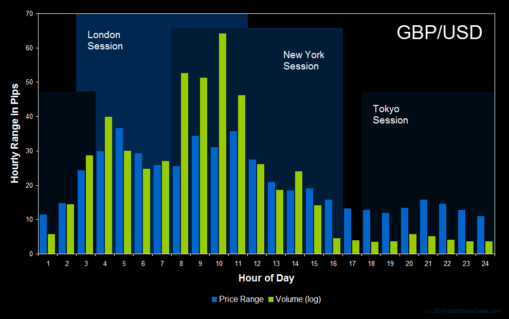

## Table of Contents

## What is the British Pound and why is its trading important?

The British Pound, often called the Pound Sterling, is the official currency of the United Kingdom. It is one of the oldest currencies still in use today and is symbolized as £. People use the Pound to buy things, save money, and pay for services in the UK. It's also used in other places like the Channel Islands, the Isle of Man, and some British territories.

Trading the British Pound is important for many reasons. First, it helps businesses and people in the UK buy things from other countries. When the Pound is strong, it can buy more foreign goods, which can be good for shoppers. But if it's weak, it might be harder to buy things from abroad. Second, trading the Pound affects the UK's economy. A strong Pound can make UK products more expensive for other countries, which might mean fewer sales. A weak Pound can make UK products cheaper and more attractive to foreign buyers, helping UK businesses sell more. So, the value of the Pound is important for the UK's trade and economy.

## What are the standard trading hours for the British Pound?

The British Pound trades all day and night, but the busiest times are when the big financial markets are open. The main trading hours for the Pound are from 8 AM to 4 PM UK time, Monday to Friday. This is when the London Stock Exchange is open, and lots of people are buying and selling the Pound.

Outside these hours, the Pound still trades, but it's less busy. For example, when New York opens at 1 PM UK time, trading picks up again because many people in the US trade the Pound too. Trading slows down on weekends, but you can still trade the Pound 24 hours a day from Sunday evening to Friday evening.

## How do different time zones affect the trading of the British Pound?

Different time zones affect the trading of the British Pound because the currency market is open 24 hours a day. When it's daytime in one part of the world, it might be nighttime in another. This means that when the London market closes at 4 PM UK time, the New York market is just getting started at 1 PM UK time. So, even though London is closed, trading continues in New York, and the Pound keeps being bought and sold.

The busiest times for trading the British Pound are when the big financial centers like London, New York, and Tokyo are open at the same time. For example, when London and New York are both open, there are more people trading, which can make the Pound's value move more. But when it's only Tokyo time, and London and New York are closed, trading might be slower because fewer people are trading the Pound. So, the time zones can make the Pound's trading busier or quieter at different times of the day.

## What are the peak trading hours for the British Pound and why?

The peak trading hours for the British Pound are when the London and New York markets are both open. This happens from 1 PM to 4 PM UK time. During these hours, lots of people from both Europe and the US are trading, so there's a lot of activity. More people trading means more buying and selling, which can make the Pound's value change more quickly.

These peak hours are important because they are when the most trading happens. When both big markets are open, it's easier for people to trade with each other across the Atlantic. This overlap time is busy because it's the middle of the day in both places, so banks, businesses, and traders are all working and making deals.

## How does the overlap of the London and New York trading sessions impact GBP trading?

The overlap of the London and New York trading sessions is a big deal for trading the British Pound. It happens from 1 PM to 4 PM UK time. During this time, both markets are open, so lots of people from Europe and the US are trading at the same time. This means there's a lot more buying and selling of the Pound. More people trading makes the market busier and can make the Pound's value change more quickly.

This busy time is important because it's when the most trading happens. When both big markets are open, it's easier for people to trade with each other across the Atlantic. This overlap time is busy because it's the middle of the day in both places, so banks, businesses, and traders are all working and making deals. So, the overlap makes the Pound's trading more active and can lead to bigger changes in its value.

## What economic indicators should traders watch during GBP trading hours?

Traders should keep an eye on some important economic numbers when trading the British Pound. One big thing to watch is the UK's Gross Domestic Product (GDP). This tells us how well the whole country's economy is doing. If the GDP goes up, it might mean the Pound will get stronger because people think the UK is doing well. Another thing to look at is the unemployment rate. If fewer people are out of work, it's good for the economy and might make the Pound stronger. Also, the inflation rate is important. If prices are going up fast, it can affect how much the Pound is worth.

Another key thing to watch is the Bank of England's interest rate decisions. If the bank raises rates, it can make the Pound stronger because people want to keep their money in the UK to get better returns. On the other hand, if rates go down, the Pound might get weaker. Traders also pay attention to the UK's trade balance, which shows if the country is selling more stuff to other countries than it's buying. A good trade balance can help the Pound. All these numbers can move the Pound's value, so traders need to watch them closely during trading hours.

## How can beginners identify the best times to trade the British Pound?

Beginners should know that the best times to trade the British Pound are when the markets are really busy. The busiest time is when both the London and New York markets are open, from 1 PM to 4 PM UK time. This is when lots of people are trading, so the Pound's value can change a lot. It's a good time to trade because you can see big moves in the Pound's value and maybe make more money.

Another good time to trade is when the London market is open by itself, from 8 AM to 1 PM UK time. This time is also busy, but not as busy as when both London and New York are open. Beginners should try to trade during these times because there's more action, and it's easier to see what's happening with the Pound. But remember, trading can be risky, so always learn as much as you can before you start.

## What are the common strategies used during the most active GBP trading hours?

During the most active GBP trading hours, which are when the London and New York markets are both open from 1 PM to 4 PM UK time, traders often use a strategy called "trend trading." This means they look at the Pound's price to see if it's going up or down over time. If the Pound is going up, they might buy it, hoping to sell it later for more money. If it's going down, they might sell it, hoping to buy it back later for less. This time is good for trend trading because there are lots of people trading, so the Pound's price can move a lot, making trends easier to spot.

Another common strategy is "scalping." This means traders make lots of small trades really quickly, trying to make a little bit of money on each one. During the busy hours, the Pound's price can change a lot in just a few minutes, so scalping can work well. Traders need to be quick and pay close attention to the market. They might use special tools to help them see these small price changes and make their trades fast.

Both of these strategies work well during the peak trading times because the market is more active. But remember, trading can be risky, so it's important to learn a lot and practice before you start using these strategies with real money.

## How do seasonal trends affect the optimal trading hours for the British Pound?

Seasonal trends can change when the best times are to trade the British Pound. During certain times of the year, like the holiday season around Christmas and New Year, trading can slow down. This is because many people take time off, so fewer people are trading. The markets might not be as busy, and the Pound's price might not move as much. So, the peak trading hours from 1 PM to 4 PM UK time might not be as good for trading during these times. Traders need to watch the market closely and maybe trade at different times when things are quieter.

On the other hand, there are times of the year when trading can be busier. For example, at the end of the financial year in March or during big economic events like budget announcements, more people might be trading. This can make the peak trading hours even busier and more important. The Pound's price can move a lot more during these times, so traders might want to focus on trading during the usual peak hours of 1 PM to 4 PM UK time. Knowing about these seasonal trends can help traders pick the best times to trade the British Pound.

## What role do major news announcements play in determining the best trading times for GBP?

Major news announcements can really change when the best times are to trade the British Pound. When big news comes out, like the Bank of England's interest rate decisions or important economic reports, lots of people start trading. They want to buy or sell the Pound based on the news. So, the times right after these announcements can be very busy. Traders need to know when these news events are happening so they can be ready to trade during these times.

For example, if the Bank of England announces a change in interest rates at noon UK time, the trading hours right after that can be really active. The Pound's value might go up or down a lot because of the news. So, even though the usual peak trading hours are from 1 PM to 4 PM UK time, the best time to trade might be right after the news comes out. Traders should keep an eye on the economic calendar to know when these big news events are happening and plan their trading around them.

## How can advanced traders use volatility patterns to optimize their GBP trading schedule?

Advanced traders can use volatility patterns to figure out the best times to trade the British Pound. Volatility means how much the Pound's price moves up and down. Traders look at past data to see when the Pound usually moves a lot. They might find that the Pound is more volatile during the overlap of the London and New York trading sessions, from 1 PM to 4 PM UK time. By knowing when the Pound is likely to move a lot, traders can plan to trade during these times to take advantage of big price changes.

Traders also use tools like the Average True Range (ATR) to measure volatility. The ATR shows how much the Pound's price has been moving over a certain time. If the ATR is high during certain hours, it means the Pound is more volatile then. Traders can use this information to decide when to trade. For example, if they see that the ATR is high in the morning when the London market opens, they might choose to trade then. By understanding and using volatility patterns, advanced traders can make better decisions about when to buy and sell the British Pound.

## What are the risks associated with trading the British Pound during different hours and how can they be mitigated?

Trading the British Pound can be risky at different times of the day. When the markets are really busy, like during the overlap of the London and New York sessions from 1 PM to 4 PM UK time, the Pound's price can move a lot. This can be good because you might make more money, but it can also be bad because the price can go against you quickly. If you trade when the markets are quiet, like during the night or on weekends, there might not be many people trading. This can make it hard to buy or sell the Pound at the price you want, and the price might not move much.

To make trading safer, you can use some tools and strategies. One way is to set a "stop-loss" order, which tells the market to sell your Pound if the price goes down too much. This can help you lose less money if the price moves against you. Another way is to use "take-profit" orders, which tell the market to sell your Pound when it reaches a certain high price, so you can make sure to take your profits. Also, it's a good idea to keep learning about the market and practice trading with small amounts of money first. This way, you can get better at trading without risking too much.

## References & Further Reading

[1]: ["Brexit: What does it all mean?"](https://www.investopedia.com/terms/b/brexit.asp) BBC News

[2]: ["How Japan's 2011 Earthquake Shifted All Our Horizons."](https://en.wikipedia.org/wiki/2011_T%C5%8Dhoku_earthquake_and_tsunami) Investopedia

[3]: ["China devaluation: How do yuan moves affect rest of world?"](https://www.investopedia.com/trading/chinese-devaluation-yuan/) Financial Times

[4]: ["The Interest Rate as a Policy Instrument, Bank Rate."](https://www.wallstreetmojo.com/interest-rate-policy/) Bank of England

[5]: ["BoE to decide on interest rates amid high inflation concerns."](https://www.bnnbloomberg.ca/investing/2024/12/18/traders-bet-on-slow-boe-cuts-with-inflation-outlook-still-bleak/) Reuters