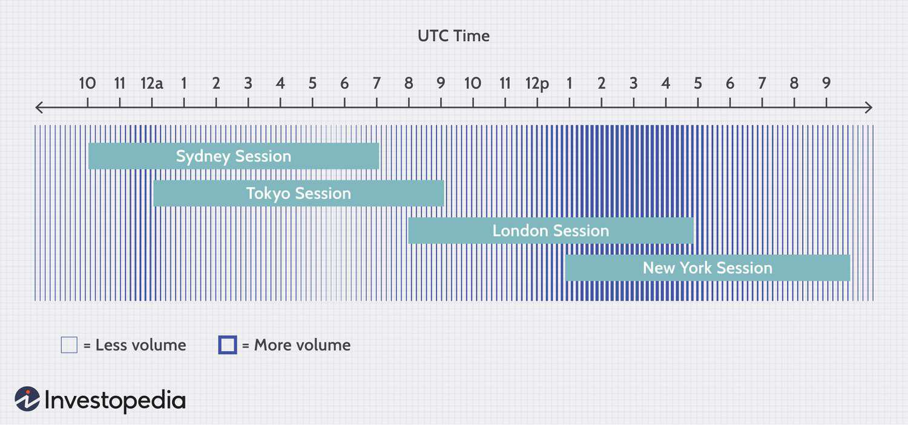

The currency market, particularly for the Euro, plays a vital role in global finance due to its magnitude and reach. Forex trading, the exchange of one currency for another, constitutes one of the largest and most liquid segments of the international financial market. The Euro stands as a focal point within this market, being among the most widely traded currencies globally. This prominence stems from the Euro’s adoption by multiple European nations and its significance in global financial transactions.

Understanding the operational mechanics of forex trading, specifically concerning trading hours, is crucial for traders looking to optimize their strategies. Forex markets operate continuously from Monday to Friday, facilitating trades at any time within this window. However, trading activity and market volatility vary depending on the specific trading hours of global financial centers. The Euro experiences heightened trading volumes during the European trading sessions, when financial markets in major cities such as London, Frankfurt, and Paris are active.



Furthermore, the rise of algorithmic trading represents a transformative development within the forex market. Algorithmic trading involves the use of automated systems to execute trades based on pre-defined criteria. This approach enhances efficiency and allows traders to capitalize on market movements with greater precision. For the Euro, algorithmic trading can optimize strategies by swiftly responding to fluctuations, particularly during peak trading hours or volatile market conditions.

This article aims to explore the dynamics of Euro trading in the forex market, including an examination of the specific trading hours and the influence of algorithmic trading systems. By analyzing these components, traders—both novice and experienced—can gain valuable insights into the optimal times to trade the Euro, thereby refining their trading approaches and improving profitability.

## Table of Contents

## Understanding Forex Trading and Euro's Role

The forex market stands as the largest financial marketplace globally, facilitating the exchange of currencies with unparalleled liquidity and volume. Operating continuously 24 hours a day from Monday to Friday, it enables market participation across different time zones, thus offering unique trading opportunities. The Euro (€), which is the official currency of the Eurozone, is a significant player in this market, ranking as the second most traded currency after the United States dollar (USD). 

In forex trading, currency pairs are quoted, where the value of one currency is exchanged for another. The Euro, due to its economic prominence and stability, is often paired with other major currencies such as the U.S. dollar (EUR/USD), British pound (EUR/GBP), and Japanese yen (EUR/JPY). These currency pairs account for a substantial portion of daily trading volume, attracting traders seeking to leverage the Euro's fluctuations.

Traders engage in the [forex](/wiki/forex-system) market to profit from the variability in currency exchange rates. For example, they might speculate that the Euro will strengthen against the U.S. dollar, or vice versa, based on economic indicators, geopolitical tensions, or central bank policies. This speculation can be influenced by numerous factors such as [interest rate](/wiki/interest-rate-trading-strategies) differentials, economic growth data, or regulatory announcements from the European Central Bank (ECB) or other significant financial institutions.

When trading Euro-related currency pairs, traders often analyze both fundamental and technical factors to predict price movements. Fundamental analysis might focus on economic [statistics](/wiki/bayesian-statistics) from the Eurozone, while technical analysis involves studying price charts and patterns to forecast future direction. In addition to these, [algorithmic trading](/wiki/algorithmic-trading) systems can be employed to execute trades based on predefined strategies and criteria, thereby enhancing the precision and response times in trading decisions.

The interplay of these factors makes the Euro a pivotal currency in forex trading, contributing to the dynamic nature and depth of the market. Understanding how these elements influence the Euro's role in forex can help traders in developing more informed trading strategies, ultimately aiding in navigating the complexities of the global financial market.

## European Trading Hours for the Euro

The European forex trading session, a pivotal component of the global forex market, operates daily from 8:00 AM to 5:00 PM GMT. This timeframe encompasses the business hours of several critical financial centers, most notably London, Frankfurt, and Zurich. These cities play a major role in contributing to the significant market [liquidity](/wiki/liquidity-risk-premium) observed during this session.

London, often considered the heart of the forex market, accounts for a substantial share of global forex transactions. Its strategic position allows it to overlap with both the Asian and American trading sessions, thereby enhancing liquidity and trading opportunities. Frankfurt, as a leading financial center in the Eurozone, contributes significantly to the trading of the Euro by hosting the European Central Bank and other influential financial institutions. Zurich, as a financial hub, adds to the [volume](/wiki/volume-trading-strategy) and liquidity due to Switzerland's stable economy and banking system.

Understanding these trading hours is crucial for traders, as they correspond with heightened market activity and [volatility](/wiki/volatility-trading-strategies). The European session is often characterized by significant movements in currency prices, particularly concerning the Euro and other European-related currency pairs. Traders can capitalize on trends that emerge during these hours, driven by economic data releases, geopolitical developments, and monetary policy announcements from the European Central Bank. 

In conclusion, knowledge of the European trading session's hours and the role of its key financial centers can be instrumental in developing informed strategies and making timely trades. This understanding allows traders to take advantage of the natural ebb and flow of market dynamics, thus enhancing their chances of achieving successful trading outcomes.

## Optimal Times to Trade the Euro

The optimal times to trade the Euro in the forex market often align with the period when the European and U.S. trading sessions overlap. This overlap typically occurs from 1:00 PM to 4:00 PM GMT, a time frame characterized by heightened activity due to the simultaneous operations of two of the world's most significant trading centers, London and New York. Such periods are crucial as they concentrate a substantial amount of market volume and liquidity, which are critical factors for traders seeking to maximize profit opportunities.

High-impact economic releases from both the Eurozone and the U.S. frequently coincide with these overlap hours. These releases, including data on employment, inflation, and central bank meetings, can lead to increased volatility in the forex market. For instance, announcements from the European Central Bank or the U.S. Federal Reserve often cause swift and substantial shifts in currency prices, thus presenting short-term trading opportunities.

During these peak times, traders benefit from increased market volume, which generally leads to tighter spreads and more precise pricing. Tighter spreads, the difference between the bid and ask price, reduce trading costs and improve transaction efficiency. Therefore, market participants can capitalize on short-term price movements with less friction, ultimately increasing the potential for profitable trades.

Moreover, the increased activity results in more pronounced price movements, which can be advantageous for traders employing various strategies, such as [scalping](/wiki/gamma-scalping) or [day trading](/wiki/day-trading-spy). The presence of significant liquidity allows for quicker execution of trades, thereby reducing the risks associated with slippage, where the executed price significantly deviates from the expected price due to market conditions.

In conclusion, to maximize trading efficiency and capitalize on market opportunities, focusing on times with overlapping trading sessions, particularly when economic announcements are scheduled, is essential for anyone engaging in Euro forex trading. By aligning trading activities with these optimum periods, traders can enhance their strategies and take advantage of market fluctuations that occur during these dynamic hours.

## Algorithmic Trading in Forex Markets

Algorithmic trading represents a significant advancement in the forex markets, employing automated systems to execute trades based on predefined criteria. This sophisticated process enhances trading efficiency by reducing human errors and enabling rapid decision-making processes. Algorithms are designed to analyze vast amounts of market data, identifying potential trading opportunities within fractions of a second. Consequently, this technology provides traders with a competitive edge, particularly in the highly volatile forex market.

In the context of forex, algorithms can process complex data streams to detect and exploit patterns in price movements, market volume, and other important market indicators. By doing so, they can execute trades with speed and precision that surpass human capabilities. This can be especially advantageous during periods of high market volatility, where rapid shifts in currency prices can occur.

For the Euro, one of the most actively traded currencies, algorithmic trading offers a powerful toolset to capitalize on fluctuations during high-impact economic events, such as ECB (European Central Bank) announcements or geopolitical developments. By setting specific conditions under which trades are executed, algorithms can optimize strategies to take advantage of short-term market inefficiencies. For instance, a simple algorithm might be programmed in Python as follows:

```python
def trading_algorithm(data):
    for event in data['high_impact_events']:
        if event['currency'] == 'EUR':
            if event['price_indicators']['volatility'] > threshold:
                execute_trade(event)
```

The primary advantage of using such algorithms lies in their ability to analyze extensive datasets continuously and make informed trading decisions without the delay associated with human intervention. Additionally, algorithmic trading allows for [backtesting](/wiki/backtesting)—analyzing historical data to improve the validity and efficacy of trading strategies before deploying them in live markets.

Overall, algorithmic trading systems stand as a robust tool for traders looking to optimize trading strategies and enhance efficiency, particularly when dealing with the dynamic and fast-paced forex markets.

## Implications of Algo Trading on Euro Trading Hours

Algorithmic trading in the forex market for the Euro enables traders to exploit market movements across all trading hours, significantly enhancing the precision and efficiency of executing trades. This is particularly important given the 24-hour nature of the forex market and the high liquidity periods that characterize Euro trading hours. 

During peak trading hours, such as the overlap between European and U.S. sessions, market liquidity is at its highest, providing ample opportunities for algorithmic systems to operate. These algorithms can process substantial volumes of market data within milliseconds, adjusting to new information and optimizing trade entries and exits based on pre-set criteria. This rapid response is crucial when economic data releases occur, as they can cause rapid price fluctuations. Algorithmic trading systems can instantly assess the impact of these data releases, thereby optimizing the timing and execution of trades to capitalize on the resulting volatility.

Another advantage of algorithmic trading during high liquidity periods is the ability to achieve improved pricing and tighter bid-ask spreads, which are beneficial for executing large volumes of trades without causing significant price impacts. The reduced transaction costs associated with tighter spreads can enhance profitability, an important consideration when engaging in high-frequency trading.

To exploit these opportunities, algorithmic trading systems often employ techniques such as statistical [arbitrage](/wiki/arbitrage) or [market making](/wiki/market-making), which require rapid analysis of small price discrepancies or the provision of liquidity to capture the spread. Python, with its powerful libraries such as NumPy and pandas, serves as a popular choice for implementing these algorithms due to its robust data handling capabilities and ease of integration with trading platforms. 

For instance, a basic Python script designed to trade the Euro based on moving average crossovers might look like this:

```python
import pandas as pd
import numpy as np

# Example data frame containing historical Euro price data
data = pd.DataFrame({'Price': [1.0850, 1.0860, 1.0870, ..., 1.0900]})

# Calculate moving averages
data['Short_MA'] = data['Price'].rolling(window=5).mean()
data['Long_MA'] = data['Price'].rolling(window=20).mean()

# Generate signals
data['Signal'] = 0
data.loc[data['Short_MA'] > data['Long_MA'], 'Signal'] = 1
data.loc[data['Short_MA'] < data['Long_MA'], 'Signal'] = -1

# Identify positions
data['Position'] = data['Signal'].diff()

print(data.tail())
```

Such an algorithm can execute trades whenever short-term trends indicate potential price movements, adjusting strategies dynamically in response to market conditions. Overall, algorithmic trading underscores the importance of agility and precision in financial markets, empowering traders to navigate the complexities of Euro trading efficiently, especially during periods of heightened market activity.

## Conclusion

In the forex market, understanding the trading hours for the Euro is essential for executing successful trades and optimizing strategies. The Euro's active trading periods align with times of increased volume and liquidity, offering more precise pricing and opportunities to capitalize on market movements. 

Algorithmic trading plays a significant role in enhancing trading efficiency and can be leveraged to exploit market inefficiencies. Automated trading systems execute trades based on pre-set criteria, processing data and reacting faster than manual methods. This offers a competitive advantage, particularly during high-volume periods, such as when there are overlaps in the European and U.S. trading sessions or during significant economic announcements.

Traders should focus on these high-volume periods and stay informed about economic releases to fully harness Euro trading opportunities. Key events and data releases can cause fluctuations and increased volatility, presenting lucrative trading avenues. As the forex market continues to evolve, staying updated with advancements in trading technologies and market dynamics is crucial for maintaining an edge in trading endeavors. Employing these strategies can lead to improved decision-making and better overall performance in trading the Euro in today's fast-paced market environment.

## References & Further Reading

[1]: Marcos López de Prado, ["Advances in Financial Machine Learning"](https://www.amazon.com/Advances-Financial-Machine-Learning-Marcos/dp/1119482089), Wiley, 2018.

[2]: David Aronson, ["Evidence-Based Technical Analysis: Applying the Scientific Method and Statistical Inference to Trading Signals"](https://www.amazon.com/Evidence-Based-Technical-Analysis-Scientific-Statistical/dp/0470008741), Wiley, 2007.

[3]: Stefan Jansen, ["Machine Learning for Algorithmic Trading"](https://github.com/stefan-jansen/machine-learning-for-trading), 2nd Edition, 2020.

[4]: Ernest P. Chan, ["Quantitative Trading: How to Build Your Own Algorithmic Trading Business"](https://www.amazon.com/Quantitative-Trading-Build-Algorithmic-Business/dp/0470284889), Wiley, 2008.

[5]: James Bergin, "Forex Trading for Maximum Profit: The Best Kept Secret Off Wall Street," Mcgraw-Hill Education, 2006.

[6]: Boris Schlossberg, ["Technical Analysis: Using Multiple Timeframes"](https://www.morpher.com/blog/technical-analysis-multiple-timeframes), Equity Press, 2008.