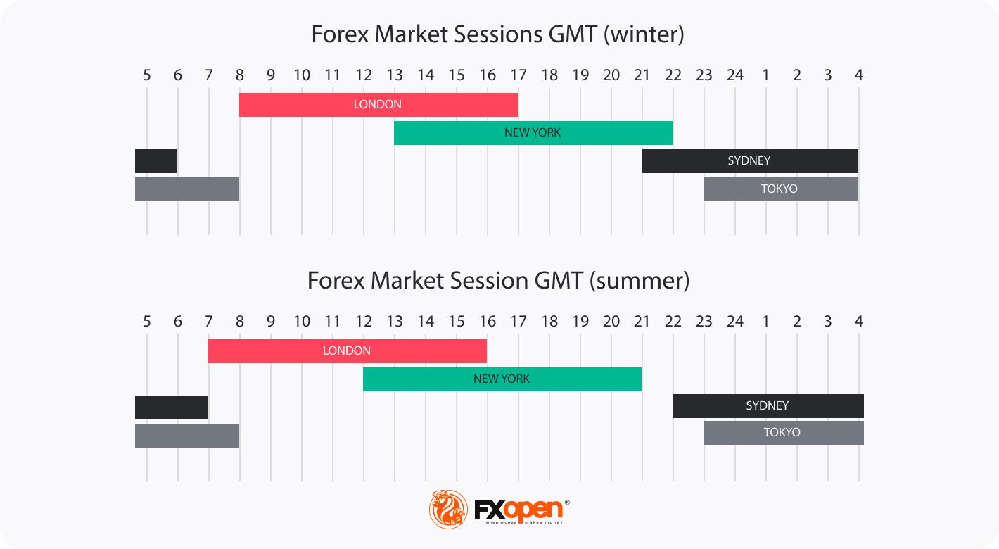

## Table of Contents

## What is the Swiss Franc and why is it important in forex trading?

The Swiss Franc is the official currency of Switzerland and Liechtenstein. It is often shown with the symbol CHF. The Swiss Franc is important because Switzerland has a strong and stable economy. People trust the Swiss Franc because Switzerland is known for its good government and strong banks. The Swiss Franc is also seen as a safe place to keep money during times of trouble in the world.

In forex trading, the Swiss Franc is important because it is one of the major currencies traded. Forex traders often look at the Swiss Franc to see how safe or risky the world economy is. When there is a lot of worry or trouble, more people want to buy the Swiss Franc, and its value goes up. Traders use the Swiss Franc to make money by guessing if its value will go up or down compared to other currencies. This makes the Swiss Franc a key part of the forex market.

## What are the general trading hours for the Swiss Franc?

The Swiss Franc, like other major currencies, is traded in the forex market, which operates 24 hours a day from Monday to Friday. The trading hours for the Swiss Franc are influenced by the opening times of the major financial centers around the world. The forex market starts in Sydney, then moves to Tokyo, London, and finally New York. This means that you can trade the Swiss Franc at any time during the week, but there are times when trading is more active.

The busiest trading times for the Swiss Franc are when the London and New York sessions overlap, usually from 8 AM to 12 PM Eastern Time. During these hours, there is a lot of trading activity, which can lead to more opportunities to buy or sell the Swiss Franc. Outside of these peak times, trading might be slower, but you can still trade the Swiss Franc whenever the market is open.

## How do the trading hours of the Swiss Franc align with major forex market sessions?

The Swiss Franc can be traded 24 hours a day from Monday to Friday, just like other major currencies. The forex market follows the sun around the world, starting in Sydney, then moving to Tokyo, London, and finally New York. This means you can trade the Swiss Franc at any time during the week, but the busiest times are when the big financial centers are open.

The busiest trading times for the Swiss Franc happen when the London and New York sessions overlap. This is usually from 8 AM to 12 PM Eastern Time. During these hours, there is a lot of trading activity, which means more chances to buy or sell the Swiss Franc. Outside of these peak times, trading might be slower, but you can still trade the Swiss Franc whenever the market is open.

## What are the peak trading hours for the Swiss Franc and why?

The peak trading hours for the Swiss Franc happen when the London and New York sessions overlap. This time is usually from 8 AM to 12 PM Eastern Time. During these hours, there is a lot of trading activity because both the London and New York markets are open at the same time. This means more people are buying and selling the Swiss Franc, which can lead to more chances to make trades.

The reason these hours are so busy is that London and New York are two of the biggest financial centers in the world. When both are open, there are more traders and more money moving around. This makes the Swiss Franc more active and easier to trade during these times. If you want to trade the Swiss Franc, these peak hours are the best times to do it because there is more action in the market.

## How does the Swiss Franc's trading volume vary throughout the day?

The trading volume of the Swiss Franc changes throughout the day because it follows the opening times of big financial centers around the world. The forex market starts in Sydney, then moves to Tokyo, London, and finally New York. When these big markets open, more people start trading, and the volume of the Swiss Franc goes up. The volume is usually low when only one or two markets are open, like during the Sydney and Tokyo sessions.

The busiest time for trading the Swiss Franc is when the London and New York sessions overlap. This happens from 8 AM to 12 PM Eastern Time. During these hours, both markets are open, and a lot of people are buying and selling the Swiss Franc. This makes the trading volume very high. Outside of these peak hours, the volume might be lower, but you can still trade the Swiss Franc at any time during the week when the forex market is open.

## What impact do economic releases have on the Swiss Franc during different trading hours?

Economic releases can have a big impact on the Swiss Franc, but the effect can be different depending on when the news comes out. If an important economic report is released during the busy times when London and New York are both open, the Swiss Franc can move a lot. More people are trading during these hours, so the news can make the price go up or down quickly. For example, if Switzerland's unemployment numbers are better than expected, the Swiss Franc might get stronger because people think the economy is doing well.

When economic news comes out during quieter times, like when only Sydney or Tokyo is open, the Swiss Franc might not move as much right away. Fewer people are trading, so the price might not change as fast. But once the busier markets open, the Swiss Franc can still react to the news. Traders in London and New York might see the news and start buying or selling, which can make the Swiss Franc move more later in the day. So, the timing of economic releases can change how the Swiss Franc reacts.

## How can traders use the Swiss Franc's trading hours to optimize their trading strategies?

Traders can use the Swiss Franc's trading hours to make better trading plans by focusing on the busiest times. The busiest times are when London and New York are both open, from 8 AM to 12 PM Eastern Time. During these hours, a lot of people are trading, so the Swiss Franc moves a lot. Traders can use this time to buy or sell the Swiss Franc because there are more chances to make money. If a trader wants to trade based on big economic news, they should wait for these busy hours because the news can make the Swiss Franc move more.

Traders can also look at quieter times, like when only Sydney or Tokyo is open, to plan their trades. During these times, the Swiss Franc might not move as much, but traders can still use this time to get ready for the busier hours. They can watch the market and see how it reacts to any news that comes out. Then, when London and New York open, they can use what they learned to make smart trades. By knowing when the Swiss Franc is most active, traders can plan their moves better and maybe make more money.

## What are the liquidity conditions for the Swiss Franc during different times of the day?

The liquidity of the Swiss Franc changes throughout the day based on when the big financial markets are open. When the Sydney and Tokyo sessions are open, the liquidity is lower because fewer people are trading. This means that it might be harder to buy or sell the Swiss Franc quickly during these times. The Swiss Franc might not move as much because there are not as many traders making deals.

The liquidity gets much better when the London session starts and even better when New York opens too. From 8 AM to 12 PM Eastern Time, both London and New York are open, and this is when the Swiss Franc is most liquid. A lot of people are trading, so it's easy to buy or sell the Swiss Franc. The price can move a lot during these hours because there are so many traders making deals. If you want to trade the Swiss Franc, these are the best times because the market is very active.

## How do Swiss Franc trading hours affect the spread and transaction costs?

The spread and transaction costs for trading the Swiss Franc change based on when you trade. The spread is the difference between the price to buy and the price to sell the Swiss Franc. When there are a lot of people trading, like during the London and New York sessions, the spread is usually smaller. This is because there are more buyers and sellers, so it's easier to make a trade. Smaller spreads mean lower costs for traders because they don't have to pay as much to buy or sell the Swiss Franc.

During quieter times, like when only Sydney or Tokyo is open, the spread can be bigger. Fewer people are trading, so it can be harder to find someone to buy from or sell to. This means the cost to trade the Swiss Franc might be higher because the spread is larger. If you want to keep your trading costs low, it's best to trade the Swiss Franc when the market is busy and the spread is smaller.

## What are the best times to trade the Swiss Franc for short-term and long-term traders?

For short-term traders, the best times to trade the Swiss Franc are during the peak hours when the London and New York sessions overlap, from 8 AM to 12 PM Eastern Time. During these hours, there are a lot of people trading, so the Swiss Franc moves a lot. This makes it easier for short-term traders to make quick trades and take advantage of small price changes. They can buy and sell the Swiss Franc quickly because the market is very active, and the costs to trade are lower because the spread is smaller.

For long-term traders, the timing is not as important as it is for short-term traders. Long-term traders can look at the Swiss Franc at any time during the week because they are not trying to make quick trades. They can use quieter times, like when only Sydney or Tokyo is open, to study the market and plan their trades. When big economic news comes out, long-term traders can watch how the Swiss Franc reacts during the busy hours and use that information to make their trading decisions.

## How do global events and news affect the Swiss Franc's trading hours and volatility?

Global events and news can change how much the Swiss Franc moves and when it's best to trade it. When big news happens, like a change in a country's interest rates or a big world event, the Swiss Franc can get very busy. If the news comes out during the busy times when London and New York are open, the Swiss Franc can move a lot because a lot of people are trading. Traders watch the news and quickly buy or sell the Swiss Franc, making the market very active and the price go up and down fast.

Even if big news comes out during quieter times, like when only Sydney or Tokyo is open, it can still affect the Swiss Franc. The Swiss Franc might not move as much right away because fewer people are trading. But once the busier markets open, the Swiss Franc can start moving more. Traders in London and New York will see the news and start trading, which can make the Swiss Franc more active later in the day. So, global events and news can make the Swiss Franc more or less busy and change when it's best to trade it.

## What advanced strategies can expert traders employ during specific Swiss Franc trading hours?

Expert traders can use a strategy called scalping during the peak trading hours of the Swiss Franc, from 8 AM to 12 PM Eastern Time. Scalping means making a lot of small trades to make a little bit of money each time. During these busy hours, the Swiss Franc moves a lot, and the spread is small. This makes it easier for expert traders to quickly buy and sell the Swiss Franc and make money from small price changes. They can watch the market closely and use fast trading tools to make their trades.

Another strategy expert traders can use is called news trading. They watch for big economic news about Switzerland or the world and trade the Swiss Franc when the news comes out. If the news is good, the Swiss Franc might go up, and if it's bad, it might go down. Expert traders can use the busy hours when London and New York are open to trade right after the news comes out because a lot of people are trading then. This can make the Swiss Franc move a lot, and expert traders can use this to make money.

## References & Further Reading

[1]: Bergstra, J., Bardenet, R., Bengio, Y., & Kégl, B. (2011). ["Algorithms for Hyper-Parameter Optimization."](https://papers.nips.cc/paper/4443-algorithms-for-hyper-parameter-optimization) Advances in Neural Information Processing Systems 24.

[2]: ["Advances in Financial Machine Learning"](https://www.amazon.com/Advances-Financial-Machine-Learning-Marcos/dp/1119482089) by Marcos Lopez de Prado

[3]: ["Evidence-Based Technical Analysis: Applying the Scientific Method and Statistical Inference to Trading Signals"](https://www.amazon.com/Evidence-Based-Technical-Analysis-Scientific-Statistical/dp/0470008741) by David Aronson

[4]: ["Machine Learning for Algorithmic Trading"](https://github.com/stefan-jansen/machine-learning-for-trading) by Stefan Jansen

[5]: ["Quantitative Trading: How to Build Your Own Algorithmic Trading Business"](https://www.amazon.com/Quantitative-Trading-Build-Algorithmic-Business/dp/1119800064) by Ernest P. Chan