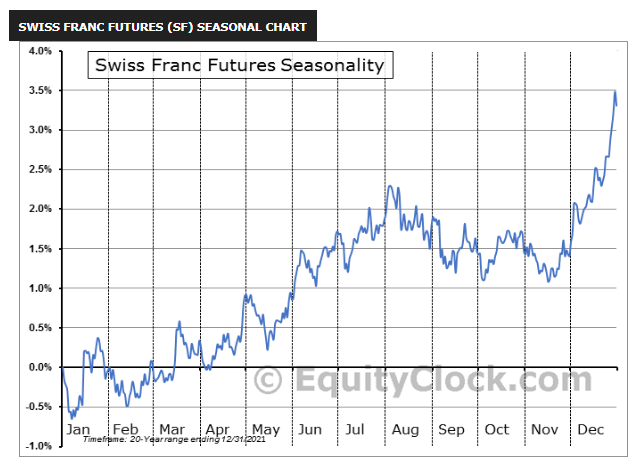

The Swiss franc (CHF) is a cornerstone of the global forex market, offering traders a variety of opportunities to capitalize on its unique characteristics. As a currency entrenched in a nation known for its economic stability and political neutrality, the CHF provides both a safe haven and a dynamic asset for speculators and investors alike. This article aims to dissect the intricacies of trading the Swiss franc, focusing particularly on the trading hours, currency pairs, and the advantages presented by algorithmic trading techniques.

Trading the CHF requires a keen understanding of the forex market dynamics and strategic planning to optimize trading times and techniques. Effective trading is not merely about timing but also about adopting sophisticated methods that leverage technology and market analytics. By utilizing automated trading systems, traders can enhance their efficiency and profitability, reducing the emotional and human errors often associated with manual trading.



In understanding market dynamics, traders benefit from analyzing the best trading hours which coincide with peak market activities and major economic releases. These elements are crucial as they affect liquidity and volatility, providing windows where significant market movements occur. Mastering these nuances allows traders to enhance their trading performance and yield better outcomes.

Moreover, the discussion will highlight how traders can make strategic use of algorithmic trading systems. These powerful tools enable the execution of complex trading strategies with precision and speed, capitalizing on market trends as they spontaneously arise. Such systems can automatically manage positions and market entries and exits based on predefined criteria, offering disciplined execution even when traders are not actively monitoring the market.

The insights provided in the following sections will arm you with the necessary knowledge and tools to navigate Swiss franc trading efficiently, harnessing both traditional trading strategies and cutting-edge algorithmic techniques. Whether you are seasoned in forex trading or embarking on your first trades, the Swiss franc offers numerous avenues to explore and profit from.

## Table of Contents

## Understanding Swiss Franc Trading Hours

The Swiss franc (CHF) is actively traded throughout the week, starting from Sunday evening to Friday afternoon. This continuous trading period coincides with the global forex market hours, providing ample opportunities for traders worldwide. However, not all hours offer the same advantages. Understanding the variations in trading volumes and volatility is essential for optimizing trading strategies involving the CHF.

Trading activity in the Swiss franc tends to peak during specific periods when market participants anticipate or react to economic data releases. For instance, U.S. economic data releases, occurring between 8:30 a.m. and 10:00 a.m. Eastern Time (ET), often influence CHF trading as they impact the USD/CHF pair. Similarly, eurozone economic data, released typically between 2:00 a.m. and 5:00 a.m. ET, can significantly affect the EUR/CHF pair.

The overlap between the London and New York trading sessions appears to be particularly lucrative for CHF trading. This period, occurring between 8:00 a.m. ET and 12:00 p.m. ET, combines substantial market [liquidity](/wiki/liquidity-risk-premium) and heightened trading activities as major financial centers operate simultaneously. Traders often find opportunities during this overlap due to increased market movements and better spreads, making it an ideal time for executing trades involving the Swiss franc.

In essence, while the CHF is available for trading five days a week, pinpointing the most active and volatile hours based on economic data releases and market session overlaps is key to enhancing trading performance. By aligning trading strategies with these optimal trading windows, traders can better manage risk and potentially improve their profitability.

## Key Swiss Franc Currency Pairs

Forex traders primarily engage with the Swiss franc through several key currency pairs, notably EUR/CHF, USD/CHF, CHF/JPY, and GBP/CHF. These pairs are among the most popular due to their high liquidity and the economic significance of the involved countries. The economies of the European Union, the United States, Japan, and the United Kingdom are intertwined with global markets, making these currency pairs attractive to [forex](/wiki/forex-system) traders.

Liquidity is a crucial [factor](/wiki/factor-investing) that enhances trading opportunities. The EUR/CHF and USD/CHF pairs, for instance, are traded extensively due to the substantial trade and financial transactions between Switzerland and the Eurozone as well as the United States. Similarly, the CHF/JPY and GBP/CHF pairs provide traders with diverse exposure to the Asian markets and the British economy, respectively. The presence of such liquidity means that traders can easily enter and [exit](/wiki/exit-strategy) positions without significant price distortion, allowing for more efficient market operations.

Each of these currency pairs experiences optimal trading times stemming from overlapping market sessions. For instance, the overlap between the London and New York sessions sees increased trading activity, particularly impacting GBP/CHF and USD/CHF pairs. Conversely, the EUR/CHF pair witnesses heightened activity during the overlap of the London and Frankfurt sessions. The CHF/JPY pair benefits from activity during the Tokyo session overlap with the European markets. Understanding these overlaps is essential for strategic timing, as trading during these periods can provide better liquidity and lower spreads.

Additionally, traders must remain vigilant of macroeconomic events and policy announcements from the Swiss National Bank (SNB). The SNB's monetary policy decisions and economic outlook reports can significantly influence CHF currency pairs. For example, changes in interest rates or interventions in foreign exchange markets by the SNB can cause substantial movements in CHF-related pairs. Therefore, keeping abreast of such announcements is imperative for traders to make informed decisions and harness potential market movements effectively.

In summary, engaging with Swiss franc currency pairs requires understanding of their liquidity dynamics, optimal trading windows, and the potential impact of macroeconomic indicators and SNB policies. This strategic approach enables traders to manage risks and capitalize on opportunities in the forex market.

## Algorithmic Trading: Enhancing CHF Forex Strategies

Algorithmic trading systems have revolutionized the world of forex trading by enabling traders to implement intricate strategies with precision and speed. These systems essentially automate the trading process, effectively removing the influence of emotions and human errors that can cloud decision-making. In the context of trading the Swiss franc (CHF), [algorithmic trading](/wiki/algorithmic-trading) offers significant advantages, particularly when managing multiple currency pairs simultaneously and optimizing trade entry and exit points.

One of the most compelling benefits of algorithmic trading is its ability to identify and exploit patterns and volatilities in the forex market during key trading hours. By leveraging historical data and current market conditions, these systems can predict potential price movements and execute trades at the opportune moment. This is crucial in the foreign exchange market where prices can fluctuate rapidly, and timely decision-making is essential for maximizing profitability.

To achieve consistency and discipline in trading, algorithmic systems are configured with predefined criteria. These criteria are often based on technical indicators, quantitative models, or a combination of both. For instance, a simple moving average (SMA) strategy for a CHF currency pair might be programmed as follows in Python:

```python
import pandas as pd

def moving_average_strategy(data, short_window=50, long_window=200):
    data['Short_MA'] = data['Close'].rolling(window=short_window, min_periods=1).mean()
    data['Long_MA'] = data['Close'].rolling(window=long_window, min_periods=1).mean()
    data['Signal'] = 0
    data['Signal'][short_window:] = np.where(data['Short_MA'][short_window:] > data['Long_MA'][short_window:], 1, 0)
    data['Position'] = data['Signal'].diff()
    return data

# Example usage with historical price data in a DataFrame
# data = pd.read_csv('CHF_data.csv')
# strategy_data = moving_average_strategy(data)
# plot data and strategy_data to visualize buy/sell signals
```

In this example, the script calculates short-term and long-term moving averages (SMA) and generates buy or sell signals based on their crossover. When the short-term SMA crosses above the long-term SMA, a buy signal is generated, while a crossover below results in a sell signal. By automating this process, traders can maintain a systematic approach to trading, ensuring that opportunities are not missed even when they are not actively monitoring the markets.

Furthermore, algorithmic trading systems can adapt to various market conditions by integrating [machine learning](/wiki/machine-learning) algorithms. These algorithms can enhance the predictive accuracy of trading models by learning from market data and continuously improving their predictions. Such methodologies can effectively handle CHF forex trading's complex and dynamic nature, providing traders with a competitive edge.

In conclusion, algorithmic trading is an indispensable tool for traders looking to optimize their strategies in the CHF forex market. By automating decision-making processes and incorporating advanced analytical techniques, traders can capitalize on market opportunities with increased efficiency and profitability.

## Swiss Franc Trading: Economic and Political Influences

The Swiss franc (CHF) is regarded as a safe-haven currency, a status largely attributed to Switzerland's long-standing political neutrality and robust economic framework. This perception makes the CHF particularly appealing to investors seeking refuge during periods of geopolitical tension or economic uncertainty. The safety attributed to the Swiss franc is further reinforced by the country's stable banking system, low debt levels, and consistent trade surpluses.

Monetary policy decisions by the Swiss National Bank (SNB) are a critical factor in shaping the value of the CHF. The SNB's policy interventions, such as adjusting interest rates or engaging in currency market interventions, can lead to significant fluctuations in the CHF's value. For instance, the SNB's decision to remove the CHF's cap against the euro in January 2015 led to a rapid appreciation of the Swiss franc, illustrating the profound impact of policy shifts.

In the forex market, the Swiss franc often exhibits strong correlations with movements in major global currencies such as the US dollar (USD) and the euro (EUR). Announcements related to the economic indicators or monetary policy changes concerning these currencies can lead to significant market movements. For example, an unexpected change in the Federal Reserve's [interest rate](/wiki/interest-rate-trading-strategies) policy can cause adjustments in USD/CHF exchange rates, creating both risks and opportunities for traders.

Staying informed about geopolitical tensions is vital for anyone trading the CHF. Switzerland's geographical and economic proximity to the eurozone means that political and economic developments within Europe can have a direct impact on the value of the Swiss franc. Similarly, significant global macroeconomic releases, such as data on inflation, employment, and GDP growth rates from major economies, should be closely monitored as these can influence market sentiment and the CHF's valuation.

Successful trading of the CHF entails understanding and anticipating the effects of these economic and political factors. Traders can enhance their strategies by developing models to predict potential currency movements based on various economic indicators and news events. Employing statistical or machine learning models can help in recognizing patterns and making educated decisions regarding CHF trades. Here's a basic example using Python to analyze the impact of major economic announcements on CHF [volatility](/wiki/volatility-trading-strategies):

```python
import pandas as pd
import numpy as np
from statsmodels.tsa.arima_model import ARIMA

# Example data frame `df` containing historical CHF price and event indicators
# df = pd.read_csv('historical_chf_data.csv') # Commented out as file access is not possible

# Dummy data for illustration
np.random.seed(0)
df = pd.DataFrame({
    'Price': np.random.randn(1000).cumsum() + 1,
    'Event_Impact': np.random.choice([0, 1], size=1000)  # Simulating event occurrence
})

# Analyze CHF price movements with ARIMA model
def analyze_volatility(data, order=(1, 1, 1)):
    try:
        model = ARIMA(data['Price'], order=order)
        fit_model = model.fit(disp=0)
        print(fit_model.summary())
    except Exception as e:
        print(f"Error: {e}")

analyze_volatility(df)
```

In conclusion, understanding the economic and political influences on the Swiss franc demands a comprehensive approach, incorporating knowledge of Switzerland's monetary policies, global economic data releases, and geopolitical developments. This enables traders to navigate the forex market with greater insight and adaptability.

## Conclusion

Trading the Swiss franc requires a comprehensive understanding of the dynamic interplay between global economic factors, strategic timing, and the application of advanced technology. Optimal trading hours are pivotal in maximizing potential profits, as volatility and liquidity vary significantly throughout the day. By identifying the most active market sessions, such as the overlap of the London and New York sessions, traders can capitalize on increased activity that often leads to more favorable trading conditions.

Automated trading methods, such as algorithmic systems, can further enhance the precision and efficiency of Swiss franc trading strategies. These technologies eliminate the emotional biases inherent in manual trading, offering a systematic approach to mastering the complexities of the forex market. Automation allows for the execution of trades based on pre-set criteria, ensuring timely response to market movements even when traders are not actively monitoring the market.

The Swiss franc presents numerous opportunities for both seasoned traders and newcomers to forex. Its reputation as a safe-haven currency, backed by Switzerland's economic stability and political neutrality, attracts traders in times of global uncertainty. This characteristic, combined with the strategic insights gained from market analysis and algorithms, provides a robust framework for exploring CHF trading.

In conclusion, the successful trading of the Swiss franc is anchored in leveraging the synergies of market analysis and technological advancement. By strategically aligning trading activities with optimal hours and employing algorithmic systems, traders equip themselves to navigate the intricacies of the forex market effectively and profitably.

## References & Further Reading

[1]: Bergstra, J., Bardenet, R., Bengio, Y., & Kégl, B. (2011). ["Algorithms for Hyper-Parameter Optimization."](https://papers.nips.cc/paper/4443-algorithms-for-hyper-parameter-optimization) Advances in Neural Information Processing Systems 24.

[2]: ["Advances in Financial Machine Learning"](https://www.amazon.com/Advances-Financial-Machine-Learning-Marcos/dp/1119482089) by Marcos Lopez de Prado

[3]: ["Evidence-Based Technical Analysis: Applying the Scientific Method and Statistical Inference to Trading Signals"](https://www.amazon.com/Evidence-Based-Technical-Analysis-Scientific-Statistical/dp/0470008741) by David Aronson

[4]: ["Machine Learning for Algorithmic Trading"](https://github.com/stefan-jansen/machine-learning-for-trading) by Stefan Jansen

[5]: ["Quantitative Trading: How to Build Your Own Algorithmic Trading Business"](https://www.amazon.com/Quantitative-Trading-Build-Algorithmic-Business/dp/1119800064) by Ernest P. Chan