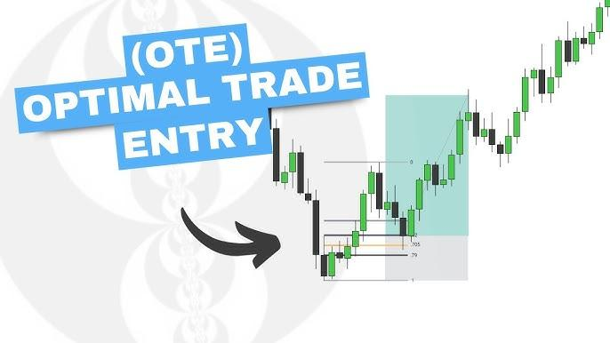

## Table of Contents

## What is the Optimal Trading Rule (OTR) framework?

The Optimal Trading Rule (OTR) framework is a method used in finance to figure out the best way to buy and sell assets. It helps traders make decisions by looking at the costs and benefits of trading at different times. The goal is to find a balance that maximizes profit while minimizing costs like transaction fees and the impact of the trade on the market price.

In simple terms, OTR helps traders answer questions like "When should I buy?" and "When should I sell?" It does this by using math models that consider things like how much the price might move because of the trade, how much it costs to make the trade, and how quickly the trader wants to finish the trade. By using OTR, traders can make smarter decisions that lead to better overall results.

## How does the OTR framework differ from other trading strategies?

The OTR framework is different from other trading strategies because it focuses on finding the best balance between trading costs and trading benefits. Many other strategies might focus on just making quick profits or following market trends, but OTR looks at the whole picture. It uses math models to figure out when and how to trade to minimize costs like transaction fees and the impact of the trade on the market price, while still aiming to maximize profits.

For example, a simple trading strategy might tell you to buy a stock when its price goes down and sell when it goes up. But OTR would consider more factors, like how much the price might move because of your trade and how quickly you need to finish trading. This makes OTR more complex but also potentially more effective, especially for big trades that can affect the market.

Overall, while other strategies might be easier to understand and follow, the OTR framework offers a more detailed and scientific approach to trading. It's like comparing a basic recipe to a gourmet one; the gourmet recipe takes more effort but can lead to a better result.

## What are the key components of the OTR framework?

The OTR framework is made up of a few important parts that help traders make smart decisions. One key part is the cost of trading, which includes things like transaction fees and the impact the trade might have on the market price. This is important because every trade has costs, and the OTR framework tries to keep these costs as low as possible. Another part is the benefit of trading, which is usually the profit a trader hopes to make. The OTR framework looks at how to balance these costs and benefits to find the best time to buy and sell.

Another important part of the OTR framework is the use of math models. These models help predict how the market might react to a trade and how quickly a trader needs to finish trading. For example, if a trader wants to buy a lot of a certain stock, the price might go up because of the big buy. The OTR framework uses math to figure out the best way to spread out the buying to keep the price impact low. This helps traders make better decisions by thinking about all the different factors that can affect a trade.

Overall, the OTR framework brings together the costs, benefits, and math models to create a detailed plan for trading. It's not just about making quick profits; it's about understanding the whole picture and making trades that are smart and efficient. This makes the OTR framework a powerful tool for traders who want to do more than just follow simple buy and sell signals.

## Can you explain the mathematical model behind the OTR framework?

The math model behind the OTR framework is all about finding the best way to trade. It starts by figuring out the costs of trading, like the fees you pay when you buy or sell and how your trade might change the price of what you're trading. The model uses a thing called the "price impact function" to guess how much the price will move because of your trade. It also looks at the "trading [volume](/wiki/volume-trading-strategy)" to decide how quickly you should buy or sell to keep costs low. The goal is to find the right balance between these costs and the profit you hope to make.

Then, the model uses something called "optimization" to figure out the best plan. This means it tries different ways of trading and picks the one that gives the best results. It might suggest spreading out your trades over time to keep the price from moving too much, or it might say to trade quickly if the market is moving fast. The model uses a lot of math to make these decisions, but at its heart, it's just trying to find the smartest way to trade by looking at all the different factors that can affect your trades.

## How is the OTR framework implemented in practice?

In practice, using the OTR framework means traders need to gather a lot of information first. They need to know things like how much it costs to make a trade, how the price might change because of their trade, and how quickly they need to finish trading. Once they have this information, they can use special computer programs that have the OTR math models built into them. These programs help traders figure out the best times and ways to buy and sell to keep costs low and profits high.

Traders then follow the plan the OTR model gives them. This might mean spreading out their trades over a few days to avoid moving the price too much, or it might mean trading quickly if the market is moving fast. The key is to stick to the plan the model suggests, because it's based on a lot of math that looks at all the different factors that can affect a trade. By using the OTR framework, traders can make smarter decisions and hopefully get better results from their trades.

## What data inputs are required for the OTR framework?

To use the OTR framework, traders need to gather a few important pieces of information. They need to know the costs of trading, which include things like the fees they have to pay when they buy or sell, and how much the price might change because of their trade. This is called the "price impact." They also need to know how quickly they want to finish their trading, which is called the "trading volume." All of this information helps the OTR model figure out the best way to trade.

Once they have all this data, traders can use special computer programs that have the OTR math models built into them. These programs take the information about trading costs, price impact, and trading volume, and then they use math to figure out the best plan for buying and selling. This plan might tell the trader to spread out their trades over time to keep the price from moving too much, or it might tell them to trade quickly if the market is moving fast. By following this plan, traders can make smarter decisions and hopefully get better results from their trades.

## What are the common challenges faced when using the OTR framework?

One big challenge when using the OTR framework is getting all the right data. Traders need to know the costs of trading, how much the price might change because of their trade, and how quickly they want to finish trading. If any of this information is wrong or missing, the OTR model might give a bad plan. It's like trying to bake a cake without knowing the right amounts of ingredients; the cake might not turn out well.

Another challenge is that the OTR framework can be hard to understand and use. It uses a lot of math and special computer programs, which can be tricky for some traders. They might need to learn new skills or hire experts to help them use the OTR framework correctly. Even then, the market can change quickly, and the plan the OTR model gives might not always work out perfectly. Traders need to be ready to change their plans if the market does something unexpected.

## How can the OTR framework be optimized for different market conditions?

To make the OTR framework work better in different market conditions, traders need to keep updating their data. The costs of trading, how much the price might change because of their trade, and how quickly they want to finish trading can all change depending on what's happening in the market. For example, if the market is moving fast, traders might need to trade quickly to keep up. They can use the OTR framework to figure out the best way to do this by giving it new information about the market.

Another way to make the OTR framework work better is by using different math models for different situations. Some models might work better when the market is calm, while others might be better when the market is moving a lot. Traders can switch between these models to find the one that fits the current market conditions best. By doing this, they can make smarter decisions and get better results from their trades, no matter what the market is doing.

## What are some case studies or examples where the OTR framework has been successfully applied?

One example where the OTR framework was used successfully is in the trading of large blocks of stocks. A big investment firm wanted to sell a lot of shares without making the price go down too much. They used the OTR framework to figure out the best way to do this. The model told them to spread out their selling over a few days and to sell more when the market was busy. By following the OTR plan, the firm was able to sell all their shares without moving the price too much, which saved them a lot of money.

Another example is a [hedge fund](/wiki/hedge-fund-trading-strategies) that used the OTR framework to trade during a time when the market was moving a lot. The fund needed to buy a lot of a certain stock quickly, but they didn't want to push the price up too high. The OTR model helped them figure out the best times to buy, taking into account how much the price might move and how quickly they needed to finish the trade. By following the OTR plan, the hedge fund was able to buy the stock they needed without paying too much, which helped them make a good profit.

## How does the OTR framework handle risk management?

The OTR framework helps traders manage risk by looking at the costs and benefits of trading. It uses math to figure out the best way to buy and sell so that traders can avoid losing too much money. For example, if a trader wants to sell a lot of shares, the OTR framework might tell them to spread out the selling over time. This can help keep the price from dropping too much, which reduces the risk of losing money on the trade.

Another way the OTR framework handles risk is by considering how the market might move. If the market is moving a lot, the framework might suggest trading quickly to take advantage of the situation. But if the market is calm, it might tell the trader to take their time to keep costs low. By adjusting the trading plan based on what's happening in the market, the OTR framework helps traders make smarter decisions and manage their risk better.

## What are the latest advancements or research developments in the OTR framework?

Recent research in the OTR framework has focused on making it work better with new technology. One big advancement is using [machine learning](/wiki/machine-learning) to make the math models smarter. These models can now learn from past trades to predict how the market might move in the future. This helps traders make even better plans for buying and selling. Another development is making the OTR framework easier to use with new software tools. These tools help traders put in all the data they need and get the best trading plan without having to be math experts themselves.

Another area of research is looking at how to use the OTR framework for different kinds of trading, like trading things other than stocks, such as bonds or cryptocurrencies. Researchers are trying to see if the same math models can work for these other markets. They are also working on ways to make the OTR framework handle risk even better. For example, they are adding new ways to predict how much the price might move because of a trade, which helps traders avoid losing too much money. By keeping up with these advancements, the OTR framework can help traders make smarter decisions no matter what they are trading.

## How can the OTR framework be integrated with other financial technologies or systems?

The OTR framework can be integrated with other financial technologies to make trading easier and smarter. For example, it can work with trading platforms that let traders buy and sell quickly. These platforms can take the trading plans the OTR framework suggests and turn them into real trades. This means traders don't have to do everything by hand; the computer can do a lot of the work for them. The OTR framework can also connect with data analysis tools that help traders understand the market better. These tools can give the OTR framework the information it needs about trading costs and how the market is moving, which helps it make better plans.

Another way to integrate the OTR framework is with risk management systems. These systems help traders keep track of how much risk they are taking with their trades. By working together, the OTR framework can make trading plans that fit with the risk levels the trader is comfortable with. This makes trading safer and more controlled. Overall, integrating the OTR framework with other financial technologies helps traders make better decisions and manage their trades more effectively.

## What is the Optimal Trading Rule (OTR) and how can it be understood?

The Optimal Trading Rule (OTR) framework is designed to devise trading rules that maximize returns or minimize risks, representing a pivotal advancement in [algorithmic trading](/wiki/algorithmic-trading). Unlike conventional methods heavily reliant on historical data for [backtesting](/wiki/backtesting), OTR seeks to optimize trading parameters without this heavy dependence, addressing the challenge of overfitting and improving predictive accuracy in volatile markets.

Researchers have developed various methodologies to derive these optimal trading rules. Many of these methods leverage advanced mathematical and statistical models. By focusing on theoretical constructs, like stochastic processes and financial mathematics, OTR provides a more robust approach that adapts to changes in market dynamics without being ensnared by past market anomalies present in historical data.

One notable model employed within this framework is the discrete Ornstein-Uhlenbeck process, which aids in modeling mean-reverting behaviors observed in financial time series. The Ornstein-Uhlenbeck process is a type of continuous-time stochastic process used to describe systems with a tendency to revert to a mean value over time. This characteristic renders it particularly useful for modeling the dynamics of interest rates, exchange rates, or other financial indicators that exhibit similar behaviors. It is defined by the stochastic differential equation:

$$
dX_t = \theta(\mu - X_t)dt + \sigma dW_t
$$

where $X_t$ is the variable of interest at time $t$, $\theta$ is the rate of reversion, $\mu$ is the long-term mean, $\sigma$ is the volatility, and $dW_t$ is the Wiener process or standard Brownian motion.

The theoretical foundation of OTR is essential for quant traders and researchers who strive to develop resilient trading strategies. These strategies incorporate a dynamic framework that considers both expected returns and associated risks. By doing so, OTR fosters the creation of trading systems that are not only optimized for performance but are also resilient to abrupt market shifts, providing a strategic advantage in fast-paced financial environments.

In summary, the understanding and application of OTR represent a significant step forward in creating more efficient and less data-dependent trading strategies. Its focus on theoretical rigour over empirical overfitting provides a solid grounding for developing strategies that are adaptable and robust, ensuring that traders can navigate the complexities of modern financial markets with enhanced precision and reduced risk.

## Question: Can you conduct a Case Study on OTR without Backtesting?

One compelling study has showcased the feasibility of determining Optimal Trading Rules (OTRs) without the traditional reliance on backtesting, thereby mitigating the risk of overfitting. This approach is essential for developing robust algorithmic trading strategies that are not overly dependent on historical data, which might not always be indicative of future market conditions. 

The study made use of the Ornstein-Uhlenbeck process, a well-regarded statistical model for capturing mean-reverting behavior in financial time series. This model assists in understanding complex market dynamics by providing a mathematical framework through which asset prices are assumed to revert to a mean over time. The classical representation of the Ornstein-Uhlenbeck process can be described with the stochastic differential equation:

$$
dX_t = \theta(\mu - X_t)dt + \sigma dW_t
$$

where $X_t$ is the variable of interest (e.g., price), $\mu$ is the long-term mean, $\theta$ is the rate at which the process reverts to the mean, $\sigma$ is the volatility, and $W_t$ represents a Wiener process or Brownian motion.

Numerical methods were employed to derive these optimal trading rules, offering a viable alternative to traditional trading strategy development methods. By avoiding backtesting—typically reliant on historical price data—this approach minimizes biases introduced by overfitting, a common pitfall where a model overly adapts to past data at the expense of future performance.

The findings emphasize the potential effectiveness of such trading rules, which leverage the intrinsic characteristics of market behaviors rather than historical price patterns. Not only does this improve risk management by avoiding reliance on potentially biased historical data, but it also opens new avenues for strategy formulation that align more closely with theoretical price behaviors suggested by mathematical models.

In summary, this innovative study establishes a new benchmark for future research, highlighting the possibility of designing trading strategies that maintain an optimal balance between efficiency and risk management. It underscores the importance of adopting alternative frameworks like OTR, which could redefine how algorithmic trading strategies are developed and executed.

## References & Further Reading

[1]: Bergstra, J., Bardenet, R., Bengio, Y., & Kégl, B. (2011). ["Algorithms for Hyper-Parameter Optimization."](https://papers.nips.cc/paper/4443-algorithms-for-hyper-parameter-optimization) Advances in Neural Information Processing Systems 24.

[2]: ["Advances in Financial Machine Learning"](https://www.amazon.com/Advances-Financial-Machine-Learning-Marcos/dp/1119482089) by Marcos Lopez de Prado

[3]: ["Evidence-Based Technical Analysis: Applying the Scientific Method and Statistical Inference to Trading Signals"](https://www.amazon.com/Evidence-Based-Technical-Analysis-Scientific-Statistical/dp/0470008741) by David Aronson

[4]: ["Machine Learning for Algorithmic Trading"](https://github.com/stefan-jansen/machine-learning-for-trading) by Stefan Jansen

[5]: ["Quantitative Trading: How to Build Your Own Algorithmic Trading Business"](https://books.google.com/books/about/Quantitative_Trading.html?id=j70yEAAAQBAJ) by Ernest P. Chan