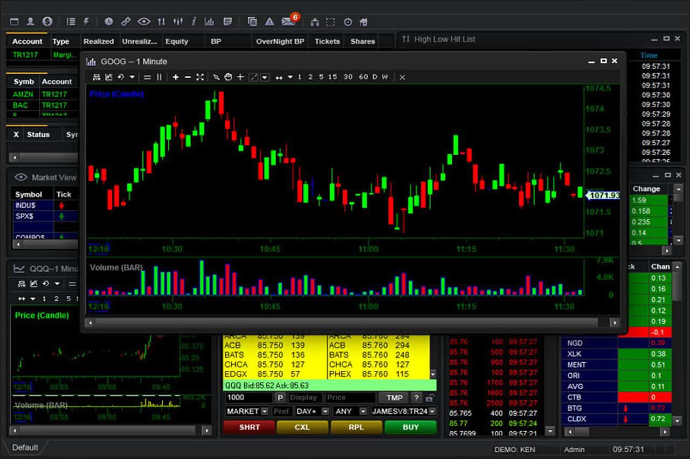

Algorithmic trading, commonly referred to as algo trading, has profoundly transformed the landscape of financial markets. By leveraging sophisticated algorithms, it automates trading processes, thereby enhancing the speed and efficiency of trades. This automation not only minimizes human intervention but also allows for the execution of trades at a scale and speed that would be impossible manually. At the core of successful algorithmic trading is the concept of 'optimal trading speed.' This factor is pivotal because it offers traders significant competitive advantages, such as the ability to rapidly respond to market changes and capitalize on fleeting opportunities.

Optimal trading speed is critical for several reasons. First, it enables traders to capture transient market opportunities that may last only for fractions of a second. This aspect is particularly vital in highly volatile markets where price movements are swift and unpredictable. Secondly, by executing trades at an optimal speed, traders can minimize market impact, particularly when dealing with large volumes. Quick execution can prevent the adverse effects of large trades on market prices, preserving value and ensuring favorable outcomes. Lastly, the speed of trade execution contributes to increased liquidity and reduced bid-ask spreads, creating a more efficient and competitive market environment.



This article will examine why trading speed is essential in algorithmic trading and how it serves to enhance trading outcomes. Alongside, we will explore the pivotal role that algo trading platforms play in achieving these optimal speeds. These platforms provide the necessary infrastructure and tools that enable traders to execute at high speeds while tailoring their strategies to meet specific market conditions. Through advanced features such as low-latency connectivity and co-location services, these platforms support traders in maintaining their competitive edge in an increasingly fast-paced financial world.

## Table of Contents

## Significance of Trading Speed in Algo Trading

Speed plays a pivotal role in the success of algorithmic trading for several substantial reasons. First, the rapid execution of trades is essential for capturing fleeting market opportunities that may only be available for fractions of a second. These ephemeral opportunities can result from minimal price discrepancies, and only traders equipped with speed-optimized algorithms can effectively capitalize on them.

Second, speed is paramount in minimizing the market impact during the execution of large volume trades. When significant quantities of assets are traded, the market can be swayed by the sheer volume of the transaction. Quick execution ensures that the market impact is reduced, allowing the trade to be completed before any considerable price shifts occur as a result of the trade itself.

Moreover, increased speed in trading contributes to enhanced liquidity and narrower bid-ask spreads. Rapid order placement facilitated by advanced algorithms means that liquidity is continuously replenished, making the market more efficient. This efficiency allows for the narrowing of bid-ask spreads, reducing the cost of trading for all participants. This narrowing can be mathematically expressed by considering the bid-ask spread, $S$, as a function of order execution speed, $\tau$, showing that:

$$
S = f(\tau)
$$

where an increase in $\tau$ results in a decrease in $S$, illustrating the reduction in spreads. Hence, optimal trading speed is integral not only to individual traders but also to the overall functionality and efficiency of financial markets.

## Understanding High-Frequency Trading (HFT)

High-Frequency Trading ([HFT](/wiki/high-frequency-trading-strategies)) represents a sophisticated subset of [algorithmic trading](/wiki/algorithmic-trading) where the rapid execution of trades is paramount. Utilizing advanced algorithms, HFT systems are programmed to execute a vast number of orders within fractions of a second. This speed allows HFT to exploit ephemeral market conditions, such as momentary price discrepancies and inefficiencies that traditional trading mechanisms may overlook.

The primary advantage of HFT is its ability to capitalize on short-lived market anomalies. These anomalies often present as slight price differentials between markets or within different segments of the same market. By leveraging sophisticated algorithms, HFT systems can identify and act on these opportunities before they are corrected, thus securing profits that might be unattainable through slower, manual trading methods.

Execution speed and low latency are critical to successful HFT. Execution speed refers to how quickly an order can be placed, processed, and completed. Low latency, on the other hand, pertains to the time delay between when a market signal is obtained and when a trade based on that signal is executed. Minimizing latency is essential because even microseconds of delay can result in missed opportunities or reduced profitability. For instance, co-locating trading servers close to exchange data centers is a common practice to reduce latency. 

In summary, HFT leverages the power of advanced computing and network technologies to process large volumes of transactions at rapid speeds. It demands top-notch execution speed and low latency to effectively identify and exploit brief market inefficiencies, thus presenting a formidable tool in the arsenal of modern traders.

## Role of Algo Trading Platforms

Algorithmic trading platforms play a vital role in facilitating high-speed and efficient trading by providing the necessary technological infrastructure and tools. These platforms are designed to meet the demands of modern trading strategies, emphasizing features that enhance speed and customizability.

One of the primary features of algo trading platforms is low-latency connectivity, which is essential for traders aiming to execute orders rapidly. Latency refers to the time delay between the execution of a trading decision by an algorithm and the actual completion of that transaction in the market. In algorithmic trading, even microseconds can be critical. The formula for latency can be described as:

$$
\text{Latency} = \text{Transmission Time} + \text{Processing Delay} + \text{Queuing Time}
$$

Minimizing latency involves ensuring that these components are optimized, allowing traders to capitalize on fleeting market opportunities.

Co-location with exchange data centers is another crucial feature offered by algo trading platforms. It involves placing traders' servers in close proximity to exchange servers. This physical closeness reduces the distance that data must travel, thereby significantly decreasing latency. The reduced data transmission time can provide a critical edge in markets where prices can change in fractions of a second.

Furthermore, algo trading platforms offer customizable algorithms that enable traders to tailor their strategies to specific market conditions and trading goals. Traders can create bespoke algorithms using various programming languages. Python is frequently used due to its robust libraries and ease of use. For instance, traders can use Python to implement a simple moving average crossover strategy as follows:

```python
import numpy as np
import pandas as pd

def moving_average_crossover(prices, short_window=40, long_window=100):
    signals = pd.DataFrame(index=prices.index)
    signals['signal'] = 0.0

    signals['short_mavg'] = prices['Close'].rolling(window=short_window, min_periods=1, center=False).mean()
    signals['long_mavg'] = prices['Close'].rolling(window=long_window, min_periods=1, center=False).mean()

    signals['signal'][short_window:] = np.where(signals['short_mavg'][short_window:] 
                                                > signals['long_mavg'][short_window:], 1.0, 0.0)   

    signals['positions'] = signals['signal'].diff()
    return signals
```

In essence, algorithmic trading platforms equip traders with the tools needed to operate at the cutting-edge of financial markets. By providing low-latency connections, co-location options, and customizable algorithmic frameworks, these platforms not only enable optimal trading speeds but also empower traders to devise and implement strategies that can improve trading performance.

## Benefits of Optimal Trading Speed

Optimal trading speed plays a vital role in enhancing the efficiency and effectiveness of algorithmic trading strategies by streamlining and accelerating the trading process. The automation involved in achieving optimal speeds significantly boosts productivity by ensuring that trades are executed swiftly, thus minimizing unnecessary delays.

One of the primary advantages of achieving optimal trading speed is the exploitation of [arbitrage](/wiki/arbitrage) opportunities. Arbitrage refers to the simultaneous purchase and sale of an asset in different markets to profit from price discrepancies. These pricing discrepancies are often ephemeral, existing for only a brief moment. By executing trades at high speed, traders can capitalize on these discrepancies before they disappear, thereby securing profits that would otherwise be unattainable.

Furthermore, high-speed execution plays a critical role in reducing slippage, which is the difference between the expected price of a trade and the actual price at which it is executed. Slippage can occur due to market [volatility](/wiki/volatility-trading-strategies) and delays in trade execution. By minimizing the time between the decision to trade and the execution of that trade, optimal trading speed reduces the probability of slippage, allowing traders to execute buy or sell orders closer to their desired prices.

An additional benefit of optimal trading speed is the enhancement of overall market efficiency. Faster trade executions contribute to the more efficient functioning of financial markets by ensuring that prices reflect all available information in a timely manner. This increased efficiency leads to tighter bid-ask spreads, which indicates lower transaction costs and improved [liquidity](/wiki/liquidity-risk-premium). Consequently, both traders and the market as a whole benefit from increased transparency and reduced costs.

Overall, optimal trading speed equips traders with a compelling competitive edge, allowing them to navigate markets with improved accuracy and effectiveness. By leveraging technology to achieve rapid executions, traders can maximize their opportunities in complex and fast-paced financial environments.

## Challenges and Considerations

Algorithmic trading, particularly high-frequency trading (HFT), presents several challenges and considerations for participants in the financial markets. One of the primary requirements is the investment in robust technological and infrastructural capabilities. This includes the development and maintenance of cutting-edge hardware and software systems to achieve the needed execution speeds. Low latency and high throughput are crucial, demanding significant resources to ensure that traders can capitalize on fast-moving market conditions. 

Moreover, extreme emphasis must be placed on regulatory compliance. Traders engaged in algo trading must navigate a complex landscape of market regulations designed to ensure fair and transparent operations. Regulatory bodies impose strict guidelines concerning high-speed trading activities, aiming to mitigate the risks of market manipulation and systemic disruptions. Adherence to such regulations not only protects traders from potential legal repercussions but also fosters a fair trading environment.

High-speed trading can contribute to increased market volatility, with rapid execution potentially amplifying price movements during turbulent times. As such, there is a need for careful management of this volatility to prevent excessive fluctuations. Traders must develop strategies to measure and control market impacts, ensuring that their activities do not lead to destabilizing effects.

Robust risk management systems, comprehensive testing, and real-time monitoring are crucial components in addressing these challenges. Traders should leverage these systems to assess risk exposure and mitigate the potential adverse effects of high-speed execution. In summary, while the advantages of algorithmic trading are significant, success depends on careful attention to the technological, regulatory, and market dynamics involved.

## Conclusion

Algorithmic trading strategies rely heavily on the speed of execution to maximize their effectiveness. Trading speed can substantially influence the profitability and risk management of these strategies. A swift execution minimizes the risk of price slippage and ensures the capture of favorable price points before market conditions change.

The advancements in platforms like uTrade Algos demonstrate the pivotal role of technology in enabling optimal trading speeds. These platforms equip traders with low-latency connectivity and offer customizable algorithms designed to operate at the highest efficiency levels. By providing seamless access to market data and executing trades in real time, such platforms significantly enhance traders' abilities to respond to fleeting market opportunities and arbitrage conditions.

The continuous evolution of financial technology suggests an inevitable trend towards even faster and more efficient trading execution. This progression is fueled by improvements in algorithmic sophistication, data processing speeds, and connectivity infrastructures. As these technologies advance, they promise to further reduce latency and enhance the precision of trading operations.

Ultimately, achieving optimal trading speeds is not just about facilitating faster transactions but also about enhancing the overall market infrastructure, which can lead to increased liquidity and efficiency in financial markets. As algorithmic trading continues to develop, the focus remains on maintaining speed as a cornerstone of successful trading strategy implementation.

## References & Further Reading

[1]: Aldridge, I. (2013). ["High-Frequency Trading: A Practical Guide to Algorithmic Strategies and Trading Systems."](https://www.ahmetbeyefendi.com/wp-content/uploads/2020/07/High-Frequency-Trading-Irene-Aldridge.pdf) Wiley.

[2]: Kissell, R. (2013). ["The Science of Algorithmic Trading and Portfolio Management."](https://www.sciencedirect.com/book/9780124016897/the-science-of-algorithmic-trading-and-portfolio-management) Academic Press.

[3]: Narang, R. K. (2013). ["Inside the Black Box: A Simple Guide to Quantitative and High-Frequency Trading."](https://onlinelibrary.wiley.com/doi/book/10.1002/9781118662717) Wiley.

[4]: Patterson, S. (2013). ["Dark Pools: The Rise of the Machine Traders and the Rigging of the U.S. Stock Market."](https://www.amazon.com/Dark-Pools-Machine-Traders-Rigging/dp/0307887189) Crown Business.

[5]: Harris, L. (2002). ["Trading and Exchanges: Market Microstructure for Practitioners."](https://www.acsu.buffalo.edu/~keechung/MGF743/Readings/Trading-Exchanges-Market-Microstructure-Practitioners%20Draft%20Copy.pdf) Oxford University Press.

[6]: Hasbrouck, J. (1995). ["One Security, Many Markets: Determining the Contributions to Price Discovery."](https://onlinelibrary.wiley.com/doi/abs/10.1111/j.1540-6261.1995.tb04054.x) The Journal of Finance, 50(4), 1175-1199.

[7]: Brogaard, J., Hendershott, T., & Riordan, R. (2014). ["High-Frequency Trading and Price Discovery."](https://academic.oup.com/rfs/article-abstract/27/8/2267/1582754) The Review of Financial Studies, 27(8), 2267-2306.