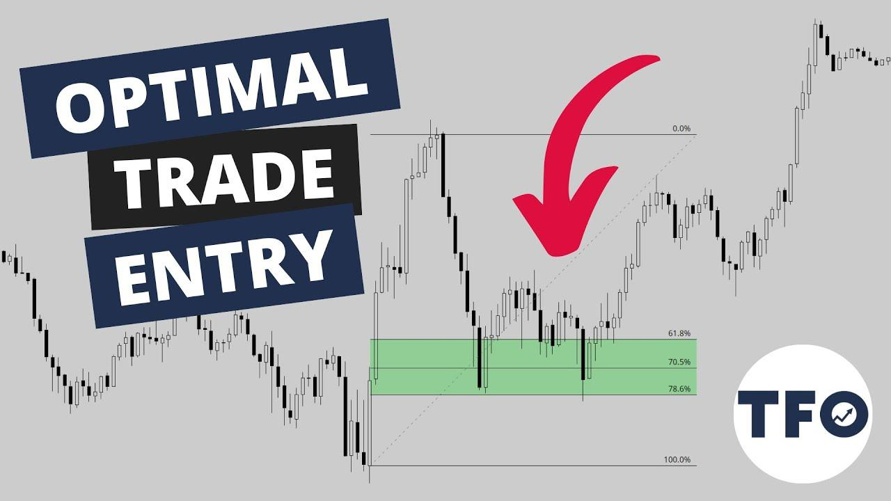

## Table of Contents

## What is trading and why is it important?

Trading is when people buy and sell things like stocks, currencies, or goods to make money. It happens in places called markets, where people come together to trade. For example, if you buy a stock and its price goes up, you can sell it for more money than you paid. This is how traders make profits.

Trading is important because it helps the economy grow. When people trade, they help move money and goods around, which creates jobs and helps businesses. Trading also lets people invest their money and possibly earn more, which can improve their lives. Without trading, it would be hard for the economy to work well.

## What are the basic principles of optimal trading?

Optimal trading is about making smart choices to make the most money while keeping risks low. One key principle is to always have a plan. This means setting clear goals for what you want to achieve and deciding how much risk you're willing to take. Before you start trading, you should research the market and understand what might make prices go up or down. Having a plan helps you stay focused and avoid making quick, emotional decisions that can lead to losses.

Another important principle is to manage your money wisely. This means not putting all your money into one trade, but spreading it out over different investments. This way, if one trade doesn't go well, you won't lose everything. It's also important to know when to cut your losses. If a trade isn't working out, it's better to sell and lose a little money than to hold on and lose a lot. Keeping track of your trades and learning from both your wins and losses will help you get better over time.

Lastly, staying disciplined and patient is crucial. The market can be unpredictable, and it's easy to get caught up in the excitement or panic. But successful traders stick to their plans and don't let their emotions take over. They understand that making money in trading often takes time and that it's important to keep learning and adapting to new information. By following these principles, traders can increase their chances of success in the long run.

## How do beginners start with trading?

If you're a beginner and want to start trading, the first thing you should do is learn the basics. Trading means buying and selling things like stocks or currencies to make money. You can start by reading [books](/wiki/algo-trading-books), watching videos, or taking online courses about trading. It's also helpful to understand how the market works and what can make prices go up or down. Once you feel you have a good understanding, you can open a practice account, also called a demo account, where you can trade with fake money. This is a safe way to practice without risking your real money.

After you've practiced and feel more confident, you can start trading with real money. But it's important to start small. Don't put all your money into one trade. Instead, spread it out over different investments to lower your risk. It's also a good idea to set clear goals and decide how much risk you're willing to take. Remember, trading can be risky, so always be ready to learn from your mistakes and keep improving. With time and practice, you can get better at trading and maybe even make a profit.

## What are the different types of trading strategies?

There are many different types of trading strategies that people use to make money. One common strategy is called [day trading](/wiki/day-trading-spy). Day traders buy and sell things like stocks or currencies within the same day, trying to make quick profits from small price changes. Another strategy is swing trading, where traders hold onto their investments for a few days or weeks, hoping to make money from bigger price swings. Then there's position trading, where traders keep their investments for months or even years, aiming to benefit from long-term trends in the market.

Another popular strategy is [trend following](/wiki/trend-following), where traders try to find and follow the direction of the market. They buy when they think prices will go up and sell when they think prices will go down. There's also [scalping](/wiki/gamma-scalping), a very fast-paced strategy where traders make lots of small trades to earn tiny profits that add up over time. Lastly, there's algo trading, where traders use computer programs to make trades based on set rules, which can help them make decisions faster and without emotions getting in the way.

Each of these strategies has its own risks and rewards, and what works best can depend on things like how much time you have, how much risk you're willing to take, and what you're trading. It's important for beginners to learn about these different strategies and maybe try them out in a practice account before using real money. This way, they can find out which strategy fits them best and helps them make the most money while keeping risks low.

## How does risk management play a role in optimal trading?

Risk management is super important in trading because it helps you protect your money. When you trade, there's always a chance you could lose money. That's why it's smart to have a plan for managing risks. One way to do this is by not putting all your money into one trade. Instead, you spread it out over different investments. This way, if one trade goes bad, you won't lose everything. Another way is to decide ahead of time how much you're willing to lose on a trade. If the trade starts going the wrong way, you can sell and only lose a little bit instead of a lot.

Sticking to your risk management plan is also key. It's easy to get caught up in the excitement or panic of trading and make quick decisions that can lead to big losses. But if you follow your plan, you can keep your emotions in check and make smarter choices. Over time, good risk management can help you trade more successfully and grow your money. It's all about finding the right balance between making money and keeping your risks low.

## What are common tools and technologies used in trading?

Traders use many tools and technologies to help them make better decisions and manage their trades. One common tool is a trading platform, which is like a computer program where you can buy and sell stocks, currencies, or other things. These platforms often have charts and graphs that show how prices are moving, which helps traders see trends and patterns. Another important tool is a stock screener, which lets you search for investments that meet certain criteria, like price or performance. Many traders also use economic calendars to keep track of important events that might affect the market, like government reports or company earnings announcements.

Another key technology is [algorithmic trading](/wiki/algorithmic-trading), where traders use computer programs to make trades automatically based on set rules. These programs can analyze lots of data quickly and make trades faster than a person could. Some traders also use risk management tools, like stop-loss orders, which automatically sell a trade if it starts losing too much money. This helps protect their money. Lastly, many traders use mobile apps so they can keep an eye on their trades and make decisions from anywhere, not just from a computer.

All these tools and technologies make trading easier and can help traders make better decisions. But it's important to remember that while these tools can be very helpful, they don't guarantee success. Trading still involves risks, and it's up to each trader to use these tools wisely and keep learning to improve their skills.

## How can traders analyze market trends and patterns?

Traders can analyze market trends and patterns by using charts and graphs. These tools show how prices have moved over time, which helps traders see if there's a pattern or trend. For example, if a stock's price keeps going up over several weeks, that might be a sign of an upward trend. Traders often use different types of charts, like line charts, bar charts, or candlestick charts, to get a better understanding of what's happening in the market. They also use technical indicators, which are calculations based on price and [volume](/wiki/volume-trading-strategy) data, to help them spot trends and predict where prices might go next.

Another way traders analyze market trends is by looking at the news and economic reports. Things like company earnings, government policies, or big world events can affect the market. By keeping up with the news, traders can understand why prices are moving the way they are and make better guesses about where they might go next. Some traders also use [fundamental analysis](/wiki/fundamental-analysis), which means looking at a company's financial health and other important factors to decide if it's a good investment. By combining all these methods, traders can get a fuller picture of the market and make smarter trading decisions.

## What psychological factors affect trading decisions?

When people trade, their feelings can really affect the choices they make. One big feeling is fear. If a trader is scared that prices will go down, they might sell their investments too soon and miss out on making more money. On the other hand, if they're too greedy, they might hold onto a trade for too long, hoping to make even more money, but end up losing a lot if the price suddenly drops. Another feeling that can mess with trading is overconfidence. If a trader thinks they know everything, they might take big risks without thinking carefully, which can lead to big losses.

Another important psychological [factor](/wiki/factor-investing) is discipline. Good traders stick to their plans and don't let their emotions take over. They know that trading can be stressful, but they keep calm and make decisions based on their research and strategy, not on how they feel at the moment. It's also important for traders to learn from their mistakes and not let past losses make them too scared to trade again. By understanding and managing these psychological factors, traders can make better decisions and be more successful in the long run.

## How do advanced traders optimize their trading algorithms?

Advanced traders use many smart ways to make their trading algorithms work better. They start by testing their algorithms a lot. They use something called [backtesting](/wiki/backtesting), where they run their algorithm on old market data to see how it would have done in the past. This helps them find and fix any problems before they start using real money. They also keep an eye on how their algorithm is doing in real time and make changes if it's not working as well as they hoped. They might change the rules their algorithm follows or add new data to make it smarter.

Another thing advanced traders do is use [machine learning](/wiki/machine-learning) to make their algorithms better. Machine learning lets the algorithm learn from new data and improve over time without the trader having to change it themselves. This can help the algorithm spot new patterns in the market and make better trades. Advanced traders also think about how much risk they're taking and try to find the right balance between making money and keeping their risks low. They might use different strategies or spread their money out over different investments to lower their risk. By doing all these things, advanced traders can make their algorithms work better and make more money.

## What are the impacts of global economic events on trading?

Global economic events can really shake up the trading world. When big things happen, like a country changing its interest rates or a big company reporting its earnings, it can make prices in the market go up or down fast. For example, if a country raises its interest rates, it might make its currency stronger, which can affect traders who are betting on that currency. Or if a company does better than expected, its stock price might jump, making traders who own that stock happy. These events can create a lot of uncertainty, which can make traders nervous and lead them to buy or sell quickly.

These global events can also change how traders think about the future. If there's a big economic report that says the economy is doing badly, traders might start to worry and sell their investments to avoid losing money. On the other hand, good news can make traders feel more confident and want to buy more. Because the market is all connected, what happens in one part of the world can affect traders everywhere. For example, if there's a big problem in one country, it can make the whole world's markets go down. Traders need to keep an eye on these events and be ready to change their plans to deal with the ups and downs.

## How can traders leverage data analytics for better trading decisions?

Traders can use data analytics to make better choices by looking at a lot of information quickly. They can use tools to find patterns and trends in the market that they might miss if they were just looking at charts by themselves. For example, data analytics can help traders see how different things like news events or economic reports affect prices. By understanding these patterns, traders can make smarter guesses about where prices might go next and decide when to buy or sell.

Another way data analytics helps is by letting traders test their ideas before using real money. They can use past data to see how well their trading plan would have worked in the past. This is called backtesting. If the plan didn't work well, they can change it and try again. This helps traders find the best way to trade without losing money. By using data analytics, traders can make more informed decisions and hopefully make more money while keeping their risks low.

## What future trends and technologies are likely to influence trading?

In the future, trading is likely to be influenced by new technologies like [artificial intelligence](/wiki/ai-artificial-intelligence) (AI) and machine learning. These technologies can help traders by looking at huge amounts of data very quickly and finding patterns that humans might miss. For example, AI can predict how prices might change based on past data and current news. This can help traders make better decisions about when to buy or sell. Also, blockchain technology might change how trades are done by making them faster and more secure. Instead of using a middleman like a bank, traders could use blockchain to trade directly with each other.

Another trend that could affect trading is the rise of mobile trading. More and more people are using their phones to trade, which means trading platforms need to be easy to use on small screens. This can make trading more accessible to people who don't have time to sit at a computer all day. Also, as the world becomes more connected, global events will have an even bigger impact on trading. Traders will need to keep up with news from around the world to make smart decisions. By using these new technologies and staying informed, traders can be better prepared for the future.

## References & Further Reading

[1]: Chan, E. P. (2009). ["Quantitative Trading: How to Build Your Own Algorithmic Trading Business."](https://github.com/ftvision/quant_trading_echan_book) John Wiley & Sons.

[2]: Zhang, A. (2019). ["Machine Learning for Algorithmic Trading - Second Edition."](https://github.com/zhangrun1992/Machine-Learning-for-Algorithmic-Trading-Second-Edition) Packt Publishing.

[3]: Lopez de Prado, M. (2018). ["Advances in Financial Machine Learning."](https://books.google.com/books/about/Advances_in_Financial_Machine_Learning.html?id=oU9KDwAAQBAJ) Wiley.

[4]: Aronson, D. (2007). ["Evidence-Based Technical Analysis: Applying the Scientific Method and Statistical Inference to Trading Signals."](https://www.amazon.com/Evidence-Based-Technical-Analysis-Scientific-Statistical/dp/0470008741) Wiley.

[5]: Kissell, R. (2013). ["The Science of Algorithmic Trading and Portfolio Management."](https://www.sciencedirect.com/book/9780124016897/the-science-of-algorithmic-trading-and-portfolio-management) Academic Press.