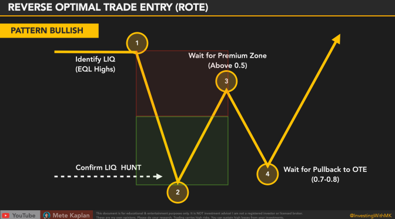

Algorithmic trading, often referred to as algo trading, signifies a transformational development within the financial sector. It employs sophisticated computer algorithms to manage trading actions, enhancing the speed and efficiency of transactions compared to manual trading processes. By automating trades, these algorithms eliminate the pitfalls of human emotion and error, thus ensuring precision and consistency in executing trades.

This article examines the multifaceted nature of algorithmic trading. It encompasses the underlying mechanics, various strategic approaches, and the associated advantages and risks inherent in the practice. Furthermore, we offer guidance on how to start your journey in algorithmic trading, providing insights into acquiring the necessary knowledge and tools to effectively engage in this innovative form of trading. Algorithmic trading presents significant opportunities but demands a solid understanding and commitment to continuous learning and adaptation in a rapidly evolving financial landscape.



## Table of Contents

## Understanding Algorithmic Trading

Algorithmic trading utilizes sophisticated computer algorithms to execute trades based on predetermined criteria, incorporating market variables like price, volume, and timing. This automation facilitates the rapid assessment and execution of trades, often outpacing human traders in both speed and accuracy. By leveraging these algorithms, traders can capitalize on market opportunities with enhanced precision and consistency.

One of the key benefits of algorithmic trading is the reduction of human emotions and errors associated with traditional trading. Emotional decision-making, often influenced by fear or greed, can lead to irrational buying or selling of assets. By employing algorithms, traders maintain objectivity, sticking strictly to strategic instructions coded into their systems. This encompasses a wide range of trading strategies, from simple rule-based approaches to complex mathematical models that continuously analyze market conditions.

The underpinning technology in algorithmic trading often includes powerful computational algorithms that process vast amounts of data. These algorithms employ statistical models and machine learning techniques to predict asset price movements and identify optimal trading opportunities. Concepts such as time-weighted average price (TWAP) and volume-weighted average price (VWAP) are commonly used to ensure that trades are executed at the best possible price while minimizing market impact.

By automating the trading process, algorithmic trading not only boosts efficiency but also enables the handling of complicated strategies across multiple markets and asset classes simultaneously. This scalability is particularly advantageous in contemporary, fast-paced financial markets where the ability to adapt quickly to market changes is vital.

For anyone considering a foray into [algorithmic trading](/wiki/algorithmic-trading), understanding the foundational principles of computer programming and financial markets is essential. Ensuring robust infrastructure and risk management processes can further enhance the effectiveness of algorithmic trading systems.

## Popular Algorithmic Trading Strategies

Algorithmic trading strategies are designed to leverage computational algorithms for acquiring and selling financial instruments with precision and speed. These strategies are often employed to exploit market inefficiencies, enhance trade execution, and minimize human error. Here are some popular algorithmic trading strategies:

### Trend Following

The trend-following strategy focuses on identifying and following market trends to optimize profits. It operates on the principle that assets moving in a specific direction are likely to continue in that direction. Algorithms are programmed to detect trends using various technical indicators, such as moving averages or price channels, and automatically execute trades that align with these trends.

### Arbitrage

Arbitrage is a widely-used strategy that seeks to exploit price discrepancies of identical or similar financial instruments across different markets or forms. The basic idea is to buy low in one market and sell high in another. For example, an algorithm could identify a price difference for the same stock on two exchanges and execute simultaneous buy and sell orders to capitalize on this difference.

### Mean Reversion

Mean reversion is based on the concept that asset prices will eventually revert to their long-term historical averages. Algorithms employing this strategy analyze market conditions to identify when an asset is deviating significantly from its average price, suggesting that the asset will likely return to its normal range. By buying undervalued stocks and selling overvalued ones, the strategy bets on the eventual correction of the price.

### Index Fund Rebalancing

This strategy anticipates the periodic rebalancing of index funds. Index funds adjust their holdings to match their benchmark indexes, which can create predictable asset movements. By forecasting these adjustments, algorithmic traders attempt to position themselves strategically to benefit from resultant price changes as large quantities of stocks are bought or sold during rebalancing.

### Market Timing

Market timing involves identifying optimal entry and [exit](/wiki/exit-strategy) points in trades based on predicted market conditions. This strategy uses sophisticated algorithms to analyze a wide range of data, including economic indicators, interest rates, and market sentiment, to determine the best times to enter or exit the market. Market timing aims to maximize returns by correctly forecasting short-term market movements.

These strategies, when executed effectively, can significantly enhance trading outcomes by capitalizing on different aspects of market behavior. However, they also require continuous monitoring and adjustment to account for changing market dynamics.

## Platforms and Tools for Algo Trading

Traders involved in algorithmic trading can utilize a variety of platforms designed to enhance and streamline the trading process. These platforms, such as ProRealTime, MetaTrader 4, and a range of native APIs, serve as crucial tools for implementing and customizing trading algorithms with precision.

ProRealTime is notable for its advanced charting and technical analysis capabilities. It provides real-time market data and a wide range of indicators, which are essential for developing robust trading strategies. Moreover, ProRealTime's user-friendly interface makes it accessible to both novice and experienced traders. The platform supports automation through its programming language, ProRealCode, which allows users to create, modify, and optimize their trading algorithms.

MetaTrader 4 (MT4) is another popular platform among traders, particularly for [forex](/wiki/forex-system) and contract for difference (CFD) markets. It offers an extensive suite of tools for technical analysis, including numerous charting options and indicators. One of MT4's standout features is its support for Expert Advisors (EAs), which are scripts written in MetaQuotes Language 4 (MQL4) that enable automated trading. Traders can develop their own EAs or take advantage of the large community of developers who share their algorithms, enhancing collaborative learning and strategy improvement.

Native APIs offered by brokers and trading platforms provide even more flexibility and customization options. These APIs allow traders to connect directly to trading servers, enabling rapid execution of trades and integration with other software systems. For instance, using Python, traders can employ libraries such as `ccxt` or `ib_insync` to interact with interactive brokers and other platforms for seamless trading operations. Here's a simple example of using Python to fetch real-time market data:

```python
import ccxt

exchange = ccxt.binance()
ticker = exchange.fetch_ticker('BTC/USDT')
print(f"Current BTC/USDT price: {ticker['last']}")
```

Advanced features such as [backtesting](/wiki/backtesting) capabilities are integral across these platforms. Backtesting involves running trading algorithms on historical data to assess their effectiveness before deploying them in live markets. This process can help identify potential weaknesses or opportunities for optimization in the algorithm, thus mitigating risks and improving profitability.

These platforms, equipped with comprehensive trading strategies and community-shared algorithms, empower traders to refine their trading processes, adapt to evolving market conditions, and execute trades with increased accuracy and speed.

## Benefits and Risks of Algorithmic Trading

Algorithmic trading offers a multitude of benefits that have revolutionized the financial markets. At the forefront is the significantly increased execution speed, allowing trades to be completed in fractions of a second. This rapid execution ensures traders can capitalize on minute price movements, providing a competitive edge over traditional trading methods. Algorithms are devoid of emotional biases inherent in human traders, thereby enabling more objective and consistent trading decisions.

The technological advancements facilitating algorithmic trading also allow for comprehensive backtesting capabilities. Traders can test their strategies against historical data, refining their algorithms to optimize performance before executing real trades. This process of backtesting helps mitigate potential losses and enhance strategy robustness.

Moreover, algorithmic trading permits simultaneous trading across a variety of markets, a feat nearly impossible through manual trading. This ability to operate on multiple markets concurrently enhances portfolio diversification and risk management.

Despite these substantial benefits, algorithmic trading is not without its risks. Technology failures pose significant threats; unscheduled downtimes or malfunctions can lead to substantial financial losses. Over-optimization is another risk, where strategies are excessively tailored to historical data, resulting in poor real-time performance.

The lack of human oversight is a critical concern as well. Algorithms devoid of supervision might execute trades based on erroneous signals, compounding losses swiftly. High setup costs, including expenses for sophisticated software, hardware, and data services, act as barriers to entry.

Lastly, the vulnerability to cyber attacks remains a poignant risk. As trading platforms become increasingly digital, ensuring cybersecurity becomes paramount to protect sensitive financial information and trading algorithms from potential breaches. The balance between leveraging algorithmic trading's advantages and managing its risks is crucial for sustainable success in financial markets.

## Steps to Start with Algorithmic Trading

To embark on algorithmic trading, one must first acquire a strong foundation in both programming and financial markets. This includes understanding programming languages like Python or C++, which are commonly used for developing trading algorithms, as well as gaining insights into market dynamics, trading instruments, and financial concepts.

The next step is to select a trading platform that supports algorithmic strategies. Popular platforms include MetaTrader 4, ProRealTime, and various broker-specific APIs, each offering distinct features that cater to algorithmic trading needs. When choosing a platform, consider factors such as ease of use, programming capability, backtesting features, and support for a range of trading instruments.

Developing a trading strategy is crucial. This involves creating algorithms based on predefined rules and conditions for entry, exit, and risk management. Once a strategy is established, it's imperative to backtest it using historical data to evaluate its performance and refine it to improve effectiveness. Backtesting helps in identifying potential issues and optimizing parameters, thereby increasing the robustness of the trading strategy.

Before committing real capital, it is advisable to use a demo account for paper trading. Demo accounts simulate real market conditions without financial risk, allowing traders to test their strategies in real-time environments. This stage is vital for validating the strategy under current market conditions and ensuring that it behaves as expected.

Monitoring performance is an ongoing process in algorithmic trading. Continuous assessment of the algorithm’s performance against market changes is necessary. This involves regularly updating the algorithm to accommodate shifts in market conditions or trading anomalies. Optimization techniques, including [machine learning](/wiki/machine-learning) or statistical methods, can be employed to enhance the algorithm's efficacy.

Here is a basic Python example for a moving average crossover strategy:

```python
import pandas as pd

def moving_average_strategy(prices, short_window, long_window):
    signals = pd.DataFrame(index=prices.index)
    signals['signal'] = 0.0
    # Create short and long simple moving averages
    signals['short_mavg'] = prices.rolling(window=short_window, min_periods=1, center=False).mean()
    signals['long_mavg'] = prices.rolling(window=long_window, min_periods=1, center=False).mean()
    # Create signals
    signals['signal'][short_window:] = np.where(signals['short_mavg'][short_window:] > signals['long_mavg'][short_window:], 1.0, 0.0) 
    # Generate trading orders
    signals['positions'] = signals['signal'].diff()
    return signals

# Usage
prices = pd.read_csv('historical_prices.csv', index_col='Date', parse_dates=True)
signals = moving_average_strategy(prices['Close'], short_window=40, long_window=100)
```

This example outlines a basic strategy where a short-term moving average crossover with a long-term moving average signals potential trades. The strategy then generates positions based on these signals, which can be backtested and optimized prior to implementation in live trading.

Starting with algorithmic trading demands a blend of technical expertise and financial acumen, ongoing adaptation to market trends, and an iterative approach to strategy refinement.

## Conclusion

Algorithmic trading offers significant advantages, particularly in regard to speed and accuracy, as it automates trading processes that rapidly respond to market changes without emotional interference. This operating mode reduces the likelihood of human error and bias, facilitating more efficient execution of trades.

However, the benefits of algorithmic trading come with prerequisites that cannot be overlooked. Successful algo trading necessitates diligent oversight and considerable financial commitment. High setup costs for infrastructure, along with ongoing expenses for technology maintenance, are integral parts of the system. Additionally, navigating the complexities of algorithmic trading demands technical expertise. Individuals must have a strong understanding of both programming and financial markets to develop, implement, and refine sophisticated trading strategies.

For those prepared to invest in the necessary learning and infrastructure, algorithmic trading offers lucrative opportunities. Potential gains are predicated on the ability to effectively leverage technology to capitalize on market inefficiencies and trends.

Continuous education is paramount. As market conditions evolve and new trading technologies emerge, staying informed allows traders to refine strategies and enhance their system's performance. Strategy refinement should be a constant endeavor, relying on backtesting and analysis of historical data to optimize decision-making processes.

Moreover, a robust understanding of market behavior underpins successful algorithmic trading. Awareness and anticipation of market dynamics enable the design of algorithms that more accurately predict and respond to changes. In conclusion, while algorithmic trading presents significant challenges, those who master its complexities can exploit its capabilities for substantial financial gain.

## References & Further Reading

[1]: Chan, E. P. (2009). ["Quantitative Trading: How to Build Your Own Algorithmic Trading Business."](https://github.com/ftvision/quant_trading_echan_book) John Wiley & Sons.

[2]: Zhang, A. (2019). ["Machine Learning for Algorithmic Trading - Second Edition."](https://github.com/zhangrun1992/Machine-Learning-for-Algorithmic-Trading-Second-Edition) Packt Publishing.

[3]: Lopez de Prado, M. (2018). ["Advances in Financial Machine Learning."](https://books.google.com/books/about/Advances_in_Financial_Machine_Learning.html?id=oU9KDwAAQBAJ) Wiley.

[4]: Aronson, D. (2007). ["Evidence-Based Technical Analysis: Applying the Scientific Method and Statistical Inference to Trading Signals."](https://www.amazon.com/Evidence-Based-Technical-Analysis-Scientific-Statistical/dp/0470008741) Wiley.

[5]: Kissell, R. (2013). ["The Science of Algorithmic Trading and Portfolio Management."](https://www.sciencedirect.com/book/9780124016897/the-science-of-algorithmic-trading-and-portfolio-management) Academic Press.