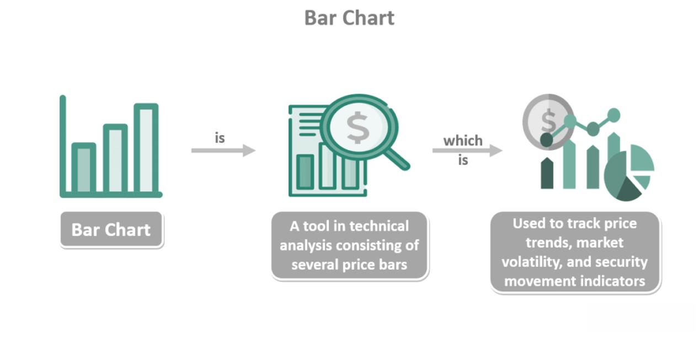

Financial markets optimization, technical analysis, and algorithmic trading are integral components of modern trading strategies. These areas are deeply interconnected and play significant roles in optimizing the performance of trading systems, enhancing decision-making processes, and ultimately improving financial outcomes. Understanding these concepts and their relationships is essential for any trader or investor aiming to stay competitive in today's dynamic financial environment.

Financial markets optimization refers to the systematic approach of enhancing the efficiency and effectiveness of trading systems. The primary goals of this optimization process include reducing transaction costs, maximizing returns, and managing risk. To achieve these objectives, traders and financial analysts employ various strategies such as adjusting trading algorithm parameters, optimizing portfolio allocations, and continuously refining tactics to adapt to shifting market conditions.



Technical analysis serves as a cornerstone for decision-making by leveraging historical market data to identify patterns and predict future price movements. This discipline utilizes tools such as trendlines, moving averages, and indicators to provide insights into market trends and trading opportunities. When incorporated into algorithmic trading systems, technical analysis aids in the development of robust strategies that can exploit market inefficiencies and generate profits.

Algorithmic trading, or automated trading, leverages computer algorithms to execute trades at high speed and precision. This modern trading approach minimizes human errors, removes emotional biases, and allows traders to capitalize on fleeting market opportunities. Algorithms can process vast amounts of data in real-time, making quick decisions based on the strategic framework provided by financial markets optimization and technical analysis.

This article aims to explore how these elements are utilized in tandem to enhance trading systems. By covering key techniques and strategies, we will examine how traders optimize algorithmic trading processes, integrate technical analysis, and leverage modern technology to maintain a competitive edge. Understanding these advancements allows market participants to navigate the complexities of financial markets and respond effectively to emerging trends and challenges.

## Table of Contents

## Understanding Financial Markets Optimization

Financial markets optimization is the process of adjusting trading systems and strategies to enhance their effectiveness. Its primary role is to fine-tune the various parameters and components of a trading system to achieve better outcomes. The main goals of financial markets optimization include reducing costs, increasing returns, and managing risks. These objectives are crucial for traders and investors seeking to maximize the performance of their portfolios in an ever-changing market environment.

One of the primary goals of optimization is to reduce costs. This can involve minimizing transaction fees, slippage, and other expenses associated with trading. By optimizing the execution of trades, traders can significantly cut costs, which in turn can improve overall profitability. The reduction of trading costs often involves optimizing order execution strategies and selecting the right trading venues.

Increasing returns is another pivotal goal of financial markets optimization. This involves identifying and implementing strategies that enhance the profit-generating potential of a trading system. Optimization can involve adjusting variables within trading algorithms to take advantage of market trends or opportunities. For example, parameter optimization in a trading algorithm might include fine-tuning the period of a moving average to better capture market trends.

Risk management is a fundamental aspect of financial markets optimization. Optimizing a trading system involves implementing mechanisms that can effectively manage and mitigate risks associated with trading. This can include diversifying portfolios to spread risk or employing hedging strategies to protect against adverse market movements. Ensuring that a trading system maintains an optimal risk-reward balance is crucial for long-term success.

Common strategies in financial markets optimization include both adjusting variables in trading algorithms and portfolio optimization. Algorithmic adjustments can involve parameter optimization to refine how an algorithm responds to market conditions. For instance, optimizing the look-back period for [volatility](/wiki/volatility-trading-strategies) calculations in a mean reversion strategy can improve its accuracy and effectiveness in different market scenarios.

Portfolio optimization is another critical strategy, focusing on the composition of assets within a portfolio to achieve the best possible risk-adjusted returns. Techniques such as the mean-variance optimization, introduced by Harry Markowitz, can be used to allocate assets in a way that maximizes returns for a given level of risk. Python libraries such as `PyPortfolioOpt` allow traders to implement such optimization techniques efficiently:

```python
from pypfopt import EfficientFrontier
from pypfopt import risk_models, expected_returns

# Fetch historical data for portfolio assets
# Assume `prices` is a pandas DataFrame with historical prices

# Calculate expected returns and the covariance matrix
mu = expected_returns.mean_historical_return(prices)
S = risk_models.sample_cov(prices)

# Optimize for maximal Sharpe ratio
ef = EfficientFrontier(mu, S)
weights = ef.max_sharpe()

# Get the cleaned weights
cleaned_weights = ef.clean_weights()
print(cleaned_weights)

# Performance of the optimized portfolio
ef.portfolio_performance(verbose=True)
```

The ongoing nature of optimization is dictated by the dynamic nature of financial markets. Market conditions are in a constant state of flux due to economic, political, and social factors. As a result, what might be optimal today could be suboptimal tomorrow. Continuous monitoring and adjustment of trading systems are essential to stay relevant and competitive. Adaptive algorithms that recalibrate their parameters based on real-time data are increasingly employed to tackle this challenge.

In conclusion, financial markets optimization is an indispensable process for maximizing the efficiency and performance of trading systems. By focusing on reducing costs, increasing returns, and managing risks, traders and investors can develop robust strategies that adapt to evolving market conditions.

## Technical Analysis in Algorithmic Trading

Technical analysis is a method used in the financial markets to evaluate and forecast the future price movements of securities by analyzing historical price data and trading volumes. It is based on the belief that historical price patterns tend to repeat themselves and that these patterns can be used to predict future price movements. Technical analysis is crucial in trading because it provides insights into market psychology and helps traders identify potential trading opportunities.

Technical analysis tools like trendlines, moving averages, and indicators are integral components of [algorithmic trading](/wiki/algorithmic-trading) systems. Trendlines are used to identify and confirm trends in market data. They provide a visual representation of support and resistance levels by connecting significant price points. Moving averages smooth out price data to identify the direction of a trade more easily. They are particularly useful in spotting changes in trends and smoothing out price fluctuations, allowing algorithms to make more informed decisions.

Indicators, such as the Relative Strength Index (RSI), Moving Average Convergence Divergence (MACD), and Bollinger Bands, are mathematical calculations based on price, [volume](/wiki/volume-trading-strategy), or open interest information that provide signals for potential market entry and [exit](/wiki/exit-strategy) points. For example, the RSI measures the speed and change of price movements and can indicate whether a security is overbought or oversold. In an algorithm, these indicators are implemented to automatically trigger buy or sell decisions, thus optimizing the trading process.

Incorporating technical analysis into trading systems offers multiple benefits. It enhances the ability to systematically identify market trends and trading opportunities without the bias of human emotions. By automating the analysis process, algorithms can react swiftly to market changes and execute trades with precision. This automation also increases the consistency of trading decisions, as it eliminates the variability introduced by human decision-making.

Backtesting plays a pivotal role in validating technical analysis strategies within algorithmic trading. It involves running a trading algorithm on historical market data to assess how a trading strategy would have performed in the past. This process helps traders understand the potential success and limitations of their strategies. Backtesting allows for the optimization of technical indicators, ensuring they are fine-tuned to provide the best possible results when employed in real-time trading.

Python is commonly used in implementing and [backtesting](/wiki/backtesting) technical analysis strategies. Here's a simple example using Python:

```python
import pandas as pd
import numpy as np
import matplotlib.pyplot as plt

# Load historical data
data = pd.read_csv('historical_data.csv')
close_prices = data['Close']

# Calculate Moving Average
short_window = 40
long_window = 100

signals = pd.DataFrame(index=data.index)
signals['signal'] = 0.0

signals['short_mavg'] = close_prices.rolling(window=short_window, min_periods=1, center=False).mean()
signals['long_mavg'] = close_prices.rolling(window=long_window, min_periods=1, center=False).mean()

# Generate signals
signals['signal'][short_window:] = np.where(signals['short_mavg'][short_window:] > signals['long_mavg'][short_window:], 1.0, 0.0)
signals['positions'] = signals['signal'].diff()

# Plot signals
plt.figure(figsize=(15, 8))
plt.plot(close_prices.index, close_prices, label='Closing Prices')
plt.plot(signals['short_mavg'], label=f'Short {short_window}-Day Moving Average')
plt.plot(signals['long_mavg'], label=f'Long {long_window}-Day Moving Average')
plt.plot(signals.loc[signals.positions == 1.0].index, signals.short_mavg[signals.positions == 1.0], '^', markersize=10, color='g', lw=0, label='Buy Signal')
plt.plot(signals.loc[signals.positions == -1.0].index, signals.short_mavg[signals.positions == -1.0], 'v', markersize=10, color='r', lw=0, label='Sell Signal')
plt.title('Moving Average Crossover Strategy')
plt.xlabel('Date')
plt.ylabel('Price')
plt.legend(loc='best')
plt.grid()
plt.show()
```

This code implements a simple moving average crossover strategy, providing buy or sell signals when the short-term moving average crosses above or below the long-term moving average. The visualization of these signals aids traders in validating their strategies before applying them to live markets.

## Algorithmic Trading Strategies

Algorithmic trading refers to the use of computer algorithms to automate the process of trading in financial markets. This method harnesses the power of technology to conduct trades at speeds and efficiencies unachievable by human traders. Among its advantages are the ability to process vast amounts of data quickly, execute trades at optimal prices, and eliminate human error and emotional decision-making, which can often lead to poor trading outcomes.

There are several established types of algorithmic trading strategies, each catering to different market dynamics and trader preferences:

1. **Trend Following**: This strategy involves identifying and taking advantage of trends in the price movement of assets. Algorithms analyze historical pricing data to detect patterns that indicate the beginning of a new trend. For example, if an asset exhibits a consistent upward momentum, an algorithm might trigger a buy order to capitalize on the ongoing trend, only selling when a reversing trend is detected.

2. **Mean Reversion**: This type of strategy operates on the principle that asset prices will tend to return to an average value over time. Algorithms deploying this strategy typically look for deviations from the mean or historical average, triggering buy signals when prices fall below the mean (underpriced) and sell signals when prices rise above it (overpriced).

3. **Arbitrage**: Arbitrage strategies exploit price discrepancies of the same asset in different markets or forms. An algorithm identifies these pricing inefficiencies and executes trades that lock in a risk-free profit. For instance, if a stock is priced differently on two different exchanges, the algorithm can buy at the lower price and sell at the higher price simultaneously.

Algorithmic trading significantly benefits from its ability to quickly process real-time data and make trading decisions within milliseconds. This capability is critical in maintaining speed and precision — two essential components in successful trading. High-frequency trading, a subset of algorithmic trading, exemplifies these advantages by executing thousands of orders per second to capture small price movements.

Moreover, removing emotional interference is a key advantage of algorithmic trading. Human traders are often susceptible to cognitive biases and emotional swings, which can lead to inconsistent decision-making. By automating trading decisions based on pre-defined parameters and real-time data, algorithms ensure that trading strategies are executed strictly according to plan, free from emotion-driven deviations.

The integration of complex algorithms with real-time data is the cornerstone of effective algorithmic trading. Algorithms are programmed to respond immediately to market changes, using live data feeds to inform trading decisions. This integration allows for the timely execution of trades, ensuring that opportunities are seized at the right moments and risks are mitigated efficiently.

In conclusion, algorithmic trading strategies leverage advanced technologies to optimize trading processes, providing advantages in terms of speed, precision, and emotional neutrality, while handling complex and voluminous data. As financial markets continue to evolve, these systems will remain integral to gaining a competitive edge.

## The Role of Machine Learning and AI in Optimization

Machine learning (ML) and [artificial intelligence](/wiki/ai-artificial-intelligence) (AI) have revolutionized the optimization of trading algorithms by introducing advanced methods for pattern recognition, market prediction, and strategic enhancement. These technologies enable traders to harness large volumes of data for improving trading systems' performance and efficiency.

**Identification of Patterns and Prediction of Market Conditions**
AI and ML technologies excel at identifying complex patterns within market data that are not readily apparent through traditional methods. Machine learning models can process historical and real-time data to uncover trends, correlations, and anomalies that might indicate future market movements. This ability is particularly valuable in predicting price fluctuations, volatility changes, and other market conditions, allowing traders to make informed decisions.

For instance, supervised learning models such as regression analysis are utilized to predict asset prices based on their historical values and other influencing factors. Consider a linear regression model represented by the equation:
$$
Y = \beta_0 + \beta_1 X_1 + \beta_2 X_2 + \cdots + \beta_n X_n + \epsilon
$$
where $Y$ is the dependent variable (e.g., future stock price), $X_1, X_2, \ldots, X_n$ are independent variables (e.g., various market indicators), and $\epsilon$ is the error term.

**Optimization of Trading Strategies**
Decision trees and neural networks are other examples of ML models employed in optimizing trading strategies. Decision trees help in categorizing market conditions and suggesting optimal actions based on historical performance. They are easy to understand and implement, making them a popular choice for traders.

In contrast, neural networks, particularly [deep learning](/wiki/deep-learning) models, have the capability to process unstructured data and recognize intricate patterns. They learn by adjusting weights through layers of neurons, capturing non-linear relationships within data. This characteristic makes them ideal for formulating sophisticated trading strategies that adapt to evolving market scenarios.

**Continuous Learning and Adaptation**
The changing dynamics of financial markets necessitate that trading algorithms continuously learn and adapt. Implementing [machine learning](/wiki/machine-learning) models that evolve as they are exposed to new data is crucial for maintaining a competitive edge. Reinforcement learning, a subset of ML, facilitates this by allowing algorithms to learn optimal actions through trial and error, reinforced by feedback from trading outcomes.

An illustrative example in Python could involve using libraries such as Scikit-learn or TensorFlow to create and train models that self-update as new market data streams in. A basic [reinforcement learning](/wiki/reinforcement-learning) setup might involve:

```python
import gym
import numpy as np
from stable_baselines3 import PPO

# Create the trading environment
env = gym.make('TradingEnv-v0')

# Define the reinforcement learning model
model = PPO('MlpPolicy', env, verbose=1)

# Train the model
model.learn(total_timesteps=10000)

# Use the model to predict and optimize trading actions
obs = env.reset()
for _ in range(1000):
    action, _states = model.predict(obs)
    obs, rewards, done, info = env.step(action)
    if done:
        obs = env.reset()
```

By continuously integrating new data, these algorithms adjust to new market conditions in real-time, enhancing their predictive accuracy and robustness.

In conclusion, the strategic integration of machine learning and artificial intelligence in trading optimization fosters more efficient algorithms that can adapt and thrive amidst the complexity and volatility of financial markets. Their application enables traders to not only anticipate market conditions but also constantly refine their strategies for sustained success.

## Challenges and Risks in Optimizing Trading Systems

Financial markets optimization is crucial for enhancing trading system efficiency, yet it presents inherent challenges and risks that traders must navigate. A prevalent issue is overfitting, which occurs when a model is excessively complex and captures noise instead of the underlying trend. This results in a model that performs well on historical data but poorly in live trading. To mitigate overfitting, traders can use techniques such as cross-validation and regularization. These methods help ensure that a model generalizes well by testing it on different subsets of data and penalizing complexity, respectively.

Model risk is another significant challenge in optimizing trading systems. This risk arises from inaccuracies in the assumptions and predictions of trading models, potentially leading to substantial financial losses. Managing model risk requires rigorous model validation and stress testing, where models are evaluated under various market scenarios to assess their robustness and reliability.

Optimizing for current market conditions while maintaining flexibility is a delicate balance. Markets are dynamic, with conditions that fluctuate due to economic, political, and technological factors. Models optimized solely for current conditions risk underperformance when markets shift. Implementing adaptive algorithms, which adjust parameters based on real-time data, can help strike this balance. These algorithms continuously learn from new data, allowing them to respond to changing market environments.

Algorithmic trading introduces further risks, such as technology failures and ethical concerns. Technology failures, like system outages or software bugs, can hinder trade execution and result in financial losses. To mitigate these risks, traders employ robust system architectures with backup protocols and redundant systems. Additionally, comprehensive testing and monitoring ensure systems operate flawlessly.

Ethical considerations are paramount in algorithmic trading. Traders must ensure that their algorithms comply with regulatory requirements and do not engage in manipulative practices that could disrupt markets. This includes adhering to ethical guidelines that promote fairness and transparency in trading practices.

Robust testing and risk management practices are critical in mitigating the challenges and risks associated with trading systems optimization. Backtesting, where trading strategies are tested against historical data, provides insights into a strategy's potential performance. However, traders must ensure that backtesting aligns with realistic expectations and considers transaction costs.

Risk management involves setting clear risk parameters, such as stop-loss limits, to protect against adverse market movements. Diversification, which spreads risk across various assets or strategies, reduces exposure to any single source of risk. Continuous monitoring and adjustment of trading systems ensure they remain aligned with market conditions and risk tolerance levels.

In conclusion, optimizing trading systems involves navigating complex challenges and risks. By employing rigorous testing, adaptive algorithms, and comprehensive risk management strategies, traders can enhance their systems' performance while minimizing potential drawbacks. These efforts are crucial for maintaining competitive edge and ensuring ethical trading in an ever-evolving financial landscape.

## Conclusion

The integration of optimization, technical analysis, and algorithmic trading represents a transformative shift in how financial markets are navigated. This synergy enables more informed decision-making processes and enhances trading efficiency, ultimately leading to improved market performance. Optimization plays a pivotal role in refining trading systems by fine-tuning variables and strategies to achieve desired financial goals such as cost reduction, increased returns, and risk management. Coupled with technical analysis, these systems can identify potential trading opportunities through patterns and trends, allowing for rapid and precise execution in algorithmic trades.

A significant insight into this integrated approach is the necessity of continuous optimization to adapt to dynamic market conditions. Markets are ever-changing, and strategies that were once effective may lose their efficacy over time. Thus, it is imperative for traders and investors to engage in relentless learning and adaptational processes. This can be achieved through frequent backtesting, performance evaluations, and adjustments of trading algorithms to ensure robustness and flexibility against unforeseen market developments.

Traders and investors are advised to embrace evolving technologies that leverage machine learning and artificial intelligence, which are at the forefront of optimizing trading strategies. These technologies offer powerful tools for pattern recognition, market prediction, and strategic optimization. Employing AI-driven algorithms can significantly enhance the speed and precision of trades, while simultaneously reducing emotional bias inherent in manual trading.

Looking toward the future, financial markets optimization is expected to increasingly incorporate advanced machine learning techniques, including deep learning and reinforcement learning, to further elevate trading systems. Additionally, the ongoing integration of big data analytics and blockchain technology holds promise for more secure, transparent, and efficient market practices.

In summary, the fusion of optimization, technical analysis, and algorithmic trading provides substantial opportunities for advancing trading strategies. Continuous adaptation and technological adoption remain crucial as market landscapes evolve, emphasizing the importance of staying ahead of trends and developments to maintain a competitive edge.

## References & Further Reading

[1]: Bergstra, J., Bardenet, R., Bengio, Y., & Kégl, B. (2011). ["Algorithms for Hyper-Parameter Optimization."](https://dl.acm.org/doi/10.5555/2986459.2986743) Advances in Neural Information Processing Systems 24.

[2]: ["Advances in Financial Machine Learning"](https://www.amazon.com/Advances-Financial-Machine-Learning-Marcos/dp/1119482089) by Marcos Lopez de Prado

[3]: ["Evidence-Based Technical Analysis: Applying the Scientific Method and Statistical Inference to Trading Signals"](https://www.amazon.com/Evidence-Based-Technical-Analysis-Scientific-Statistical/dp/0470008741) by David Aronson

[4]: ["Machine Learning for Algorithmic Trading"](https://github.com/stefan-jansen/machine-learning-for-trading) by Stefan Jansen

[5]: ["Quantitative Trading: How to Build Your Own Algorithmic Trading Business"](https://www.amazon.com/Quantitative-Trading-Build-Algorithmic-Business/dp/1119800064) by Ernest P. Chan