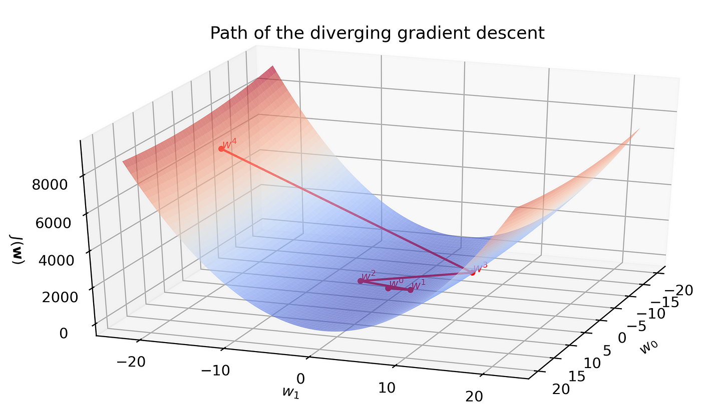

## Table of Contents

## What is optimization in the context of machine learning?

Optimization in machine learning is about finding the best settings for a model so it can make the most accurate predictions. Imagine you're trying to hit a bullseye with a dart. The dart's position is like the model's settings, and the bullseye is the best prediction. You keep adjusting the dart's position to get closer to the bullseye. In machine learning, we use math to adjust the model's settings to minimize the difference between the model's predictions and the actual results. This difference is called the loss or cost, and we want to make it as small as possible.

The process of adjusting the model's settings is often done using an algorithm called gradient descent. This algorithm calculates how to change the settings to reduce the loss. It's like taking steps downhill towards the lowest point, where the loss is smallest. The formula for updating the settings using gradient descent is $$ \theta = \theta - \alpha \cdot \nabla J(\theta) $$, where $$ \theta $$ are the model's settings, $$ \alpha $$ is the learning rate (how big the steps are), and $$ \nabla J(\theta) $$ is the gradient of the loss function. By repeatedly applying this formula, the model's settings get closer and closer to the optimal values, improving the model's predictions over time.

## How does Stochastic Gradient Descent (SGD) work, and what are its advantages and disadvantages?

Stochastic Gradient Descent (SGD) is a version of the gradient descent algorithm that's used to train machine learning models. Instead of using all the data at once to calculate the gradient and update the model's settings, SGD uses just one random data point at a time. This makes it much faster, especially when you have a lot of data. The formula for updating the model's settings in SGD is $$ \theta = \theta - \alpha \cdot \nabla J(\theta_i) $$, where $$ \theta $$ are the model's settings, $$ \alpha $$ is the learning rate, and $$ \nabla J(\theta_i) $$ is the gradient calculated using just one data point $$ \theta_i $$. By doing this update many times with different random data points, the model's settings gradually get closer to the best values.

The main advantage of SGD is its speed. Because it uses only one data point at a time, it can update the model's settings much faster than regular gradient descent, which needs to go through all the data before making an update. This makes SGD great for large datasets where using all the data at once would take too long. However, SGD also has some disadvantages. Because it uses only one data point at a time, the updates can be noisy and less stable. This means the path to the best settings can be a bit bumpy, and the model might not always find the very best settings. Also, choosing the right learning rate $$ \alpha $$ can be tricky, as a rate that's too high can make the model miss the best settings, while a rate that's too low can make the training take too long.

## What is the Adam optimization algorithm, and how does it differ from SGD?

The Adam optimization algorithm is a type of gradient descent that's really good at training [machine learning](/wiki/machine-learning) models. It's like a smart version of Stochastic Gradient Descent (SGD). Adam stands for Adaptive Moment Estimation, which means it keeps track of not just the gradient but also how the gradient changes over time. This helps Adam adjust the learning rate for each parameter in the model, making it more efficient and less likely to miss the best settings. The formula for updating the model's settings in Adam is a bit more complicated than SGD, but it basically combines the ideas of [momentum](/wiki/momentum) and adaptive learning rates to make the training process smoother and faster.

The main difference between Adam and SGD is how they handle the learning rate. In SGD, you usually have to choose one learning rate for all the model's settings, and it stays the same throughout training. This can be a problem because some settings might need a bigger or smaller learning rate to find the best values. Adam solves this by automatically adjusting the learning rate for each setting based on how it's been changing. This makes Adam more flexible and often leads to better results, especially for complex models. However, Adam can be a bit harder to understand and set up because it has more parameters to tweak, like the learning rate and two other parameters that control how it adapts to the gradients.

In practice, Adam is often the go-to choice for many machine learning tasks because it's fast and works well out of the box. But if you're working with a simpler model or a smaller dataset, SGD might still be a good choice because it's simpler and easier to understand. Both methods have their place, and the best choice depends on your specific situation.

## Can you explain the concept of learning rate and its impact on optimization?

The learning rate is like the size of the steps you take when you're trying to find the best settings for your machine learning model. Imagine you're walking down a hill to get to the bottom, which is where the best settings are. If your steps are too big, you might overshoot and miss the bottom. If your steps are too small, it'll take a long time to get there. The learning rate is a number that decides how big these steps are. In the formula for updating the model's settings, the learning rate is usually shown as $$ \alpha $$. For example, in gradient descent, the update rule is $$ \theta = \theta - \alpha \cdot \nabla J(\theta) $$, where $$ \theta $$ are the model's settings and $$ \nabla J(\theta) $$ is the gradient of the loss function.

Choosing the right learning rate is really important because it can make a big difference in how well your model learns. If the learning rate is too high, the model might jump around a lot and never settle on the best settings. This is called overshooting, and it can make your model perform poorly. On the other hand, if the learning rate is too low, the model will take tiny steps and might take forever to find the best settings. This can make training really slow. Some optimization algorithms, like Adam, automatically adjust the learning rate to try to find a good balance, but in simpler methods like SGD, you have to choose the learning rate yourself and it can take some trial and error to get it right.

## What are some common challenges faced during the optimization process in machine learning?

One common challenge in the optimization process of machine learning is choosing the right learning rate. The learning rate decides how big the steps are when updating the model's settings. If it's too high, the model might overshoot and never find the best settings, leading to poor performance. If it's too low, the model will take tiny steps and might take forever to reach the best settings, making the training process very slow. Finding the right balance can be tricky and often requires some trial and error. Some advanced optimization algorithms like Adam try to solve this by automatically adjusting the learning rate, but for simpler methods like SGD, you have to choose it yourself.

Another challenge is dealing with local minima and saddle points. Imagine you're trying to find the lowest point on a hilly landscape. A local minimum is like a small valley that's not the lowest point overall, but it's lower than the areas around it. If your model gets stuck in a local minimum, it might think it's found the best settings when there's actually a better solution somewhere else. Saddle points are spots where the gradient is zero, but it's not a minimum or a maximum. They can also slow down the optimization process because the model might get stuck there. Algorithms like SGD and Adam help by using randomness to try to escape these traps, but they're not perfect, and it's still a challenge to avoid getting stuck.

Finally, the optimization process can be affected by the choice of the loss function. The loss function measures how wrong the model's predictions are, and the goal of optimization is to minimize this loss. Different loss functions can lead to different optimization paths and results. For example, some loss functions might be more sensitive to outliers, causing the model to focus too much on them. Others might be smoother and easier to optimize but might not capture the nuances of the data as well. Choosing the right loss function and understanding its impact on the optimization process is crucial for getting the best performance out of your model.

## How does the AdaGrad algorithm adapt the learning rate for each parameter?

AdaGrad is a smart way to train machine learning models that changes the learning rate for each setting in the model. It does this by keeping track of how much each setting has changed over time. If a setting has changed a lot, AdaGrad makes its learning rate smaller so it doesn't change too much more. If a setting hasn't changed much, AdaGrad keeps its learning rate bigger so it can keep learning. This helps the model find the best settings faster because it can focus on the settings that need more work.

The way AdaGrad works is by using a special formula to update the settings. For each setting, AdaGrad keeps a running total of the squares of the gradients it has seen so far. This total is used to adjust the learning rate for that setting. The formula for updating a setting $$ \theta_i $$ in AdaGrad is $$ \theta_i = \theta_i - \frac{\alpha}{\sqrt{G_{ii} + \epsilon}} \cdot g_i $$, where $$ \alpha $$ is the base learning rate, $$ G_{ii} $$ is the running total of the squared gradients for that setting, $$ \epsilon $$ is a small number to avoid dividing by zero, and $$ g_i $$ is the current gradient for that setting. By using this formula, AdaGrad makes sure that settings that have had big gradients in the past get smaller learning rates, while settings with small gradients keep bigger learning rates.

## What is the purpose of momentum in optimization algorithms like SGD with Momentum?

Momentum in optimization algorithms like SGD with Momentum helps the model learn faster and smoother. Imagine you're pushing a heavy ball down a hill. If you give it a good push, it will keep rolling and pick up speed, even if the hill has some small bumps. Momentum works the same way with the model's settings. It adds a bit of the previous update to the current update, helping the model keep moving in the right direction and not get stuck on small bumps or noisy data.

The formula for updating the settings in SGD with Momentum is $$ v_t = \gamma \cdot v_{t-1} + \alpha \cdot \nabla J(\theta) $$ and $$ \theta = \theta - v_t $$, where $$ v_t $$ is the current velocity, $$ \gamma $$ is the momentum coefficient (usually between 0 and 1), $$ \alpha $$ is the learning rate, and $$ \nabla J(\theta) $$ is the gradient of the loss function. The velocity $$ v_t $$ keeps a bit of the previous update, which helps the model move more smoothly and escape local minima or saddle points more easily. This makes the training process faster and often leads to better results.

## How does RMSProp improve upon the limitations of AdaGrad?

RMSProp improves upon AdaGrad by solving a problem that AdaGrad can run into: its learning rate can get too small over time. AdaGrad keeps track of the squares of all the gradients it has seen and uses them to adjust the learning rate. But because it adds up all these squares, the total keeps getting bigger, which makes the learning rate smaller and smaller. This can make the model stop learning too soon, even if it hasn't found the best settings yet. RMSProp fixes this by using a moving average of the recent gradients instead of the total from the start. This way, the learning rate doesn't keep shrinking forever, and the model can keep learning for longer.

The formula for updating the settings in RMSProp is $$ E[g^2]_t = \beta \cdot E[g^2]_{t-1} + (1 - \beta) \cdot g_t^2 $$ and $$ \theta = \theta - \frac{\alpha}{\sqrt{E[g^2]_t + \epsilon}} \cdot g_t $$, where $$ E[g^2]_t $$ is the moving average of the squared gradients, $$ \beta $$ is a smoothing parameter (usually around 0.9), $$ \alpha $$ is the learning rate, $$ \epsilon $$ is a small number to avoid dividing by zero, and $$ g_t $$ is the current gradient. By using this moving average, RMSProp can adapt the learning rate more effectively and help the model find the best settings faster and more reliably.

## What are the key differences between Adam and AdamW, and when should each be used?

Adam and AdamW are both smart ways to train machine learning models, but they handle something called weight decay differently. Adam uses a method called L2 regularization to stop the model from getting too complicated. This method adds a bit of the model's settings to the loss function, which can make the model's settings smaller over time. But this can sometimes mess with the learning rate that Adam uses. AdamW fixes this by separating the weight decay from the learning rate. It applies the weight decay directly to the model's settings before updating them, which helps the model learn better and faster.

You should use Adam when you want a simple way to train your model that works well out of the box. Adam is good for many different kinds of machine learning tasks because it automatically adjusts the learning rate for each setting in the model. But if you're working on a task where you need to control how much the model's settings shrink, like in some [deep learning](/wiki/deep-learning) tasks, AdamW might be a better choice. AdamW gives you more control over the weight decay, which can lead to better results in some cases. So, if you need to fine-tune your model and make sure it doesn't get too complicated, AdamW could be the way to go.

## How do advanced optimization techniques like Sharpness-Aware Minimization (SAM) enhance model generalization?

Sharpness-Aware Minimization (SAM) is a smart way to train machine learning models that helps them work better on new data they haven't seen before. When we train a model, we want it to find the best settings that make the least mistakes on the data we have. But sometimes, these settings can be too specific to the data we used for training and not work well on new data. SAM helps solve this problem by looking for settings that not only make few mistakes but also stay good even if we change the settings a little bit. This makes the model more stable and better at handling new data.

SAM does this by using a special trick during training. It looks at how the loss changes when we move the settings a bit in different directions. If the loss stays low even when we move the settings, that means the settings are in a good, flat area. SAM tries to find these flat areas because they make the model more general and less likely to overfit to the training data. The formula for updating the settings in SAM is a bit more complicated, but it basically adds an extra step to find the worst direction to move the settings before updating them. This helps the model find settings that are not just good but also robust, making it perform better on new data.

## What role does gradient clipping play in training deep learning models, and how is it implemented?

Gradient clipping is a technique used in training deep learning models to stop the gradients from getting too big. When gradients are too large, they can make the model's settings change too much in one go, which can mess up the training process. This is called the exploding gradient problem. By setting a limit on how big the gradients can be, gradient clipping helps keep the training stable and prevents the model from making huge jumps that might make it miss the best settings.

To implement gradient clipping, you set a maximum value for the gradients. If a gradient is bigger than this value, you shrink it down to the maximum. This can be done in different ways, but one common method is to use a technique called norm clipping. In norm clipping, you calculate the size of the gradient vector and if it's bigger than your limit, you scale the whole vector down so its size matches the limit. The formula for this is $$ \text{if } \|\nabla\| > \text{clip_value } \text{ then } \nabla = \frac{\text{clip_value} \cdot \nabla}{\|\nabla\|} $$. Here, $$ \nabla $$ is the gradient vector, $$ \|\nabla\| $$ is its size, and $$ \text{clip_value} $$ is the maximum size you allow. This simple trick helps keep the training process smooth and helps the model learn better.

## How do ensemble methods like Stochastic Weight Averaging (SWA) contribute to optimization in neural networks?

Ensemble methods like Stochastic Weight Averaging (SWA) help make neural networks better by combining different versions of the model's settings. SWA does this by averaging the settings from different points during training. This averaging can make the model more stable and better at handling new data it hasn't seen before. Instead of just using the last settings after training, SWA keeps track of many different settings and mixes them together. This helps the model find a good middle ground that works well overall.

SWA works by saving the model's settings at different times during training and then averaging them at the end. The formula for SWA is $$ \theta_{\text{SWA}} = \frac{1}{N} \sum_{i=1}^{N} \theta_i $$, where $$ \theta_{\text{SWA}} $$ is the final averaged settings, $$ N $$ is the number of times you saved the settings, and $$ \theta_i $$ are the settings at each save point. By using this average, SWA can make the model more general and less likely to overfit to the training data. This means the model can work better on new data, which is really important for making sure the model is useful in real life.

## References & Further Reading

[1]: Ruder, S. (2016). ["An overview of gradient descent optimization algorithms."](https://arxiv.org/abs/1609.04747) arXiv preprint arXiv:1609.04747.

[2]: Kingma, D. P., & Ba, J. (2014). ["Adam: A method for stochastic optimization."](https://arxiv.org/abs/1412.6980) arXiv preprint arXiv:1412.6980.

[3]: Duchi, J., Hazan, E., & Singer, Y. (2011). ["Adaptive subgradient methods for online learning and stochastic optimization."](https://dl.acm.org/doi/10.5555/1953048.2021068) Journal of Machine Learning Research, 12, 2121-2159.

[4]: Tieleman, T., & Hinton, G. (2012). ["Lecture 6.5-RMSProp: Divide the gradient by a running average of its recent magnitude."](https://scholar.google.com/citations?user=YGGcq5EAAAAJ&hl=en) COURSERA: Neural Networks for Machine Learning.

[5]: Loshchilov, I., & Hutter, F. (2017). ["Decoupled weight decay regularization."](https://arxiv.org/abs/1711.05101) arXiv preprint arXiv:1711.05101.

[6]: Foret, P., Kleiner, A., Mobahi, H., & Neyshabur, B. (2020). ["Sharpness-aware minimization for efficiently improving generalization."](https://arxiv.org/abs/2010.01412) arXiv preprint arXiv:2010.01412.