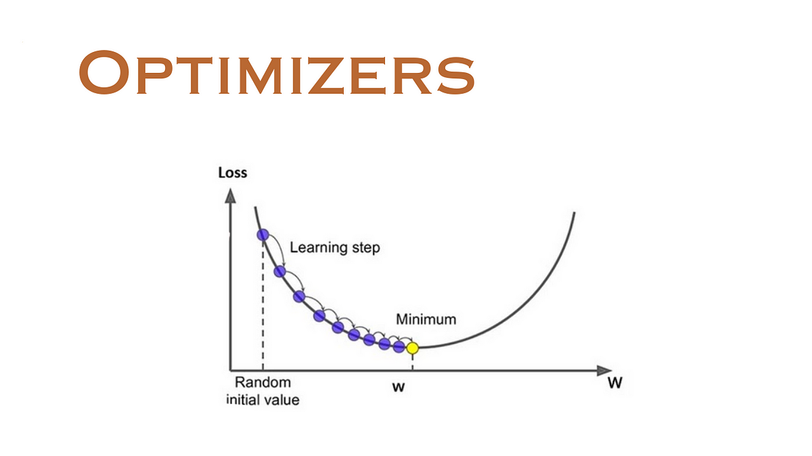

## Table of Contents

## What is an optimizer in machine learning?

An optimizer in machine learning is a tool that helps a model learn better. It does this by adjusting the model's parameters, like weights and biases, to minimize the difference between the model's predictions and the actual results. This difference is often measured by a loss function. The optimizer's job is to find the best values for these parameters so that the loss function is as small as possible.

Think of it like trying to find the lowest point in a hilly landscape. The optimizer helps the model navigate this landscape by taking steps in the direction that reduces the loss. Different optimizers use different strategies to do this. For example, the gradient descent optimizer uses the gradient of the loss function to decide which way to go. The formula for updating parameters in gradient descent is $$ \theta = \theta - \alpha \nabla J(\theta) $$, where $$ \theta $$ are the parameters, $$ \alpha $$ is the learning rate, and $$ \nabla J(\theta) $$ is the gradient of the loss function. Other optimizers, like Adam or RMSprop, add more sophisticated ways to adjust the step size and direction, making the learning process more efficient.

## Why are optimizers important in training machine learning models?

Optimizers are important in training machine learning models because they help the model learn from the data more effectively. When a model makes predictions, it often gets things wrong at first. The optimizer's job is to figure out how to adjust the model's settings, like weights and biases, to make the predictions better. It does this by trying to minimize the difference between the model's predictions and the actual results, which is measured by something called the loss function. By finding the best values for the model's parameters, the optimizer helps the model perform better on new, unseen data.

Different optimizers use different strategies to adjust the model's parameters. For example, the gradient descent optimizer uses a simple formula $$ \theta = \theta - \alpha \nabla J(\theta) $$ to update the parameters. Here, $$ \theta $$ are the parameters, $$ \alpha $$ is the learning rate, and $$ \nabla J(\theta) $$ is the gradient of the loss function. Other optimizers, like Adam or RMSprop, add more sophisticated ways to adjust the step size and direction, making the learning process more efficient. By choosing the right optimizer, you can make your model learn faster and more accurately, which is crucial for building effective machine learning models.

## What is the difference between gradient descent and other optimization algorithms?

Gradient descent is a basic optimization algorithm that helps [machine learning](/wiki/machine-learning) models learn by adjusting their parameters to reduce the difference between their predictions and the actual results. It does this by taking steps in the direction that makes the loss function smaller. The formula for updating parameters in gradient descent is $$ \theta = \theta - \alpha \nabla J(\theta) $$, where $$ \theta $$ are the parameters, $$ \alpha $$ is the learning rate, and $$ \nabla J(\theta) $$ is the gradient of the loss function. This method is simple but can be slow and may get stuck in places that aren't the best solution.

Other optimization algorithms, like Adam and RMSprop, build on gradient descent by adding more advanced ways to adjust the step size and direction. These algorithms often learn faster and can find better solutions. For example, Adam adapts the learning rate for each parameter, which can help the model learn more efficiently. RMSprop, on the other hand, changes the learning rate based on the average of recent gradients, which can help the model avoid getting stuck. These methods are more complex but can lead to better results in training machine learning models.

In summary, while gradient descent is a straightforward approach to optimization, other algorithms offer more sophisticated techniques to improve the learning process. By choosing the right optimizer, you can help your model learn faster and more accurately, which is crucial for building effective machine learning models.

## Can you explain the concept of learning rate and its impact on optimization?

The learning rate is a key setting in machine learning that tells the model how big of a step to take when it's trying to learn from the data. Imagine you're walking down a hill to find the lowest point. The learning rate is like deciding how big of a step to take each time. If the step is too small, you might take a long time to reach the bottom. But if the step is too big, you might overshoot and miss the lowest point. In optimization, the learning rate is often called $$ \alpha $$, and it's used in the formula $$ \theta = \theta - \alpha \nabla J(\theta) $$ to update the model's parameters. Here, $$ \theta $$ are the parameters, $$ \nabla J(\theta) $$ is the gradient of the loss function, and $$ \alpha $$ is the learning rate.

The impact of the learning rate on optimization is huge. If the learning rate is too high, the model might jump around and never settle on a good solution. This is because the big steps can make the model overshoot the best parameters. On the other hand, if the learning rate is too low, the model will take tiny steps and might take forever to learn anything useful. It's like trying to find the lowest point on a hill by taking baby steps. The trick is to find a learning rate that's just right, so the model can learn quickly without missing the best solution. Many advanced optimizers, like Adam and RMSprop, adjust the learning rate automatically to help the model learn better.

## What are some common types of optimizers used in machine learning?

In machine learning, several common types of optimizers help models learn better. One of the simplest is gradient descent, which updates the model's parameters by taking steps in the direction that reduces the loss function. The formula for gradient descent is $$ \theta = \theta - \alpha \nabla J(\theta) $$, where $$ \theta $$ are the parameters, $$ \alpha $$ is the learning rate, and $$ \nabla J(\theta) $$ is the gradient of the loss function. Another type is stochastic gradient descent (SGD), which is similar but uses a random subset of the data for each update, making it faster for large datasets.

More advanced optimizers include Adam and RMSprop. Adam, which stands for Adaptive Moment Estimation, adjusts the learning rate for each parameter based on the past gradients. This helps the model learn more efficiently and can handle different types of data well. RMSprop, or Root Mean Square Propagation, changes the learning rate based on the average of recent gradients, which can help the model avoid getting stuck and converge faster. Both of these optimizers are popular because they can adapt to the problem and help the model find the best solution more quickly.

Choosing the right optimizer depends on the specific problem and dataset. For example, if the dataset is large and you want to train quickly, SGD might be a good choice. If you need an optimizer that can adapt to different types of data and learn efficiently, Adam or RMSprop could be better. The key is to experiment with different optimizers and see which one works best for your model.

## How does the Stochastic Gradient Descent (SGD) optimizer work?

Stochastic Gradient Descent (SGD) is a type of optimizer used in machine learning to help models learn from data. Unlike regular gradient descent, which uses the entire dataset to calculate the gradient and update the parameters, SGD uses just one random example from the dataset at a time. This makes it faster, especially when you have a lot of data. The formula for updating the parameters in SGD is $$ \theta = \theta - \alpha \nabla J(\theta_i) $$, where $$ \theta $$ are the parameters, $$ \alpha $$ is the learning rate, and $$ \nabla J(\theta_i) $$ is the gradient of the loss function for the chosen example $$ i $$.

Because SGD uses only one example at a time, it can be a bit noisy and jump around a lot. But over time, as it goes through the whole dataset many times, it usually finds a good solution. This randomness can actually help the model escape from getting stuck in places that aren't the best solution. By choosing a good learning rate and maybe adding some tweaks like [momentum](/wiki/momentum), SGD can be a powerful tool for training machine learning models efficiently.

## What are the advantages of using Adam optimizer over other optimizers?

The Adam optimizer has several advantages that make it popular in machine learning. One big advantage is that it adapts the learning rate for each parameter, which helps the model learn more efficiently. Unlike simple optimizers like gradient descent, which use the same learning rate for all parameters, Adam adjusts the learning rate based on the past gradients. This means it can handle different types of data well and often finds a good solution faster. The formula for updating parameters in Adam is a bit more complicated, but it helps the model learn better: $$ \theta = \theta - \alpha \frac{\hat{m}_t}{\sqrt{\hat{v}_t} + \epsilon} $$, where $$ \theta $$ are the parameters, $$ \alpha $$ is the learning rate, $$ \hat{m}_t $$ and $$ \hat{v}_t $$ are estimates of the mean and variance of the gradients, and $$ \epsilon $$ is a small constant to avoid division by zero.

Another advantage of Adam is that it combines ideas from other optimizers like RMSprop and momentum. This combination makes it good at handling different kinds of problems. Adam can learn quickly and also avoid getting stuck in places that aren't the best solution. Because it's good at adapting to different types of data and problems, many people choose Adam when they're not sure which optimizer to use. This makes it a go-to choice for many machine learning tasks, especially when you want your model to learn efficiently and effectively.

## How do you choose the right optimizer for a specific machine learning task?

Choosing the right optimizer for a specific machine learning task depends on several factors, including the size of your dataset, the type of problem you're solving, and how quickly you want your model to learn. If you have a large dataset, you might want to use Stochastic Gradient Descent (SGD) because it's faster. It updates the model's parameters using just one random example at a time, which can help the model learn quickly. The formula for updating parameters in SGD is $$ \theta = \theta - \alpha \nabla J(\theta_i) $$, where $$ \theta $$ are the parameters, $$ \alpha $$ is the learning rate, and $$ \nabla J(\theta_i) $$ is the gradient of the loss function for the chosen example $$ i $$.

For many tasks, especially when you're not sure which optimizer to use, the Adam optimizer is a good choice. Adam adapts the learning rate for each parameter, which helps the model learn more efficiently. It combines ideas from other optimizers like RMSprop and momentum, making it good at handling different kinds of problems. The formula for updating parameters in Adam is $$ \theta = \theta - \alpha \frac{\hat{m}_t}{\sqrt{\hat{v}_t} + \epsilon} $$, where $$ \theta $$ are the parameters, $$ \alpha $$ is the learning rate, $$ \hat{m}_t $$ and $$ \hat{v}_t $$ are estimates of the mean and variance of the gradients, and $$ \epsilon $$ is a small constant to avoid division by zero. Adam is often a go-to choice because it can adapt to different types of data and problems, helping your model learn quickly and effectively.

Experimenting with different optimizers is a good idea. You might start with Adam because it's versatile, but if you find your model isn't learning well, you could try SGD with some tweaks like momentum. The key is to test different optimizers and see which one works best for your specific task. By choosing the right optimizer, you can help your model learn faster and more accurately, which is crucial for building effective machine learning models.

## What is the role of momentum in optimizers and how does it help?

Momentum in optimizers helps the model learn better by adding a bit of the past to the current step. Imagine you're pushing a ball down a hill. If you give it a little push and then another, the ball will keep rolling and pick up speed. Momentum in optimizers works the same way. It takes a bit of the past step and adds it to the current step, helping the model move faster and smoother towards the best solution. The formula for updating parameters with momentum is $$ v_t = \beta v_{t-1} + \alpha \nabla J(\theta) $$ and $$ \theta = \theta - v_t $$, where $$ v_t $$ is the velocity at time $$ t $$, $$ \beta $$ is the momentum coefficient, $$ \alpha $$ is the learning rate, and $$ \nabla J(\theta) $$ is the gradient of the loss function.

Using momentum helps the optimizer avoid getting stuck in places that aren't the best solution. Sometimes, the path to the best solution can have little bumps or dips, and without momentum, the optimizer might get stuck in these. But with momentum, the optimizer can roll over these bumps and keep going towards the best solution. This makes the learning process faster and more stable, helping the model find the best parameters more quickly. Momentum is often used with optimizers like SGD to make them work better.

## Can you discuss the concept of adaptive learning rates in optimizers like Adagrad and RMSprop?

Adaptive learning rates in optimizers like Adagrad and RMSprop help the model learn better by changing the step size based on the past. Imagine you're walking down a hill to find the lowest point. If you take big steps when the hill is steep and smaller steps when it's flat, you'll get to the bottom faster. Adagrad does something similar by making the learning rate smaller for parameters that have big gradients, which means they've changed a lot in the past. This helps the model learn more smoothly and avoid taking too big of steps. The formula for updating parameters in Adagrad is $$ \theta = \theta - \frac{\alpha}{\sqrt{G_t + \epsilon}} \nabla J(\theta) $$, where $$ \theta $$ are the parameters, $$ \alpha $$ is the learning rate, $$ G_t $$ is the sum of the squared gradients up to time $$ t $$, and $$ \epsilon $$ is a small constant to avoid division by zero.

RMSprop also uses an adaptive learning rate, but it does it differently. Instead of using all past gradients like Adagrad, RMSprop only looks at the recent ones. This means it can adjust the learning rate more quickly to the current situation. RMSprop calculates an average of the recent squared gradients and uses that to change the learning rate. This helps the model learn faster and avoid getting stuck. The formula for updating parameters in RMSprop is $$ v_t = \beta v_{t-1} + (1 - \beta) (\nabla J(\theta))^2 $$ and $$ \theta = \theta - \frac{\alpha}{\sqrt{v_t + \epsilon}} \nabla J(\theta) $$, where $$ v_t $$ is the moving average of the squared gradients, $$ \beta $$ is the decay rate, $$ \alpha $$ is the learning rate, and $$ \epsilon $$ is a small constant to avoid division by zero. By using these adaptive learning rates, both Adagrad and RMSprop can help the model learn more efficiently and find the best solution faster.

## How do optimizers handle issues like vanishing and exploding gradients in deep learning?

Optimizers help deal with problems like vanishing and exploding gradients in [deep learning](/wiki/deep-learning) by adjusting how they update the model's parameters. Vanishing gradients happen when the gradients become very small as they go through the layers of a [neural network](/wiki/neural-network), making it hard for the model to learn. Exploding gradients are the opposite, where the gradients get too big and can make the model's learning unstable. Optimizers like gradient descent use a learning rate, $$ \alpha $$, to control the size of the updates. If the gradients are too small, increasing the learning rate can help, but if they're too big, lowering the learning rate can prevent the updates from being too large.

Advanced optimizers like Adam and RMSprop can handle these issues even better. They use adaptive learning rates, which means they change the step size based on the past gradients. For example, RMSprop uses a formula like $$ v_t = \beta v_{t-1} + (1 - \beta) (\nabla J(\theta))^2 $$ and $$ \theta = \theta - \frac{\alpha}{\sqrt{v_t + \epsilon}} \nabla J(\theta) $$ to adjust the learning rate. This helps the model learn more smoothly and can prevent the gradients from vanishing or exploding. By adapting the learning rate, these optimizers can help the model learn better and avoid getting stuck or jumping around too much.

## What advanced techniques can be used to further optimize the performance of machine learning models?

To further optimize the performance of machine learning models, one advanced technique is to use learning rate schedules. This means changing the learning rate over time instead of keeping it the same. For example, you might start with a high learning rate to help the model learn quickly at first, and then lower it as the model gets closer to the best solution. This can help the model learn faster and avoid getting stuck. Another technique is to use regularization, which helps prevent the model from overfitting to the training data. Overfitting happens when the model learns the training data too well and doesn't do as well on new data. Regularization adds a penalty to the loss function to keep the model's parameters from getting too big, which can help the model generalize better to new data.

Another advanced technique is to use ensemble methods, which combine the predictions of multiple models to get a better result. For example, you might train several models on different parts of the data and then average their predictions. This can help the model perform better because it's less likely to make mistakes if it's combining the strengths of different models. Additionally, techniques like early stopping can be used to prevent overfitting. Early stopping means stopping the training process before the model has a chance to overfit. You can do this by monitoring the model's performance on a validation set and stopping when the performance starts to get worse. By using these advanced techniques, you can help your machine learning model perform better and learn more efficiently.

## References & Further Reading

[1]: Kingma, D. P., & Ba, J. (2014). ["Adam: A Method for Stochastic Optimization."](https://arxiv.org/abs/1412.6980) arXiv preprint arXiv:1412.6980.

[2]: Ruder, S. (2016). ["An Overview of Gradient Descent Optimization Algorithms."](https://arxiv.org/abs/1609.04747) arXiv preprint arXiv:1609.04747.

[3]: Goodfellow, I., Bengio, Y., & Courville, A. (2016). Deep Learning. MIT Press. [Chapter 8: Optimization for Training Deep Models.](https://www.deeplearningbook.org/)

[4]: Zeiler, M. D. (2012). ["ADADELTA: An Adaptive Learning Rate Method."](https://arxiv.org/abs/1212.5701) arXiv preprint arXiv:1212.5701.

[5]: Duchi, J., Hazan, E., & Singer, Y. (2011). ["Adaptive Subgradient Methods for Online Learning and Stochastic Optimization."](https://dl.acm.org/doi/10.5555/1953048.2021068) Journal of Machine Learning Research, 12, 2121-2159.

[6]: Hinton, G., Srivastava, N., Krizhevsky, A., Sutskever, I., & Salakhutdinov, R. (2012). ["Improving neural networks by preventing co-adaptation of feature detectors"](https://arxiv.org/abs/1207.0580). arXiv preprint arXiv:1207.0580.