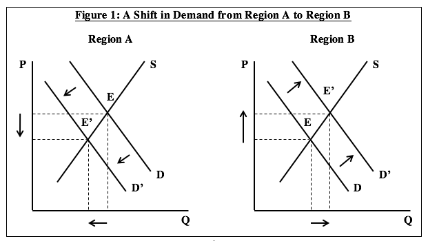

## Table of Contents

## What is the Optimum Currency Area Theory?

The Optimum Currency Area Theory is an economic concept that explains when it makes sense for different regions or countries to use the same currency. It was first introduced by economist Robert Mundell in the 1960s. The main idea is that sharing a currency can be beneficial if the regions are similar enough in terms of their economies. This means they should have similar economic cycles, be able to move workers and goods easily between them, and have some way to help each other out if one region faces economic trouble.

A key part of the theory is the idea of economic integration. If regions are closely linked through trade and have similar economic conditions, using the same currency can make transactions easier and reduce costs. However, if the regions are very different, sharing a currency might cause problems. For example, if one region falls into a recession while the other does well, they can't use different interest rates or currency values to help fix their problems. This is why the theory suggests that regions should only share a currency if they can handle these kinds of economic differences well.

## Who developed the Optimum Currency Area Theory?

The Optimum Currency Area Theory was developed by an economist named Robert Mundell. He came up with this idea in the 1960s. The theory is about when it makes sense for different places to use the same money. Mundell thought that if regions have similar economies and can easily move workers and goods between them, then using the same currency could be a good idea.

Mundell's theory became important because it helped people think about whether countries should join together and use the same money, like in the European Union. His ideas showed that sharing a currency can be good if the regions are closely connected and can help each other during tough economic times. But if the regions are too different, sharing a currency might cause more problems than it solves.

## What are the main criteria for an area to be considered an optimum currency area?

For an area to be considered an optimum currency area, the regions within it should have similar economic cycles. This means that if one part of the area is doing well economically, the other parts should be doing well too. If the economies are similar, using the same currency can help make trading easier and cheaper because people don't have to change money all the time. Also, the regions should be able to move workers and goods easily between them. If someone loses their job in one part of the area, they should be able to find a new job in another part without too much trouble.

Another important thing is that the regions should have ways to help each other out if one part faces economic trouble. This could be through things like sending money from richer parts to poorer parts or having a shared budget to help everyone. If the regions can't help each other, using the same currency might cause problems because they can't use different interest rates or change the value of their money to fix their economic issues. So, the main criteria are having similar economies, being able to move workers and goods easily, and having ways to support each other during tough times.

## How does labor mobility affect the effectiveness of an optimum currency area?

Labor mobility is really important for an optimum currency area to work well. It means that people can move easily from one place to another within the area to find jobs. If one part of the area is doing badly and people are losing their jobs, they should be able to move to another part where there are more job opportunities. This helps balance out the economy because it stops one place from getting too poor while another gets too rich. If people can't move easily, then using the same money might cause more problems because the areas can't help each other out by sharing workers.

For example, if a factory closes down in one city, the workers there might not have any jobs left. But if they can move to another city where there are still factories hiring, they can find new work and keep [earning](/wiki/earning-announcement) money. This helps the whole area stay strong because the workers can keep spending money and supporting the economy. Without good labor mobility, the area might struggle more because the people in the city with the closed factory would have a harder time finding new jobs, and that could make the whole area's economy weaker.

## What role does fiscal integration play in an optimum currency area?

Fiscal integration is really important for an optimum currency area. It means that the different regions in the area work together on money matters, like taxes and spending. If one part of the area is doing badly and people there are losing their jobs, fiscal integration can help by sending money from the richer parts to the poorer parts. This helps balance things out and keeps the whole area strong. Without fiscal integration, if one region gets into trouble, it might not have the money to fix its problems, and that could make the whole area's economy weaker.

For example, imagine one city in the area has a lot of factories that close down. The people there might not have any jobs left. But if there's fiscal integration, the area can use money from other cities that are doing better to help the people in the city with the closed factories. They could give them money to help them find new jobs or start businesses. This way, the whole area can keep going strong, even if one part is having a tough time. So, fiscal integration is a big part of making sure an optimum currency area works well.

## Can you explain the concept of price and wage flexibility in the context of an optimum currency area?

Price and wage flexibility means that prices for things and the money people get paid can change easily. In an optimum currency area, this is important because it helps the economy stay balanced. If one part of the area is doing badly and people are losing their jobs, prices and wages need to be able to go down. This makes it easier for businesses to keep going and for people to find new jobs. If prices and wages can't change easily, it might be harder for the area to fix its problems.

For example, if a factory closes down and people lose their jobs, the prices of things in that area might need to go down so that people can still afford to buy them. Also, the wages for new jobs might need to be lower so that businesses can hire more people. If prices and wages can change like this, it helps the whole area stay strong. But if they can't change easily, the area might struggle more because it can't adjust to the problems it's facing. So, price and wage flexibility is a big part of making sure an optimum currency area works well.

## How do economic shocks influence the stability of an optimum currency area?

Economic shocks are big changes that can hurt an economy, like a factory closing or a big drop in prices. In an optimum currency area, these shocks can make things unstable if the different parts of the area are not similar enough. If one part gets hit by a shock and its economy starts to do badly, but the other parts are doing okay, it can be hard for the whole area to stay strong. This is because they all use the same money and can't use different interest rates or change the value of their money to fix the problem.

But if the area is set up well, it can handle these shocks better. This means the parts of the area should be able to help each other out. For example, if one part is doing badly, the other parts can send money or help people move to where there are more jobs. Also, if prices and wages can change easily, it helps the area adjust to the shock. So, how well an optimum currency area can deal with economic shocks depends a lot on how similar the economies are and how well they can support each other.

## What are the benefits of adopting a single currency within an optimum currency area?

Using the same money in an optimum currency area can make things easier and cheaper. When different places use the same money, people and businesses don't have to change their money all the time when they buy or sell things. This saves time and money. Also, it makes it easier for businesses to sell their things in different places because they don't have to worry about different money values. This can help the whole area grow and get stronger because it's easier for everyone to trade with each other.

Another good thing about using the same money is that it can help keep the area stable. If the places in the area are similar and can help each other out, using the same money can make it easier to work together. For example, if one place is doing badly, the others can send money to help. This can stop one place from getting too poor while another gets too rich. So, using the same money can make the whole area stronger and more able to handle tough times.

## What are the potential drawbacks or challenges of implementing an optimum currency area?

One big challenge of using the same money in an optimum currency area is that it can be hard to handle economic problems if the places in the area are too different. If one place is doing badly and people are losing their jobs, but the other places are doing okay, they can't use different interest rates or change the value of their money to fix the problem. This is because they all use the same money. If the places can't help each other out well, the area might struggle more because it can't adjust to the problems it's facing.

Another problem is that it can be hard for people to move to where there are jobs. If someone loses their job in one place, they should be able to find a new job in another place without too much trouble. But if it's hard for people to move, then using the same money might cause more problems because the places can't help each other out by sharing workers. Also, if prices and wages can't change easily, it might be harder for the area to fix its problems because it can't adjust to the shock. So, making an optimum currency area work well depends a lot on how similar the economies are and how well they can support each other.

## How has the theory of optimum currency areas been applied in real-world scenarios, such as the Eurozone?

The Eurozone is a big example of trying to use the idea of optimum currency areas in real life. It's a group of countries in Europe that all use the same money, called the Euro. The idea was that if these countries used the same money, it would be easier for them to trade with each other and their economies would grow. But it's been hard because the countries are not all the same. Some countries, like Germany, have strong economies, while others, like Greece, have had a lot of problems. When the Eurozone started, people thought it would be an optimum currency area because the countries were working together and trying to help each other out. But it's been a challenge because the countries are not as similar as they need to be to make it work perfectly.

One big problem in the Eurozone has been dealing with economic shocks. When the world economy had a big shock in 2008, some countries in the Eurozone, like Greece and Spain, were hit really hard. Because they all use the same money, these countries couldn't change their money's value or use different interest rates to help fix their problems. They had to rely on other countries in the Eurozone to help them out. This showed that for the Eurozone to work well as an optimum currency area, the countries need to be more similar and better at helping each other. It's been a big lesson in how hard it can be to make an optimum currency area work in real life.

## What are the criticisms of the Optimum Currency Area Theory?

Some people think the Optimum Currency Area Theory has problems. One big criticism is that it's hard to know if different places are similar enough to use the same money. The theory says places should have similar economies and be able to help each other out. But in real life, it's tough to figure out if places are similar enough. Also, the theory doesn't always work well because it assumes places can move workers and goods easily. But in many places, it's hard for people to move to where the jobs are, and that can cause big problems if one place is doing badly.

Another criticism is that the theory doesn't deal well with big economic shocks. When something bad happens, like a factory closing or a big drop in prices, places using the same money can't use different interest rates or change their money's value to fix the problem. This can make things worse if the places can't help each other out well. Critics say the theory doesn't explain how to handle these shocks well, and that can make it hard for an optimum currency area to stay strong.

## How might future economic trends and global integration affect the relevance of the Optimum Currency Area Theory?

As the world becomes more connected, the idea of using the same money in different places might become more important. More trade and easier travel between countries could make it easier for places to work together and help each other out. This could make the Optimum Currency Area Theory more relevant because it's all about how places can use the same money if they are similar and can support each other. But it also means that places need to be ready to handle big changes and shocks, like a sudden drop in prices or a factory closing down. If they can't do that well, using the same money might cause more problems than it solves.

On the other hand, new technology and ways of doing business might make it easier for places to adjust to changes. For example, if people can work from home or move jobs more easily, it might help places handle economic shocks better. This could make the Optimum Currency Area Theory more useful because it would be easier for places to meet the theory's ideas about moving workers and goods. But it's still hard to know if places are similar enough to use the same money. As the world changes, the theory might need to change too, to keep up with new ways of doing things and new problems that come up.

## References & Further Reading

- Mundell, R. A. (1961). 'A Theory of Optimum Currency Areas.' The American Economic Review, 51(4), 657-665. This seminal work by Robert Mundell introduces the theoretical framework for understanding the criteria necessary for the formation of an optimal currency area, detailing the potential benefits of currency unions in regions that meet specific economic conditions.

- De Grauwe, P. (2018). 'Economics of Monetary Union.' Oxford University Press. Paul De Grauwe provides an in-depth analysis of the economic and policy implications of monetary unions, with a particular focus on the Eurozone. This book explores both the theoretical and empirical aspects of currency integration.

- Lane, P. R., & Milesi-Ferretti, G. M. (2007). 'The External Wealth of Nations Mark II: Revised and Extended Estimates of Foreign Assets and Liabilities, 1970-2004.' Journal of International Economics, 73(2), 223-250. This paper presents comprehensive data on international financial positions, essential for understanding capital mobility and economic integration aspects in currency areas.

- Lopez de Prado, M. (2018). 'Advances in Financial Machine Learning.' Wiley. This book covers the application of machine learning techniques in the financial markets, offering insights into algorithmic trading and how these methods can be used to optimize trading strategies in line with economic indicators.

- Aronson, D. R. (2006). 'Evidence-Based Technical Analysis: Applying the Scientific Method and Statistical Inference to Trading Signals.' Wiley. Aronson's work emphasizes a scientific approach to technical analysis, crucial for developing robust trading signals within algorithmic trading frameworks.

- Chan, E. P. (2009). 'Quantitative Trading: How to Build Your Own Algorithmic Trading Business.' Wiley. This resource provides practical guidance on establishing and managing an algorithmic trading business, including strategy development that considers economic principles like those outlined in OCA theory.

- European Central Bank. (2015). 'The International Role of the Euro.' European Central Bank. The report analyzes the Euro's role in the global financial system, which is relevant for understanding the real-world application of OCA criteria within the Eurozone and its impact on international markets.

