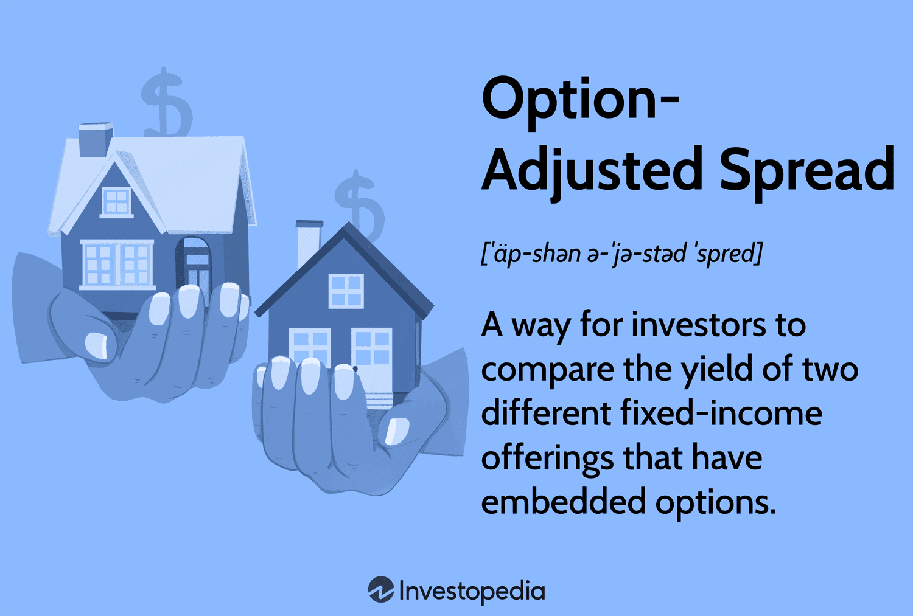

## Table of Contents

## What is Option-Adjusted Spread (OAS)?

Option-Adjusted Spread (OAS) is a way to measure the value of a bond with special features, like the ability to be paid off early. It helps investors understand if the bond is a good deal by comparing it to a regular bond without these features. OAS takes into account the possibility that the bond might be paid off early, which can affect its value. This makes it a useful tool for figuring out the extra return an investor gets for taking on the risk of these special features.

To calculate OAS, you start with the bond's yield and then subtract the value of the option to pay off the bond early. This gives you a clearer picture of the bond's return, without the influence of the option. For example, if a bond has an OAS of 50 basis points, it means the bond offers an extra 0.5% return over a similar bond without the option to be paid off early. This helps investors make better decisions by showing them the true value of the bond, beyond just its interest rate.

## How does OAS differ from other spread measures like Z-spread?

Option-Adjusted Spread (OAS) and Z-spread are both used to measure the value of bonds, but they do it in different ways. OAS is special because it takes into account the possibility that a bond might be paid off early. This is important for bonds with features like callable options, where the issuer can choose to pay off the bond before it matures. OAS helps investors see the true value of the bond by removing the effect of this early payoff option. It shows the extra return an investor gets for taking on the risk of the bond's special features.

On the other hand, the Z-spread, or zero-volatility spread, doesn't consider the possibility of early payoff. It measures the bond's value by looking at the difference between the bond's yield and the yield of a risk-free bond, like a government bond, across all possible times until the bond matures. The Z-spread assumes that the bond will be held until it matures, which can make it less accurate for bonds that might be paid off early. So, while the Z-spread is simpler to calculate, it might not give a complete picture of the bond's value if there's a chance it could be called early.

## Why is OAS important for analyzing bonds with embedded options?

OAS is important for analyzing bonds with embedded options because it helps investors understand the true value of these bonds. Bonds with embedded options, like callable bonds, can be paid off early by the issuer. This possibility affects the bond's value, making it different from a regular bond without such options. OAS takes this into account by removing the value of the option to pay off the bond early. This way, investors can see the extra return they get for taking on the risk of the bond's special features.

By using OAS, investors can make better decisions about whether a bond is a good investment. OAS gives a clearer picture of the bond's return, without the influence of the option to pay off the bond early. For example, if a bond has an OAS of 50 basis points, it means the bond offers an extra 0.5% return over a similar bond without the option to be paid off early. This helps investors compare different bonds more accurately and understand the true value of the bond beyond just its interest rate.

## How is OAS calculated?

To calculate OAS, you start with the bond's yield and then subtract the value of the option to pay off the bond early. This option value is found using a model that looks at different ways the bond might be paid off early, based on things like interest rates and how likely it is that the bond will be called. By taking away the value of this option, OAS shows the extra return an investor gets for holding the bond, without the effect of the option.

For example, if a bond has a yield of 5% and the value of its early payoff option is 0.5%, the OAS would be 4.5%. This means the bond offers an extra 4.5% return over a similar bond without the option to be paid off early. OAS helps investors see the true value of the bond by removing the influence of the option, making it easier to compare different bonds and understand their real returns.

## What are the key components needed to compute OAS?

To compute OAS, you need the bond's yield, which is the interest rate the bond pays. You also need to know the value of the option to pay off the bond early. This option value comes from a model that looks at different ways the bond might be paid off early. The model considers things like interest rates and how likely it is that the bond will be called. By subtracting the option value from the bond's yield, you get the OAS.

OAS shows the extra return an investor gets for holding the bond, without the effect of the option to pay it off early. For example, if a bond has a yield of 5% and the value of its early payoff option is 0.5%, the OAS would be 4.5%. This means the bond offers an extra 4.5% return over a similar bond without the option to be paid off early. OAS helps investors see the true value of the bond by removing the influence of the option, making it easier to compare different bonds and understand their real returns.

## Can you explain the role of interest rate models in OAS analysis?

Interest rate models play a big role in OAS analysis because they help figure out the value of the option to pay off a bond early. These models look at how interest rates might change in the future and how likely it is that the bond will be called. By understanding these things, the model can guess the value of the option. This is important because the option value is what you subtract from the bond's yield to find the OAS. Without the interest rate model, it would be hard to know the true value of the bond and how it compares to other bonds.

Using an interest rate model makes OAS analysis more accurate. The model helps create different scenarios for how interest rates might change, which affects when the bond might be called. For example, if interest rates go down, the issuer might want to call the bond and issue a new one at a lower rate. The model takes all these possibilities into account and calculates the option value. This way, OAS can show investors the extra return they get for holding the bond, without the option's influence, giving a clearer picture of the bond's real value.

## How does OAS help in comparing different bonds?

OAS helps in comparing different bonds by giving a clear picture of their value without the effect of options like early payoff. When you look at a bond's yield, it includes the value of any options the bond has. But OAS takes away this option value, so you can see the extra return you get for holding the bond. This makes it easier to compare bonds that have different options, like callable bonds, to bonds without these options.

For example, if you have two bonds with the same yield but one can be paid off early, the OAS will show you that the bond without the option might actually give you a better return. By using OAS, you can see which bond offers a better deal, even if their yields look the same at first. This helps investors make smarter choices about which bonds to buy, based on the true value of the bonds.

## What are the limitations and assumptions of using OAS?

Using OAS to analyze bonds has some limits and makes certain guesses. One big guess is about how interest rates might change in the future. OAS uses models to predict these changes, but these models can be wrong. If the model doesn't guess the future right, the OAS might not show the bond's true value. Also, OAS assumes that the market for the bond is perfect, with no costs for buying or selling the bond. In real life, there are always costs, like fees, that can change how good a deal the bond is.

Another limit of OAS is that it can be hard to figure out. You need special models and computers to calculate it, which can be tricky. Not everyone has access to these tools, so it might be hard for some investors to use OAS. Also, OAS assumes that the chance of the bond being paid off early is the same for all bonds. But in real life, different bonds might have different chances of being called, which can make the OAS less accurate. So, while OAS is a useful tool, it's important to know its limits and not rely on it too much when making choices about bonds.

## How can OAS be used in investment decision-making?

OAS can help investors make better choices about bonds by showing the true value of a bond without the effect of options like early payoff. When you look at a bond's yield, it includes the value of any options the bond has. But OAS takes away this option value, so you can see the extra return you get for holding the bond. This makes it easier to compare bonds that have different options, like callable bonds, to bonds without these options. By using OAS, you can see which bond offers a better deal, even if their yields look the same at first.

For example, if you have two bonds with the same yield but one can be paid off early, the OAS will show you that the bond without the option might actually give you a better return. This helps investors make smarter choices about which bonds to buy, based on the true value of the bonds. OAS also helps investors understand the risks they are taking. By knowing the OAS, investors can decide if the extra return is worth the risk of the bond's special features. This way, OAS can guide investors to make more informed decisions about their investments.

## What is the impact of volatility on OAS?

Volatility, which means how much interest rates can change, has a big effect on OAS. When interest rates are more likely to change a lot, it makes the option to pay off a bond early more valuable. This is because if rates go down, the issuer might want to call the bond and issue a new one at a lower rate. So, when volatility goes up, the value of the option goes up too. This means the OAS, which is the bond's yield minus the option value, will go down. A lower OAS shows that the bond is less attractive because the extra return you get for holding it is smaller.

On the other hand, when interest rates are not likely to change much, the option to pay off the bond early is less valuable. This is because there's less chance the issuer will call the bond. So, when volatility goes down, the value of the option goes down too. This means the OAS will go up, making the bond look more attractive. A higher OAS shows that the bond offers a better deal because the extra return you get for holding it is bigger. Understanding how volatility affects OAS helps investors make better choices about which bonds to buy.

## How do changes in the yield curve affect OAS?

Changes in the yield curve can have a big impact on OAS. The yield curve shows how interest rates change over time for different lengths of time until a bond matures. When the yield curve changes, it can change the value of the option to pay off a bond early. For example, if the yield curve gets steeper, meaning long-term rates go up more than short-term rates, it might make the option to call the bond less valuable. This is because the issuer might not want to call the bond and issue a new one at a higher rate. So, when the yield curve gets steeper, the OAS might go up because the option value goes down, making the bond look more attractive.

On the other hand, if the yield curve gets flatter, meaning long-term rates don't go up as much as short-term rates, it can make the option to call the bond more valuable. This is because the issuer might want to call the bond and issue a new one at a lower long-term rate. So, when the yield curve gets flatter, the OAS might go down because the option value goes up, making the bond look less attractive. Understanding how changes in the yield curve affect OAS helps investors see how the bond's value might change in different interest rate environments.

## What advanced techniques can be used to refine OAS calculations?

To make OAS calculations more accurate, you can use advanced techniques like better interest rate models. These models can look at more ways interest rates might change and how likely each way is. For example, using a model like the Black-Derman-Toy model or the Hull-White model can help. These models are good at predicting how interest rates might move in the future, which is important for figuring out the value of the option to pay off a bond early. By using a better model, you can get a more accurate OAS, which helps you understand the true value of the bond better.

Another way to refine OAS calculations is by using more data. This means looking at more information about how the bond and similar bonds have acted in the past. By studying this data, you can see patterns and make better guesses about how likely it is that the bond will be called. Using more data can also help you understand how different things, like changes in the economy, might affect the bond's value. This way, you can make your OAS calculations more accurate and make smarter choices about which bonds to invest in.

## What is Option-Adjusted Spread (OAS)?

The Option-Adjusted Spread (OAS) is an essential measure in bond markets, particularly for bonds with embedded options such as mortgage-backed securities (MBS). OAS quantifies the spread of a bond's yield over the risk-free rate, while accounting for the value of embedded options. This enables investors to determine the bond's true yield by factoring in the complexities introduced by these options.

Embedded options, such as the prepayment option in MBS, can significantly impact the cash flows and thus the valuation of the bond. The OAS helps adjust the bond's yield to reflect these option-induced changes, providing a more accurate picture of its risk-adjusted return. This adjustment process involves dynamically recalculating the bond's spread by simulating various interest rate scenarios to account for potential changes in cash flows caused by embedded options.

Mathematically, the OAS is obtained by computing the difference between the bond's yield and the risk-free rate, as adjusted for the options. Here is a simplified representation of how such an adjustment might be expressed:

$$
\text{OAS} = Y_{\text{bond}} - Y_{\text{risk-free}} - \text{Option Adjustment}
$$

Where $Y_{\text{bond}}$ represents the yield of the bond and $Y_{\text{risk-free}}$ denotes the yield on a comparable risk-free security. The "Option Adjustment" accounts for the cost or benefit of the embedded options.

By using the OAS, investors gain insight into the bond's actual yield, after considering potential option-related scenarios. This makes the OAS a vital tool for analyzing bonds with complex structures, helping investors and portfolio managers make informed decisions based on a bond's risk-adjusted returns.

## How do you calculate the Option-Adjusted Spread (OAS)?

To calculate the Option-Adjusted Spread (OAS), one must follow a series of structured steps designed to understand the risk-adjusted yield of a bond that includes embedded options, such as callable or putable bonds. The process ensures that the bond's potential behavioral changes under various interest rate environments are properly accounted for.

### Step 1: Model the Bond's Cash Flows
Begin with the bond's market price and estimate its expected cash flows. This involves determining the potential payments of interest (coupons) and the principal based on the bond's terms. For bonds with embedded options, such as mortgage-backed securities, the cash flows need to accommodate potential scenarios where options might be exercised.

### Step 2: Adjust Cash Flows Using Interest Rate Scenarios
To adjust these cash flows, simulate a range of interest rate paths to account for different market conditions. This involves creating a lattice or tree model, such as a binomial or trinomial tree, which depicts potential future interest rates at various time periods.

One possible approach is to use the **Monte Carlo simulation**, where random interest rate paths are generated to reflect future interest rate movements:

```python
import numpy as np

# Parameters
num_simulations = 1000
time_steps = 10
initial_rate = 0.03  # Example starting interest rate
rate_volatility = 0.01

# Generate random interest rate paths
interest_rate_paths = np.zeros((num_simulations, time_steps))
interest_rate_paths[:, 0] = initial_rate

for t in range(1, time_steps):
    random_shocks = np.random.normal(0, rate_volatility, num_simulations)
    interest_rate_paths[:, t] = interest_rate_paths[:, t-1] + random_shocks

```

### Step 3: Calculate the Present Value of Adjusted Cash Flows
Discount the adjusted cash flows to present value using a risk-free rate as the discount [factor](/wiki/factor-investing). The risk-free rate typically represents the yield of government bonds for the corresponding maturity period.

Calculate the present value (PV) using the formula:
$$
PV = \sum_{t=1}^{T} \frac{CF_t}{(1 + r)^t}
$$
where $CF_t$ are the adjusted cash flows at time $t$, $r$ is the risk-free rate, and $T$ is the total number of periods considered.

### Step 4: Determine the Option-Adjusted Spread (OAS)
The OAS is the constant spread over the risk-free rate that equates the present value of the adjusted cash flows to the bond's current market price. Conceptually, OAS is found by solving for the spread $s$ in the equation:

$$
\sum_{t=1}^{T} \frac{CF_t}{(1 + r + s)^t} = P_{\text{market}}
$$

where $P_{\text{market}}$ is the market price of the bond. The goal is to find the appropriate spread $s$ that adjusts the discounted cash flows to match the observed market price of the bond. In practice, this is often achieved using iterative numerical methods, such as a root-finding algorithm, due to the complexity introduced by the range of interest rate scenarios and cash flow adjustments. 

By following these steps, the investor derives an OAS that reflects a comprehensive view of the bond's yield, adjusted for interest rate changes and embedded options, thereby offering a clearer measure of its risk-adjusted return.

## References & Further Reading

[1]: ["Fixed Income Analysis"](https://en.wikipedia.org/wiki/Fixed_income_analysis) by Frank J. Fabozzi

[2]: ["Quantitative Financial Analytics: The Path To Investment Profits"](https://archive.org/details/quantitativefina0000will) by Edward E. Williams and Michael A. Young

[3]: ["The Handbook of Fixed Income Securities"](https://www.amazon.com/Handbook-Fixed-Income-Securities-Ninth/dp/1260473899) by Frank J. Fabozzi

[4]: ["Inside the Yield Book: The Classic That Created the Science of Bond Analysis"](https://www.amazon.com/Inside-Yield-Book-Classic-Analysis/dp/111839013X) by Martin L. Leibowitz and Sidney Homer

[5]: ["Options, Futures, and Other Derivatives"](https://www.amazon.com/Options-Futures-Other-Derivatives-9th/dp/0133456315) by John C. Hull