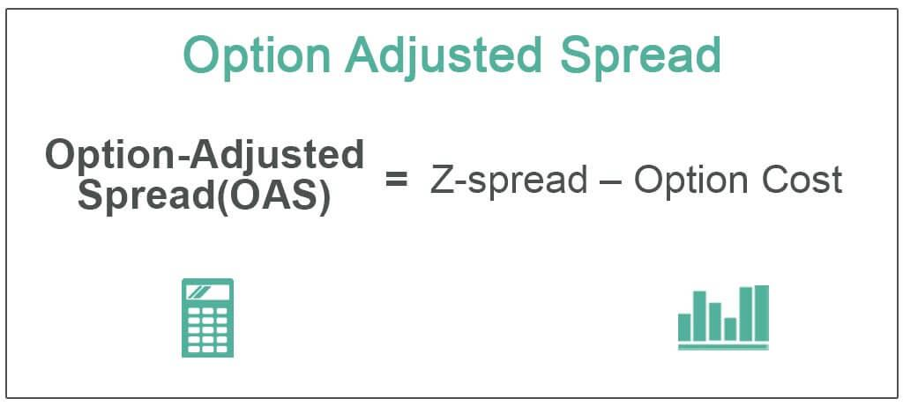

The financial markets are constantly evolving, driven by advancements in technology and the introduction of innovative financial metrics. Among these innovations, the Option-Adjusted Spread (OAS) has emerged as a crucial tool for investors and traders seeking to evaluate the risk-adjusted returns of bonds, particularly those with embedded options. OAS helps to unravel the complexities associated with bonds by providing a clearer perspective on their yield adjusted for potential option-related scenarios.

In conjunction with algorithmic trading, OAS offers a sophisticated approach to enhancing trading strategies and portfolio management. Algorithmic trading relies on powerful computational techniques to execute trades based on pre-defined criteria. By incorporating OAS into these algorithms, traders can integrate a deeper level of analysis into their trading decisions, factoring in the effect of embedded options on a bond's yield. This integration not only aids in refining strategies but also fosters more informed investment decisions, ultimately leading to optimized portfolio performance.



This article explores the concept of OAS, detailing its calculation and applications in algorithmic trading. By understanding and mastering OAS, investors can gain a competitive edge in the complex landscape of modern financial markets, effectively managing bond portfolios and leveraging the insights provided by this valuable metric.

## Table of Contents

## Understanding Financial Spreads: An Overview

Financial spreads are essential tools in the analysis of market dynamics, risk assessment, and the evaluation of potential returns. They provide a snapshot of the difference between two prices, rates, or yields and serve as a critical indicator for traders and investors. By interpreting these spreads, market participants can gauge market sentiment, assess liquidity, and make informed trading decisions.

One of the fundamental types of financial spreads is the credit spread. This spread represents the difference in yield between two bonds of similar maturity but different credit quality. Typically, it is calculated as the yield on a corporate bond minus the yield on a government bond, which is considered risk-free. Credit spreads give insights into the perceived risk of default by corporate bond issuers compared to government bond issuers. Wider credit spreads often indicate higher default risk and increased investor concern.

Another common spread is the bid-ask spread, which reflects the difference between the highest price a buyer is willing to pay for an asset (bid) and the lowest price a seller is willing to accept (ask). The bid-ask spread is a direct measure of market [liquidity](/wiki/liquidity-risk-premium)—the narrower the spread, the more liquid the market. It also signals the cost of trading assets and can vary significantly based on market conditions, asset class, and the time of day.

Specialized spreads such as the Zero-Volatility Spread (Z-spread) and the Option-Adjusted Spread (OAS) add greater depth to financial analysis. The Z-spread is a measure that helps assess the yield of a bond over the entire yield curve, assuming no embedded options. It provides a static view and is useful for evaluating bonds in a constant [interest rate](/wiki/interest-rate-trading-strategies) environment.

The OAS, on the other hand, adjusts the bond yield for embedded options, offering a dynamic perspective. It calculates the spread over a risk-free rate, factoring in the optionality, which is particularly relevant for securities like mortgage-backed securities that have features such as call or put options.

Understanding these various spreads is essential for traders and investors as they offer critical insights into the underlying factors influencing market movements and investment returns. They help in identifying [arbitrage](/wiki/arbitrage) opportunities, assessing the relative value of different financial instruments, and managing portfolio risks effectively. As such, the meticulous analysis of financial spreads can lead to more informed and strategic trading decisions.

## What is Option-Adjusted Spread (OAS)?

The Option-Adjusted Spread (OAS) is an essential measure in bond markets, particularly for bonds with embedded options such as mortgage-backed securities (MBS). OAS quantifies the spread of a bond's yield over the risk-free rate, while accounting for the value of embedded options. This enables investors to determine the bond's true yield by factoring in the complexities introduced by these options.

Embedded options, such as the prepayment option in MBS, can significantly impact the cash flows and thus the valuation of the bond. The OAS helps adjust the bond's yield to reflect these option-induced changes, providing a more accurate picture of its risk-adjusted return. This adjustment process involves dynamically recalculating the bond's spread by simulating various interest rate scenarios to account for potential changes in cash flows caused by embedded options.

Mathematically, the OAS is obtained by computing the difference between the bond's yield and the risk-free rate, as adjusted for the options. Here is a simplified representation of how such an adjustment might be expressed:

$$
\text{OAS} = Y_{\text{bond}} - Y_{\text{risk-free}} - \text{Option Adjustment}
$$

Where $Y_{\text{bond}}$ represents the yield of the bond and $Y_{\text{risk-free}}$ denotes the yield on a comparable risk-free security. The "Option Adjustment" accounts for the cost or benefit of the embedded options.

By using the OAS, investors gain insight into the bond's actual yield, after considering potential option-related scenarios. This makes the OAS a vital tool for analyzing bonds with complex structures, helping investors and portfolio managers make informed decisions based on a bond's risk-adjusted returns.

## Calculating the Option-Adjusted Spread (OAS)

To calculate the Option-Adjusted Spread (OAS), one must follow a series of structured steps designed to understand the risk-adjusted yield of a bond that includes embedded options, such as callable or putable bonds. The process ensures that the bond's potential behavioral changes under various interest rate environments are properly accounted for.

### Step 1: Model the Bond's Cash Flows
Begin with the bond's market price and estimate its expected cash flows. This involves determining the potential payments of interest (coupons) and the principal based on the bond's terms. For bonds with embedded options, such as mortgage-backed securities, the cash flows need to accommodate potential scenarios where options might be exercised.

### Step 2: Adjust Cash Flows Using Interest Rate Scenarios
To adjust these cash flows, simulate a range of interest rate paths to account for different market conditions. This involves creating a lattice or tree model, such as a binomial or trinomial tree, which depicts potential future interest rates at various time periods.

One possible approach is to use the **Monte Carlo simulation**, where random interest rate paths are generated to reflect future interest rate movements:

```python
import numpy as np

# Parameters
num_simulations = 1000
time_steps = 10
initial_rate = 0.03  # Example starting interest rate
rate_volatility = 0.01

# Generate random interest rate paths
interest_rate_paths = np.zeros((num_simulations, time_steps))
interest_rate_paths[:, 0] = initial_rate

for t in range(1, time_steps):
    random_shocks = np.random.normal(0, rate_volatility, num_simulations)
    interest_rate_paths[:, t] = interest_rate_paths[:, t-1] + random_shocks

```

### Step 3: Calculate the Present Value of Adjusted Cash Flows
Discount the adjusted cash flows to present value using a risk-free rate as the discount [factor](/wiki/factor-investing). The risk-free rate typically represents the yield of government bonds for the corresponding maturity period.

Calculate the present value (PV) using the formula:
$$
PV = \sum_{t=1}^{T} \frac{CF_t}{(1 + r)^t}
$$
where $CF_t$ are the adjusted cash flows at time $t$, $r$ is the risk-free rate, and $T$ is the total number of periods considered.

### Step 4: Determine the Option-Adjusted Spread (OAS)
The OAS is the constant spread over the risk-free rate that equates the present value of the adjusted cash flows to the bond's current market price. Conceptually, OAS is found by solving for the spread $s$ in the equation:

$$
\sum_{t=1}^{T} \frac{CF_t}{(1 + r + s)^t} = P_{\text{market}}
$$

where $P_{\text{market}}$ is the market price of the bond. The goal is to find the appropriate spread $s$ that adjusts the discounted cash flows to match the observed market price of the bond. In practice, this is often achieved using iterative numerical methods, such as a root-finding algorithm, due to the complexity introduced by the range of interest rate scenarios and cash flow adjustments. 

By following these steps, the investor derives an OAS that reflects a comprehensive view of the bond's yield, adjusted for interest rate changes and embedded options, thereby offering a clearer measure of its risk-adjusted return.

## OAS in Algorithmic Trading

Algorithmic trading utilizes the computational power of modern technology to execute trades at speeds and efficiencies unparalleled by human traders. By incorporating the Option-Adjusted Spread (OAS) into these trading algorithms, traders add a sophisticated layer of risk-adjusted analysis, which enhances the precision of trading strategies.

OAS, by design, adjusts the yield spread of a bond over a risk-free rate to account for the value of embedded options, such as call or put features. This adjustment is critical for accurately estimating the bond's risk-adjusted return, particularly in markets characterized by bonds with embedded options like mortgage-backed securities (MBS) or callable corporate bonds.

Incorporating OAS into [algorithmic trading](/wiki/algorithmic-trading) involves several computational steps that can be efficiently handled through algorithms. These steps include modeling the bond's cash flows under a range of interest rate scenarios and adjusting them for embedded options. This process requires complex mathematical modeling, usually reliant on Monte Carlo simulations or binomial lattice models to capture the different paths that interest rates—and consequently, bond prices—could take.

The adjusted cash flows are then discounted back to their present value using a risk-free rate. The OAS is calculated as the spread over this risk-free rate that aligns the present value of these cash flows with the bond’s current market price. In a trading algorithm, this entire process can be coded and executed rapidly across a large set of bonds, providing dynamic data points that help predict price movements more accurately.

Python, a preferred language for algorithmic trading due to its versatility and strong libraries, can handle these calculations efficiently. The following Python snippet demonstrates an abstract representation of how OAS might be computed within an algorithmic trading framework:

```python
import numpy as np

def calculate_oas(cash_flows, market_price, interest_rate_scenarios, risk_free_rate):
    np.random.seed(0)
    scenario_pv = []

    # Simulate present value under different interest rate scenarios
    for scenario in interest_rate_scenarios:
        adjusted_flows = adjust_for_options(cash_flows, scenario)
        pv = np.sum([cf / ((1 + risk_free_rate) ** t) for t, cf in enumerate(adjusted_flows, start=1)])
        scenario_pv.append(pv)

    # Monte Carlo simulation to estimate OAS
    mean_pv = np.mean(scenario_pv)
    oas = (market_price / mean_pv - 1) * 10000  # Converting to basis points

    return oas

def adjust_for_options(cash_flows, scenario):
    # Placeholder for option-adjustment logic
    return [cf * np.random.uniform(0.95, 1.05) for cf in cash_flows]

cash_flows = [100, 100, 100, 1100]  # Assumes a 3-year bond with annual coupons
market_price = 1040
interest_rate_scenarios = [[0.03, 0.04, 0.05], [0.02, 0.03, 0.04]]  # Hypothetical scenarios
risk_free_rate = 0.02

oas = calculate_oas(cash_flows, market_price, interest_rate_scenarios, risk_free_rate)
print(f'OAS: {oas} basis points')
```

By integrating OAS calculations into algorithmic trading, traders gain a more nuanced understanding of the risk-return profile of securities with embedded options. This leads to more informed and strategic trading decisions, offering enhanced opportunities for maximizing returns while managing risks effectively. This approach illustrates not only the theoretical value of OAS but also its practical application in real-time trading scenarios using modern computational tools.

## Comparing OAS with Z-Spread

The Option-Adjusted Spread (OAS) and the Z-Spread are both critical measures used by investors to assess bond yields, but they differ fundamentally in their approach and applicability, particularly with respect to bonds containing embedded options. Understanding these differences is crucial for traders and investors seeking to make informed decisions based on comprehensive risk-adjusted analyses.

The Z-Spread, or Zero-Volatility Spread, is a measure that indicates the constant spread that would need to be added to the Treasury yield curve to make a bond's discounted cash flows equal its current market price. One significant limitation of the Z-Spread is that it assumes no embedded options influence the bond's cash flows. This static nature means it provides a straightforward calculation of a bond's spread over the yield curve without considering potential variations due to options, such as calls or puts.

In contrast, the Option-Adjusted Spread (OAS) offers a more dynamic analysis by incorporating adjustments for these embedded options. By simulating different interest rate paths and accounting for option-related cash flow changes, the OAS provides the spread over the risk-free rate that reconciles the bond's adjusted present value with its market price. This adjustment is essential for accurately capturing the risk-adjusted returns of bonds where the issuer may exercise options based on market conditions.

For example, consider a callable bond. The Z-Spread calculation would simply compare the bond's yields against the yield curve, ignoring the impact of the call option that allows the issuer to redeem the bond before maturity. The OAS, however, factors in various exercise scenarios of the call option, thus providing a spread that accounts for the altered expected cash flows.

Understanding and utilizing both OAS and Z-Spread allows traders and investors to gain a more nuanced picture of bond valuations. The Z-Spread can be beneficial for a quick measure of the yield spread without delving into the complexities of option adjustments, suitable for non-callable, non-puttable bonds. Meanwhile, the OAS is indispensable for bonds with embedded options, offering insights into how these options might affect future cash flows and risk-adjusted returns.

In summary, while the Z-Spread offers a simplistic and static measure for comparing yields against the yield curve, the OAS provides a comprehensive view by adjusting spreads based on potential option execution scenarios. Incorporating these two spreads into an analytical framework equips investors with a robust set of tools for evaluating bond performance, managing interest rate risks, and constructing diversified bond portfolios.

## Practical Applications of OAS

Option-Adjusted Spread (OAS) is a pivotal metric widely utilized in the management of portfolios, specifically for assessing the value of bonds and managing interest rate risks. By adjusting for embedded options, OAS enables investors to evaluate the yield of a bond more accurately, providing a comprehensive view of its risk-adjusted return. This capability is particularly important in determining the relative value of bonds, which is essential for formulating effective investment strategies and optimizing portfolio allocations.

One of the primary applications of OAS in portfolio management is identifying arbitrage opportunities. In the context of bond markets, arbitrage involves exploiting price discrepancies to generate risk-free profits. By considering the adjustments for embedded options, OAS aids traders in pinpointing inconsistencies between a bond’s market price and its theoretical value, allowing them to capitalize on these differences. For instance, when the OAS of a bond deviates significantly from its peers with similar risk profiles, it could indicate a potential arbitrage opportunity.

Furthermore, OAS supports informed decision-making in bond trading strategies. By providing a clearer understanding of the bond’s effective yield after accounting for the risk of prepayment or other embedded options, traders can make better-informed choices regarding buy, hold, or sell decisions. This level of analysis is crucial for constructing portfolios that are resilient to interest rate changes and fluctuations in market conditions.

In the context of fixed-income securities, OAS proves indispensable for constructing diversified and risk-adjusted portfolios. Fixed-income portfolios often comprise a variety of bonds with different maturities, credit qualities, and embedded option features. The use of OAS allows portfolio managers to align their investments with specific risk and return objectives by selecting bonds that offer favorable risk-adjusted returns. This alignment is crucial for achieving a balanced mix of securities, which can protect against interest rate [volatility](/wiki/volatility-trading-strategies) and credit risk.

By providing a measure that considers the complexities introduced by embedded options, OAS enhances the precision of bond valuation and risk management practices. Its application extends beyond individual bond analysis, contributing to a more robust framework for the strategic management of diverse investment portfolios.

## Conclusion

The Option-Adjusted Spread (OAS) serves as a key metric for evaluating the risk-adjusted yields of bonds, particularly those with embedded options like callable or putable bonds. By adjusting for the cost or value of these options, OAS provides a more accurate reflection of a bond's true yield compared to static measures like the Z-spread. This adjustment process makes OAS a vital tool for accurately assessing the potential returns and risks associated with a bond investment.

When integrated into algorithmic trading systems, OAS allows for more sophisticated analysis and execution strategies. Algorithms can incorporate this nuanced measure to better predict price movements and identify inefficiencies in the market, thus optimizing trade execution and improving overall strategy performance. The capacity to model how a bond’s yield might vary under different interest rate scenarios offers traders a dynamic framework to make informed decisions, enhancing the precision and effectiveness of trading algorithms.

Mastering the concept and application of OAS provides investors with a substantial advantage in their investment approaches. It aids in crafting well-balanced portfolios that account for interest rate variations and embedded option risks. In the rapidly changing landscape of financial markets, an in-depth understanding of OAS is crucial for investors to manage bond portfolios effectively, exploit arbitrage opportunities, and maintain a competitive edge.

## References & Further Reading

[1]: ["Fixed Income Analysis"](https://en.wikipedia.org/wiki/Fixed_income_analysis) by Frank J. Fabozzi

[2]: ["Quantitative Financial Analytics: The Path To Investment Profits"](https://archive.org/details/quantitativefina0000will) by Edward E. Williams and Michael A. Young

[3]: ["The Handbook of Fixed Income Securities"](https://www.amazon.com/Handbook-Fixed-Income-Securities-Ninth/dp/1260473899) by Frank J. Fabozzi

[4]: ["Inside the Yield Book: The Classic That Created the Science of Bond Analysis"](https://www.amazon.com/Inside-Yield-Book-Classic-Analysis/dp/111839013X) by Martin L. Leibowitz and Sidney Homer

[5]: ["Options, Futures, and Other Derivatives"](https://www.amazon.com/Options-Futures-Other-Derivatives-9th/dp/0133456315) by John C. Hull