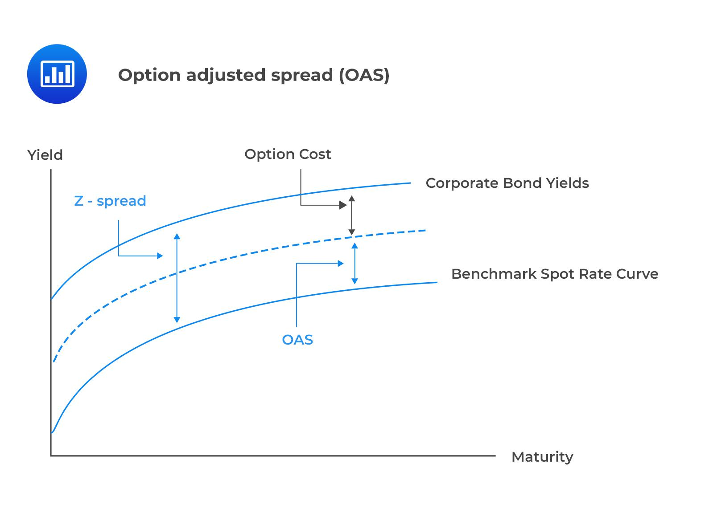

The world of financial markets continuously evolves, driven by technological advancements and innovative financial strategies. Among these, the Option-Adjusted Spread (OAS) has emerged as a pivotal tool for investors and traders, offering insights into the risk-adjusted returns of bonds, especially those with embedded options. This metric significantly enhances the ability to accurately evaluate the potential profitability and risk associated with bond investments.

In the ever-expanding field of algorithmic trading, the integration of computational power into trading strategies has revolutionized financial markets. This complex environment requires refined techniques and precise calculations, a need that sophisticated financial metrics, such as the OAS, fulfill by providing a nuanced understanding of bond yields. The OAS adjusts for embedded options, presenting a clearer picture of a bond's true yield potential compared to simpler spread measurements that may overlook such dynamic features.



The significance of OAS extends beyond standard bond analysis, as it can transform trading strategies by allowing investors to factor in changes in yield due to options embedded within securities. Algorithmic trading systems employ OAS to make informed, real-time decisions that optimize trading outcomes. By calculating the OAS, algorithms can dynamically adjust for bond yield predictions against interest rate scenarios, taking into account the impact of embedded options, thus resulting in strategies that are more aligned with market realities.

In summary, the Option-Adjusted Spread offers vital insights into financial securities with embedded options, providing a measure of risk-adjusted return that traditional yield spreads may fail to capture. Its integration into algorithmic trading platforms exemplifies how leveraging advanced financial analytics can provide a competitive edge in navigating the increasingly complex landscape of financial markets.

## Table of Contents

## Understanding Financial Spreads: An Overview

Financial spreads play a vital role in the evaluation of market dynamics, risk assessment, and the determination of potential returns for investors. These spreads provide a quantitative measure of the difference between various financial metrics such as prices, rates, or yields. By offering such a snapshot, financial spreads serve as indispensable tools for investors, aiding in making informed decisions and strategizing.

There are several key types of financial spreads utilized in the market. Among these, credit spreads are significant as they represent the difference in yield between a corporate bond and a government bond of similar maturity, often used to assess the credit risk associated with a corporate issuer. A wider credit spread typically indicates a higher perceived risk of default, helping investors evaluate the risk versus return profile of different debt instruments.

Another commonly used type is the bid-ask spread, which reflects the difference between the highest price a buyer is willing to pay (bid) and the lowest price a seller is willing to accept (ask) for a particular asset. This spread is a crucial indicator of the market [liquidity](/wiki/liquidity-risk-premium) and transaction cost, with narrower spreads generally suggesting higher liquidity and lower transaction costs.

In addition to these, more sophisticated spreads such as the Z-spread and Option-Adjusted Spread (OAS) provide deeper insights into the valuation of bonds and the movements within the market. The Z-spread, or zero-[volatility](/wiki/volatility-trading-strategies) spread, reflects the constant spread over the spot yield curve that makes the present value of a bond's cash flows equal to its price, not considering any embedded options. It provides a static measure of a bond's yield, assuming no changes in interest rates or volatility.

In contrast, the Option-Adjusted Spread (OAS) adjusts the yield spread of a bond by incorporating the potential effects of embedded options, such as call or put features. This results in a dynamic measure that accounts for variability in cash flows due to [interest rate](/wiki/interest-rate-trading-strategies) changes and potential option exercises, offering a more comprehensive assessment of bonds with complex structures.

The analysis of these financial spreads enables investors to better understand market behaviors, optimize bond portfolios, and make strategic investment choices based on a nuanced understanding of yield differentials and the intricacies of financial instruments.

## What is Option-Adjusted Spread (OAS)?

The Option-Adjusted Spread (OAS) serves as a valuable metric for assessing the yield spread of a bond relative to a risk-free rate, taking into account the influence of embedded options. By incorporating these options, OAS provides a more precise estimation of a bond's actual yield, which can be particularly beneficial for investors evaluating bonds with complex structures.

Bonds with embedded features, such as callable bonds or mortgage-backed securities (MBS), introduce additional complexity to yield calculations due to options like prepayment. These options can significantly alter the expected cash flows of the bond, making straightforward yield measurements inadequate. OAS adjusts for these options by isolating their impact, offering clarity on the bond's yield independent of these embedded features.

The OAS calculation involves assessing different interest rate paths to simulate future cash flows under various scenarios. For instance, the prepayment option in mortgage-backed securities allows homeowners to pay off their mortgages early, affecting the cash flow timing. By modeling these scenarios, OAS captures the impact of such options and translates it into an adjusted yield spread over the risk-free rate.

Mathematically, OAS is derived through a series of calculations:

1. **Modeling Cash Flows**: Identify all potential cash flow scenarios considering the options.
2. **Interest Rate Simulation**: Use models like the binomial interest rate tree to simulate possible future interest rates.
3. **Present Value Calculation**: Calculate the present value of cash flows in each interest rate scenario using a discount rate.
4. **Adjusting the Spread**: Determine the spread that, when added to the risk-free rate, equates the present value of the cash flows to the bond's market price.

This approach enables investors to compare bonds on a risk-adjusted basis, accounting for the volatility introduced by embedded options. By providing a clearer understanding of the yield relative to risk, OAS is an essential tool for evaluating bond investments, particularly those with complex financial instruments.

## Calculating the Option-Adjusted Spread (OAS)

Calculating the Option-Adjusted Spread (OAS) is a methodological process that provides insight into the risk-adjusted yield of a bond, particularly those with embedded options. The following steps are involved in calculating OAS:

**Step 1: Model the Bond's Cash Flows**

The initial step is to construct a detailed model of the bond's cash flows, which includes potential scenarios resulting from embedded options. These options could be call or put options that allow the issuer or holder to alter future cash flows. For instance, with mortgage-backed securities, prepayment options require modeling varying cash flow scenarios reflecting early repayments.

**Step 2: Adjust Cash Flows Using Interest Rate Scenarios**

Once the cash flow model is established, the next step involves adjusting these cash flows based on different interest rate scenarios. This adjustment is typically achieved through simulation techniques such as the Monte Carlo method, which generates a wide range of possible future interest rates and calculates the corresponding cash flows. These scenarios need to accurately capture the volatility and path-dependency of interest rates, which can significantly influence the bond's cash flows due to the embedded options.

**Step 3: Calculate the Present Value of Adjusted Cash Flows**

The adjusted cash flows are then discounted back to their present value using a risk-free interest rate. This present value calculation forms the core of determining the risk-adjusted return for the bond. Using a risk-free rate, often derived from government securities like U.S. Treasury bills, provides a benchmark free of credit risk, ensuring that only the option and interest rate risks are reflected.

**Step 4: Determine the OAS**

The final step in calculating the OAS is to adjust the spread over the risk-free rate to align the present value of the adjusted cash flows with the bond's current market price. This involves iteratively finding the spread that equalizes the market price and the present value of the simulated cash flows. Mathematically, OAS is the spread added to the risk-free rate that, after discounting, aligns these values. 

An algorithmic approach to finding the OAS might involve the following Python pseudocode:

```python
def calculate_oas(bond, market_price, risk_free_rate, interest_rate_scenarios):
    def present_value(adjusted_cash_flows, spread):
        return sum(cf / ((1 + risk_free_rate + spread) ** t) for t, cf in enumerate(adjusted_cash_flows))

    adjusted_cash_flows = adjust_cash_flows(bond, interest_rate_scenarios)

    # Initial guess for the spread
    low, high = 0.0, 1.0

    # Implementing a binary search algorithm to find the precise OAS
    while high - low > 1e-6:
        mid = (low + high) / 2
        pv = present_value(adjusted_cash_flows, mid)

        if pv < market_price:
            low = mid
        else:
            high = mid

    return (low + high) / 2

# Hypothetical usage
oas = calculate_oas(bond_data, market_price=950, risk_free_rate=0.02, interest_rate_scenarios=scenarios)
print("Calculated OAS:", oas)
```

This step-by-step approach ensures that the OAS reflects the bond's true economic value while accounting for the risks intrinsic to its embedded options.

## OAS in Algorithmic Trading

Algorithmic trading, characterized by the use of computer algorithms to automate trading strategies, leverages sophisticated analytical techniques to optimize decision-making processes. The inclusion of the Option-Adjusted Spread (OAS) in [algorithmic trading](/wiki/algorithmic-trading) enhances these strategies by providing a nuanced analysis of the risk-adjusted yields of bonds with embedded options. Here's how OAS integrates into and enhances algorithmic trading:

1. **Dynamic Yield Analysis:** OAS allows algorithms to incorporate dynamic yield predictions by adjusting for the impact of embedded options in bonds. This capability is crucial for securities like mortgage-backed securities where cash flows can fluctuate due to options such as prepayment. Algorithms utilizing OAS can make more informed trading decisions by understanding potential yield changes caused by these options, thereby maximizing expected returns.

2. **Risk-Adjusted Yield Computation:** Incorporating OAS into algorithmic models enables the calculation of risk-adjusted yields. This is essential for evaluating how potential interest rate changes could impact the yield of bonds with embedded options. Such insights allow trading algorithms to better assess the attractiveness of different bonds, ensuring more accurate risk-return profiles in portfolio management.

3. **Optimizing Trade Execution:** The integration of OAS can lead to more efficient trade execution strategies. By providing an adjusted measure of bond spreads, algorithms can fine-tune their execution plans based on the anticipated behavior of bond yields. This facilitates optimal buy and sell decisions that align with the investor's risk tolerance and return expectations.

4. **Python Example for Calculating OAS:**

```python
import numpy as np

def calculate_oas(cash_flows, interest_rate_scenarios, market_price, risk_free_rate):
    present_values = []
    for rates in interest_rate_scenarios:
        adjusted_cash_flows = [cf / ((1 + rate) ** t) for t, (cf, rate) in enumerate(zip(cash_flows, rates))]
        present_value = sum(adjusted_cash_flows)
        present_values.append(present_value)

    # Find the spread that equates the average present value with the market price
    def find_oas(spread_guess):
        average_pv = np.mean([pv / ((1 + spread_guess) ** t) for t, pv in enumerate(present_values)])
        return average_pv - market_price

    from scipy.optimize import brentq
    oas = brentq(find_oas, -0.1, 0.1)  # finding root between -10% and 10% spread
    return oas

# Example usage
cash_flows = [100, 100, 100, 1100]  # Example cash flows of a bond
risk_free_rate = 0.02  # Example risk-free rate
market_price = 950  # Example market price of the bond
interest_rate_scenarios = [[0.03, 0.025, 0.02, 0.015], [0.035, 0.03, 0.025, 0.02]]  # Simulated interest rate scenarios

oas = calculate_oas(cash_flows, interest_rate_scenarios, market_price, risk_free_rate)
print(f"Calculated OAS: {oas:.4f}")
```

The Python example above demonstrates a basic approach to calculating OAS using simulated interest rate scenarios. Integrating such calculations into trading algorithms allows for ongoing assessment and adaptation of strategies as market conditions evolve.

In conclusion, OAS enhances algorithmic trading by allowing algorithms to account for the complexities introduced by embedded options in bonds. This leads to optimized trading outcomes, leveraging comprehensive risk-adjusted yield analysis to maintain competitive advantage in financial markets.

## Comparing OAS with Z-Spread

While both the Option-Adjusted Spread (OAS) and Z-spread are fundamental tools used to evaluate bond yields, they differ in how they account for embedded options. 

The Z-spread, or zero-volatility spread, is a measure that calculates the constant spread added to the yield of a risk-free benchmark, typically a Treasury yield curve, to price a bond. It is a static measure and assumes that the bond does not contain any options that could alter cash flows. As such, the Z-spread provides a straightforward, constant spread without regard to the complexities that may arise from callable or putable options that are often embedded in fixed-income securities.

In contrast, the OAS accounts for the existence and potential impact of these embedded options. It modifies the Z-spread by incorporating option-adjusted scenarios in the bond's pricing. This adjustment reflects the spread over a risk-free rate that aligns the bond's present value of cash flows, factoring in the possible exercise of options, with its market price. The OAS is dynamic, adapting to changes in interest rate volatility and market conditions, offering a precise measure for securities with embedded options. 

To understand the implication of both spreads, consider a callable bond. The Z-spread would provide a yield spread over the benchmark curve but fail to incorporate the callable feature's potential effect on future cash flows. Conversely, the OAS would adjust for this, offering a more nuanced view that acknowledges the fluctuating risk premium due to the bond's optionality.

This distinction is crucial for investors seeking to evaluate bonds with embedded features, as OAS enhances the ability to manage interest rate risks and price-fixed income securities more accurately. The incorporation of these options into the spread calculation via models that simulate different interest rate environments is what sets the OAS apart as a more sophisticated tool compared to the Z-spread.

Overall, choosing between OAS and Z-spread depends on the investor's need to account for options. If the bond's pricing does not involve options, the Z-spread suffices. However, when options are present, OAS offers a more comprehensive analysis for determining a bond's true yield.

## Practical Applications of OAS

Option-Adjusted Spread (OAS) serves as a crucial analytical tool in modern portfolio management, offering refined evaluation metrics for bonds, particularly those with embedded options. By adjusting for options, OAS provides a comprehensive approach to measuring the risk-adjusted yield of securities, thus enhancing investment decision-making processes.

One practical application of OAS lies in its ability to assess the relative value of bonds within a portfolio. By accounting for embedded options, OAS delivers a nuanced understanding of a bond's yield compared to a risk-free benchmark. This comparison enables portfolio managers to ascertain whether a bond offers superior or inferior yields relative to market alternatives, factoring in the complexities introduced by features such as call or put options.

Additionally, OAS serves as a pivotal tool for managing interest rate risks. The dynamic spread that OAS represents allows investors to adjust portfolios dynamically, shielding them from fluctuating interest rate environments. This adaptability is crucial for fixed-income securities that may be sensitive to interest rate changes due to their embedded options.

OAS also identifies [arbitrage](/wiki/arbitrage) opportunities by pinpointing discrepancies between the market price of a bond and its calculated theoretical price. For instance, if a bond's market price deviates significantly from its hypothetical OAS-adjusted value, it may signal mispricing. This insight allows traders to exploit price inefficiencies, buying undervalued securities or selling overvalued ones to capitalize on potential profit margins.

In bond trading strategies, OAS enhances the precision of yield assessments. By revealing the true risk-adjusted yield, OAS enables the formulation of more informed trading strategies, aligning them with investor risk appetite and market expectations. This precision assists in constructing robust and diversified portfolios that optimize return potential while mitigating inherent risks.

Incorporating OAS in algorithmic trading further refines trade execution processes, as algorithms can react to real-time changes in OAS values, enabling prompt trade adjustments. This integration ensures that trading strategies remain agile, responsive to market dynamics, and tailored to the complexities of bonds with embedded options. Consequently, OAS not only aids in streamlining decision-making but also provides a competitive edge in navigating the intricacies of financial markets.

## Conclusion

The Option-Adjusted Spread (OAS) serves as a crucial metric in the analysis of bond yields, adjusting for the presence of embedded options to accurately represent risk-adjusted returns. By accounting for these adjustable elements, OAS provides a clearer picture of a bond's potential performance, making it indispensable for investors aiming to discern the true value of complex securities. The inclusion of OAS in financial analyses allows for a nuanced understanding of the trade-offs between yield and risk, particularly in situations where options can significantly alter potential cash flows.

Incorporating OAS into algorithmic trading enhances the precision and adaptability of trading strategies. These algorithms, grounded in advanced computational techniques, can efficiently integrate OAS to dynamically adjust trading decisions based on fluctuations in bond yields and embedded option behavior. This results in more informed decision-making and optimized trade execution, ultimately offering a competitive advantage in the constantly evolving financial markets. The ability to utilize OAS not only enhances the understanding of bond valuations but also improves the strategic positioning of portfolios, ensuring they are aligned with both current market conditions and anticipated economic shifts. This integration provides traders and investors with a refined tool to navigate the complexities of market dynamics with increased confidence.

## References & Further Reading

1. "Fixed Income Analysis" by Frank J. Fabozzi  
   This comprehensive guide provides insight into the valuation and analysis of fixed-income securities. It covers the fundamental concepts of bond pricing and yield curves, factors affecting interest rates, and the tools necessary for evaluating investment opportunities in fixed-income markets.

2. "Quantitative Financial Analytics: The Path To Investment Profits" by Edward E. Williams and Michael A. Young  
   This book offers a detailed look at quantitative methods used in financial analysis and investment. It bridges the gap between theoretical approaches and practical applications, showcasing how quantitative techniques can drive profitability in investment strategies.

3. "The Handbook of Fixed Income Securities" by Frank J. Fabozzi  
   Renowned as a definitive resource, this handbook provides extensive coverage of fixed income products, trading strategies, and risk management techniques. It is an essential reference for professionals seeking a deeper understanding of the intricate fixed-income market.

4. "Inside the Yield Book: The Classic That Created the Science of Bond Analysis" by Martin L. Leibowitz and Sidney Homer  
   This classic text revolutionized bond analysis by introducing scientific approaches to yield and duration. The book explores the analytic use of the yield book in assessing bond analytics and offers a historical perspective on the development of strategies for bond portfolio management.

5. "Options, Futures, and Other Derivatives" by John C. Hull  
   A key resource for understanding derivatives markets, this book covers a wide range of derivative instruments including options, futures, swaps, and risk management techniques. It provides a solid foundation for understanding the pricing and application of derivatives in financial markets, crucial for managing complex investment portfolios.

