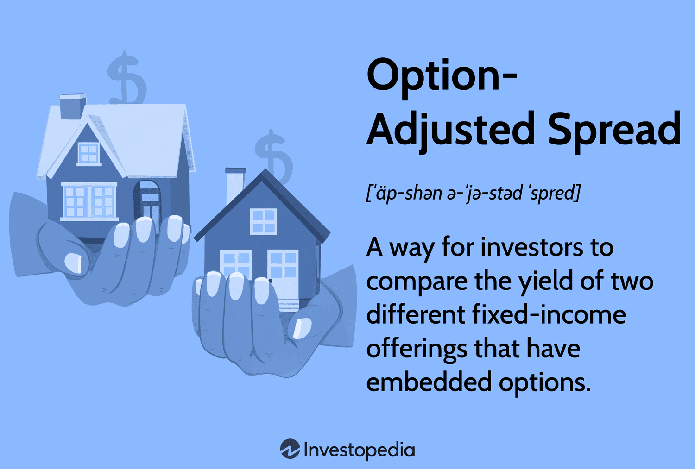

## Table of Contents

## What is the option-adjusted spread (OAS)?

The option-adjusted spread (OAS) is a way to measure the extra return an investor can expect from a bond that has embedded options, like the right to be called or put back to the issuer. It helps investors understand how much more they are being paid for taking on the risk of these options compared to a similar bond without options. OAS takes into account how likely it is that these options will be used and adjusts the bond's yield accordingly.

To calculate OAS, you start with the bond's yield and then subtract the yield of a similar risk-free bond, like a Treasury bond. Then, you adjust this spread to account for the value of the embedded options. This gives a clearer picture of the bond's value because it separates the extra yield that comes from the bond's credit risk from the yield that comes from the options. This makes it easier for investors to compare different bonds and make better investment decisions.

## How does the option-adjusted spread differ from the nominal spread?

The option-adjusted spread (OAS) and the nominal spread are both used to measure the extra return from a bond, but they do so in different ways. The nominal spread is the simplest way to measure this extra return. It's just the difference between the yield of a bond and the yield of a similar risk-free bond, like a Treasury bond. For example, if a bond yields 5% and a Treasury bond yields 3%, the nominal spread is 2%. This spread shows how much more return you get from the bond compared to a risk-free bond.

However, the nominal spread doesn't take into account any options that might be part of the bond, like the right for the issuer to call the bond back before it matures. That's where the option-adjusted spread comes in. The OAS adjusts the nominal spread to account for these options. It uses complex models to figure out how likely it is that these options will be used and what that means for the bond's value. So, the OAS gives a more accurate picture of the extra return you're getting, because it separates the return that comes from the bond's credit risk from the return that comes from the options.

## Why is the option-adjusted spread important in fixed income analysis?

The option-adjusted spread (OAS) is important in fixed income analysis because it helps investors understand the true value of a bond with embedded options. These options, like the right for the issuer to call the bond back before it matures, can change the bond's value. The OAS takes these options into account and adjusts the bond's yield to show how much extra return an investor can expect just from the bond's credit risk, not from the options. This makes it easier for investors to compare different bonds and see which ones offer the best value.

Using the OAS also helps investors make better decisions about which bonds to buy. By looking at the OAS, investors can see if a bond is priced fairly compared to other bonds with similar risks but no options. This is important because it helps investors avoid bonds that might look good at first but actually offer less return once the value of the options is considered. In short, the OAS gives a clearer and more accurate picture of a bond's value, which is crucial for making smart investment choices in the fixed income market.

## How is the option-adjusted spread calculated?

The option-adjusted spread (OAS) is calculated by first finding the nominal spread, which is the difference between the yield of a bond and the yield of a similar risk-free bond, like a Treasury bond. For example, if a bond yields 5% and a Treasury bond yields 3%, the nominal spread is 2%. This spread shows how much more return you get from the bond compared to a risk-free bond.

However, the nominal spread doesn't take into account any options that might be part of the bond, like the right for the issuer to call the bond back before it matures. To calculate the OAS, you need to adjust the nominal spread to account for these options. This is done using complex models that figure out how likely it is that these options will be used and what that means for the bond's value. The OAS then shows the extra return you're getting just from the bond's credit risk, not from the options.

## What are the key components needed to compute the option-adjusted spread?

To compute the option-adjusted spread (OAS), you need to start with the bond's yield and the yield of a similar risk-free bond, like a Treasury bond. The difference between these two yields is called the nominal spread. This nominal spread shows how much more return you get from the bond compared to a risk-free bond. But, if the bond has options, like the right for the issuer to call it back before it matures, the nominal spread doesn't tell the whole story.

To get the OAS, you need to adjust the nominal spread to account for these options. This involves using complex models that figure out how likely it is that these options will be used and what that means for the bond's value. These models look at things like interest rates, how long the bond will last, and how the bond's price might change. Once you've adjusted for the options, the OAS shows the extra return you're getting just from the bond's credit risk, not from the options. This gives a clearer picture of the bond's value.

## Can you explain the role of interest rate models in calculating OAS?

Interest rate models play a big role in calculating the option-adjusted spread (OAS). These models help figure out how interest rates might change over time. Since the value of a bond's options depends a lot on what interest rates do, these models are very important. They look at different possible paths that interest rates could take and figure out how likely each path is. This helps to see how the options in the bond might be used and what that means for the bond's value.

By using interest rate models, we can adjust the nominal spread of a bond to account for its options. The nominal spread is just the difference between the bond's yield and a risk-free bond's yield. But, if the bond has options like the right to be called back, the nominal spread isn't enough. The interest rate models help us see what might happen with the bond's options in different interest rate scenarios. This lets us find the OAS, which shows the extra return from the bond's credit risk, not from the options. So, interest rate models are key to getting a clear picture of a bond's true value.

## How does the option-adjusted spread account for embedded options in bonds?

The option-adjusted spread (OAS) helps investors figure out the true value of a bond that has options built into it. These options, like the right for the issuer to call the bond back before it matures, can change the bond's value. The OAS adjusts the bond's yield to account for these options. It does this by using complex models that look at different possible paths for interest rates and how likely each path is. This helps to see how the options might be used and what that means for the bond's value.

By adjusting the bond's yield for the options, the OAS shows the extra return an investor can expect just from the bond's credit risk, not from the options. This makes it easier for investors to compare different bonds and see which ones offer the best value. Without the OAS, a bond might look good because of its high yield, but the OAS helps investors see if that yield is really worth it once the value of the options is taken into account.

## What are the limitations of using the option-adjusted spread?

Using the option-adjusted spread (OAS) has some limits. One big problem is that it depends a lot on the models used to predict how interest rates and options might behave. If these models are wrong, the OAS won't be right either. This can make it hard for investors to trust the OAS when making decisions. Also, the OAS assumes that the market is perfect and everyone has the same information, which isn't true in real life. This can lead to mistakes in figuring out the true value of a bond.

Another limit is that the OAS can be hard to figure out for bonds with very complex options. The models used to calculate the OAS can get very complicated and might not always work well for every kind of bond. This means that the OAS might not be as helpful for some bonds as it is for others. Plus, the OAS doesn't take into account other risks like how easy it is to sell the bond or what might happen if the issuer can't pay back the bond. So, while the OAS is a useful tool, it's not perfect and should be used with other ways to check a bond's value.

## How can investors use the option-adjusted spread to compare different bonds?

Investors can use the option-adjusted spread (OAS) to compare different bonds by looking at the extra return they get from each bond after taking away the value of any options. The OAS shows how much more return an investor can expect just from the bond's credit risk, not from any options it might have. This makes it easier to see which bond offers a better deal. For example, if one bond has an OAS of 1% and another has an OAS of 1.5%, the second bond might be a better choice because it gives a higher return for the same level of risk.

However, it's important to remember that the OAS depends on models that predict how interest rates and options might behave. If these models are wrong, the OAS won't be right either. So, investors should use the OAS along with other ways to check a bond's value. By looking at the OAS and other information, investors can make smarter choices about which bonds to buy.

## What impact do changes in market volatility have on the option-adjusted spread?

Changes in market volatility can have a big effect on the option-adjusted spread (OAS). When the market gets more volatile, it means that interest rates and bond prices can change a lot more than usual. This makes it harder to predict what will happen with the options in a bond. Because of this, the models used to calculate the OAS need to take into account more possible scenarios, which can make the OAS go up. A higher OAS means that investors want more return to take on the extra risk that comes with higher volatility.

On the other hand, when the market is less volatile, it's easier to predict what will happen with the options in a bond. This makes the models used to calculate the OAS more reliable, and the OAS might go down. A lower OAS means that investors are okay with less extra return because the risk is lower. So, the OAS helps investors see how much more return they can expect from a bond when the market is more or less volatile.

## How does the option-adjusted spread help in assessing the risk of callable and putable bonds?

The option-adjusted spread (OAS) is really helpful for figuring out the risk of callable and putable bonds. Callable bonds can be taken back by the issuer before they mature, and putable bonds can be given back to the issuer by the investor. Both types of bonds have options that can change their value. The OAS takes these options into account and adjusts the bond's yield to show how much extra return an investor can expect just from the bond's credit risk, not from the options. This helps investors understand if the bond is a good deal or not.

By using the OAS, investors can compare callable and putable bonds to other bonds and see which ones offer the best value. If the OAS is high, it means the bond gives a good return for the risk, even after considering the options. But if the OAS is low, the bond might not be worth it because the options make it less valuable. So, the OAS helps investors make better choices by showing them the true risk and return of callable and putable bonds.

## What advanced techniques can be used to refine the calculation of the option-adjusted spread for complex securities?

To refine the calculation of the option-adjusted spread (OAS) for complex securities, one advanced technique is to use more detailed interest rate models. These models can look at a wider range of possible interest rate paths and how likely each path is. This helps to better predict how the options in the bond might be used and what that means for the bond's value. By using these more detailed models, the OAS can be more accurate and give investors a clearer picture of the bond's true value.

Another technique is to use Monte Carlo simulations. These simulations run many different scenarios to see how the bond's options might behave under different conditions. This can help to account for the complex ways that interest rates and bond prices can change. By running these simulations, the OAS can be adjusted to reflect the real risks and rewards of the bond more accurately. This makes it easier for investors to compare different bonds and make better investment decisions.

## References & Further Reading

1. "Fixed Income Analysis" by Frank J. Fabozzi  
   This comprehensive guide provides insight into the valuation and analysis of fixed-income securities. It covers the fundamental concepts of bond pricing and yield curves, factors affecting interest rates, and the tools necessary for evaluating investment opportunities in fixed-income markets.

2. "Quantitative Financial Analytics: The Path To Investment Profits" by Edward E. Williams and Michael A. Young  
   This book offers a detailed look at quantitative methods used in financial analysis and investment. It bridges the gap between theoretical approaches and practical applications, showcasing how quantitative techniques can drive profitability in investment strategies.

3. "The Handbook of Fixed Income Securities" by Frank J. Fabozzi  
   Renowned as a definitive resource, this handbook provides extensive coverage of fixed income products, trading strategies, and risk management techniques. It is an essential reference for professionals seeking a deeper understanding of the intricate fixed-income market.

4. "Inside the Yield Book: The Classic That Created the Science of Bond Analysis" by Martin L. Leibowitz and Sidney Homer  
   This classic text revolutionized bond analysis by introducing scientific approaches to yield and duration. The book explores the analytic use of the yield book in assessing bond analytics and offers a historical perspective on the development of strategies for bond portfolio management.

5. "Options, Futures, and Other Derivatives" by John C. Hull  
   A key resource for understanding derivatives markets, this book covers a wide range of derivative instruments including options, futures, swaps, and risk management techniques. It provides a solid foundation for understanding the pricing and application of derivatives in financial markets, crucial for managing complex investment portfolios.

