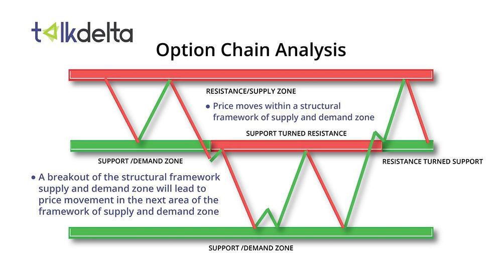

In recent years, there has been an increasing interest in options trading and algorithmic strategies within financial markets. This heightened curiosity stems from the ability of these strategies to enhance trading efficiency, improve market accessibility, and offer opportunities for significant profit generation. Options trading, a cornerstone of financial derivatives, allows traders to hedge against risks, speculate on future price movements, and optimize their investment strategies through leveraging. By providing the right to buy or sell an underlying asset at a predetermined price before the expiration date, options offer flexibility and strategic depth in financial decision-making processes.

One of the key tools leveraged by traders in developing robust trading strategies is the option chain. An option chain is a comprehensive listing of all available options contracts for a particular security, detailing essential information such as strike prices, expiration dates, and pricing metrics. Utilizing option chains enables traders to understand market sentiment, gauge the potential profitability of trades, and assess the implied volatility of securities. These insights are invaluable for executing informed and strategic trades that align with an investor’s risk tolerance and market outlook.



Understanding financial markets and the intricacies of options analysis is critical for any trader looking to employ algorithmic trading strategies effectively. Algorithmic trading, with its inherent benefits of speed, precision, and automation, integrates data analysis, technology, and financial acumen to execute trades based on predefined criteria. In options trading, algorithms can process vast datasets from option chains, identify patterns, and execute trades with minimal human intervention, thereby enhancing trading efficiency and reducing biases.

As the financial landscape continues to evolve, mastering the interplay between options trading and algorithmic strategies becomes crucial for traders aiming to capitalize on market opportunities. By grasping the fundamentals of option chains and embracing technology through algo-trading, investors can significantly enhance their trading performance while navigating the complexities of modern financial markets.

## Table of Contents

## Understanding Financial Markets and Options

Financial markets constitute a complex network of institutions, mechanisms, and instruments designed to facilitate the buying and selling of financial assets. These markets are integral to the operation of economies, providing a platform for price discovery, resource allocation, and risk management (Mishkin & Eakins, 2018). Options, as derivative instruments within these markets, play a pivotal role by offering traders and investors versatile tools for speculation, hedging, and leveraging.

Options are contracts that give the holder the right, but not the obligation, to buy or sell an underlying asset at a predetermined price, within a certain period. This leads to two primary types of options: call options and put options (Hull, 2017).

1. **Call Options**: A call option grants the holder the right to purchase the underlying asset at the specified strike price before the option's expiration date. Traders typically purchase call options when they anticipate an increase in the price of the underlying asset. 

2. **Put Options**: Conversely, a put option gives the holder the right to sell the underlying asset at the strike price before the expiration date. Investors use put options when they forecast a decline in the asset's value.

Instead of directly investing in the underlying asset, traders use options to speculate on price movements. This speculation can lead to higher potential returns relative to the initial investment, due to the leverage effect inherent in options trading. Leverage permits traders to gain significant exposure to the price movements of the underlying asset without committing the full capital typically required for outright ownership.

Furthermore, options are indispensable for hedging purposes. Investors or portfolio managers might use options to protect existing positions against adverse market movements. For instance, purchasing put options can serve as a form of insurance against declines in stock prices, thereby mitigating downside risk.

Options also allow for sophisticated strategies that involve various combinations of call and put options, often across different strike prices and expiration dates. These strategies can offer tailored risk-return profiles, catering to the specific market outlook or risk appetite of the trader. Examples include spreads, straddles, and collars, among others.

Mathematically, the value (premium) of an option can be conceptualized using models like the Black-Scholes formula, which factors in variables such as the current price of the underlying asset (S), the strike price (K), time until expiration (T), risk-free [interest rate](/wiki/interest-rate-trading-strategies) (r), and the [volatility](/wiki/volatility-trading-strategies) of the underlying asset ($\sigma$) (Black & Scholes, 1973). The formula for a call option is expressed as follows:

$$
C = S \cdot N(d_1) - K \cdot e^{-rT} \cdot N(d_2)
$$

where:
$$
d_1 = \frac{\ln(S/K) + (r + \sigma^2/2)T}{\sigma\sqrt{T}}
$$
$$
d_2 = d_1 - \sigma\sqrt{T}
$$

and $N(\cdot)$ represents the cumulative distribution function of the standard normal distribution.

Understanding these basic concepts of options is crucial for anyone engaging with financial markets, as they provide powerful mechanisms for managing financial exposures and pursuing investment opportunities.

## The Role of an Option Chain in Trading

An options chain is a comprehensive listing of all the available options contracts for a particular security, such as a stock or an index. This chain provides traders with essential data points that facilitate informed decision-making. The components of an options chain help traders assess both the current market conditions and the sentiments driving those conditions. 

Key features of an options chain include strike prices, expiration dates, bid-ask prices, and implied volatility. Each options contract within the chain specifies a strike price, which is the predetermined price at which the option can be exercised. Expiration dates indicate the timeframe within which the option must be exercised, typically categorized into weekly, monthly, or quarterly durations. Bid-ask prices reflect the market's supply and demand dynamics, offering insight into the [liquidity](/wiki/liquidity-risk-premium) of the options. Lastly, implied volatility is a crucial measure derived from the price of the options, representing the market's forecast of the security's volatility over the life of the contract.

The option chain is a valuable tool for traders aiming to analyze market sentiment and identify potential trading opportunities. By examining the distribution of open interest across different strike prices and expiration dates, traders can infer the market's expectations of future price movements. For example, a high concentration of open interest at a specific strike price could suggest a significant level of support or resistance. Additionally, changes in implied volatility, extracted from the chain, offer insights into how the market's perception of risk is evolving. This information aids traders in crafting strategies that align with current market expectations and volatility forecasts.

Utilizing options chains allows traders to gauge sentiment more precisely and to identify mispricings or [arbitrage](/wiki/arbitrage) opportunities. With the detailed data provided, they can seamlessly incorporate this information into algorithmic models and trading strategies, enhancing their capability to execute trades more efficiently and effectively in line with market movements.

## Analyzing Options Chains for Trading Strategies

Options chain data is an invaluable resource for developing effective trading strategies. An options chain provides detailed information about available options contracts on a specific underlying asset, presenting an organized view of call and put options across various strike prices and expiration dates. This data serves as the foundation for crafting sophisticated trading strategies that can capitalize on market movements and investor sentiment.

**Liquidity, Implied Volatility, and Open Interest**

Three critical components of options chains that traders need to evaluate are liquidity, implied volatility, and open interest. 

1. **Liquidity**: The liquidity of an option refers to how easily it can be bought or sold without affecting its price. High liquidity often translates to tighter bid-ask spreads, reducing the cost for traders to enter and exit positions. Trading highly liquid options minimizes slippage and enhances execution speed, crucial for implementing responsive strategies.

2. **Implied Volatility (IV)**: Implied volatility represents the market's forecast of the underlying asset's volatility over the life of the option. It is a key indicator for identifying potentially profitable trading opportunities. High implied volatility usually signals increased market uncertainty, which can expand option premiums. Traders often look for disparities between current IV and historical volatility to identify under or overvalued options.

3. **Open Interest**: Open interest indicates the total number of outstanding contracts that have not been settled. High open interest typically signifies active interest and participation in a particular option, which can indicate strong support or resistance levels. Tracking changes in open interest helps traders gauge market sentiment and potential price movements.

**Technology's Role in Analyzing Options Chains**

With the expansive data provided by options chains, technology facilitates the analysis and decision-making process, enhancing the effectiveness of trading strategies. Advanced software tools and programming languages like Python provide traders with the ability to automate the extraction, calculation, and analysis of options data.

*Python Example: Implied Volatility Calculation*

```python
from scipy.optimize import brentq
from math import exp, sqrt, log
from scipy.stats import norm

def black_scholes_call(S, K, T, r, sigma):
    d1 = (log(S / K) + (r + 0.5 * sigma ** 2) * T) / (sigma * sqrt(T))
    d2 = d1 - sigma * sqrt(T)
    return S * norm.cdf(d1) - K * exp(-r * T) * norm.cdf(d2)

def implied_volatility_call(C, S, K, T, r):
    return brentq(lambda sigma: black_scholes_call(S, K, T, r, sigma) - C, 1e-5, 1)

# Example usage
call_price = 10
stock_price = 100
strike_price = 105
time_to_expiry = 1
risk_free_rate = 0.05

iv = implied_volatility_call(call_price, stock_price, strike_price, time_to_expiry, risk_free_rate)
print(f"Implied Volatility: {iv:.2%}")
```

Technology not only aids in calculating key metrics such as implied volatility but also supports [backtesting](/wiki/backtesting) and implementing trading algorithms. By modeling historical data, traders can simulate the performance of their strategies under varied market conditions, allowing for the refinement and optimization of their trading approach. Furthermore, real-time data feeds and algorithms enable automatic adjustments to trading strategies based on market changes, improving response times and decision-making accuracy.

Incorporating options chain analysis into trading strategies enables traders to leverage sophisticated insights for better market engagement. Understanding how to evaluate liquidity, implied volatility, and open interest, combined with technological tools, provides a formidable foundation for driving effective and informed trading strategies.

## Algo Trading: Enhancing Options Trading

Algorithmic trading, often referred to as algo trading, utilizes computer algorithms to execute trades based on pre-established criteria without human intervention. In options trading, algorithms can analyze multifaceted market data efficiently, providing traders with rapid, precise, and automated strategies to capitalize on opportunities and mitigate risks.

### Benefits of Algorithmic Strategies in Options Trading

**Speed and Efficiency:** One of the most significant advantages of algorithmic trading is the speed with which trades are executed. In financial markets, where conditions can shift rapidly, an algorithm's ability to analyze vast amounts of market data and execute trades in milliseconds is invaluable. This rapid execution can enhance profitability by securing optimal entry and exit points in a volatile market.

**Precision and Objectivity:** Algorithms operate on clearly defined rules, eliminating human emotion and bias from trading decisions. This objectivity ensures consistent execution of strategies, reducing errors that might occur due to psychological factors such as fear or greed. Precision in executing trades is especially crucial in options trading, where the value of contracts can be highly sensitive to market movements.

**Automation and Scalability:** Algorithmic trading allows for the automation of complex strategies, freeing traders to focus on strategy development and analysis rather than manual execution. This automation enables the handling of multiple trades and contracts simultaneously, increasing a trader's ability to scale operations. In options trading, automation can manage portfolios with varying expiry dates and strike prices, optimizing returns.

### Managing Complex Trading Strategies and Risks

Algorithms are equipped to handle multifaceted trading strategies that may be difficult to manage manually. For instance, a common options strategy involves the use of spreads, which requires simultaneous buying and selling of different options contracts. Algorithms can efficiently manage these by instantly calculating the optimal spread positions based on real-time data.

Moreover, algorithms can integrate risk management protocols directly into their operations. Techniques like stop-loss orders can be programmed to minimize losses automatically when market conditions deviate unfavorably. Additionally, dynamic position sizing algorithms adjust the [volume](/wiki/volume-trading-strategy) of trades based on volatility measures, such as the Greek metrics (Delta, Gamma, Theta, Vega), to maintain a balanced risk-reward profile.

**Example of an Algo Trading Strategy:**
```python
import numpy as np

def calculate_position_size(account_size, risk_percentage, trade_risk):
    """
    Calculate the position size based on the account size, 
    risk tolerance and the risk involved in the trade.
    """
    return (account_size * risk_percentage) / trade_risk

# Example parameters
account_size = 100000  # Account size in dollars
risk_percentage = 0.01  # Willing to risk 1% of account
trade_risk = 2  # Risk of the trade in dollars per option

position_size = calculate_position_size(account_size, risk_percentage, trade_risk)
print(f"Position Size: {position_size} options contracts")
```

In this Python snippet, a dynamic position sizing function is defined, illustrating how algorithms can customize trade sizes based on account size and risk preferences, ensuring trades remain proportionate to the trader's overall risk strategy.

Algorithmic trading is thus not only augmenting options trading by improving efficiency and precision but is also integral to managing sophisticated trading strategies and intrinsic risks systematically. By leveraging algorithms, traders can respond adeptly to market developments, enhancing their strategic edge.

## Building an Option Chain Based Algo Trading Strategy

Building an option chain-based [algorithmic trading](/wiki/algorithmic-trading) strategy involves a systematic approach to harness financial data for informed decision-making. Here's a step-by-step guide:

### 1. Data Analysis
The first step in developing an algorithmic strategy is comprehensive data analysis of the options chain. This involves compiling data on strike prices, expiration dates, bid-ask spreads, open interest, and implied volatility. Analyzing this data provides insights into market trends and potential entry and [exit](/wiki/exit-strategy) points.

#### Tools and Methods
- **Python Libraries**: Utilize libraries like Pandas for data manipulation and NumPy for numerical computing.
- **Data Sources**: Integrate APIs from financial data providers to ensure real-time and historical data availability.

```python
import pandas as pd
import numpy as np

# Example: fetching data (pseudo-code, replace with actual API call)
data = fetch_option_chain_data('AAPL')  
df = pd.DataFrame(data)
```

### 2. Strategy Development
Once the data is analyzed, the next step is to develop a trading strategy. A robust strategy defines clear criteria for entering and exiting trades based on insights drawn from option chain data.

#### Strategy Components
- **Signal Generation**: Create rules based on indicators like changes in implied volatility or open interest spikes.
- **Risk Management**: Develop guidelines for position sizing and stop-loss placements to manage downside risk.

### 3. Backtesting
Backtesting involves applying the trading strategy to historical data to evaluate its performance. It helps in understanding the strategy's potential risks and rewards.

#### Considerations for Effective Backtesting
- **Data Quality**: Ensure the use of clean and accurate historical data.
- **Transaction Costs**: Factor in commissions and slippage to assess realistic performance.

```python
from backtesting import Backtest, Strategy

class OptionStrategy(Strategy):
    def init(self):
        # Initialize indicators
        pass

    def next(self):
        # Define trading logic
        pass

bt = Backtest(df, OptionStrategy, commission=0.002)
stats = bt.run()
bt.plot()
```

### 4. Real-Time Execution
Implementing the strategy in real-time requires a robust trading infrastructure. This includes low-latency execution systems and reliable connectivity to trading platforms.

#### Key Execution Methods
- **Algorithm Tuning**: Continuously refine the algorithm based on market conditions and performance metrics.
- **Automation**: Automate order placement and monitoring to capitalize on market opportunities swiftly.

### Key Considerations for a Robust Strategy
Creating a flexible and durable algorithmic trading strategy necessitates several considerations:
- **Adaptability**: The ability to adjust strategies swiftly as market conditions change.
- **Scalability**: Ensure that the strategy can handle increased trade volumes efficiently.
- **Risk Controls**: Implement dynamic risk management tactics to guard against unforeseen market events.

By following these steps, traders can construct a systematic and reliable option chain-based algorithmic trading strategy that harnesses data-driven insights for strategic advantage. Continuous learning and adaptation are essential to maintaining effectiveness in ever-evolving markets.

## Risk Management in Options Algo Trading

Risk management is a crucial aspect of options trading, particularly when integrated with algorithmic strategies. The complexity of options trading, combined with the speed and precision of algorithms, demands robust risk management practices to protect capital and optimize returns.

One fundamental risk management strategy in options trading is the use of stop-loss orders. Stop-loss orders automatically sell or buy an option when its price reaches a predetermined level, limiting potential losses. In algorithmic trading, stop-loss levels can be dynamically adjusted based on real-time data, allowing for more responsive risk management. For instance, a Python script could be employed to adjust stop-loss orders by continuously monitoring market volatility:

```python
def calculate_stop_loss(current_price, volatility, factor=1.5):
    return current_price - (volatility * factor)

current_price = 150
volatility = 5  # this could be a standard deviation calculation
stop_loss = calculate_stop_loss(current_price, volatility)
```

Another critical component is dynamic position sizing, which involves adjusting the size of the trading position based on the perceived level of risk. Dynamic position sizing can be implemented algorithmically by evaluating the historical volatility of the asset and adjusting the investment proportionately. The following Python snippet illustrates a basic dynamic position sizing model:

```python
def calculate_position_size(account_balance, risk_per_trade, stop_loss_distance):
    return (account_balance * risk_per_trade) / stop_loss_distance

account_balance = 10000
risk_per_trade = 0.02  # 2% of account balance
stop_loss_distance = 10
position_size = calculate_position_size(account_balance, risk_per_trade, stop_loss_distance)
```

Hedging is another effective method to manage risk in options trading. By creating positions that offset potential losses from other investments, hedging can mitigate downside risk. Algorithms can automate the hedging process by swiftly identifying correlated assets and recalibrating positions in response to market fluctuations.

Adaptive risk management requires continuous monitoring and adjustments. Markets are dynamic, and a strategy that works in one context may not perform well in another. Regular performance reviews and strategy adjustments are essential. Leveraging [machine learning](/wiki/machine-learning) models to predict potential market shifts can enhance this process, enabling traders to make informed adjustments. 

In conclusion, successful options algorithmic trading hinges on robust risk management strategies. Employing tools like stop-loss orders, dynamic position sizing, and algorithmic hedging helps manage risk effectively. Continuous monitoring and adaptive strategies ensure that risk management remains responsive to the ever-changing market landscape.

## Conclusion

The exploration of financial markets through the lens of options analysis and algorithmic trading reveals a landscape rich with potential for traders aiming to enhance their performance. Options, with their inherent flexibility and strategic depth, serve as essential instruments for hedging, speculating, and leveraging market movements. Utilizing the comprehensive data offered by option chains, traders can gain critical insights into market sentiment and identify viable trading opportunities. The effective analysis of option chains includes examining factors such as liquidity, implied volatility, and open interest, each serving as a cornerstone for informed decision-making.

Incorporating algorithmic strategies into options trading exponentially increases the capabilities of traders, offering precision, speed, and the ability to execute complex trading plans with minimal human intervention. The integration of technology not only simplifies the analysis of voluminous options chain data but also enhances risk management practices through automated processes. A structured approach to developing an algorithmic strategy, from initial data analysis to real-time execution, equips traders with the tools needed to adapt swiftly to market changes and mitigate risks.

It is essential for traders to continually engage with the evolving paradigms of options and algorithmic trading. This ongoing learning process ensures that traders remain agile and responsive to new market conditions and technological advancements. By leveraging the strategies discussed, traders can improve their trading performance and maintain a competitive edge in the ever-changing financial landscape.

## References & Further Reading

[1]: Hull, J. C. (2017). ["Options, Futures, and Other Derivatives."](https://www.semanticscholar.org/paper/Options%2C-Futures%2C-and-Other-Derivatives-Hull/89bdee500c8623864fc9eb7a471546aa713acc44) Pearson.

[2]: Black, F., & Scholes, M. (1973). ["The Pricing of Options and Corporate Liabilities."](https://www.cs.princeton.edu/courses/archive/fall09/cos323/papers/black_scholes73.pdf) Journal of Political Economy, 81(3), 637-654.

[3]: Mishkin, F. S., & Eakins, S. G. (2018). ["Financial Markets and Institutions."](https://books.google.com/books/about/Financial_Markets_and_Institutions_Globa.html?id=PPJFDwAAQBAJ) Pearson.

[4]: Narang, R. K. (2013). ["Inside the Black Box: A Simple Guide to Quantitative and High Frequency Trading."](https://onlinelibrary.wiley.com/doi/book/10.1002/9781118662717) Wiley.

[5]: Chan, E. (2008). ["Quantitative Trading: How to Build Your Own Algorithmic Trading Business."](https://github.com/ftvision/quant_trading_echan_book) Wiley.