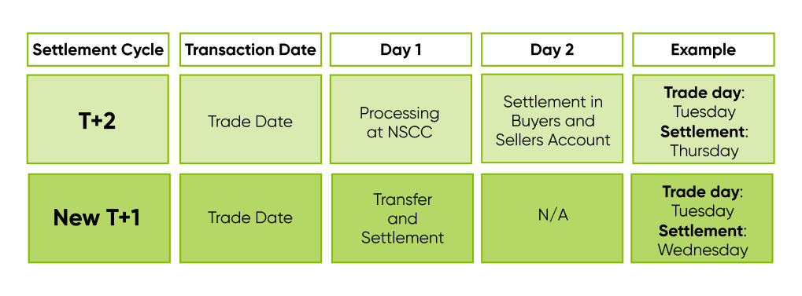

## Table of Contents

## What is an option cycle?

An option cycle is a schedule that shows when different stock options expire. It helps traders know when they need to act on their options. There are three main cycles: January, April, July, and October (JAJO); February, May, August, and November (FMAN); and March, June, September, and December (MJSD). Each stock is assigned to one of these cycles, which tells you in which months its options will expire.

For example, if a stock is on the JAJO cycle, its options will expire in January, April, July, and October. This cycle helps traders plan their investments better. Knowing the option cycle for a stock can help you decide when to buy or sell options, making it an important part of trading strategies.

## How do option cycles affect trading strategies?

Option cycles can really change how traders make their plans. Knowing when options will expire helps traders decide the best times to buy or sell. If a trader knows that a stock's options will expire soon, they might choose to buy those options to take advantage of any price changes before the expiration date. On the other hand, if the expiration is far away, a trader might hold onto the options longer, hoping for bigger price movements.

This knowledge also helps traders manage risk. For example, if a trader sees that an option is about to expire and the stock price isn't moving in their favor, they might decide to sell the option to cut their losses. Or, if they think the stock will move in their favor just before the expiration, they might keep the option. By understanding the option cycle, traders can better time their moves and make smarter decisions about when to act.

## What are the different types of option cycles?

Option cycles are schedules that tell you when options for a stock will expire. There are three main types of option cycles: JAJO, FMAN, and MJSD. JAJO stands for January, April, July, and October. If a stock is on the JAJO cycle, its options will expire in those months. FMAN stands for February, May, August, and November. Stocks on the FMAN cycle have options that expire in those months. MJSD stands for March, June, September, and December. Stocks on the MJSD cycle have options expiring in those months.

Knowing which cycle a stock is on helps traders plan their moves. For example, if a trader knows a stock is on the JAJO cycle, they can plan to buy or sell options around those months. This can help them take advantage of price changes before the options expire. Understanding the option cycle can make a big difference in how traders manage their investments and make decisions.

## Can you explain the monthly option cycle?

The monthly option cycle is a bit different from the regular option cycles like JAJO, FMAN, and MJSD. Instead of expiring only in certain months, options in the monthly cycle expire every month. This means that if a stock has monthly options, you can buy or sell options that will expire at the end of any month, not just specific ones. This can be really helpful for traders who want more flexibility and want to take advantage of short-term movements in the stock price.

Having options that expire every month can change how traders plan their strategies. If a trader thinks a stock will move a lot in the next month, they can buy a monthly option and try to make money from that move. It also means traders can adjust their positions more often, buying new options every month if they want to. This can help them react quicker to changes in the market and manage their risks better.

## What is a quarterly option cycle and how does it work?

A quarterly option cycle is a schedule that tells you when options for a stock will expire, but only in certain months of the year. There are three main quarterly cycles: JAJO, FMAN, and MJSD. JAJO stands for January, April, July, and October. FMAN stands for February, May, August, and November. MJSD stands for March, June, September, and December. If a stock follows one of these cycles, its options will only expire in those specific months.

Knowing the quarterly cycle for a stock can help traders plan their moves better. For example, if a stock is on the JAJO cycle, a trader might buy options in January and plan to sell them before they expire in April. This helps traders take advantage of price changes that happen around those times. Understanding the quarterly cycle can make a big difference in how traders manage their investments and make decisions about when to buy or sell options.

## How do weekly option cycles differ from others?

Weekly option cycles are different from other cycles because their options expire every week, instead of every month or every quarter. If a stock has weekly options, you can buy or sell options that will expire at the end of any week. This gives traders more chances to make moves and take advantage of short-term changes in the stock price.

Having options that expire every week can change how traders plan their strategies. Traders can buy weekly options if they think a stock will move a lot in just a few days. This lets them try to make money from quick price changes. It also means traders can adjust their positions more often, buying new options every week if they want to. This can help them react faster to what's happening in the market and manage their risks better.

## What are the key dates to know in an option cycle?

In an option cycle, there are a few key dates that traders need to know. The first important date is the expiration date. This is when the option contract ends, and you need to decide if you want to use it or let it go. If you don't do anything by this date, the option will expire and you won't be able to use it anymore. Another key date is the last trading day, which is usually the day before the expiration date. This is your last chance to buy or sell the option before it expires.

Another important date to know is the ex-dividend date. If you own a stock option and the stock pays a dividend, you need to own the option before this date to get the dividend. If you buy the option on or after the ex-dividend date, you won't get the dividend. Knowing these dates helps traders plan their moves and make smart decisions about when to buy or sell options.

## How can understanding option cycles improve investment decisions?

Understanding option cycles can really help traders make better investment choices. By knowing when options will expire, traders can plan their moves better. For example, if a stock's options are about to expire, a trader might decide to buy those options to take advantage of any price changes before they expire. On the other hand, if the expiration is far away, a trader might hold onto the options longer, hoping for bigger price movements. This knowledge helps traders pick the right time to buy or sell, which can make their investments more successful.

Also, knowing the option cycle helps traders manage risk. If a trader sees that an option is about to expire and the stock price isn't moving in their favor, they might sell the option to cut their losses. Or, if they think the stock will move in their favor just before the expiration, they might keep the option. By understanding the option cycle, traders can time their moves better and make smarter decisions about when to act. This can lead to better investment outcomes and help traders feel more in control of their investments.

## What are some common mistakes traders make regarding option cycles?

One common mistake traders make is not paying attention to the option cycle of the stocks they're trading. They might buy an option without knowing when it will expire. This can lead to big surprises if the option expires sooner than they thought. Traders can lose money if they miss the chance to sell the option before it expires. Knowing the option cycle helps traders avoid these surprises and plan their moves better.

Another mistake is not understanding how the option cycle affects their trading strategy. Some traders might buy options that expire too soon or too late for what they want to do. If they want to make money from a short-term price change, they should buy options with a closer expiration date. But if they're looking at a longer-term move, they should choose options that expire later. By not matching the option cycle to their strategy, traders can miss out on good opportunities or hold onto options that don't work for their plans.

## How do option cycles impact the pricing of options?

Option cycles can affect how much an option costs. When an option is about to expire, its price can change a lot. If the stock price is close to the option's strike price, the option might become more expensive because there's a bigger chance it will be used before it expires. On the other hand, if the stock price is far from the strike price, the option might get cheaper because it's less likely to be used. Traders need to think about how close the expiration date is when they decide if an option is a good buy.

Also, the time until the option expires, called time value, can make the option more or less expensive. Options that expire further in the future usually cost more because they give the trader more time for the stock price to move in their favor. But as the expiration date gets closer, the time value goes down, which can make the option cheaper. Knowing how option cycles work helps traders understand why an option costs what it does and make better choices about when to buy or sell.

## Can you provide examples of how option cycles have influenced market events?

Option cycles can have a big impact on market events. For example, when a lot of options are about to expire, it can cause more trading in the market. This is because traders want to use their options before they expire or sell them to someone else. If many options are expiring at the same time, it can make the stock price move a lot. This happened in 2021 with GameStop. Many options were expiring, and this led to a lot of buying and selling, which made the stock price go up and down a lot.

Another example is how option cycles can affect the market right before earnings announcements. If a company is about to report its earnings and a lot of options are expiring soon, traders might buy more options hoping to make money from the price changes after the earnings news. This can make the stock price move even more than usual. In 2018, before Apple's earnings report, there was a lot of trading in options that were about to expire. This added to the excitement and the big price moves in Apple's stock after the earnings were announced.

## What advanced strategies can be employed using knowledge of option cycles?

Knowing about option cycles can help traders use advanced strategies like "calendar spreads." This is when a trader buys an option that expires in one month and sells an option that expires sooner, both on the same stock. The idea is to make money from the difference in how much the options cost over time. If the stock price stays the same or moves a little, the option that expires sooner will lose value faster than the one that expires later. This can help the trader make money, even if the stock price doesn't move a lot.

Another advanced strategy is "rolling options." This means a trader can move their option to a later expiration date if they think the stock will move in their favor but needs more time. For example, if a trader has an option that's about to expire and the stock price hasn't moved as expected, they can sell that option and buy a new one with a later expiration date. This gives them more time for the stock price to move the way they want. Understanding option cycles helps traders know when to roll their options and make the most of their investments.

## References & Further Reading

[1]: Hull, J. C. (2018). ["Options, Futures, and Other Derivatives."](https://www.semanticscholar.org/paper/Options%2C-Futures%2C-and-Other-Derivatives-Hull/89bdee500c8623864fc9eb7a471546aa713acc44) Pearson.

[2]: Wilmott, P. (2006). ["Paul Wilmott Introduces Quantitative Finance."](https://www.amazon.com/Paul-Wilmott-Quantitative-Finance-Set/dp/0470018704) Wiley.

[3]: Carver, R. (2015). ["Systematic Trading: A Unique New Method for Designing Trading and Investing Systems."](https://www.amazon.com/Systematic-Trading-designing-trading-investing/dp/0857194453) Harriman House.

[4]: Aldridge, I. (2013). ["High-Frequency Trading: A Practical Guide to Algorithmic Strategies and Trading Systems."](https://www.amazon.com/High-Frequency-Trading-Practical-Algorithmic-Strategies/dp/1118343506) Wiley.

[5]: Kissell, R. (2014). ["The Science of Algorithmic Trading and Portfolio Management."](https://www.sciencedirect.com/book/9780124016897/the-science-of-algorithmic-trading-and-portfolio-management) Academic Press.