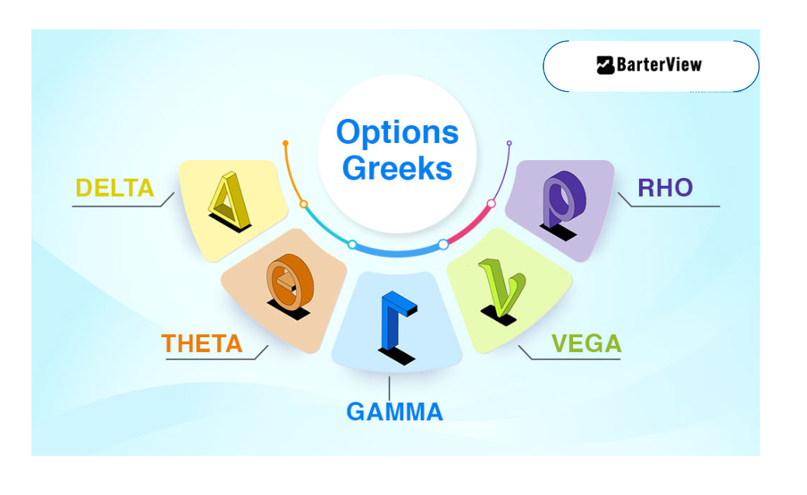

## Table of Contents

## What are Option Greeks and why are they important for options trading?

Option Greeks are tools that help traders understand how different factors affect the price of an option. They are called "Greeks" because they are usually represented by Greek letters. The main Greeks are Delta, Gamma, Theta, Vega, and Rho. Delta tells you how much the option's price will change when the stock price changes. Gamma shows how Delta changes when the stock price moves. Theta measures how much the option's value decreases as time passes. Vega shows how the option's price changes with changes in the market's expectation of future volatility. Rho tells you how the option's price will change with changes in interest rates.

These Greeks are important for options trading because they help traders make better decisions. By understanding how sensitive an option is to changes in the stock price, time, volatility, and interest rates, traders can predict how the option's value might change. This helps them choose the right options to buy or sell and manage their risk better. For example, if a trader knows that an option has a high Theta, they might decide to sell it quickly before it loses too much value due to time decay. Similarly, if an option has a high Vega, a trader might buy it if they expect the market to become more volatile. Overall, using the Greeks can lead to more informed and potentially more profitable trading strategies.

## Can you explain what Delta represents in options?

Delta is a number that shows how much an option's price will change when the price of the stock it's based on changes. For example, if a call option has a Delta of 0.5, that means if the stock price goes up by $1, the price of the option will go up by about $0.50. If the stock price goes down by $1, the option price will go down by about $0.50 too. Delta is always between 0 and 1 for call options and between 0 and -1 for put options.

Delta also gives you an idea of the chance that the option will end up being worth something at the end of its life. If a call option has a Delta close to 1, it means there's a high chance the option will be worth something when it expires. If the Delta is close to 0, the chance is low. This can help traders decide which options to buy or sell based on how likely they think it is that the stock price will move in their favor.

## How does Gamma affect the Delta of an option?

Gamma tells you how much the Delta of an option changes when the stock price changes. Think of Delta as a speedometer that shows how fast the option's price is moving with the stock price. Gamma is like the [accelerator](/wiki/accelerator) that makes the speedometer (Delta) change faster or slower. If an option has a high Gamma, the Delta will change a lot even with small moves in the stock price. If the Gamma is low, the Delta won't change as much.

This is important because it helps traders know how sensitive their options are to changes in the stock price. For example, if you own an option with a high Gamma, you need to be ready for big changes in the option's price, even if the stock price only moves a little. Traders use Gamma to manage their risk and decide when to buy or sell options, especially around big events that might make the stock price jump around a lot.

## What is Theta and how does it impact the value of an option over time?

Theta is a number that shows how much an option loses value as time goes by. Imagine you have a ticket to a concert that's happening next month. The closer it gets to the concert date, the less valuable that ticket becomes because there's less time left to use it. In options trading, Theta works the same way. If an option has a Theta of -0.05, it means the option's price will go down by about 5 cents every day, all else being equal.

This is important for traders because it helps them understand how quickly their options are losing value. If you're holding an option with a high Theta, you need to be careful because it's losing value fast. Traders might decide to sell options with high Theta before they lose too much value, or they might choose options with lower Theta if they want to hold them for a longer time. Knowing about Theta helps traders make better choices about when to buy or sell options.

## How does Vega measure the sensitivity of an option's price to changes in volatility?

Vega measures how much an option's price will change when the expected [volatility](/wiki/volatility-trading-strategies) of the stock changes. Imagine you're planning a picnic and the weather forecast keeps changing. If the forecast suddenly says there's a bigger chance of rain, you might be more worried about your picnic, and that worry is like Vega. If an option has a Vega of 0.10, it means the option's price will go up by about 10 cents if the expected volatility of the stock goes up by 1%.

This is important for traders because it helps them understand how sensitive their options are to changes in the market's expectations. If a trader thinks the market is going to become more unpredictable, they might buy options with a high Vega to take advantage of that. On the other hand, if they think the market is going to calm down, they might sell those options before the price drops because of lower expected volatility. Knowing about Vega helps traders make smarter choices about which options to buy or sell based on how much they think the market will move around.

## What is the relationship between Delta, Gamma, Theta, and Vega in managing an options portfolio?

When managing an options portfolio, understanding the relationship between Delta, Gamma, Theta, and Vega is key. Delta tells you how much the option's price will change with the stock price. If you have a lot of options with high Delta, your portfolio will be very sensitive to stock price movements. Gamma shows how fast Delta changes, so if your options have high Gamma, you need to be ready for quick changes in how sensitive your portfolio is to the stock price. This can be useful if you expect big moves in the stock price but can also make things more risky if you're not prepared.

Theta and Vega also play big roles. Theta tells you how much your options lose value as time goes by. If your portfolio has a lot of options with high Theta, you need to watch out because they're losing value fast. This might make you want to sell them sooner rather than later. Vega shows how much your options are affected by changes in how much the market expects the stock to move around. If you think the market is going to get more unpredictable, you might want options with high Vega to take advantage of that. But if you think things will calm down, you might want to sell those options before they lose value. By keeping an eye on all these Greeks, you can make better choices about which options to buy or sell and how to manage your portfolio's risk.

## How can a trader use Delta to hedge their options position?

A trader can use Delta to hedge their options position by balancing the sensitivity of their options to the stock price. If a trader has a portfolio of options with a total Delta of 100, that means the portfolio will move like they own 100 shares of the stock. To hedge this, they can sell 100 shares of the stock. This way, if the stock price goes up, the gain in the options will be offset by the loss in the stock, and if the stock price goes down, the loss in the options will be offset by the gain in the stock.

This strategy helps the trader reduce risk by making their portfolio less sensitive to changes in the stock price. By keeping the total Delta of their portfolio close to zero, the trader can protect themselves from big swings in the stock price. It's like putting on a seatbelt in a car; it won't stop the car from moving, but it can keep you safer if something unexpected happens.

## What strategies can be employed to manage the effects of Theta decay?

To manage the effects of Theta decay, traders often use strategies that take advantage of the time value of options. One common approach is to sell options, especially those that are close to their expiration date. When you sell an option, you get paid the premium upfront, and as time passes, the option loses value due to Theta decay. This works in your favor because the option you sold becomes less valuable, and if it expires worthless, you keep the entire premium. This strategy is called selling Theta, and it's often used by traders who think the stock price won't move much before the option expires.

Another strategy is to buy options with longer expiration dates. Options that have more time until they expire have lower Theta values, meaning they lose value more slowly. This gives the stock more time to move in the direction you want, increasing the chances that your option will be worth something at expiration. Traders might also use a strategy called a calendar spread, where they sell a short-term option and buy a longer-term option on the same stock. This way, they can profit from the faster Theta decay of the short-term option while still having exposure to potential stock price movements through the longer-term option.

## How does Vega influence option pricing strategies during periods of high market volatility?

Vega is important for option pricing strategies during times when the market is moving a lot. When the market is very unpredictable, the expected volatility goes up. This means that options with high Vega will become more expensive because there's a bigger chance the stock price will move a lot before the option expires. Traders who think the market will keep being unpredictable might want to buy options with high Vega. They can make money if the stock price moves a lot, even if it doesn't go in the direction they expected.

On the other hand, if traders think the market is going to calm down, they might want to sell options with high Vega. When the expected volatility goes down, these options will lose value quickly. By selling them before the market calms down, traders can keep the premium they got when they sold the options. Understanding Vega helps traders make better choices about which options to buy or sell, especially when the market is jumping around a lot.

## Can you discuss advanced Gamma scalping techniques for professional traders?

Gamma [scalping](/wiki/gamma-scalping) is a technique professional traders use to make money from small changes in a stock's price. They do this by buying and selling the stock quickly when the option's Delta changes. If you own an option with a high Gamma, its Delta will change a lot with small moves in the stock price. So, if the stock price goes up a bit, the Delta of your option goes up too. You can then sell some of the stock to make a small profit. If the stock price goes down a bit, the Delta goes down, and you can buy some stock back at a lower price. By doing this over and over, traders can make small profits that add up over time.

This strategy works best when the market is moving a lot but not in a clear direction. Traders need to be quick and keep a close eye on the stock price and their option's Gamma and Delta. They might use computer programs to help them make these trades fast. The goal is to keep their overall Delta close to zero so they're not too affected by big moves in the stock price. But they also want to take advantage of the small moves to make money. It's like playing a game where you need to be fast and smart to win.

## What are the limitations of using Option Greeks for risk assessment?

Option Greeks are really useful tools for figuring out how options might change in value, but they have some limits. One big limit is that they only work well when things change a little bit at a time. If the stock price or the market's expectations about how much the stock will move around change a lot all at once, the Greeks might not give you the right picture anymore. Also, the Greeks don't tell you everything about an option. They don't include things like how much you might lose if the market goes against you or how much it might cost you to buy or sell the option.

Another thing to think about is that the Greeks are based on math models that make some guesses about how the market works. These guesses might not always be right. For example, the models might assume that stock prices move in a certain way, but in real life, they might move differently. This means the Greeks can give you a good idea of what might happen, but they're not perfect. Traders need to use the Greeks along with other tools and their own experience to make the best choices.

## How do professional traders integrate Option Greeks into complex trading algorithms?

Professional traders use Option Greeks in their complex trading algorithms to make smart choices about buying and selling options. They build computer programs that watch the Delta, Gamma, Theta, and Vega of their options all the time. These programs use the Greeks to figure out when to make trades. For example, if the program sees that the Delta of an option is getting too high, it might tell the trader to sell some of the stock to balance things out. Or, if the Theta is really high, the program might suggest selling the option before it loses too much value because of time passing.

These trading algorithms also use the Greeks to help manage risk. They keep an eye on how sensitive the options are to changes in the stock price, time, and how much the market expects the stock to move around. By doing this, the algorithms can make quick decisions to protect the trader's money. For instance, if the market starts to get more unpredictable, the program might decide to buy options with a high Vega to take advantage of the situation. By using the Greeks in their algorithms, professional traders can make their trading strategies more automatic and better at handling the ups and downs of the market.

## What are Option Greeks and how can they be understood?

Option Greeks are crucial metrics in options trading, offering a quantitative measure of how various factors influence the price of an options contract. These metrics provide insight into different aspects of risk and can assist traders in making informed decisions. The primary Greeks—Delta, Gamma, Theta, and Vega—each focus on distinct elements that affect option pricing.

**Delta** provides insight into how the price of an option changes relative to changes in the price of the underlying asset. Mathematically, Delta is the first derivative of the option price with respect to the underlying asset price. It is expressed as:

$$
\Delta = \frac{\partial C}{\partial S}
$$

where $C$ is the price of the option and $S$ is the price of the underlying asset. Delta values typically range from 0 to 1 for call options, indicating the degree to which an option's price will move given a $1 change in the underlying asset's price. A Delta of 0.5, for example, suggests that the option price is expected to move $0.50 for every $1 move in the underlying asset.

**Gamma** measures the rate of change of Delta itself, essentially providing insight into the stability of Delta as the underlying asset’s price shifts. Gamma is the second derivative of the option price with respect to the underlying asset price:

$$
\Gamma = \frac{\partial^2 C}{\partial S^2}
$$

A high Gamma indicates that Delta can change quickly, suggesting that the option’s sensitivity to the underlying asset’s price is highly dynamic.

**Theta** represents the rate of decline in the value of an option due to the passage of time, often referred to as time decay. As the expiration date approaches, the extrinsic value of an option decreases, and Theta quantifies this effect. Theta is given by:

$$
\Theta = \frac{\partial C}{\partial t}
$$

where $t$ stands for time. Negative Theta indicates that the option loses value as time progresses, a significant consideration for strategies revolving around options nearing expiration.

**Vega** measures the sensitivity of an option’s price to changes in the volatility of the underlying asset, emphasizing how fluctuations in market volatility affect option pricing. It can be mathematically defined as:

$$
\text{Vega} = \frac{\partial C}{\partial \sigma}
$$

where $\sigma$ is the volatility. Vega is crucial for understanding how the implied volatility impacts options, particularly in volatile markets where prices are more unpredictable.

Grasping these primary Greeks is essential for predicting how diverse market conditions will impact option prices. By analyzing these metrics, traders can evaluate risk and leverage these insights to optimize their trading strategies.

## How does Delta help in gauging price sensitivity?

Delta is one of the fundamental Option Greeks, representing the sensitivity of an option's price to changes in the price of the underlying asset. It is expressed as the ratio of the change in the price of the option (ΔOption) to the change in the price of the underlying asset (ΔAsset), mathematically represented as:

$$
\Delta = \frac{\Delta \text{Option}}{\Delta \text{Asset}}
$$

Delta provides critical insights into the directional risk associated with an options position. A call option with a Delta of 0.5, for example, suggests that for every $1 increase in the price of the underlying asset, the option's price is expected to increase by approximately $0.50. Conversely, a put option would have a negative Delta, indicating that the option's price would decrease as the underlying asset's price increases.

Additionally, Delta serves as an indicator of the likelihood that an option will expire in-the-money. For call options, a Delta close to 1 indicates a higher probability of the option being in-the-money at expiration, while a Delta near 0 suggests it is currently out-of-the-money. For put options, the reverse holds true, with a Delta closer to -1 indicating a greater chance of profitability.

From a risk management perspective, Delta plays a pivotal role in portfolio hedging. Traders often engage in "Delta neutral" strategies, where they balance opposing Deltas to mitigate directional risk. This can be achieved by pairing long and short positions in options and the underlying asset, maintaining a net Delta close to zero. For example, if a trader holds positive Delta positions, they might short the underlying asset to achieve Delta neutrality.

Understanding Delta also aids traders in determining their market exposure, enabling them to forecast potential changes in portfolio value due to movements in the underlying asset price. This aspect is critical for constructing well-balanced positions that align with the trader's risk tolerance and market outlook. As such, Delta not only measures immediate price sensitivity but also provides a foundational basis for strategic decision-making in options trading.

## What is Theta: The Time Decay Factor?

Theta is a crucial component of options trading, representing the rate at which the value of an option decreases as time passes. This metric is especially significant because options are time-sensitive financial instruments with defined expiration dates. As an option approaches its expiration, the impact of time decay on its value becomes increasingly pronounced, directly influencing its profitability for traders and investors.

Mathematically, Theta is expressed as the partial derivative of the option price with respect to time:

$$
\Theta = \frac{\partial V}{\partial t}
$$

where $V$ is the option price, and $t$ is time. A negative Theta value typically indicates that as time progresses, the option's value decreases, assuming all other factors remain constant.

Theta is notably important for options with little time remaining until expiration. For near-term options, the time decay accelerates, which can significantly erode their value. This characteristic is often referred to as "time decay" or "the burning off effect," and it is one of the most critical factors to consider when holding or strategically planning around options close to their expiry.

For an option buyer, negative Theta implies a loss in the value of their position as time moves forward, potentially reducing profitability unless offset by favorable movements in the underlying asset's price or changes in other Greeks such as Delta or Vega. On the contrary, option sellers can potentially benefit from Theta decay, as the strategy often relies on the reduction of an option's value over time, thereby augmenting the position's profitability.

In practical terms, understanding and managing Theta requires traders to anticipate and plan for time decay, especially in circumstances where market conditions do not favor a rapid move in the underlying asset price. Integrating Theta into pricing models and strategic decision-making allows traders to optimize their position management and achieve desirable outcomes within the constraints of time-sensitive, derivative market environments.

## How does volatility impact Vega?

Vega is a critical Greek in options trading, reflecting the sensitivity of an option’s price to changes in the volatility of the underlying asset. It quantifies how much an option's price will vary with a 1% change in the underlying asset's implied volatility. Understanding Vega is crucial for traders, as volatility significantly influences both option premiums and risk management strategies.

When market volatility increases, Vega will generally rise, implying that options become more valuable. This happens because higher volatility expands the probability distribution of the underlying asset's future prices, increasing the chance of the option ending up in the money. Conversely, if market volatility decreases, Vega falls, reducing the option's price. Traders take note of these fluctuations to optimize their strategies, especially during volatile market conditions. 

The mathematical representation of Vega can be described through the partial derivative of an option's price with respect to the volatility of the underlying asset. In mathematical terms, if $V$ represents the option price and $\sigma$ represents the volatility, Vega can be expressed as:

$$
\text{Vega} = \frac{\partial V}{\partial \sigma}
$$

In Python, calculating Vega within the context of the Black-Scholes model can be implemented using libraries like NumPy and SciPy. Here is a simplified example:

```python
import numpy as np
from scipy.stats import norm

def calculate_vega(S, K, T, r, sigma):
    d1 = (np.log(S / K) + (r + 0.5 * sigma ** 2) * T) / (sigma * np.sqrt(T))
    vega = S * norm.pdf(d1) * np.sqrt(T)
    return vega

# Parameters: S = spot price, K = strike price, T = time to expiration, r = risk-free rate, sigma = volatility
vega = calculate_vega(S=100, K=100, T=1, r=0.05, sigma=0.2)
print(f'Vega: {vega}')
```

Traders often employ Vega as part of their strategy to hedge against volatility risk. When implementing strategies such as straddles or strangles, which involve positions on options that benefit from significant price movements, understanding Vega helps traders anticipate changes in option prices due to volatility shifts. Additionally, during earnings announcements or macroeconomic events that can lead to sudden changes in volatility, traders scrutinize Vega to make informed decisions about option pricing and positioning.

Vega's importance extends beyond single-option scenarios. In portfolios with multiple options, understanding the aggregate Vega can provide insights into how the entire portfolio might respond to anticipated changes in market volatility. This emphasizes the role of Vega not only in individual option analysis but also in comprehensive risk management across diverse trading setups.

## What can we learn by digging deeper into Minor Greeks?

Beyond the primary Greeks—Delta, Gamma, Theta, and Vega—minor Greeks play a crucial role in understanding the full risk profile of options. Among these, Rho is particularly significant as it measures the sensitivity of an option's price to changes in interest rates. Rho is essential for traders, especially in environments where interest rates are volatile or are expected to change. The mathematical representation of Rho can be expressed as:

$$

Rho_{\text{call}} = \frac{\partial C}{\partial r} 
$$

$$

Rho_{\text{put}} = \frac{\partial P}{\partial r} 
$$

Here, $C$ is the price of the call option, $P$ is the price of the put option, and $r$ represents the risk-free [interest rate](/wiki/interest-rate-trading-strategies). Rho provides insights into how much the price of an option is expected to change for a 1% change in interest rates. For instance, a call option with a Rho of 0.05 indicates that the option's price will increase by $0.05 for every percentage point increase in the interest rate.

Apart from Rho, other minor Greeks such as Lambda, Epsilon, and Vanna can also contribute to a nuanced understanding of options. Lambda, sometimes referred to as the elasticity, measures the percentage change in an option's price relative to the percentage change in the underlying asset's price. Similarly, Epsilon gives insights into how the price changes with dividend yield, and Vanna provides information on the interaction between changes in volatility and underlying price changes.

Understanding these lesser-known Greeks is integral for traders who aim to develop robust trading strategies. Incorporating minor Greeks allows for a deeper analysis of an option's risk factors, enabling traders to better anticipate and respond to market movements. It's especially beneficial in situations where specific factors, such as interest rates or dividend yields, are expected to fluctuate. In summary, integrating both primary and minor Greeks into trading strategies enhances a trader’s ability to manage risk and optimize portfolio performance.

## References & Further Reading

[1]: Hull, J. C. (2018). ["Options, Futures, and Other Derivatives"](https://www.semanticscholar.org/paper/Options%2C-Futures%2C-and-Other-Derivatives-Hull/89bdee500c8623864fc9eb7a471546aa713acc44) (10th Edition). Pearson.

[2]: Taleb, N. N. (1997). ["Dynamic Hedging: Managing Vanilla and Exotic Options"](https://www.amazon.com/Dynamic-Hedging-Managing-Vanilla-Options/dp/0471152803) Wiley.

[3]: Natenberg, S. (1994). ["Option Volatility and Pricing: Advanced Trading Strategies and Techniques"](https://www.amazon.com/Option-Volatility-Pricing-Strategies-Techniques/dp/0071818774) McGraw-Hill.

[4]: Wilmott, P., Howison, S., & Dewynne, J. (1995). ["The Mathematics of Financial Derivatives: A Student Introduction"](https://www.cambridge.org/core/books/mathematics-of-financial-derivatives/7121345D07C5BCE4FBEC91A8A7E6F267) Oxford University Press.

[5]: Haug, E. G. (2007). ["The Complete Guide to Option Pricing Formulas"](https://www.amazon.com/Complete-Guide-Option-Pricing-Formulas/dp/0786312408) McGraw-Hill.

[6]: Black, F., & Scholes, M. (1973). ["The Pricing of Options and Corporate Liabilities."](https://www.cs.princeton.edu/courses/archive/fall09/cos323/papers/black_scholes73.pdf) Journal of Political Economy, 81(3), 637-654.

[7]: Espen Gaarder Haug & Nassim Nicholas Taleb (2011). ["Option traders use (very) sophisticated heuristics, never the Black–Scholes–Merton formula."](https://www.sciencedirect.com/science/article/pii/S0167268110001927) Journal of Economic Behavior & Organization.