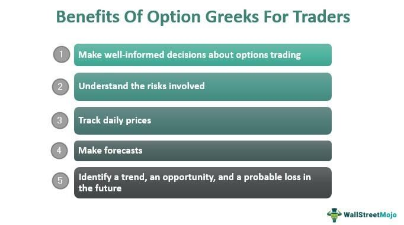

Options trading and derivative markets often present a high level of complexity, requiring traders to understand and effectively manage risk to achieve success. Central to this understanding are the Option Greeks—crucial tools that allow traders to quantify and manage the risks associated with options positions. Each Greek letter represents a different aspect of risk measurement, helping traders gain insights into the sensitivity of option prices to various underlying factors.

The Option Greeks consist of several key metrics that offer a comprehensive view of risk exposure in options trading. These metrics include Delta, Gamma, Theta, and Vega, each reflecting how option prices are likely to change in response to specific market conditions or time decay. By assessing these sensitivities, traders can better predict potential price movements and adjust their strategies accordingly.



This article will detail the significance of Option Greeks in derivative markets and algorithmic trading. By exploring the interplay between these metrics, readers will gain a deeper understanding of how they inform risk measurement and why mastering them is critical for optimizing trading strategies. Additionally, it will discuss how insights derived from Option Greeks can be applied to automated trading systems, allowing algorithms to manage risk dynamically and respond to market fluctuations. Understanding these concepts can enhance a trader’s capability to navigate the complex landscape of trading derivatives effectively.

## Table of Contents

## Understanding Option Greeks

Option Greeks are crucial metrics in options trading, offering a quantitative measure of how various factors influence the price of an options contract. These metrics provide insight into different aspects of risk and can assist traders in making informed decisions. The primary Greeks—Delta, Gamma, Theta, and Vega—each focus on distinct elements that affect option pricing.

**Delta** provides insight into how the price of an option changes relative to changes in the price of the underlying asset. Mathematically, Delta is the first derivative of the option price with respect to the underlying asset price. It is expressed as:

$$
\Delta = \frac{\partial C}{\partial S}
$$

where $C$ is the price of the option and $S$ is the price of the underlying asset. Delta values typically range from 0 to 1 for call options, indicating the degree to which an option's price will move given a $1 change in the underlying asset's price. A Delta of 0.5, for example, suggests that the option price is expected to move $0.50 for every $1 move in the underlying asset.

**Gamma** measures the rate of change of Delta itself, essentially providing insight into the stability of Delta as the underlying asset’s price shifts. Gamma is the second derivative of the option price with respect to the underlying asset price:

$$
\Gamma = \frac{\partial^2 C}{\partial S^2}
$$

A high Gamma indicates that Delta can change quickly, suggesting that the option’s sensitivity to the underlying asset’s price is highly dynamic.

**Theta** represents the rate of decline in the value of an option due to the passage of time, often referred to as time decay. As the expiration date approaches, the extrinsic value of an option decreases, and Theta quantifies this effect. Theta is given by:

$$
\Theta = \frac{\partial C}{\partial t}
$$

where $t$ stands for time. Negative Theta indicates that the option loses value as time progresses, a significant consideration for strategies revolving around options nearing expiration.

**Vega** measures the sensitivity of an option’s price to changes in the volatility of the underlying asset, emphasizing how fluctuations in market volatility affect option pricing. It can be mathematically defined as:

$$
\text{Vega} = \frac{\partial C}{\partial \sigma}
$$

where $\sigma$ is the volatility. Vega is crucial for understanding how the implied volatility impacts options, particularly in volatile markets where prices are more unpredictable.

Grasping these primary Greeks is essential for predicting how diverse market conditions will impact option prices. By analyzing these metrics, traders can evaluate risk and leverage these insights to optimize their trading strategies.

## Delta: Gauging Price Sensitivity

Delta is one of the fundamental Option Greeks, representing the sensitivity of an option's price to changes in the price of the underlying asset. It is expressed as the ratio of the change in the price of the option (ΔOption) to the change in the price of the underlying asset (ΔAsset), mathematically represented as:

$$
\Delta = \frac{\Delta \text{Option}}{\Delta \text{Asset}}
$$

Delta provides critical insights into the directional risk associated with an options position. A call option with a Delta of 0.5, for example, suggests that for every $1 increase in the price of the underlying asset, the option's price is expected to increase by approximately $0.50. Conversely, a put option would have a negative Delta, indicating that the option's price would decrease as the underlying asset's price increases.

Additionally, Delta serves as an indicator of the likelihood that an option will expire in-the-money. For call options, a Delta close to 1 indicates a higher probability of the option being in-the-money at expiration, while a Delta near 0 suggests it is currently out-of-the-money. For put options, the reverse holds true, with a Delta closer to -1 indicating a greater chance of profitability.

From a risk management perspective, Delta plays a pivotal role in portfolio hedging. Traders often engage in "Delta neutral" strategies, where they balance opposing Deltas to mitigate directional risk. This can be achieved by pairing long and short positions in options and the underlying asset, maintaining a net Delta close to zero. For example, if a trader holds positive Delta positions, they might short the underlying asset to achieve Delta neutrality.

Understanding Delta also aids traders in determining their market exposure, enabling them to forecast potential changes in portfolio value due to movements in the underlying asset price. This aspect is critical for constructing well-balanced positions that align with the trader's risk tolerance and market outlook. As such, Delta not only measures immediate price sensitivity but also provides a foundational basis for strategic decision-making in options trading.

## Gamma: Rate of Change in Delta

Gamma is an integral component of options trading, encapsulating the rate at which Delta changes in response to price movements of the underlying asset. This metric serves as a pivotal indicator of an option's price stability over time. A high Gamma suggests that Delta could change significantly with a minor fluctuation in the price of the underlying asset, signaling increased sensitivity to price changes. In contrast, a lower Gamma indicates that Delta is more stable and less responsive to changes in the underlying price.

Traders leverage Gamma to evaluate the [volatility](/wiki/volatility-trading-strategies) of their options portfolio. For instance, options that are at-the-money generally have higher Gamma because they are more sensitive to price changes. This sensitivity is crucial for traders looking to optimize their hedging strategies since it informs them about how their Delta hedges might perform as market conditions evolve.

Consider an option with a Delta (Δ) of 0.5 and a Gamma (Γ) of 0.1. If the underlying asset's price increases by $1, the new Delta will be 0.6. This example highlights how Gamma affects Delta, underscoring the dynamic nature of options trading. It highlights the necessity for traders to continually adjust their positions in rapidly changing markets.

Moreover, Gamma is paramount in forecasting future price movements. By understanding how sensitive their positions are to underlying price changes, traders can better predict how their portfolios might gain or lose value across different market scenarios. In [algorithmic trading](/wiki/algorithmic-trading), Gamma is often a critical parameter in models designed to automatically adjust positions in response to market shifts. By setting thresholds for Gamma, algorithms can trigger buy or sell signals to mitigate risk or capitalize on favorable trading conditions.

In summary, Gamma not only measures the curvature of the Delta curve but it also equips traders with foresight regarding the potential shifts in Delta. This makes it an indispensable tool in the toolkit of both traditional and algorithmic traders aiming to manage risk and enhance portfolio resilience in dynamic markets.

## Theta: The Time Decay Factor

Theta is a crucial component of options trading, representing the rate at which the value of an option decreases as time passes. This metric is especially significant because options are time-sensitive financial instruments with defined expiration dates. As an option approaches its expiration, the impact of time decay on its value becomes increasingly pronounced, directly influencing its profitability for traders and investors.

Mathematically, Theta is expressed as the partial derivative of the option price with respect to time:

$$
\Theta = \frac{\partial V}{\partial t}
$$

where $V$ is the option price, and $t$ is time. A negative Theta value typically indicates that as time progresses, the option's value decreases, assuming all other factors remain constant.

Theta is notably important for options with little time remaining until expiration. For near-term options, the time decay accelerates, which can significantly erode their value. This characteristic is often referred to as "time decay" or "the burning off effect," and it is one of the most critical factors to consider when holding or strategically planning around options close to their expiry.

For an option buyer, negative Theta implies a loss in the value of their position as time moves forward, potentially reducing profitability unless offset by favorable movements in the underlying asset's price or changes in other Greeks such as Delta or Vega. On the contrary, option sellers can potentially benefit from Theta decay, as the strategy often relies on the reduction of an option's value over time, thereby augmenting the position's profitability.

In practical terms, understanding and managing Theta requires traders to anticipate and plan for time decay, especially in circumstances where market conditions do not favor a rapid move in the underlying asset price. Integrating Theta into pricing models and strategic decision-making allows traders to optimize their position management and achieve desirable outcomes within the constraints of time-sensitive, derivative market environments.

## Vega: Volatility's Impact

Vega is a critical Greek in options trading, reflecting the sensitivity of an option’s price to changes in the volatility of the underlying asset. It quantifies how much an option's price will vary with a 1% change in the underlying asset's implied volatility. Understanding Vega is crucial for traders, as volatility significantly influences both option premiums and risk management strategies.

When market volatility increases, Vega will generally rise, implying that options become more valuable. This happens because higher volatility expands the probability distribution of the underlying asset's future prices, increasing the chance of the option ending up in the money. Conversely, if market volatility decreases, Vega falls, reducing the option's price. Traders take note of these fluctuations to optimize their strategies, especially during volatile market conditions. 

The mathematical representation of Vega can be described through the partial derivative of an option's price with respect to the volatility of the underlying asset. In mathematical terms, if $V$ represents the option price and $\sigma$ represents the volatility, Vega can be expressed as:

$$
\text{Vega} = \frac{\partial V}{\partial \sigma}
$$

In Python, calculating Vega within the context of the Black-Scholes model can be implemented using libraries like NumPy and SciPy. Here is a simplified example:

```python
import numpy as np
from scipy.stats import norm

def calculate_vega(S, K, T, r, sigma):
    d1 = (np.log(S / K) + (r + 0.5 * sigma ** 2) * T) / (sigma * np.sqrt(T))
    vega = S * norm.pdf(d1) * np.sqrt(T)
    return vega

# Parameters: S = spot price, K = strike price, T = time to expiration, r = risk-free rate, sigma = volatility
vega = calculate_vega(S=100, K=100, T=1, r=0.05, sigma=0.2)
print(f'Vega: {vega}')
```

Traders often employ Vega as part of their strategy to hedge against volatility risk. When implementing strategies such as straddles or strangles, which involve positions on options that benefit from significant price movements, understanding Vega helps traders anticipate changes in option prices due to volatility shifts. Additionally, during earnings announcements or macroeconomic events that can lead to sudden changes in volatility, traders scrutinize Vega to make informed decisions about option pricing and positioning.

Vega's importance extends beyond single-option scenarios. In portfolios with multiple options, understanding the aggregate Vega can provide insights into how the entire portfolio might respond to anticipated changes in market volatility. This emphasizes the role of Vega not only in individual option analysis but also in comprehensive risk management across diverse trading setups.

## The Role of Option Greeks in Algorithmic Trading

Algorithmic trading leverages computational algorithms to execute trading orders systematically, employing Option Greeks as critical components to manage risk and make informed decisions. These metrics provide insights into the sensitivities of an option's price to different market factors. By integrating these insights, algorithmic trading systems can effectively adapt to changing market conditions and enhance trading strategies.

Option Greeks enable the precise calibration of algorithms to address the nuances of market dynamics. Delta, for example, is used to gauge the directional risk of options. In an algorithmic context, it allows trading systems to dynamically rebalance portfolios in response to changes in the underlying asset's price. This rebalancing involves adjusting the positions to maintain a delta-neutral portfolio, which is essential in strategies like delta hedging where the goal is to mitigate exposure to price movements.

Gamma, the measure of Delta's rate of change, assists in predicting the stability and sensitivity of Delta over time. This is particularly vital in high-frequency trading environments where slight changes in Delta can significantly impact trading outcomes. By integrating Gamma into trading algorithms, systems can anticipate the necessity for adjustments before significant price movements occur.

Theta, signifying time decay, is another Greek that proves invaluable in algorithmic trading. As options near expiration, their value declines, requiring adjustments to trading strategies to minimize losses. Algorithms that [factor](/wiki/factor-investing) in Theta can systematically execute trades that capitalize on or hedge against this time decay, optimizing the timing of trades to enhance profitability.

Vega's role in measuring sensitivity to volatility changes adds another dimension to algorithmic models. When market volatility shifts, Vega-influenced strategies allow trading systems to adjust their positions quickly, ensuring that portfolios are optimized to either exploit or safeguard against these changes. For example, in a high-volatility market, an algorithm may increase its allocation to options with higher Vega to capture favorable price movements.

Incorporating these Option Greeks into algorithms involves complex mathematical modeling and real-time data analysis. The process typically entails calculating these Greeks using mathematical formulas derived from models like Black-Scholes or employing numerical methods for more sophisticated option pricing. For implementation, programming languages like Python provide robust libraries (such as NumPy and SciPy) and tools (like QuantLib) that facilitate the computation and integration of Greeks in trading algorithms.

Ultimately, the role of Option Greeks in algorithmic trading extends beyond static risk measurement. By providing a framework to understand how different factors influence option pricing, they empower trading algorithms to adapt dynamically. This adaptability ensures that algorithmic trading systems remain robust, responsive, and optimized amidst the evolving landscapes of derivative markets.

## Minor Greeks: Digging Deeper

Beyond the primary Greeks—Delta, Gamma, Theta, and Vega—minor Greeks play a crucial role in understanding the full risk profile of options. Among these, Rho is particularly significant as it measures the sensitivity of an option's price to changes in interest rates. Rho is essential for traders, especially in environments where interest rates are volatile or are expected to change. The mathematical representation of Rho can be expressed as:

$$

Rho_{\text{call}} = \frac{\partial C}{\partial r} 
$$

$$

Rho_{\text{put}} = \frac{\partial P}{\partial r} 
$$

Here, $C$ is the price of the call option, $P$ is the price of the put option, and $r$ represents the risk-free [interest rate](/wiki/interest-rate-trading-strategies). Rho provides insights into how much the price of an option is expected to change for a 1% change in interest rates. For instance, a call option with a Rho of 0.05 indicates that the option's price will increase by $0.05 for every percentage point increase in the interest rate.

Apart from Rho, other minor Greeks such as Lambda, Epsilon, and Vanna can also contribute to a nuanced understanding of options. Lambda, sometimes referred to as the elasticity, measures the percentage change in an option's price relative to the percentage change in the underlying asset's price. Similarly, Epsilon gives insights into how the price changes with dividend yield, and Vanna provides information on the interaction between changes in volatility and underlying price changes.

Understanding these lesser-known Greeks is integral for traders who aim to develop robust trading strategies. Incorporating minor Greeks allows for a deeper analysis of an option's risk factors, enabling traders to better anticipate and respond to market movements. It's especially beneficial in situations where specific factors, such as interest rates or dividend yields, are expected to fluctuate. In summary, integrating both primary and minor Greeks into trading strategies enhances a trader’s ability to manage risk and optimize portfolio performance.

## Combining Greeks for Optimal Strategies

Advanced traders leverage a combination of Option Greeks to refine their trading strategies and effectively manage various dimensions of risk. Understanding the interplay between the Greeks enhances the trader's ability to respond to market movements and optimize positions accordingly. 

Delta and Gamma work closely together to provide a comprehensive view of directional risk and its stability. While Delta indicates how much the option price will move with a change in the underlying price, Gamma measures the rate of that change, offering insights into the curvature or acceleration of risk. For example, an option with a high Delta and Gamma implies a highly responsive option price to movement in the underlying asset, suggesting a potential need for frequent rebalancing to maintain a desired risk profile.

Theta and Vega, on the other hand, help traders understand the time and volatility dimensions of risk. Theta represents the time decay of an option, indicating how much value an option loses as it approaches expiry. Combined with Vega, which measures sensitivity to volatility, traders can assess whether an option is likely to gain or lose value due to time decay faster or slower than it gains from implied volatility changes. This understanding is crucial for managing options in volatile markets, where rapid changes can significantly impact option value.

Moreover, integrating minor Greeks such as Rho, which measures sensitivity to interest rate changes, further refines strategy decisions, especially in environments with fluctuating interest rates. Although its impact may be less pronounced than the primary Greeks, it can still be significant for long-dated options.

Advanced strategies often involve computing the net Greek position of a portfolio. By doing so, traders can identify offsets where a particular risk exposure from one option might be neutralized by another. For instance, a portfolio with a high net Vega but balanced by Theta can maintain profitability across various market conditions by offsetting volatility gains with time decay.

Utilizing Python for calculations can facilitate this complex analysis. For example, using libraries such as NumPy and Pandas, traders can automate the computation of Greek values and simulate changes across different market scenarios. Here is a basic illustration of how one might calculate and model Delta and Gamma for a portfolio of options in Python:

```python
import numpy as np
import pandas as pd

# Example option data
options_data = pd.DataFrame({
    'Option': ['Option1', 'Option2'],
    'Delta': [0.6, 0.4],
    'Gamma': [0.1, 0.05],
    'Position Size': [100, 150]
})

# Calculating net Greek exposures for the portfolio
options_data['Net Delta'] = options_data['Delta'] * options_data['Position Size']
options_data['Net Gamma'] = options_data['Gamma'] * options_data['Position Size']

total_net_delta = np.sum(options_data['Net Delta'])
total_net_gamma = np.sum(options_data['Net Gamma'])

print("Total Net Delta:", total_net_delta)
print("Total Net Gamma:", total_net_gamma)
```

In conclusion, the synergistic use of Option Greeks serves as a robust framework for advanced traders. This analytical approach empowers them to construct strategies that consider various risk exposures, optimizing for changes in market conditions and the multi-dimensional nature of option behavior. This strategic comprehension and implementation can significantly enhance the capability to generate consistent trading performance.

## Conclusion

Mastering the Option Greeks is essential for traders aiming to effectively measure and manage risk in derivative markets. These metrics fundamentally depict how option prices respond to various market forces, offering invaluable insights for informed trading decisions. As financial markets continue to evolve, driven by technological advancements and increasing complexity, Option Greeks maintain their critical role in both manual and automated trading environments.

In manual trading, the Option Greeks offer tangible metrics to gauge market conditions and inform strategic decision-making, helping traders anticipate price movements and adjust their portfolios accordingly. In automated trading, they serve as foundational elements in the creation of sophisticated algorithms, enabling systems to adapt seamlessly to market fluctuations and optimize trading outcomes.

Traders equipped with a deep understanding of Option Greeks can navigate the complex landscape of derivative markets with greater precision and confidence. By comprehensively managing multiple dimensions of risk, they can better position themselves to exploit market opportunities while mitigating potential downsides. Ultimately, proficient use of the Option Greeks empowers traders to refine their strategies, ensuring they remain adaptable and resilient amidst the ever-changing dynamics of financial markets.

## References & Further Reading

[1]: Hull, J. C. (2018). ["Options, Futures, and Other Derivatives"](https://www.semanticscholar.org/paper/Options%2C-Futures%2C-and-Other-Derivatives-Hull/89bdee500c8623864fc9eb7a471546aa713acc44) (10th Edition). Pearson.

[2]: Taleb, N. N. (1997). ["Dynamic Hedging: Managing Vanilla and Exotic Options"](https://www.amazon.com/Dynamic-Hedging-Managing-Vanilla-Options/dp/0471152803) Wiley.

[3]: Natenberg, S. (1994). ["Option Volatility and Pricing: Advanced Trading Strategies and Techniques"](https://www.amazon.com/Option-Volatility-Pricing-Strategies-Techniques/dp/0071818774) McGraw-Hill.

[4]: Wilmott, P., Howison, S., & Dewynne, J. (1995). ["The Mathematics of Financial Derivatives: A Student Introduction"](https://www.cambridge.org/core/books/mathematics-of-financial-derivatives/7121345D07C5BCE4FBEC91A8A7E6F267) Oxford University Press.

[5]: Haug, E. G. (2007). ["The Complete Guide to Option Pricing Formulas"](https://www.amazon.com/Complete-Guide-Option-Pricing-Formulas/dp/0786312408) McGraw-Hill.

[6]: Black, F., & Scholes, M. (1973). ["The Pricing of Options and Corporate Liabilities."](https://www.cs.princeton.edu/courses/archive/fall09/cos323/papers/black_scholes73.pdf) Journal of Political Economy, 81(3), 637-654.

[7]: Espen Gaarder Haug & Nassim Nicholas Taleb (2011). ["Option traders use (very) sophisticated heuristics, never the Black–Scholes–Merton formula."](https://www.sciencedirect.com/science/article/pii/S0167268110001927) Journal of Economic Behavior & Organization.