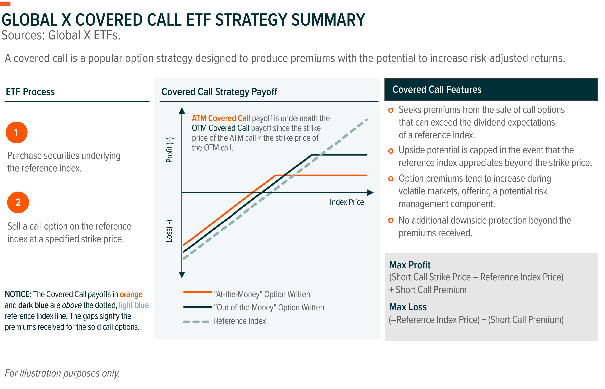

## Table of Contents

## What are Option Income Funds?

Option Income Funds are a type of investment fund that aims to generate income for investors by using options. Options are financial instruments that give the buyer the right, but not the obligation, to buy or sell an asset at a set price before a certain date. These funds typically invest in stocks or other securities and then use options strategies to earn extra income. This extra income comes from the premiums that the fund receives when it sells options.

The main goal of Option Income Funds is to provide investors with a steady stream of income, which can be especially appealing for those looking for regular payouts, like retirees. However, these funds can also be riskier than traditional stock or bond funds because the use of options can increase both potential gains and potential losses. It's important for investors to understand the risks involved and to consider how these funds fit into their overall investment strategy.

## How do Option Income Funds generate income?

Option Income Funds make money by using something called options. Options are like special agreements that let you buy or sell a stock at a certain price before a specific date. These funds own stocks and then sell these options to other people. When they sell the options, they get money right away. This money is called a premium, and it's how the fund makes income.

The fund can keep selling these options over and over, which means they can keep getting more premiums. This is why Option Income Funds can give investors a regular income. But, using options can be risky. If the stock prices move a lot, the fund might lose money. So, while these funds can give you income, they also come with more risk than just owning stocks or bonds.

## What are the main types of options used in Option Income Funds?

Option Income Funds mainly use two types of options: call options and put options. A call option gives the buyer the right to buy a stock at a set price before a certain date. When the fund sells a call option, it gets money right away, which is called a premium. If the stock price stays below the set price, the fund keeps the premium and makes money. But if the stock price goes above the set price, the fund might have to sell the stock at the lower price, which could mean losing money.

A put option is the opposite. It gives the buyer the right to sell a stock at a set price before a certain date. When the fund sells a put option, it also gets a premium. If the stock price stays above the set price, the fund keeps the premium and makes money. But if the stock price drops below the set price, the fund might have to buy the stock at the higher price, which could mean losing money.

Both call and put options help Option Income Funds earn regular income from the premiums they collect. However, using these options can be risky because the fund's profits depend a lot on how stock prices move. If the stock prices move a lot, the fund might lose money, even with the income from the premiums.

## Who should consider investing in Option Income Funds?

Option Income Funds might be a good choice for people who want to get regular income from their investments. These funds can be especially helpful for retirees or anyone who needs a steady stream of money. By selling options, the funds can give investors money every month or quarter, which can help with living expenses or other regular costs.

But, these funds are not for everyone. They can be riskier than just owning stocks or bonds because they use options. This means that if the stock market goes up or down a lot, the fund could lose money. So, people who are thinking about investing in Option Income Funds should be okay with taking on more risk and should understand how options work. It's also a good idea to talk to a financial advisor to see if these funds fit well with your overall investment plan.

## What are the potential risks associated with Option Income Funds?

Option Income Funds can be riskier than other types of investments because they use options. Options can make the fund's value go up and down a lot. If the stock market moves in a way the fund didn't expect, the fund could lose money. For example, if the fund sells a call option and the stock price goes up a lot, the fund might have to sell the stock at a lower price than it's worth, which means losing money. The same thing can happen with put options if the stock price goes down a lot.

Another risk is that the income from the options might not be enough to cover losses if the market moves against the fund. Even though the fund gets money from selling options, this money might not be enough if the stock prices change a lot. Also, the fees for managing these funds can be higher because using options is more complicated. This means that the costs could eat into the income the fund makes, making it less profitable for investors.

## How do Option Income Funds compare to traditional income investments like bonds?

Option Income Funds and bonds are both ways to get regular income from your investments, but they work differently. Bonds are like loans you give to a company or government. They pay you interest over time, and when the bond is done, you get your money back. Bonds are usually safer because you know how much money you will get and when. Option Income Funds, on the other hand, use options to make money. They own stocks and sell options on those stocks to get extra money called premiums. This can give you more income than bonds, but it's riskier because the stock market can go up and down a lot.

The main difference between Option Income Funds and bonds is how much risk you take. Bonds are safer because they have a set interest rate and return date. Option Income Funds can make more money, but they can also lose money if the stock market moves the wrong way. If you need a steady income and don't want to take big risks, bonds might be better for you. If you're okay with more risk and want to try to get more income, Option Income Funds could be a good choice. But it's important to know the risks and maybe talk to a financial advisor before you decide.

## What are the tax implications of investing in Option Income Funds?

Investing in Option Income Funds can have different tax effects than other types of investments. The income you get from these funds can be taxed as regular income or as capital gains, depending on how the fund makes its money. If the fund gets most of its income from selling options, that money might be taxed as regular income, which can be at a higher rate than capital gains. But if the fund makes money from selling stocks it owns, that might be taxed as capital gains, which can be lower.

It's also important to know that Option Income Funds might have more complicated tax forms because they use options. This can make your taxes more confusing and might mean you need to pay for a tax professional to help you. Talking to a tax advisor before you invest in Option Income Funds can help you understand how it will affect your taxes and if it's the right choice for you.

## How can Option Income Funds be used to enhance portfolio diversification?

Option Income Funds can help make your investment portfolio more diverse by adding a different way to make money. Most portfolios have stocks and bonds, but Option Income Funds use options to get extra income. This can be good because it's not tied to the same things that make stocks and bonds go up or down. By adding Option Income Funds, you spread out your risks. If the stock market goes down, the income from the options might help balance out your losses.

Using Option Income Funds can also help you get regular money from your investments. This can be useful if you need money every month or quarter, like for living expenses. While stocks and bonds can give you income too, Option Income Funds might give you more because of the extra money from selling options. But remember, these funds can be riskier, so they should be just one part of a bigger, well-thought-out investment plan.

## What are the key performance metrics to look for in Option Income Funds?

When you're looking at Option Income Funds, one important thing to check is the yield. Yield is how much money the fund gives you each year as a percentage of what you put in. A higher yield can be good because it means you get more money, but it can also mean the fund is taking more risks. Another thing to look at is the total return, which is how much the fund has made or lost over time. This includes the money from the options and any changes in the value of the stocks the fund owns.

It's also a good idea to look at the fund's volatility. Volatility is how much the fund's value goes up and down. A fund with high volatility can be riskier because it might lose a lot of money quickly. You should also check the expense ratio, which is how much it costs to run the fund. A lower expense ratio means more of the money the fund makes goes to you instead of being used to pay for the fund's costs.

## How do market conditions affect the performance of Option Income Funds?

Market conditions can have a big impact on how well Option Income Funds do. When the stock market is calm and prices don't change much, these funds can do well. They sell options and get money from the premiums, which can give investors a steady income. But if the market is calm, the premiums might be lower because there's less risk for the people buying the options.

On the other hand, if the market is very up and down, Option Income Funds can be riskier. If stock prices move a lot, the fund might lose money on the options it sold. For example, if the fund sells a call option and the stock price goes up a lot, it might have to sell the stock at a lower price than it's worth, losing money. The same thing can happen with put options if the stock price goes down a lot. So, while these funds can make more money in a volatile market from higher premiums, they also face bigger risks.

## What strategies can fund managers employ to maximize returns in Option Income Funds?

Fund managers can use different strategies to try to make more money with Option Income Funds. One way is by choosing the right stocks to own in the fund. They pick stocks that they think will not move too much in price, so they can sell options and keep the money from the premiums without losing too much on the stocks. Another strategy is to carefully decide when to sell the options. They might sell options when the premiums are high, which happens when people think the market will be more up and down. This way, they can get more money from the options.

Another thing fund managers can do is use a mix of call and put options. By selling both types, they can make money no matter if the stock market goes up or down a little. But they need to be careful because if the market moves a lot in one direction, they could lose money. Fund managers also need to keep an eye on how much risk they are taking. They might adjust their strategies based on what's happening in the market to try to balance making money with not losing too much.

## How have Option Income Funds performed historically compared to other investment vehicles?

Option Income Funds have had mixed results when you compare them to other ways to invest, like stocks and bonds. Over the years, these funds have often given investors more income than regular stock funds because they use options to make extra money. But, they can also be riskier. In times when the stock market is calm, Option Income Funds can do well because they keep the money from selling options. But if the market moves a lot, these funds might not do as well as regular stock funds because the options can lose money.

When you look at how Option Income Funds have done compared to bonds, they usually offer a higher income. Bonds give you a steady but lower income because they are safer. Option Income Funds can give you more money, but they come with more risk. Over time, these funds might not always beat bonds in total return, especially if the market gets very up and down. So, while Option Income Funds can be good for people who want more income and are okay with more risk, they might not be the best choice for everyone.

## What are Option Income Funds and how can they be understood?

Option income funds, often referred to as option income closed-end funds (OI-CEFs), are investment vehicles designed to generate income through the strategic use of options contracts. These funds primarily focus on selling options, a derivative that gives the buyer the right, but not the obligation, to buy or sell a security at a predetermined price within a specified timeframe.

### Mechanics of Option Income Funds

At the core of option income funds is the strategy of selling options to earn premiums. This process is essentially monetizing the option's time decay and market [volatility](/wiki/volatility-trading-strategies). There are two common strategies employed by these funds: covered calls and delta-neutral options.

#### Covered Calls

A covered call strategy involves owning the underlying asset, such as stocks, while simultaneously writing call options on the same asset. By doing this, the fund receives options premiums, which serves as an additional income stream. This approach is beneficial in a neutral to slightly bullish market, where the underlying asset's price appreciation is limited and the premiums from selling calls enhance overall returns. The goal is to keep the asset if the market remains stable or bearish, while capitalizing on premium income in well-performing conditions.

Mathematically, the payoff function for a covered call can be expressed as:

$$
\text{Payoff} = 
  \begin{cases} 
   S - K + P & \text{if } S > K \\
   P & \text{if } S \leq K 
  \end{cases}
$$

where $S$ is the stock price at expiration, $K$ is the strike price of the call, and $P$ is the premium received.

#### Delta-Neutral Options

Delta-neutral strategies aim to balance the delta, a measure of an option's sensitivity to changes in the price of the underlying asset. By maintaining a delta-neutral position, the fund minimizes its directional market risk, allowing it to profit regardless of market movements. This is achieved through a combination of options and the underlying securities in a manner that the overall delta of the portfolio is approximately zero. These strategies can be more complex and may involve frequent adjustments to hedge positions and maintain delta neutrality.

### Types of Options Strategies Employed

Option income funds make use of sophisticated strategies to maximize income while managing risk. Besides covered calls and delta-neutral strategies, other tactics may include:

- **Naked Calls/Puts**: Selling options without holding a corresponding position in the underlying security. This approach carries higher risk and requires accurate market forecasting.
- **Vertical Spreads**: Involves buying and selling options of different strike prices but the same expiration, reducing risk while still earning premium from option sales.
- **Straddles and Strangles**: These strategies are designed to profit from significant price movement in either direction, gaining from volatility rather than directional bets.

Option income funds leverage these strategies to offer a steady income stream to investors, differentiating themselves from traditional income-generating investment vehicles like bonds or dividend stocks. However, the success of these funds depends heavily on the fund managers' ability to effectively implement options strategies and react to market changes.

## References & Further Reading

[1]: Hendershott, T., Jones, C. M., & Menkveld, A. J. (2011). ["Does Algorithmic Trading Improve Liquidity?"](https://onlinelibrary.wiley.com/doi/full/10.1111/j.1540-6261.2010.01624.x) The Journal of Finance, 66(1), 1-33.

[2]: CBOE Options Exchange. ["Understanding Covered Calls"](https://stocknews.com/news/cboe-understanding-a-covered-call-strategy/) 

[3]: Black, F., & Scholes, M. (1973). ["The Pricing of Options and Corporate Liabilities."](https://www.cs.princeton.edu/courses/archive/fall09/cos323/papers/black_scholes73.pdf) The Journal of Political Economy, 81(3), 637-654.

[4]: ["Quantitative Trading: How to Build Your Own Algorithmic Trading Business"](https://www.amazon.com/Quantitative-Trading-Build-Algorithmic-Business/dp/1119800064) by Ernest P. Chan

[5]: ["Advances in Financial Machine Learning"](https://www.amazon.com/Advances-Financial-Machine-Learning-Marcos/dp/1119482089) by Marcos Lopez de Prado