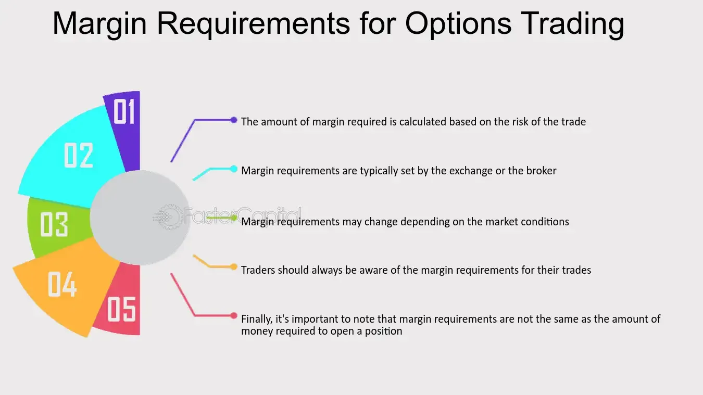

## Table of Contents

## What is option margin and why is it important?

Option margin is the amount of money or securities that you need to have in your account to trade options. It acts like a safety net for the broker, making sure that you can cover any losses that might happen when trading options. When you buy or sell options, the margin requirement can change based on things like the type of option, how much the option is worth, and how the market is doing.

Understanding option margin is important because it helps you manage your money better when trading options. If you don't have enough margin in your account, you might not be able to make the trades you want, or you might have to add more money quickly to keep your positions open. Knowing the margin requirements can help you plan your trades more carefully and avoid unexpected financial problems.

## How does option margin differ from stock margin?

Option margin and stock margin are both about making sure you have enough money in your account to cover possible losses, but they work a bit differently. When you buy stocks on margin, you're borrowing money from your broker to buy more stocks than you could with just your own money. The margin for stocks is usually a percentage of the stock's total value, and you need to keep a minimum amount of equity in your account, often around 25% to 30% of the total value of the stocks you bought on margin.

For options, the margin rules are different because options can be more complex and riskier. When you buy options, you usually pay the full price upfront, so there's no margin needed for buying. But if you sell options, especially if you're selling options without owning the underlying stock (naked options), you need to have a margin in your account. This margin can be much higher than for stocks because selling options can lead to bigger potential losses. The exact amount depends on the type of option and how volatile the market is.

## What are the basic components used in calculating option margin?

The basic components used in calculating option margin include the type of option, the price of the option, and the volatility of the underlying asset. When you sell an option, the margin requirement is based on how much risk the broker thinks there is. If you're selling a call option, the margin might be based on the difference between the stock price and the strike price, plus some extra money to cover potential losses. For put options, it might be based on the strike price minus the stock price, again with some extra money added.

Another important part is whether the option is covered or naked. A covered option means you own the underlying stock, which reduces the risk and usually means a lower margin requirement. A naked option, where you don't own the stock, is riskier and requires a higher margin. The broker also looks at the overall market conditions and how much the stock price might move, which can change the margin requirement. All these factors together help the broker decide how much money you need to have in your account to safely trade options.

## Can you explain the concept of initial margin versus maintenance margin for options?

When you trade options, you need to know about two types of margin: initial margin and maintenance margin. Initial margin is the amount of money you need to put in your account before you can start trading options. It's like a deposit to make sure you can cover any losses. The amount of initial margin depends on the type of option you're trading and how risky it is. If you're selling options, especially naked options, the initial margin can be pretty high because the risk is bigger.

Maintenance margin is a bit different. It's the minimum amount of money you need to keep in your account after you start trading. If the value of your options goes down and your account balance drops below the maintenance margin, you'll get a margin call. This means you have to add more money to your account to bring it back up to the required level. The maintenance margin is usually lower than the initial margin, but it's still important because it helps make sure you can handle any further losses without going broke.

## What is the role of the Options Clearing Corporation (OCC) in setting margin requirements?

The Options Clearing Corporation (OCC) is a big organization that helps keep options trading safe and fair. One of the things the OCC does is set the rules for how much margin, or money, you need to have in your account when you trade options. The OCC looks at how risky the options are and decides how much money you should have as a safety net. This helps make sure that if something goes wrong with your trades, there's enough money to cover any losses.

Brokers use the OCC's rules to figure out the exact margin requirements for their customers. The OCC gives them guidelines, but brokers can also add their own rules to be extra safe. This means that the margin you need might be a bit different from one broker to another, but it all starts with the OCC's basic rules. By setting these requirements, the OCC helps keep the options market stable and protects everyone involved in trading.

## How do different types of options (e.g., equity, index, futures) affect margin requirements?

Different types of options like equity, index, and futures options can change how much margin you need. Equity options are options on individual stocks. When you trade these, the margin depends on the stock's price and how much it might move. If you sell a call option on a stock without owning it, the margin can be high because the risk is big. Index options are based on a group of stocks, like the S&P 500. These options usually have lower margin requirements than equity options because they are less risky. The OCC and brokers look at how the whole index moves, not just one stock.

Futures options are options on futures contracts, which are agreements to buy or sell something at a future date. These options can be more complex and often have different margin rules. The margin for futures options can be based on the value of the futures contract and how much it might change. Because futures can be very volatile, the margin requirements can be higher to cover the bigger risks. Each type of option has its own way of figuring out margin, and it's important to know these differences when you trade.

## What are the margin requirements for selling naked options versus covered options?

When you sell naked options, you're taking on a lot of risk because you don't own the underlying stock. Because of this, the margin requirements are much higher. If you sell a naked call option, you might need to have a lot of money in your account to cover the difference between the stock price and the strike price, plus some extra to handle potential big losses. If you sell a naked put option, the margin is based on the strike price minus the stock price, again with some extra money added. Brokers want to make sure you can handle any big moves in the stock price, so they set the margin high for naked options.

Selling covered options is less risky because you own the stock that the option is based on. This means the margin requirements are lower. If you sell a covered call, the margin might just be the difference between the stock price and the strike price, without the extra money needed for naked options. For covered puts, it's less common, but if you do it, the margin would be lower because you already own the stock. The key is that covered options are safer for the broker, so they don't need you to have as much money in your account.

## How does the margin requirement change with the volatility of the underlying asset?

When the underlying asset of an option, like a stock, gets more volatile, it means the price can change a lot more quickly. This makes options riskier because big price swings can lead to bigger losses. Because of this, brokers will usually ask for more margin when the asset is more volatile. They want to make sure you have enough money in your account to cover these bigger possible losses. So, if a stock starts moving around a lot, the margin requirement for options on that stock will go up.

This change in margin happens because the broker uses something called the "risk-based margin" system. This system looks at how much the price of the asset might move and sets the margin based on that. If the stock is calm and doesn't move much, the margin might be lower. But if it's all over the place, the margin goes up to protect against the bigger risks. This is why traders need to keep an eye on how volatile the market is, because it can affect how much money they need to have in their account to keep trading options.

## Can you describe the portfolio margining system and how it differs from standard margin calculations?

The portfolio margining system is a way to figure out how much money you need to have in your account when you trade options. Instead of looking at each option by itself, it looks at your whole portfolio of stocks and options together. It thinks about how all your trades might affect each other and how much risk there is overall. This can mean you need less money in your account because it's looking at the big picture. It's like if you have some options that might lose money but others that might make money, the system sees that and might lower the margin.

Standard margin calculations are different because they look at each option or trade one at a time. They don't think about how all your trades might work together. So, if you sell a call option, the standard margin might be high because it's looking at just that one trade and how risky it is by itself. But with portfolio margining, it might see that you have other trades that could balance out the risk, so you might not need as much money. This can be really helpful for traders who have a lot of different trades going on at the same time.

## What are the specific formulas used by brokers to calculate option margin, and how do they vary?

Brokers use different formulas to figure out how much money you need to have in your account when you trade options. One common way is called the "Reg T margin" for stocks, which is set by the Federal Reserve. For options, brokers often use something called the "Option Margin Calculator." This calculator looks at things like the type of option, the price of the option, how much the stock might move, and if you're selling the option naked or covered. If you're selling a naked call, the formula might be the stock price minus the strike price, plus some extra money to cover possible losses. For a naked put, it's the strike price minus the stock price, again with extra money added.

These formulas can change from one broker to another. Some brokers might use a "risk-based margin" system, which looks at how much the stock might move and sets the margin based on that. If the stock is very volatile, the margin goes up because the risk is bigger. Other brokers might use the rules set by the Options Clearing Corporation (OCC) as a starting point but add their own rules to be extra safe. So, the exact amount of margin you need can be different depending on which broker you use and how they calculate it.

## How do regulatory changes impact option margin requirements, and what recent changes should traders be aware of?

Regulatory changes can have a big impact on how much money you need to have in your account to trade options. When rules change, brokers have to follow them, and this can mean you need more or less money to trade. For example, if a new rule says that options are riskier, brokers might ask for more margin to make sure they're safe. On the other hand, if a rule makes options seem less risky, the margin might go down. These changes are made by groups like the Options Clearing Corporation (OCC) and the Financial Industry Regulatory Authority (FINRA), and they want to keep the market safe for everyone.

Recently, traders should be aware of changes that happened because of big events like the GameStop situation in early 2021. After that, some brokers started asking for more margin to handle the wild swings in stock prices. Also, in 2023, the SEC made some new rules about how brokers handle margin for options. These rules are meant to make sure brokers have enough money to cover losses if things go wrong. So, it's a good idea for traders to keep an eye on these changes and talk to their brokers to understand how much money they need to have in their accounts.

## What advanced strategies can traders use to optimize their margin usage when trading options?

Traders can use advanced strategies like portfolio margining to optimize their margin usage when trading options. Instead of looking at each option separately, portfolio margining looks at all the stocks and options in a trader's account together. This can lower the total margin needed because it takes into account how the different trades might balance each other out. For example, if a trader has some options that might lose money but others that might make money, the system sees this and might require less margin. This strategy is helpful for traders who have a lot of different trades happening at the same time.

Another strategy is to use covered options instead of naked options. When you sell a covered option, you own the underlying stock, which makes it less risky. Because of this, brokers usually ask for less margin for covered options. For example, if you own 100 shares of a stock and sell a call option on those shares, the margin requirement will be lower than if you sold the call without owning the stock. By using covered options, traders can keep more money in their accounts for other trades or to cover potential losses. This can help them manage their money better and trade more options without needing extra cash.

## How are option margin requirements calculated?

The calculation of option margin requirements is a nuanced process, and it's shaped significantly by the type of option strategy used and the regulatory framework applied. In the United States, Regulation T, overseen by the Federal Reserve, plays a critical role in these calculations, setting forth initial margin requirements. This regulation generally requires traders to cover at least 50% of the purchase price with either cash or securities.

For options, the margin requirements differ from stock trading in that they need to account for various potential scenarios that might arise based on the movement of the underlying asset. This complexity arises particularly in strategies like spreads, straddles, and naked options, as each has its own risk profile and corresponding margin necessities.

### General Margin Calculation Process

1. **Identify the Option Strategy**: The first step is determining which option strategy is being deployed. Different strategies have unique risks and thus require distinct margin calculations. For example, a covered call will have different requirements compared to a naked put.

2. **Determine the Strategy's Risk Profile**: For each strategy, the primary risk factor (e.g., downside risk for a call) needs assessment to understand what financial exposure the broker will need to cover.

3. **Apply Regulatory Standards**: Using guidelines from Regulation T, traders must calculate the initial margin. This involves understanding the notional exposure and adjusting it based on the risk derived from historical volatility or potential price movements of the underlying securities.

4. **Utilize Margin Calculators**: Tools like the CBOE Margin Calculator can assist traders. These tools take into account multiple variables, like underlying price, strike price, days until expiration, and current volatility. The calculator provides a detailed breakdown of what the margin requirement is for a particular set of trades or portfolios, facilitating quick and accurate assessments.

### Margin Requirement Formula

While calculating margins, certain formulae are representative of common approaches, especially for simple strategies such as naked options. For example:

$$
\text{Margin Requirement} = \max(P \times 20\%, (P - O) \times 10\%) + \text{Premium},
$$

where $P$ is the underlying asset’s market value and $O$ is the option's out-of-the-money amount, if applicable.

### Python Tool Example

For algorithmic traders, implementing these calculations in code can streamline margin management. Here’s a Python snippet that simplifies margin calculation for a single option position:

```python
def margin_requirement(option_price, market_price, premium):
    margin_pct = max(0.2 * market_price, (market_price - option_price) * 0.1)
    return margin_pct + premium

# Example usage:
option_price = 50.0  # Example option strike
market_price = 55.0  # Current market price of the underlying
premium = 2.0        # Premium paid

margin = margin_requirement(option_price, market_price, premium)
print(f"Margin Requirement: ${margin:.2f}")
```

### Available Tools

Beyond standalone calculators, brokers provide API access for real-time margin data, allowing integration into trading platforms. Additionally, broker-specific platforms often offer proprietary tools tailored to their customer's trading patterns and needs.

Understanding and leveraging these calculation methods can significantly affect a trader's risk management capabilities and ultimately their success in options trading. Through precise calculation and effective tool utilization, traders can better ensure that they meet margin requirements while optimizing their capital usage.

## References & Further Reading

[1]: Hull, J. C. (2014). ["Options, Futures, and Other Derivatives"](https://www.amazon.com/Options-Futures-Other-Derivatives-9th/dp/0133456315) (9th ed.). Pearson.

[2]: CBOE. ["Margin Manual."](https://cdn.cboe.com/resources/membership/Margin_Manual.pdf) Chicago Board Options Exchange.

[3]: Natenberg, S. (1994). ["Option Volatility and Pricing: Advanced Trading Strategies and Techniques"](https://archive.org/details/optionvolatility00shel). McGraw-Hill.

[4]: Fabozzi, F. J., Focardi, S. M., & Kolm, P. N. (2010). ["Quantitative Equity Investing: Techniques and Strategies"](https://www.semanticscholar.org/paper/Quantitative-Equity-Investing%3A-Techniques-and-Fabozzi-Focardi/1c49a2a53919f7e65cb96f16691b8ff726fd3cd7). John Wiley & Sons.

[5]: Sinclair, E. (2010). ["Option Trading: Pricing and Volatility Strategies and Techniques"](https://www.wiley.com/en-us/Option+Trading%3A+Pricing+and+Volatility+Strategies+and+Techniques-p-9780470497104). Wiley Trading.