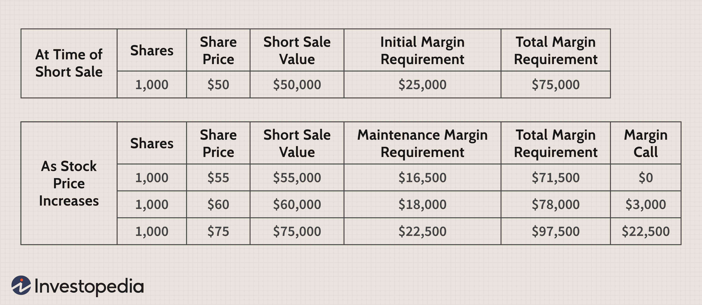

In algorithmic trading, mastering option margin requirements is vital for effective risk management and enhancing the potential returns of trading strategies. This article examines how option margin calculations are integral to algorithmic trading. We will first clarify the fundamentals of option margin and how they differ from traditional stock trading margin. Option margins act as collateral necessary for carrying option positions, a key distinction from the leverage-focused stock margins. This collateral requirement is set by regulatory authorities to mitigate default risks associated with options.

Factors influencing option margin requirements include the type of option strategy used, the underlying asset's characteristics, and market conditions. Understanding these factors helps traders optimize their strategies and manage risks effectively. Algorithmic traders leverage predictive models and computational techniques to estimate and enhance option margins, ensuring optimal trade execution.



For traders employing algorithmic systems, incorporating margin calculations into algorithms is essential. It allows traders to account for margin impacts in their execution strategies and improve profitability and risk management. Algorithms can automate margin monitoring, provide insights into margin efficiency, and enable scaling of trading operations by evaluating the margin requirements dynamically. This ensures efficient capital utilization and risk control during trades, pivotal for maintaining competitive advantage in the markets.

## Table of Contents

## Understanding Option Margin

Option margin refers to the collateral that traders must maintain before engaging in the sale or writing of options. This requirement is a crucial aspect of risk management in the trading of options, ensuring that sufficient funds are available to cover potential losses. Regulatory bodies establish margin requirements as a safeguard against default risk inherent in option contracts. Unlike stock margins, which primarily serve as a means of leveraging investment positions, option margins function primarily as collateral. This distinction is fundamental in understanding their role in options trading.

The difference between stock margins and option margins is significant. Stock margins generally allow traders to borrow funds from a broker to purchase more securities than they could with their capital alone. This leverage can amplify both gains and losses. On the other hand, option margins are not about leveraging positions; instead, they are about ensuring the fulfillment of potential obligations should the market move unfavorably.

In options trading, the margin requirement will depend on the specific strategy employed and the associated risk. For example, writing uncovered options, which exposes the trader to potentially unlimited downside, will typically require a higher margin than strategies involving covered options, where the risk is limited. The margin acts as a financial buffer, designed to ensure that the trader can meet the obligations of the option contract should the need arise.

Margin requirements are also influenced by factors such as the underlying security's [volatility](/wiki/volatility-trading-strategies), the option's time to expiration, and the monetary value of the contract. Financial institutions use complex models to predict potential price movements and determine the appropriate margin levels to mitigate risk effectively.

In summary, option margins are critical in ensuring the safe and efficient functioning of options markets. They provide a mechanism to manage risk by requiring traders to hold sufficient collateral, thereby reducing the potential for default. Understanding these requirements is essential for effective risk management and strategy implementation in options trading.

## Calculating Option Margin Requirements

The calculation of option margin requirements is a nuanced process, and it's shaped significantly by the type of option strategy used and the regulatory framework applied. In the United States, Regulation T, overseen by the Federal Reserve, plays a critical role in these calculations, setting forth initial margin requirements. This regulation generally requires traders to cover at least 50% of the purchase price with either cash or securities.

For options, the margin requirements differ from stock trading in that they need to account for various potential scenarios that might arise based on the movement of the underlying asset. This complexity arises particularly in strategies like spreads, straddles, and naked options, as each has its own risk profile and corresponding margin necessities.

### General Margin Calculation Process

1. **Identify the Option Strategy**: The first step is determining which option strategy is being deployed. Different strategies have unique risks and thus require distinct margin calculations. For example, a covered call will have different requirements compared to a naked put.

2. **Determine the Strategy's Risk Profile**: For each strategy, the primary risk factor (e.g., downside risk for a call) needs assessment to understand what financial exposure the broker will need to cover.

3. **Apply Regulatory Standards**: Using guidelines from Regulation T, traders must calculate the initial margin. This involves understanding the notional exposure and adjusting it based on the risk derived from historical volatility or potential price movements of the underlying securities.

4. **Utilize Margin Calculators**: Tools like the CBOE Margin Calculator can assist traders. These tools take into account multiple variables, like underlying price, strike price, days until expiration, and current volatility. The calculator provides a detailed breakdown of what the margin requirement is for a particular set of trades or portfolios, facilitating quick and accurate assessments.

### Margin Requirement Formula

While calculating margins, certain formulae are representative of common approaches, especially for simple strategies such as naked options. For example:

$$
\text{Margin Requirement} = \max(P \times 20\%, (P - O) \times 10\%) + \text{Premium},
$$

where $P$ is the underlying asset’s market value and $O$ is the option's out-of-the-money amount, if applicable.

### Python Tool Example

For algorithmic traders, implementing these calculations in code can streamline margin management. Here’s a Python snippet that simplifies margin calculation for a single option position:

```python
def margin_requirement(option_price, market_price, premium):
    margin_pct = max(0.2 * market_price, (market_price - option_price) * 0.1)
    return margin_pct + premium

# Example usage:
option_price = 50.0  # Example option strike
market_price = 55.0  # Current market price of the underlying
premium = 2.0        # Premium paid

margin = margin_requirement(option_price, market_price, premium)
print(f"Margin Requirement: ${margin:.2f}")
```

### Available Tools

Beyond standalone calculators, brokers provide API access for real-time margin data, allowing integration into trading platforms. Additionally, broker-specific platforms often offer proprietary tools tailored to their customer's trading patterns and needs.

Understanding and leveraging these calculation methods can significantly affect a trader's risk management capabilities and ultimately their success in options trading. Through precise calculation and effective tool utilization, traders can better ensure that they meet margin requirements while optimizing their capital usage.

## Importance in Algorithmic Trading

Algorithmic trading is highly dependent on precise calculations, and option margin requirements are a crucial component of this process. Understanding and incorporating margin requirements into trading algorithms can significantly influence both the profitability and risk management of trading strategies. Margin requirements dictate the amount of collateral traders must maintain, impacting the number of positions they can hold and leverage. 

For algorithmic traders, integrating margin calculations into their algorithms means these strategies can automatically adjust to market conditions and maintain the required collateral, reducing the risk of margin calls. Margin calculations help ensure the strategy remains viable under various market conditions by calibrating the maximum position size that the algorithm can initiate without breaching margin requirements.

Algorithmic trading systems can automate the process of monitoring margin levels, using real-time data feeds to adjust positions instantly. This automation allows traders to implement high-frequency trading strategies more effectively, scaling their operations without constant human oversight. For example, an algorithm can be programmed to use the following Python code to check margin levels and rebalance the portfolio accordingly:

```python
def check_and_adjust_margin(account_balance, margin_requirement, positions):
    total_margin = sum(position['margin'] for position in positions)
    if total_margin > account_balance * margin_requirement:
        # Logic to reduce positions
        reduce_positions(positions)
    else:
        # Logic to increase or maintain positions
        adjust_positions(positions)

def reduce_positions(positions):
    # Logic for reducing positions to maintain margin requirements
    sorted_positions = sorted(positions, key=lambda x: x['margin'], reverse=True)
    for position in sorted_positions:
        if total_margin_too_high():
            close_position(position)
        else:
            break
```

Beyond individual traders, automated margin monitoring and adjustment are pivotal for institutions managing large portfolios. Algorithms can scale trading operations by ensuring margin requirements are consistently met, allowing for the expansion of traded volumes while managing associated risks effectively.

Ultimately, the incorporation of option margin requirements in [algorithmic trading](/wiki/algorithmic-trading) algorithms provides traders with a robust framework to optimize their strategies, allowing for greater scalability and efficiency in market operations. This systematic approach to margin management enhances profitability by preventing excessive margin calls and maximizing available capital for trading.

## Strategies to Optimize Option Margins

Optimizing option margin requirements is an essential aspect of effective risk management and maximizing trading capital efficiency. By utilizing specific strategies, traders can significantly minimize the margin needed, thereby freeing up capital for other trades or investments. Among these strategies are covered calls and puts, and debit spreads, each offering distinct advantages in terms of margin requirements and risk management.

Covered calls involve holding a long position in a stock while simultaneously writing (selling) a call option on the same asset. This strategy is effective in reducing margin requirements because the stock acts as collateral for the option, thereby lowering the overall risk from the broker’s perspective. As such, regulators and brokers may impose lower margin requirements compared to uncovered or "naked" options. Covered puts operate on a similar principle but involve short selling the underlying asset while writing a put option, adding an additional layer of collateral.

Debit spreads, consisting of buying and selling options of the same class with the same expiration but different strike prices, present another avenue for optimizing margin requirements. For example, a bull call spread involves purchasing a call option with a lower strike price and selling another with a higher strike price. This strategy not only caps potential losses but also requires less margin compared to holding a single, uncovered option position. The calculated margin for a debit spread is typically the net premium paid to enter the trade rather than the full potential obligation of the underlying asset, which significantly reduces the initial capital requirement.

In Python, assessing the margin impact of these strategies can be facilitated by scripting calculations that evaluate the spread's maximum loss or required collateral. A simplified depiction is as follows:

```python
def margin_covered_call(underlying_value, call_premium):
    # Assuming the underlying is fully collateralized, margin is reduced
    return underlying_value - call_premium

def margin_debit_spread(cost_of_lower_strike_option, premium_received_higher_strike):
    # Margin is typically the net premium paid in a debit spread
    return max(0, cost_of_lower_strike_option - premium_received_higher_strike)

# Example Usage
underlying_value = 5000
call_premium = 200
cost_of_lower = 500
premium_higher = 300

print("Covered Call Margin:", margin_covered_call(underlying_value, call_premium))
print("Debit Spread Margin:", margin_debit_spread(cost_of_lower, premium_higher))
```

By adopting such strategies, traders not only optimize their trading capital but also align with efficient risk management principles. These techniques allow traders to maintain flexibility in their portfolios without being overly burdened by high margin requirements, thus enabling more agile decision-making within their algorithmic trading models.

## Conclusion and Best Practices

Understanding option margin requirements plays a pivotal role in managing risks efficiently within algorithmic trading. These requirements act as the backbone for ensuring that trades are executed with an appropriate balance between leverage and risk. Incorporating option margin calculations into trading algorithms can significantly boost both performance and risk management capabilities.

Algorithmic traders can enhance their strategies by integrating robust margin calculation frameworks. This integration helps in automatically monitoring and adjusting positions according to real-time margin impacts. For instance, using Python, traders can implement scripts that continuously assess margin requirements based on the latest market data and adjust trading strategies accordingly. Here's a basic example of how Python might be used to calculate margin for a simple option strategy:

```python
def calculate_option_margin(stock_price, strike_price, option_type, interest_rate, time_to_expiration, volatility):
    import numpy as np
    from scipy.stats import norm

    d1 = (np.log(stock_price / strike_price) + (interest_rate + 0.5 * volatility**2) * time_to_expiration) / (volatility * np.sqrt(time_to_expiration))
    d2 = d1 - volatility * np.sqrt(time_to_expiration)

    if option_type == 'call':
        margin = stock_price * norm.cdf(d1) - strike_price * np.exp(-interest_rate * time_to_expiration) * norm.cdf(d2)
    elif option_type == 'put':
        margin = strike_price * np.exp(-interest_rate * time_to_expiration) * norm.cdf(-d2) - stock_price * norm.cdf(-d1)
    else:
        raise ValueError("Invalid option type. Use 'call' or 'put'.")

    return margin
```

Remaining vigilant about regulatory changes is crucial, as these can affect margin requirements significantly. Regulatory bodies frequently update rules to mitigate systemic risks, and being informed allows traders to adjust their strategies preemptively. Traders can benefit from subscribing to financial newsletters, attending industry conferences, or using platforms that offer real-time updates on regulatory changes.

Operational tools and platforms also play a significant role in enhancing the efficiency of algo trading. Advanced trading systems equipped with margin monitoring features provide a competitive edge. Tools like the CBOE Margin Calculator or broker-specific platforms can automate these calculations, making it seamless to adjust strategies in response to market fluctuations.

Adopting best practices is essential for successfully integrating option margin strategies within algorithmic trading models. These include diversifying trading strategies to distribute margin utilization across different instruments, implementing real-time monitoring systems for proactive risk management, and using back-testing to ensure strategies hold up under variable market conditions. Algorithmic models should incorporate failsafe mechanisms to adjust or halt trading when margin thresholds are breached, ensuring that risk exposure remains within acceptable limits.

In summary, a deep understanding of option margin requirements, coupled with the ability to integrate these calculations within algorithms, offers substantial benefits. This approach not only protects against excessive risk but also optimizes the potential for leveraging opportunities. Staying informed on regulatory developments and utilizing advanced computational tools can provide a significant advantage in the competitive landscape of algorithmic trading.

## References & Further Reading

[1]: Hull, J. C. (2014). ["Options, Futures, and Other Derivatives"](https://www.amazon.com/Options-Futures-Other-Derivatives-9th/dp/0133456315) (9th ed.). Pearson.

[2]: CBOE. ["Margin Manual."](https://cdn.cboe.com/resources/membership/Margin_Manual.pdf) Chicago Board Options Exchange.

[3]: Natenberg, S. (1994). ["Option Volatility and Pricing: Advanced Trading Strategies and Techniques"](https://archive.org/details/optionvolatility00shel). McGraw-Hill.

[4]: Fabozzi, F. J., Focardi, S. M., & Kolm, P. N. (2010). ["Quantitative Equity Investing: Techniques and Strategies"](https://www.semanticscholar.org/paper/Quantitative-Equity-Investing%3A-Techniques-and-Fabozzi-Focardi/1c49a2a53919f7e65cb96f16691b8ff726fd3cd7). John Wiley & Sons.

[5]: Sinclair, E. (2010). ["Option Trading: Pricing and Volatility Strategies and Techniques"](https://www.wiley.com/en-us/Option+Trading%3A+Pricing+and+Volatility+Strategies+and+Techniques-p-9780470497104). Wiley Trading.