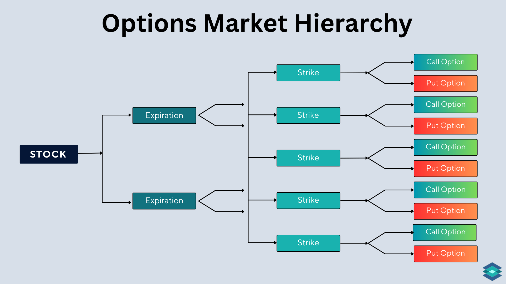

## Table of Contents

## What is option market liquidity?

Option market liquidity refers to how easily you can buy or sell options without causing a big change in their price. When an options market is liquid, there are many buyers and sellers, and you can quickly trade options at prices close to the last traded price. This makes it easier for you to enter and exit positions without worrying too much about the price moving against you.

On the other hand, if an options market is not liquid, it can be hard to find someone to trade with. This can lead to larger differences between the price you want to buy at and the price someone is willing to sell at. In such cases, you might have to accept a worse price, or you might not be able to trade at all. Liquidity is important because it affects how smoothly and efficiently you can trade options.

## Why is liquidity important in the options market?

Liquidity is really important in the options market because it makes trading easier and less risky. When an options market is liquid, there are lots of people wanting to buy and sell. This means you can quickly buy or sell options without having to wait. It also means you can usually get a price that's close to what you expect. This is good because it helps you plan your trades better and reduces the chance that the price will move a lot against you while you're trying to trade.

If the options market isn't liquid, it can be hard to find someone to trade with. This can make it take longer to buy or sell options, and you might have to accept a price that's not as good as you hoped. This can make trading riskier and more stressful. So, liquidity is key because it helps you trade more smoothly and with less worry about big price changes.

## How is liquidity measured in the options market?

Liquidity in the options market is measured by looking at a few key things. One important measure is the bid-ask spread, which is the difference between the highest price someone is willing to pay for an option (the bid) and the lowest price someone is willing to sell it for (the ask). A smaller bid-ask spread means the market is more liquid because it's easier to buy and sell at prices that are close to each other. Another measure is trading volume, which is the total number of options contracts traded in a day. Higher trading volume usually means more liquidity because there are more people buying and selling.

Another way to measure liquidity is by looking at the open interest, which is the total number of outstanding options contracts that have not been settled. High open interest suggests that there is a lot of interest in the option, which can make it easier to find someone to trade with. Together, these measures help traders understand how easy it will be to buy or sell an option without causing big price changes. By keeping an eye on these indicators, traders can make better decisions about when and how to trade options.

## What factors affect the liquidity of options?

Several things can affect how easy it is to buy or sell options, which we call liquidity. One big factor is how popular the underlying stock or asset is. If lots of people are interested in the stock, there will be more people wanting to trade its options, making the options market more liquid. Another factor is how close the option is to its expiration date. Options that are about to expire can be less liquid because fewer people want to trade them. Also, the price of the option matters. Options that are very cheap or very expensive might not be as liquid because fewer people want to trade them.

Another thing that affects liquidity is how much the stock price moves around. If the stock price is very stable, people might not be as interested in trading its options, which can make the options market less liquid. On the other hand, if the stock price is moving a lot, more people might want to trade options to bet on where the price is going, making the options market more liquid. Finally, the overall market conditions can play a role. During times when the stock market is doing well, more people might be trading options, which can increase liquidity. But if the market is doing poorly, people might be less interested in trading options, which can decrease liquidity.

## How can an investor identify liquid options?

An investor can identify liquid options by looking at a few key things. One important thing to check is the bid-ask spread. This is the difference between the price someone is willing to pay for the option and the price someone is willing to sell it for. If this difference is small, it means the option is liquid because it's easy to buy and sell at prices that are close to each other. Another thing to look at is the trading volume, which is how many options are being traded each day. If a lot of options are being traded, it's a sign that the option is liquid because there are many people buying and selling.

Another way to spot liquid options is by checking the open interest. This is the total number of options contracts that haven't been settled yet. If the open interest is high, it means a lot of people are interested in the option, which can make it easier to find someone to trade with. By keeping an eye on these three things - the bid-ask spread, trading volume, and open interest - an investor can get a good idea of how easy it will be to buy or sell an option without causing big price changes.

## What are the differences between liquid and illiquid options?

Liquid options are easy to buy and sell because there are lots of people trading them. This means you can quickly trade them without having to wait, and the price you get will be close to what you expect. You can tell an option is liquid if the difference between the price someone wants to buy it for and the price someone wants to sell it for is small. Also, if a lot of options are being traded each day and there are many options that haven't been settled yet, these are signs of a liquid option. Trading liquid options is less risky because you can get in and out of your trades more easily.

On the other hand, illiquid options are hard to buy and sell because not many people are trading them. This means you might have to wait longer to find someone to trade with, and the price you get might not be as good as you hoped. You can tell an option is illiquid if the difference between the buying and selling price is big. Also, if not many options are being traded each day and there aren't many options that haven't been settled yet, these are signs of an illiquid option. Trading illiquid options can be riskier because it's harder to get in and out of your trades without the price moving a lot.

## How does market liquidity impact option pricing?

Market liquidity can really affect how much you pay for an option. When an option is liquid, it means there are lots of people buying and selling it. This makes it easier for you to trade without causing big changes in the price. Because of this, the price you see for a liquid option is usually closer to its real value. You won't have to pay much more than what the option is actually worth, and you can sell it for close to its real value too. This makes trading liquid options less risky and more predictable.

On the other hand, if an option is not liquid, it can be hard to find someone to trade with. This means you might have to accept a price that's not as good as you hoped. The difference between what someone wants to buy the option for and what someone wants to sell it for can be big. This can make the option seem more expensive than it really is when you're buying, and less valuable when you're selling. So, trading illiquid options can be riskier because the price you get might not be as fair, and it can be harder to predict how much you'll end up paying or getting.

## What strategies can traders use to manage liquidity risk in options trading?

Traders can manage liquidity risk in options trading by focusing on options that are more liquid. This means choosing options with a small difference between the buying and selling price, lots of trading happening each day, and a high number of options that haven't been settled yet. By trading these liquid options, traders can get in and out of their trades more easily without causing big price changes. They can also use limit orders, which let them set a specific price they're willing to buy or sell at. This helps them avoid paying too much or getting too little when trading.

Another strategy is to be careful with options that are about to expire. These options can be less liquid because fewer people want to trade them. Traders can manage this risk by closing out their positions before the options get too close to expiration, or by choosing options with longer expiration dates. It's also smart to keep an eye on the overall market conditions. During times when the market is doing well, more people might be trading options, which can make them more liquid. But if the market is doing poorly, traders might want to be more careful because options can become less liquid. By paying attention to these things, traders can better handle the risks that come with trading options.

## How do market makers contribute to option market liquidity?

Market makers help make the options market more liquid by always being ready to buy or sell options. They give traders someone to trade with, even if not many other people are trading. This means traders can buy or sell options more easily and quickly. Market makers do this by offering a price to buy and a price to sell for each option. The difference between these two prices is called the bid-ask spread. When market makers keep this spread small, it makes the options market more liquid because traders can trade at prices that are close to each other.

Market makers also help by adding more options to the market. They do this by creating new options contracts and making sure there are enough options available for traders to buy or sell. This increases the number of options that haven't been settled yet, which is called open interest. When open interest is high, it's a sign that the options market is more liquid because there are more people interested in trading. By doing these things, market makers make it easier for traders to find someone to trade with and help keep the options market running smoothly.

## What role does electronic trading play in enhancing option market liquidity?

Electronic trading has made a big difference in making the options market more liquid. Before, people had to call each other or meet in person to trade options, which could take a lot of time. Now, with electronic trading, traders can buy and sell options with just a few clicks on their computer or phone. This means more people can trade options quickly and easily, no matter where they are. Because it's so easy to trade, more people are doing it, which makes the options market more liquid. There are more buyers and sellers, so it's easier to find someone to trade with.

Electronic trading also helps by making the market more open and fair. Everyone can see the prices that people are willing to buy and sell options for, which is called transparency. This helps traders make better decisions because they can see what's happening in the market in real time. Also, electronic trading systems can handle a lot of trades at once, which means the market can stay liquid even when a lot of people are trading. This makes it easier for traders to get in and out of their trades without causing big price changes, which is really important for managing risk in options trading.

## How have regulatory changes affected option market liquidity?

Regulatory changes have had a big impact on how easy it is to buy and sell options, which we call liquidity. Some rules have made the options market more liquid by making it easier for more people to trade. For example, rules that let more types of investors trade options have brought more people into the market. This means there are more buyers and sellers, which makes it easier to find someone to trade with. Also, rules that make trading more open and fair, like showing the prices people are willing to buy and sell at, help traders make better decisions and trade more easily.

On the other hand, some regulatory changes have made the options market less liquid. For example, rules that make it harder for certain types of traders to participate can reduce the number of people trading options. This can make it harder to find someone to trade with, especially for options that are not very popular. Also, rules that increase the costs of trading, like higher fees or more paperwork, can make people less interested in trading options. This can lead to fewer trades and less liquidity in the options market.

## What advanced metrics can be used to assess the depth of liquidity in the options market?

To assess the depth of liquidity in the options market, traders can look at the order book, which shows all the buy and sell orders at different price levels. A deep order book means there are lots of orders at many different prices, which makes it easier to buy or sell options without causing big price changes. Another advanced metric is the market depth, which shows how many options are available at each price level. If there are a lot of options available at prices close to the current price, it means the market is deep and liquid. Traders can also look at the time to fill, which is how long it takes to complete a trade. If trades happen quickly, it's a sign that the market is liquid and there are many people ready to trade.

Another useful metric is the volume-weighted average price (VWAP), which shows the average price of options traded over a period of time, taking into account how many options were traded at each price. A stable VWAP over time suggests that the market is liquid because lots of options are being traded at prices that are close to each other. Lastly, traders can use the liquidity ratio, which compares the number of options traded to the number of options available. A high liquidity ratio means that a lot of the available options are being traded, which is a sign of a liquid market. By looking at these advanced metrics, traders can get a better understanding of how easy it will be to buy or sell options without causing big price changes.

## References & Further Reading

[1]: Hautsch, N. (2012). ["Econometrics of Financial High-Frequency Data."](https://link.springer.com/book/10.1007/978-3-642-21925-2) Springer Science & Business Media.

[2]: Hendershott, T., Jones, C. M., & Menkveld, A. J. (2011). ["Does Algorithmic Trading Improve Liquidity?"](https://onlinelibrary.wiley.com/doi/full/10.1111/j.1540-6261.2010.01624.x) The Review of Financial Studies, 24(8), 2207-2244.

[3]: Aldridge, I. (2013). ["High-Frequency Trading: A Practical Guide to Algorithmic Strategies and Trading Systems."](https://www.amazon.com/High-Frequency-Trading-Practical-Algorithmic-Strategies/dp/1118343506) Wiley.

[4]: Chan, E. (2008). ["Quantitative Trading: How to Build Your Own Algorithmic Trading Business."](https://github.com/justinchou/books-quantitative-trading) Wiley Finance.

[5]: Hasbrouck, J., & Saar, G. (2013). ["Low-Latency Trading."](https://www.sciencedirect.com/science/article/abs/pii/S1386418113000165) The Review of Financial Studies, 26(9), 2345-2373.

[6]: Lopez de Prado, M. (2018). ["Advances in Financial Machine Learning."](https://books.google.com/books/about/Advances_in_Financial_Machine_Learning.html?id=oU9KDwAAQBAJ) Wiley.

[7]: Gomber, P., Arndt, B., Lutat, M., & Uhle, T. (2011). ["High-Frequency Trading."](https://papers.ssrn.com/sol3/papers.cfm?abstract_id=1858626) In Algorithmic Trading and DMA: An introduction to direct access trading strategies.

[8]: Kirilenko, A. A., Kyle, A. S., Samadi, M., & Tuzun, T. (2017). ["The Flash Crash: High-Frequency Trading in an Electronic Market."](https://www.jstor.org/stable/26652722) The Journal of Finance, 72(3), 2301-2341.