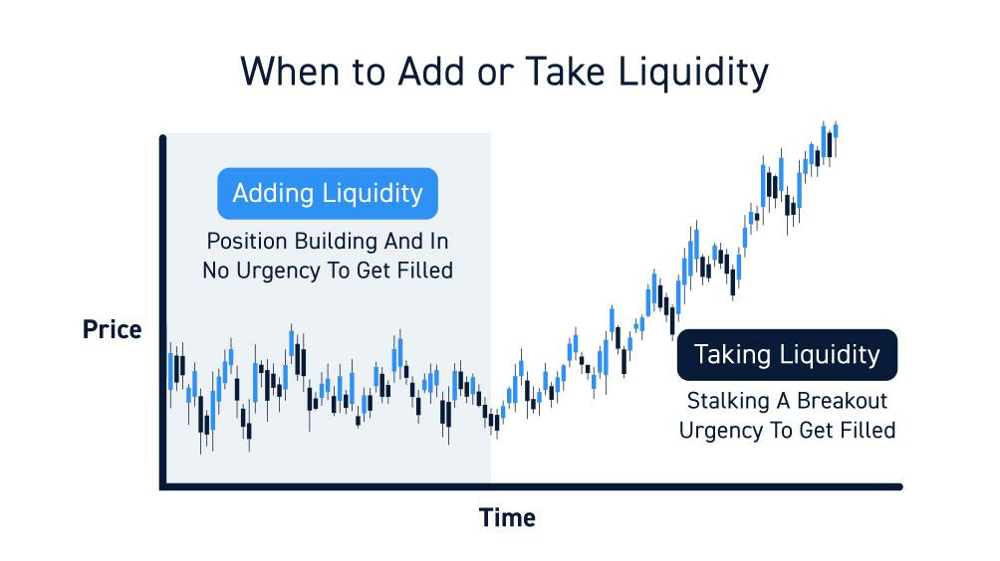

Options market liquidity refers to the ease with which options contracts can be bought and sold in the marketplace without causing a significant movement in their prices. High liquidity is characterized by a large number of buy and sell orders, narrow bid-ask spreads, and significant trading volume, allowing market participants to transact quickly and at stable prices. This liquidity is crucial for efficient price discovery, minimizing transaction costs, and providing flexibility for traders to enter and exit positions.

The importance of liquidity in the options market cannot be overstated. Liquidity facilitates the smooth functioning of markets by improving price stability and ensuring that traders have the ability to implement diverse strategies efficiently. It also contributes to lower transaction costs, as narrower bid-ask spreads reduce the expenses incurred in trading. Furthermore, liquidity underpins risk management practices, allowing traders to hedge and adjust positions with ease.



Algorithmic trading, often referred to as algo trading, involves the use of computer algorithms to automate and optimize trading processes. In the options market, these algorithms execute orders based on a set of predefined criteria, leveraging speed and precision to capitalize on market conditions. Algoriithmic trading can analyze vast amounts of data in real-time, executing complex strategies that would be infeasible for human traders to carry out manually.

Algo trading significantly impacts options market liquidity. By increasing the speed and volume of transactions, algorithms contribute to tighter bid-ask spreads and greater market depth. They facilitate quicker price adjustments in response to new information, thereby enhancing market efficiency. Additionally, algorithms can act as market makers, providing continuous liquidity even during periods of high volatility, which stabilizes prices and supports orderly market conditions.

The purpose of this article is to explore the intricate relationship between algorithmic trading and options market liquidity. It aims to provide a comprehensive understanding of how algorithmic practices influence liquidity and the various metrics used to assess these impacts. The article will also examine real-world examples and case studies to illustrate the effects of algorithmic trading on liquidity and discuss future trends and developments in this dynamic and evolving domain.

## Table of Contents

## Understanding Options Market Liquidity

Options market liquidity refers to the ease with which options contracts can be bought or sold in the market without causing significant price changes. High liquidity signifies a market with numerous buyers and sellers, enabling transactions at stable prices, whereas low liquidity can lead to greater price volatility and increased transaction costs.

Several factors influence [liquidity](/wiki/liquidity-risk-premium) in options markets. One primary determinant is the [volume](/wiki/volume-trading-strategy) of trading activity; more active markets typically offer enhanced liquidity due to the presence of multiple market participants. Additionally, the underlying asset's liquidity greatly impacts the liquidity of its options. Options derived from highly traded securities generally exhibit better liquidity. Options contract specifications, such as expiration dates and strike prices, also affect liquidity, as more standard and popular contracts tend to attract more trading interest.

Historically, liquidity in options markets has undergone significant transformations. Initially, options trading, largely open outcry, was characterized by limited liquidity and high costs. The advent of electronic trading platforms revolutionized the landscape, dramatically enhancing liquidity. Regulatory changes, such as the introduction of options exchanges and clearinghouses, have further contributed to increased market efficiency and liquidity.

Traders employ various liquidity metrics to assess and navigate options markets effectively. The bid-ask spread, which is the difference between the highest price a buyer is willing to pay and the lowest price a seller will accept, serves as a primary indicator of liquidity. A narrower spread usually indicates better liquidity. Additionally, open interest, the total number of outstanding options contracts, is monitored as it reflects the market's depth. Trading volume, representing the number of contracts traded within a specific period, is another pivotal metric, highlighting the level of market activity and liquidity.

In summary, liquidity in the options market is determined by factors such as trading volume, the underlying asset's liquidity, and contract specifications. Advancements in trading technology and regulatory frameworks have historically enhanced market liquidity. Traders rely on metrics like bid-ask spreads, open interest, and trading volume to evaluate and engage with the market effectively.

## Algorithmic Trading in Options Markets

Algorithmic trading involves the use of computer programs and systems to execute trading orders in financial markets, including options markets. These algorithms utilize mathematical models and statistical analysis to make trading decisions at speeds and frequencies human traders cannot achieve. The proliferation of [algorithmic trading](/wiki/algorithmic-trading) has transformed how financial markets operate, contributing significantly to market liquidity and efficiency.

### Types of Algorithms Used in Options Trading

Several types of algorithms are employed in options trading, each designed to achieve specific trading objectives. Some common types include:

1. **Market-Making Algorithms**: These algorithms aim to provide liquidity by continuously quoting both buy and sell prices in options contracts, profiting from the bid-ask spread. Market-making algorithms are essential in maintaining market efficiency by narrowing spreads and facilitating trades.

2. **Arbitrage Algorithms**: These algorithms seek to exploit price discrepancies between related options or between an option and its underlying asset. By capitalizing on these mispricings, arbitrage algorithms contribute to aligning option prices with their theoretical values.

3. **Trend-Following Algorithms**: Often used in systematic trading strategies, these algorithms identify trends in option price movements and execute trades that align with the prevailing market direction. They are crucial for traders looking to capitalize on established market trends.

4. **Volatility-Based Algorithms**: Given the significant role of volatility in option pricing, these algorithms focus on trading strategies contingent on forecasted volatility trends. They might adjust option positions based on implied volatility data, seeking profits from shifts in volatility.

### Benefits of Algo Trading for Liquidity

Algorithmic trading offers notable benefits that enhance liquidity in options markets:

- **Increased Trading Volumes**: By executing high-speed trades efficiently, algorithmic trading contributes to higher turnover, ensuring that markets remain liquid, even during periods of heightened volatility.

- **Tighter Bid-Ask Spreads**: Algorithms, especially market-making ones, help minimize the bid-ask spread by continuously providing quotes, making it less costly for traders to enter or exit positions.

- **Enhanced Price Discovery**: Algorithms process vast amounts of market data rapidly, leading to faster and more accurate reflection of information in options prices, facilitating better price discovery.

### Challenges Faced by Algo Traders in Options Markets

Despite the advantages, algorithmic trading faces various challenges in options markets:

- **High Market Complexity**: The options market is inherently complex due to the influence of factors like volatility, time decay, and strike prices, which algorithms need to continuously account for in trading models.

- **Latency and Slippage**: While algorithms trade quickly, network latency and market impact can lead to slippage – the difference between expected and actual transaction prices. Minimizing latency and managing slippage remains a persistent challenge.

- **Regulatory Constraints**: Regulatory scrutiny adds another layer of complexity, as traders must ensure that their algorithms comply with legal frameworks designed to maintain fair trading practices and market stability.

- **Adverse Market Conditions**: During periods of extreme market stress, algorithmic strategies may not perform as expected, potentially exacerbating volatility and contributing to liquidity disruptions.

In summary, algorithmic trading is a vital component of modern options markets, offering significant benefits for liquidity and efficiency. However, traders employing these technologies must navigate a host of complexities and challenges to capture these benefits effectively.

## Impact of Algo Trading on Options Market Liquidity

Algorithmic trading, often called algo trading, plays a pivotal role in enhancing the liquidity and overall efficiency of options markets. By employing advanced algorithms for executing trades, market participants can achieve faster and more precise operations, which significantly impacts the bid-ask spreads, transaction costs, and the behaviors of market makers, especially during periods of [volatility](/wiki/volatility-trading-strategies).

### How Algo Trading Enhances Market Efficiency

Algo trading improves market efficiency by swiftly executing numerous trades based on predefined criteria. These criteria often include price, timing, and volume, enabling traders to capitalize on market conditions rapidly. Algorithms process vast amounts of data in milliseconds, making trading more responsive to real-time market developments. This efficiency minimizes human error and enhances price discovery, contributing to a well-functioning market.

### Impact on Bid-Ask Spreads and Transaction Costs

The presence of algorithmic trading in the options market leads to tighter bid-ask spreads. Algorithms often place a large number of orders at varying prices, providing multiple price points and enhancing market depth. This increased depth allows for smaller spreads, as more competitive pricing becomes available. Consequently, transaction costs decrease, benefitting all market participants by allowing trades to occur with minimal price difference between buying and selling points.

### Role of Market Makers in Providing Liquidity

Market makers play a crucial role in maintaining market liquidity by continuously quoting buy and sell prices. With the integration of algorithmic trading, these entities can operate more efficiently. Algorithms allow market makers to dynamically adjust prices and manage inventory more effectively, ensuring that they remain competitive while fulfilling their role as liquidity providers. The ability to process information and react to market changes instantaneously reduces the risk for market makers, encouraging their participation, which further enhances liquidity.

### Examples of Algo Trading Affecting Liquidity During Volatile Periods

During times of market volatility, algorithmic trading can either stabilize or amplify fluctuations. Algorithms designed to provide liquidity can help stabilize markets by rapidly adjusting to market conditions, ensuring that opportunities to trade remain available even amidst sharp price movements. For instance, volatility-triggered algorithms can increase the frequency and quantity of orders, which helps absorb sudden sell-offs or buy pressures. However, there have been instances where poorly calibrated algorithms exacerbate market instability, leading to exaggerated price swings.

In real-world cases, such as during the "Flash Crash" of May 6, 2010, algorithmic trading was both a stabilizer and an escalator of market movements. While some algorithms provided liquidity by quickly adapting to falling prices, others contributed to the rapid acceleration of the crash, highlighting the dual-edged nature of algorithmic interventions during volatile periods.

In summary, algorithmic trading significantly influences options market liquidity by promoting efficient trade execution, reducing costs, and supporting market makers in maintaining liquidity. While it offers substantial benefits, its role during volatile times requires careful calibration and monitoring to prevent adverse outcomes that may disrupt market stability.

## Case Studies and Real-World Examples

Algorithmic trading's impact on options market liquidity can be illustrated through numerous case studies and specific trading events. These examples provide valuable insights into how algorithms influence market dynamics, especially during periods of high volatility.

One notable case study involves the implementation of algorithmic strategies by market makers to provide liquidity in the options market. Market makers use complex algorithms to hedge their risk and maintain market stability. These algorithms can rapidly adjust the bid-ask spreads in response to changing market conditions, thereby enhancing liquidity. For instance, during the market turbulence of March 2020, algorithms enabled market makers to dynamically update prices, which helped narrow spreads more quickly than manual intervention.

A specific trading event highlighting algorithmic trading's role in liquidity occurred during the 2010 Flash Crash. Although primarily affecting stocks, the crash also led to increased scrutiny of options markets. Algorithms, designed to mitigate risk by withdrawing liquidity during extreme volatility, exacerbated the situation. Some algorithms ceased operations to prevent losses, resulting in widened bid-ask spreads and less liquidity. This event underscored the dual nature of algorithms — while they can enhance liquidity under normal conditions, they may retract liquidity in turbulent times, prompting discussions on the need for adaptive algorithms that maintain stability even in crisis scenarios.

From historical data, several lessons have been learned about algorithmic trading and liquidity. Firstly, algorithms that incorporate real-time data analysis can maintain tighter spreads and make significant improvements in liquidity. Secondly, during volatile periods, some algorithms tend to decrease liquidity, suggesting a need for more robust risk management features in their design. For example, implementing circuit breakers or liquidity buffers could help mitigate the negative impact of withdrawn liquidity.

A quantitative analysis can be performed using Python to assess the impact of algorithmic trading on options market liquidity. By leveraging libraries such as NumPy and pandas, traders can analyze trade volumes and bid-ask spreads to quantify liquidity improvements or deteriorations over time. An exemplary Python snippet for such an analysis might include:

```python
import pandas as pd

# Assume df is a DataFrame containing columns 'timestamp', 'bid', 'ask', 'volume'
df['spread'] = df['ask'] - df['bid']

# Calculate average spread and volume over time
average_spread = df.groupby('timestamp')['spread'].mean()
average_volume = df.groupby('timestamp')['volume'].mean()

# Plot the results
average_spread.plot(title='Average Bid-Ask Spread Over Time')
average_volume.plot(title='Average Volume Over Time')
```

Overall, these case studies illustrate that while algorithmic trading has significantly advanced liquidity under stable market conditions, the need for adaptive strategies during periods of market stress remains paramount. The development of more resilient algorithms could enhance their capacity to sustain liquidity in all market scenarios.

## Future Trends and Developments

Technological advancements in algorithmic trading have been pivotal in shaping the options market, leading to increased liquidity and efficiency. These advancements primarily revolve around improvements in computing power, data analysis, and [machine learning](/wiki/machine-learning) techniques. With faster and more powerful computers, traders are now able to execute complex strategies in microseconds, enabling the processing of vast amounts of market data in real time, and consequently, making well-informed trading decisions swiftly. Sophisticated data analytics tools facilitate the identification of trading opportunities and risks, while machine learning algorithms enhance the ability to predict market movements, thereby optimizing trading strategies to increase profitability and liquidity.

The regulatory environment plays a significant role in influencing algorithmic trading and its impact on market liquidity. Regulatory bodies are continuously evolving their frameworks to ensure fair practices while maintaining market stability. Regulations such as the European Union's MiFID II and the SEC's rules on market access and trade reporting aim to promote transparency and fairness. These regulations require algorithmic traders to comply with certain standards, which can sometimes impose limitations on high-frequency trading strategies. However, these regulations also contribute positively to liquidity by mandating robust risk management practices and ensuring market integrity.

Predictions for future liquidity conditions in options markets largely hinge on the integration of emerging technologies and regulatory adaptations. As [artificial intelligence](/wiki/ai-artificial-intelligence) and quantum computing begin to play a larger role in trading, the potential for enhanced prediction accuracy and faster execution may lead to further improvements in market liquidity. Additionally, the continued development of blockchain technology promises increased transparency and could streamline post-trade processes, further boosting liquidity in the options markets. However, as technological capabilities expand, regulators must evolve concurrently to mitigate risks associated with such advancements.

Innovations in algorithmic strategies designed to enhance liquidity continue to emerge as traders explore new methods to capitalize on market conditions. Multi-asset trading strategies that optimize across various market segments, adaptive algorithms that modify trading behavior in response to changing market dynamics, and the implementation of more sophisticated market-making algorithms are examples of such innovations. These strategies not only aim to improve trading efficiency and execution but also contribute positively to overall market liquidity by providing continuous price stability and reducing transaction costs.

In conclusion, the future of algorithmic trading in the options market is characterized by a delicate balance between technological advancement and regulatory oversight. The ongoing development of new technologies and strategies promises to enhance liquidity, though these advancements must be carefully managed to ensure market stability and integrity.

## Conclusion

In summarizing the analysis of algorithmic trading's impact on options market liquidity, several key points emerge. Firstly, algorithmic trading plays an indispensable role in enhancing liquidity in the options market. By automating complex trading strategies, algorithmic trading increases market efficiency, leading to tighter bid-ask spreads and reduced transaction costs. The presence of algorithms helps facilitate a continuous flow of orders, thereby improving the depth and resilience of the market, even during periods of high volatility.

Balancing regulation and technological advancement is crucial for the sustained growth of liquidity in the options market. While technology provides the tools for sophisticated trading strategies, regulatory frameworks ensure that these tools are used responsibly, minimizing systemic risks. The continuous evolution of technology, such as improvements in data analytics and machine learning algorithms, promises further enhancements in trading efficiency. Nonetheless, regulatory oversight must evolve in parallel to address emerging challenges related to market fairness and stability.

In conclusion, ongoing research and innovation are vital in the field of algorithmic trading and market liquidity. As markets grow more complex and interconnected, the development of advanced algorithms will be necessary to sustain liquidity. Further studies on the interaction between algorithmic trading and market conditions, coupled with a dynamic regulatory approach, will help optimize the benefits of algorithmic trading while mitigating potential pitfalls. Stakeholders are encouraged to collaborate, fostering an environment where technology and regulation align to enhance liquidity and market integrity.

## References & Further Reading

[1]: Hautsch, N. (2012). ["Econometrics of Financial High-Frequency Data."](https://link.springer.com/book/10.1007/978-3-642-21925-2) Springer Science & Business Media.

[2]: Hendershott, T., Jones, C. M., & Menkveld, A. J. (2011). ["Does Algorithmic Trading Improve Liquidity?"](https://onlinelibrary.wiley.com/doi/full/10.1111/j.1540-6261.2010.01624.x) The Review of Financial Studies, 24(8), 2207-2244.

[3]: Aldridge, I. (2013). ["High-Frequency Trading: A Practical Guide to Algorithmic Strategies and Trading Systems."](https://www.amazon.com/High-Frequency-Trading-Practical-Algorithmic-Strategies/dp/1118343506) Wiley.

[4]: Chan, E. (2008). ["Quantitative Trading: How to Build Your Own Algorithmic Trading Business."](https://github.com/justinchou/books-quantitative-trading) Wiley Finance.

[5]: Hasbrouck, J., & Saar, G. (2013). ["Low-Latency Trading."](https://www.sciencedirect.com/science/article/abs/pii/S1386418113000165) The Review of Financial Studies, 26(9), 2345-2373.

[6]: Lopez de Prado, M. (2018). ["Advances in Financial Machine Learning."](https://books.google.com/books/about/Advances_in_Financial_Machine_Learning.html?id=oU9KDwAAQBAJ) Wiley.

[7]: Gomber, P., Arndt, B., Lutat, M., & Uhle, T. (2011). ["High-Frequency Trading."](https://papers.ssrn.com/sol3/papers.cfm?abstract_id=1858626) In Algorithmic Trading and DMA: An introduction to direct access trading strategies.

[8]: Kirilenko, A. A., Kyle, A. S., Samadi, M., & Tuzun, T. (2017). ["The Flash Crash: High-Frequency Trading in an Electronic Market."](https://www.jstor.org/stable/26652722) The Journal of Finance, 72(3), 2301-2341.