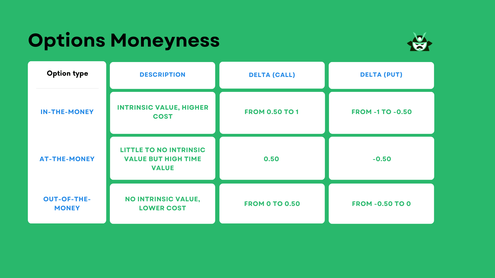

Financial derivatives, particularly options, are essential instruments in modern finance. These instruments derive their value from an underlying asset, such as stocks, commodities, or indices, offering traders the flexibility to hedge risk or speculate on market movements without directly owning the assets. Options, a prominent category of derivatives, grant the buyer the right, but not the obligation, to buy (call option) or sell (put option) an asset at a predetermined strike price before or at expiration.

A crucial aspect of options valuation is understanding option moneyness. Moneyness reflects the intrinsic value of an option, characterized by its relationship between the strike price and the current price of the underlying asset. An option is considered "in-the-money" (ITM) if execution at that moment would result in a positive cash flow, "at-the-money" (ATM) if the strike price is approximately equal to the asset's market price, and "out-of-the-money" (OTM) if execution would be unprofitable. Moneyness is crucial because it impacts both the potential profitability of an option and strategic decision-making in trading.



Algorithmic trading plays a significant role in optimizing the trading of these complex instruments. It employs mathematical models and sophisticated computer programs to make fast, accurate trading decisions, taking into account numerous variables such as price fluctuations, volatility, and time decay—each of which affects options valuation. By automating complex analytical and trading processes, algorithmic trading enables market participants to manage large volumes of trades, optimize execution strategies, and reduce human error.

This article examines the critical components of options valuation, focusing on moneyness, a key indicator of an option's potential value. Moreover, it explores how algorithmic trading tools enhance the efficiency and effectiveness of options trading, providing a powerful means to leverage market dynamics for optimum trading outcomes.

## Table of Contents

## Understanding Financial Derivatives and Options

Financial derivatives are financial instruments whose value is derived from the value of an underlying asset or group of assets. These assets can range from stocks, bonds, commodities, currencies, interest rates, to market indices. The primary purpose of derivatives is to manage risk by hedging against potential market movements, speculating on price changes for profit, or providing access to otherwise inaccessible assets or markets.

Options are a specific kind of derivative contract that bestow the holder the right, but not the obligation, to purchase (call option) or sell (put option) an underlying asset at a predetermined price within a specified time frame known as the expiration date. The pre-specified price is known as the strike price.

Understanding the basic elements of options contracts is crucial for anyone involved in options trading:

1. **Call Options**: These provide the holder the right to buy the underlying asset at the strike price before the contract expires. Call options are generally purchased by traders who expect an increase in the price of the underlying asset.

2. **Put Options**: These offer the holder the right to sell the underlying asset at the strike price before expiry. Investors typically buy put options when they anticipate a decline in the price of the underlying asset.

3. **Expiration Date**: This is the date on which the option contract becomes void. Post this date, the holder can no longer exercise the option. The expiration time frame can range from days to months, affecting the option's pricing and strategy consideration.

In trading options, various strategies can be devised using these fundamental components to either leverage potential market opportunities or protect against downside risks. The pricing of options is generally influenced by several factors: the current price of the underlying asset, the strike price, the [volatility](/wiki/volatility-trading-strategies) of the underlying asset, time until expiration, and prevailing risk-free interest rates. Understanding these facets is integral to effective trading, as they significantly impact the decision-making process on whether to exercise, sell, or retain a given option.

Mathematically, the valuation of an option can be expressed by models such as the Black-Scholes formula, which calculates the theoretical option price based on these dynamic components.

In Python, an example code snippet to calculate the theoretical price of a European call option using the Black-Scholes model is as follows:

```python
from scipy.stats import norm
import numpy as np

def black_scholes_call(S, K, T, r, sigma):
    """
    Calculate the Black-Scholes price for a European call option.

    S: Current stock price
    K: Strike price
    T: Time to expiration in years
    r: Risk-free interest rate
    sigma: Volatility of the underlying asset
    """
    d1 = (np.log(S / K) + (r + 0.5 * sigma ** 2) * T) / (sigma * np.sqrt(T))
    d2 = d1 - sigma * np.sqrt(T)

    call_price = (S * norm.cdf(d1) - K * np.exp(-r * T) * norm.cdf(d2))
    return call_price

# Example usage
S = 100  # Current stock price
K = 95   # Strike price
T = 1    # Time to expiration in years
r = 0.05 # Risk-free interest rate
sigma = 0.2  # Volatility

call_price = black_scholes_call(S, K, T, r, sigma)
print(f"The theoretical call option price is: {call_price:.2f}")
```

This example demonstrates the interplay of various parameters in options valuation and provides traders with a computational basis to make informed decisions. Understanding these foundational aspects is key to engaging effectively in derivatives and options markets.

## The Concept of Option Moneyness

Moneyness is a crucial concept in options trading as it helps traders assess the intrinsic value of an option by comparing the strike price of the option with the current market price of the underlying asset. This comparison categorizes options into three distinct types: in-the-money (ITM), at-the-money (ATM), and out-of-the-money (OTM).

An option is considered in-the-money (ITM) when exercising it would result in a positive cash flow. For a call option, this occurs when the market price of the underlying asset is higher than the strike price. Conversely, a put option is ITM when the strike price is greater than the market price. The intrinsic value of an option represents this inherent profitability and is calculated as the absolute difference between the market and strike prices for ITM options. Mathematically, the intrinsic value $V_{\text{intrinsic}}$ for a call option can be expressed as:

$$

V_{\text{intrinsic\_call}} = \max(0, S - K) 
$$

and for a put option as:

$$
V_{\text{intrinsic\_put}} = \max(0, K - S) 
$$

where $S$ is the current price of the underlying asset, and $K$ is the strike price of the option.

An option is at-the-money (ATM) when the strike price is approximately equal to the market price of the underlying asset. ATM options might not have intrinsic value but may [carry](/wiki/carry-trading) significant extrinsic value due to their potential for future profitability, largely influenced by time and volatility.

Out-of-the-money (OTM) options have no intrinsic value since exercising them would not be beneficial at current market prices. A call option is OTM if the strike price exceeds the market price, while a put option is OTM if the market price is higher than the strike price.

Understanding moneyness is fundamental to assessing the potential profitability of an option, influencing decision-making in trading. Moneyness affects premium calculations and risk assessments, and traders use this information to craft strategies that align with their financial goals and risk tolerance. Through the careful evaluation of moneyness, traders can better navigate the complexities of the options market and optimize their trading outcomes.

## Valuation of Options: Intrinsic and Extrinsic Values

Options valuation is a crucial aspect of financial analysis, encompassing both intrinsic and extrinsic values. These components together determine the premium of an option, reflecting the potential profit and the contributing factors of time and market dynamics.

The intrinsic value of an option represents the immediate benefit obtainable if the option were to be exercised at the current moment. For a call option, the intrinsic value is the difference between the underlying asset's price and the strike price, provided this difference is positive; otherwise, it is zero. Conversely, for a put option, the intrinsic value is the difference between the strike price and the underlying asset's price, again being zero if this difference is not favorable. Mathematically, these can be expressed as:

$$
\text{Intrinsic Value (Call)} = \max(0, S - K)
$$

$$
\text{Intrinsic Value (Put)} = \max(0, K - S)
$$

where $S$ is the current price of the underlying asset and $K$ is the strike price.

Extrinsic value, often referred to as time value, accounts for the probability that an option will become profitable before its expiration. This component considers factors such as time to expiration and the volatility of the underlying asset. The extrinsic value is essentially the option premium minus the intrinsic value. Higher volatility increases the likelihood of favorable price movements, thus inflating the extrinsic value. 

To price options accurately, mathematical models such as the Black-Scholes model are widely utilized. The Black-Scholes model assumes a log-normal distribution of asset prices and incorporates key variables including the current stock price, the option's strike price, time to expiration, risk-free [interest rate](/wiki/interest-rate-trading-strategies), and the volatility of the asset. The Black-Scholes formula for a European call option is expressed as:

$$
C = S_0 N(d_1) - Ke^{-rT} N(d_2)
$$

where
$$
d_1 = \frac{\ln(\frac{S_0}{K}) + (r + \frac{\sigma^2}{2})T}{\sigma \sqrt{T}}
$$

$$
d_2 = d_1 - \sigma \sqrt{T}
$$

Here, $C$ is the call option price, $N(\cdot)$ is the cumulative distribution function of the standard normal distribution, $S_0$ is the current price of the asset, $T$ is the time to expiration, $r$ is the risk-free interest rate, $\sigma$ is the volatility, and $K$ is the strike price.

The value of an option, therefore, is intricately linked to the interplay of its intrinsic and extrinsic components. Factors such as the asset's current market price, the volatility level, the chosen strike price, and the temporal distance to expiry all collaboratively influence the final pricing of an option. Understanding these dynamics is paramount for traders aiming to assess the value accurately and leverage profit opportunities effectively.

## Algorithmic Trading in Options

Algorithmic trading in options involves the use of algorithms—complex sets of rules or instructions commonly embedded in computer programs—to automate the trading process. This efficient method of trading allows traders and financial institutions to execute pre-programmed strategies at high speeds, far exceeding the capabilities of human traders. Algorithmic trading is particularly valuable in options trading, where the complexity of the instruments can present significant challenges in decision-making and execution.

One of the primary benefits of [algorithmic trading](/wiki/algorithmic-trading) in options is its ability to handle and process vast amounts of data with precision and speed. Options are derivative instruments whose values depend on various factors, including the underlying asset's price, strike price, time to expiration, and volatility. The intricate relationship between these factors requires quick and accurate calculations, which algorithms can perform efficiently. For instance, options traders often rely on mathematical models like the Black-Scholes model to determine options pricing. Algorithmic systems can input market conditions and fetch real-time data, calculating the implied volatilities and other crucial variables instantaneously.

Moreover, algorithmic trading systems can effectively manage the complexities associated with options moneyness. Moneyness, which reflects the intrinsic value of an option relative to the underlying asset's current price, can change rapidly due to market fluctuations. Algorithms can track these changes and adjust trading strategies accordingly, ensuring that trading positions remain optimal. This is particularly useful when managing large portfolios of options, where manual tracking would be inefficient and prone to errors.

Algorithmic trading also facilitates the execution of complex strategies that involve multiple trades and intricate rules. For example, a strategy might involve buying and selling options simultaneously across different strike prices and expirations to capitalize on discrepancies in pricing or to hedge positions. Executing such strategies requires high computational power and precision timing, as profits often depend on executing trades in narrow windows of opportunity. Algorithms can efficiently analyze market conditions and execute these trades almost instantaneously, ensuring that traders capitalize on favorable market movements.

Lastly, algorithmic trading enhances risk management in options trading. The systems can be programmed to monitor and adjust portfolios in real-time, responding swiftly to market events that might increase risk exposure. For example, an algorithm might automatically liquidate certain positions if the underlying asset's volatility exceeds a predetermined threshold, thereby mitigating potential losses.

In summary, algorithmic trading enhances the ability to manage and execute options trading strategies by utilizing advanced computational techniques to handle the complexity and speed required in modern financial markets. This capability not only improves trading efficiency and accuracy but also provides significant advantages in optimizing strategy execution and risk management.

## Strategies for Leveraging Option Moneyness

Traders utilize the concept of option moneyness to formulate strategies that either maximize returns or mitigate risks. This strategic approach involves understanding whether options are in-the-money (ITM), at-the-money (ATM), or out-of-the-money (OTM) and leveraging these states to exploit market conditions effectively.

### Maximizing Returns with Moneyness Strategies

One common strategy for maximizing returns involves purchasing deep ITM options. These options generally have a higher intrinsic value, meaning the difference between the underlying asset's current price and the strike price is significant. By investing in deep ITM options, traders capitalize on the inherent value of the option, albeit at a higher premium, which can offer a higher chance of profitability if the underlying asset moves favorably.

Another strategy is selling covered calls. This tactic involves owning the underlying asset and selling call options against it. Selling covered calls against ATM or slightly OTM options allows traders to generate income through premiums, while potentially selling the asset at a desired price if the options are exercised.

### Hedging with Moneyness

For hedging purposes, traders may utilize options based on their moneyness to protect against adverse price movements. OTM put options, for example, might be purchased as an insurance strategy. These options provide protection against significant drops in the underlying asset's price, offering a payout if the asset's price falls below the strike, thus offsetting some losses.

### Role of Algorithmic Trading

Algorithmic trading systems enhance the efficiency of these moneyness strategies by automating the process of analysis and execution. These systems can quickly assess market conditions, calculate potential profitability or risk, and execute trades with precision and speed, which is critical in the dynamic environment of options trading.

Python can be used to develop algorithmic trading systems to manage such strategies. Here's a simple example of a Python function that evaluates whether an option is ITM, ATM, or OTM:

```python
def option_moneyness(spot_price, strike_price):
    if spot_price > strike_price:
        return "ITM"
    elif spot_price == strike_price:
        return "ATM"
    else:
        return "OTM"

# Example usage
spot_price = 105
strike_price = 100
moneyness = option_moneyness(spot_price, strike_price)
print(f"The option is {moneyness}")
```

This function helps traders quickly assess the moneyness of an option, forming the basis for deciding which strategy to adopt. By leveraging algorithmic systems, traders can optimize their strategies, adjust positions automatically as market conditions change, and effectively balance the trade-off between risk and reward.

## Risk Management and Moneyness

Understanding moneyness is crucial in managing the risks associated with options trading. Moneyness refers to the intrinsic value of an option, which is determined by the position of the underlying asset's current price relative to the option's strike price. This classification, which categorizes options as in-the-money (ITM), at-the-money (ATM), or out-of-the-money (OTM), has significant implications for risk management strategies.

Options that are deep ITM carry intrinsic value as the difference between the underlying asset's market price and the strike price is substantial and favorable for the option holder. Although these options have higher premiums, they tend to be less risky compared to OTM options due to the higher probability of profit at expiration. However, the risk associated with holding deep ITM options is predominantly linked to the sensitivity to asset price movements—measured by the option's delta. Managing such risk involves using delta hedging strategies, which aim to create a delta-neutral position to mitigate the effect of price changes in the underlying asset.

Conversely, OTM options, with strike prices unfavorable relative to the current market price, feature low or zero intrinsic value. These options are riskier due to their high sensitivity to volatility and lower likelihood of expiring in the money. The primary appeal of OTM options is their cost-effectiveness combined with the high potential for profit if the market moves favorably. Risk management strategies for OTM options often focus on leveraging the options' gamma, which measures the delta's rate of change, to adjust positions dynamically in response to large movements in the underlying asset's price. 

Algorithmic trading systems enhance risk management by employing sophisticated algorithms capable of monitoring and responding to market movements in real-time. These systems can efficiently adjust holdings, execute delta and gamma hedging strategies, and capitalize on volatility changes to protect against adverse market shifts. For instance, an algorithm might automatically execute trades to rebalance a portfolio and maintain a targeted delta level, thus mitigating risk exposure rapidly and reducing the potential for human error.

Incorporating Python code, one can implement a basic algorithm that calculates delta-neutral positions. Here's an example:

```python
from scipy.stats import norm
import numpy as np

def black_scholes_delta(S, K, T, r, sigma, option_type='call'):
    """Calculate the Black-Scholes delta for a European option."""
    d1 = (np.log(S / K) + (r + 0.5 * sigma ** 2) * T) / (sigma * np.sqrt(T))
    if option_type == 'call':
        return norm.cdf(d1)
    elif option_type == 'put':
        return norm.cdf(d1) - 1

# Example parameters
spot_price = 100  # current stock price
strike_price = 100  # option strike price
time_to_expiry = 1  # time to expiration in years
risk_free_rate = 0.05  # risk-free interest rate
volatility = 0.2  # stock volatility

# Calculate delta for a call option
delta = black_scholes_delta(spot_price, strike_price, time_to_expiry, risk_free_rate, volatility)
print(f"Delta: {delta}")
```

This simplistic model can be extended to devise strategies that maintain delta neutral positions by dynamically rebalancing the portfolio as market conditions change. In summary, understanding and leveraging moneyness through algorithmic trading systems provides a robust framework for effective risk management in options trading, allowing traders to navigate the complexities of financial markets with heightened precision and control.

## Conclusion

Options valuation, particularly when considering moneyness, plays a fundamental role in financial trading. This complex aspect of derivatives trading requires a deep understanding of the intrinsic and extrinsic components of option pricing. The concept of moneyness—whether an option is in-the-money (ITM), at-the-money (ATM), or out-of-the-money (OTM)—is crucial because it determines the potential profitability of options and directly influences trading decisions and strategies.

The integration of algorithmic trading into the options market has transformed traditional trading methodologies. By employing sophisticated mathematical models and advanced computational techniques, algorithmic trading systems can process large volumes of data rapidly and execute complex trading strategies with precision. These systems are particularly advantageous in managing the intricate variables associated with options trading, such as volatility, time decay, and moneyness. For example, a Python-based algorithmic trading model might dynamically adjust the portfolio composition based on real-time changes in moneyness, as demonstrated through scripts utilizing libraries like NumPy and pandas for data analysis and [backtesting](/wiki/backtesting).

```python
import numpy as np
import pandas as pd

# Example of how a basic model might adjust options based on moneyness
# Randomly generated values for demonstration purposes
options_data = pd.DataFrame({
    'strike_price': np.random.uniform(90, 110, 10),
    'market_price': np.random.uniform(95, 105, 10)
})

# Calculate moneyness for each option
options_data['moneyness'] = options_data['market_price'] / options_data['strike_price']

# Basic decision rule based on moneyness
def trading_decision(row):
    if row['moneyness'] > 1.05:
        return 'Buy'
    elif row['moneyness'] < 0.95:
        return 'Sell'
    else:
        return 'Hold'

# Apply the decision rule
options_data['decision'] = options_data.apply(trading_decision, axis=1)
```

A comprehensive understanding and strategic application of options moneyness can significantly enhance trading performance and risk management. Traders can optimize their portfolios by leveraging opportunities presented by different moneyness scenarios, thus maximizing returns while mitigating risk. This is particularly important as financial markets become increasingly volatile and complex. In conclusion, mastering the intricacies of options valuation and the technical prowess of algorithmic trading provides traders with the tools needed to thrive in the competitive environment of financial markets.

## References & Further Reading

[1]: ["Options, Futures, and Other Derivatives"](https://www.amazon.com/Options-Futures-Other-Derivatives-10th/dp/013447208X) by John C. Hull

[2]: Black, F., & Scholes, M. (1973). ["The Pricing of Options and Corporate Liabilities."](https://www.cs.princeton.edu/courses/archive/fall09/cos323/papers/black_scholes73.pdf) Journal of Political Economy, 81(3), 637-654.

[3]: Haug, E. G. (2007). ["The Complete Guide to Option Pricing Formulas"](https://www.amazon.com/Complete-Guide-Option-Pricing-Formulas/dp/0071389970)

[4]: Natenberg, S. (1994). ["Option Volatility and Pricing: Advanced Trading Strategies and Techniques"](https://www.amazon.com/Option-Volatility-Pricing-Strategies-Techniques/dp/0071818774)

[5]: Aldridge, I. (2013). ["High-Frequency Trading: A Practical Guide to Algorithmic Strategies and Trading Systems"](https://www.amazon.com/High-Frequency-Trading-Practical-Algorithmic-Strategies/dp/1118343506)

[6]: Taleb, N. N. (1997). ["Dynamic Hedging: Managing Vanilla and Exotic Options"](https://archive.org/details/dynamichedgingma0000tale)

[7]: Hull, J., & White, A. (1987). ["The Impact of Stochastic Volatility on the Pricing of Index Options."](https://onlinelibrary.wiley.com/doi/full/10.1111/j.1540-6261.1987.tb02568.x) Journal of Finance, 42(2), 281-300.