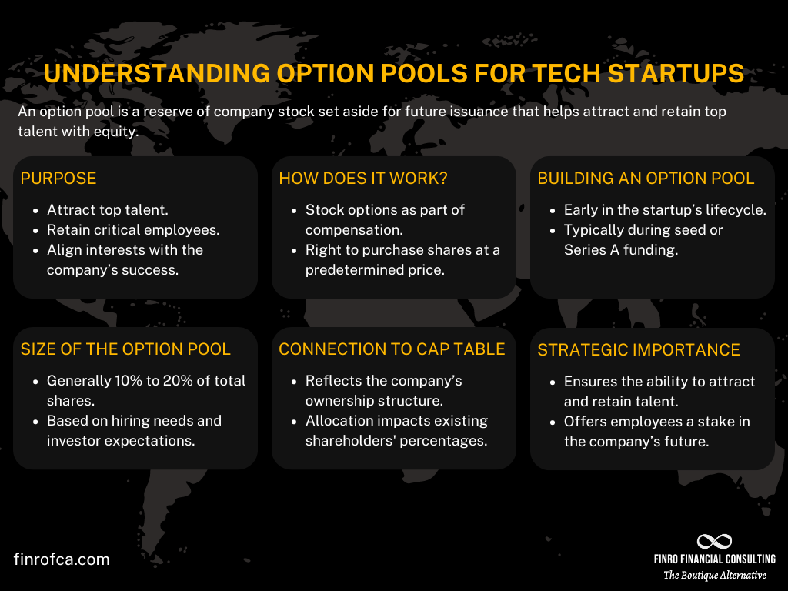

## Table of Contents

## What is an option pool?

An option pool is a portion of a company's shares that are set aside for employees, advisors, and sometimes consultants. It's like a special reserve that a company creates to attract and keep talented people. When a company gives someone options from the pool, it's giving them the right to buy shares in the future at a set price. This can be a big motivator for employees because if the company does well, the value of those shares could go up a lot.

The size of an option pool can affect how much of the company the founders and investors own. When a company is starting up or raising money, investors might ask for an option pool to be created or increased. This is to make sure there are enough shares to give to new hires as the company grows. The option pool is usually set as a percentage of the total shares, and it's important for founders to think carefully about how big it should be, because it can dilute their ownership.

## Why do companies create option pools?

Companies create option pools to attract and keep good workers. When a company gives someone options from the pool, it's like giving them a chance to own a piece of the company later on. This can make employees feel more connected to the company's success. They might work harder and stay longer because they want the company to do well so their options become more valuable.

Option pools are also important when a company is trying to get money from investors. Investors often want to see an option pool in place so the company can hire more people as it grows. But, making an option pool means the founders and current owners will own a smaller piece of the company. So, it's a balance - the pool helps the company grow and succeed, but it also means sharing the company with more people.

## How is an option pool size determined?

When deciding how big an option pool should be, companies look at a few things. They think about how many people they need to hire and how much of the company they want to give to those new hires. They also talk to investors, who often have ideas about how big the pool should be. A bigger pool might help attract more talent, but it also means the founders and current owners will own less of the company.

The size of the option pool is usually set as a percentage of the total shares. This percentage can be anywhere from 10% to 20%, but it depends on the company's stage and plans. A startup might need a bigger pool to attract early employees, while a more established company might need a smaller one. It's a balancing act - the company wants to have enough options to offer good people, but not so many that it gives away too much of the company.

## Who typically receives options from the option pool?

Companies usually give options from the option pool to their employees. This includes everyone from the top executives to the newest hires. They do this to make people want to work hard and stay with the company. When employees get options, they feel like they own a part of the company and are more likely to help it succeed.

Sometimes, companies also give options to advisors and consultants. These are people who help the company but aren't regular employees. Giving them options is a way to thank them for their help and to keep them interested in the company's success. By sharing options with a variety of people, the company can build a strong team that's all working toward the same goal.

## What is the impact of an option pool on company valuation?

When a company creates an option pool, it can affect how much the company is worth. This is because the option pool is made up of shares that are set aside for employees and others. When these shares are added to the total number of shares, it can make each share worth less. This is called dilution. So, if investors are looking at buying part of the company, they might see it as being worth less because there are more shares to go around.

However, having an option pool can also help the company grow and become more valuable in the long run. By giving options to employees, the company can attract and keep talented people who can help the business succeed. If the company does well because of these employees, the value of the company could go up. So, while the option pool might lower the value a bit at first, it could lead to a bigger payoff later if the company grows and does well.

## How does an option pool affect existing shareholders?

When a company creates an option pool, it can change things for the people who already own shares. The pool is made up of new shares, and when these are added, it means the existing shares are worth a smaller piece of the company. This is called dilution. So, if you own 10% of the company before the pool is created, you might own a bit less after because there are more shares now.

But, there's a good side too. The option pool can help the company grow by attracting new employees who will work hard to make the company successful. If the company does well because of these new people, the value of the company might go up. So, even though existing shareholders might own a smaller piece, that piece could be worth more if the company grows. It's a bit like trading a smaller slice of a bigger pie for a chance at a bigger slice of an even bigger pie later.

## What are the tax implications of receiving options from an option pool?

When you get options from an option pool, it can affect your taxes. There are two main types of options: non-qualified stock options (NSOs) and incentive stock options (ISOs). With NSOs, you have to pay taxes when you exercise the options, which means when you buy the shares. The difference between what you pay for the shares and what they're worth at that time is counted as income, and you'll have to pay regular income tax on it. Later, if you sell the shares, you might have to pay capital gains tax on any profit you make.

ISOs can be a bit different. If you meet certain rules, you don't have to pay income tax when you exercise them. But, if you sell the shares later, you might have to pay capital gains tax on the profit. If you don't follow the rules, like selling the shares too soon, you might have to pay regular income tax on the difference between what you paid and what the shares were worth when you exercised the options. It's a good idea to talk to a tax expert to understand how your options will affect your taxes.

## How are options from an option pool typically structured?

Options from an option pool are usually given to employees as a way to reward them and keep them interested in the company's success. When someone gets options, they get the right to buy shares of the company at a certain price, called the exercise price or strike price. This price is often set at what the shares are worth when the options are given out. The options come with a vesting schedule, which means the employee has to stay with the company for a certain amount of time before they can use the options. A common vesting schedule is over four years, with a one-year cliff. This means the employee gets nothing if they leave before a year, but after a year, they start to get some options, and more each month until the four years are up.

When it's time to use the options, the employee can buy the shares at the exercise price. If the company has done well and the shares are now worth more than the exercise price, the employee can make a profit by selling the shares at the higher market price. But, if the company hasn't done well and the shares are worth less than the exercise price, the options might not be worth using. Companies often set rules about when employees can sell the shares they get from exercising options, like waiting periods or black-out dates, to make sure everyone follows the company's trading policies.

## What is the process for creating and managing an option pool?

When a company wants to create an option pool, it starts by deciding how big the pool should be. This is usually done with help from investors and the company's advisors. They think about how many new people the company will need to hire and how much of the company they want to give to those new hires. Once they agree on a size, usually a percentage of the total shares, they set aside those shares for the option pool. This means the existing shareholders will own a smaller piece of the company because there are more shares now. The company then writes down the rules for the option pool in its legal documents, like the company's bylaws or shareholder agreement.

After the option pool is created, the company needs to manage it. This means deciding who gets options and how many. Usually, a company's board of directors or a special committee handles this. They look at things like how important the job is and how long someone has been with the company. When they give out options, they set an exercise price, which is what the person has to pay to buy the shares later. They also set a vesting schedule, which means the person has to stay with the company for a certain time before they can use the options. The company keeps track of all this in a special record called a cap table, which shows who owns what part of the company. If the company needs to, it can change the size of the option pool later, but this can affect the value of the company and how much everyone owns.

## How can the size of an option pool be adjusted over time?

The size of an option pool can be changed as the company grows and its needs change. If the company needs to hire more people or wants to give more options to keep current employees happy, it might decide to make the pool bigger. To do this, the company's board of directors or shareholders might vote to increase the number of shares in the pool. This means more shares are set aside for options, which can make the existing shareholders own a smaller piece of the company because there are more shares now.

On the other hand, if the company has more shares in the pool than it needs, it might decide to make the pool smaller. This can happen if the company doesn't need to hire as many people as it thought or if it wants to give more value back to the existing shareholders. To shrink the pool, the company can cancel some of the shares that were set aside for options and put them back into the company's total shares. This can make the existing shareholders own a bigger piece of the company because there are fewer shares now.

## What are the common pitfalls to avoid when setting up an option pool?

When setting up an option pool, one common mistake is making it too big or too small. If the pool is too big, it can dilute the ownership of the founders and existing shareholders too much. This means they own a smaller piece of the company, which might not be good for them. On the other hand, if the pool is too small, the company might not have enough options to give to new hires or to keep current employees happy. This can make it hard to attract and keep the talent the company needs to grow.

Another pitfall is not thinking about the timing of when to set up the pool. Some companies wait too long to create an option pool, which can make it harder to hire people when they need to. It's better to set up the pool early, so the company is ready to offer options as soon as they start hiring. Also, companies should be clear about the rules for the pool, like the vesting schedule and exercise price. If these rules are not clear, it can cause confusion and problems later on.

## How do option pools vary across different industries and company stages?

Option pools can be different depending on the industry a company is in. For example, tech companies often need a bigger option pool because they have to compete for talented engineers and other tech workers. These workers might want more options because they know the company could grow a lot and the options could be worth a lot of money one day. On the other hand, companies in more traditional industries, like manufacturing, might not need as big of an option pool because they might not grow as fast or need to compete as much for talent.

The stage of the company also matters when deciding on the size of the option pool. A startup that's just beginning might need a bigger pool to attract the first employees who are taking a risk by joining a new company. These early employees might get more options because there's a bigger chance the company could grow a lot. As the company gets bigger and more established, it might not need as big of an option pool because it's easier to attract employees and the company might not grow as quickly. But, if the company is planning to grow a lot or go public, it might still need a bigger pool to keep employees motivated and to attract new talent.

## What are the strategies for effective option pool management?

Effective management of option pools necessitates striking a balance between employee incentives and shareholder value, ensuring that the interests of both are adequately addressed. One of the pivotal considerations in managing option pools is the distinction between pre-money and post-money option pool adjustments, which can significantly impact equity dilution for company founders.

When planning an option pool, founders often face the decision of whether to establish it before or after securing a round of funding. A pre-money option pool is created before investor capital is added to the company's balance sheet. In contrast, a post-money option pool is established after the investment is made. Each approach has implications for dilution—the reduction in ownership percentage for existing shareholders, including founders.

**Impact on Dilution:**

1. **Pre-Money Option Pool**: Establishing the option pool beforehand allows investors to effectively spread the equity dilution among existing shareholders and the incoming employees. The formula for calculating the founder's new ownership post-financing with a pre-money option pool is:
$$
   \text{Founder's New Ownership} = \frac{\text{Founder's Original Ownership \%}}{\text{1 + Investor's Ownership \% + Option Pool \%}}

$$

2. **Post-Money Option Pool**: In this scenario, the founders bear more of the dilution as the pool is introduced after investment, and the existing valuation accounts for the investor's share. This can lead to greater equity dilution for founders as option pools are taken out of their ownership. The formula is:
$$
   \text{Founder's New Ownership} = \frac{\text{Founder's Original Ownership \%}}{\text{1 + Investor's Ownership \%}}

$$
$$
   \text{Post Option Pool Adjustment} = \text{Founder's New Ownership \%} \times (1 - \text{Option Pool Size \%})

$$

Another essential strategy in effective option pool management is ensuring that options are granted at fair market value, which aligns with the company’s growth trajectory. This is accomplished through regular 409A valuations. Section 409A of the Internal Revenue Code mandates that non-qualified deferred compensation plans comply with specific valuation principles. Conducting regular 409A valuations guarantees that the strike price of granted options reflects the company’s most up-to-date valuation, thereby protecting the company and its employees from potential tax liabilities and ensuring that the options are an attractive form of compensation.

Implementing checks for these valuations and adjusting option pools in line with the company’s growth enables a startup to offer fair and competitive compensation packages that can attract and retain top talent. Consistent reevaluation and adjustment of the option pool size help align employee incentives with long-term shareholder value, fostering a sustainable growth environment for the startup.

By incorporating these strategies, a startup can effectively manage its option pool, thus strengthening its ability to attract skilled personnel while maintaining a fair distribution of equity among stakeholders.

## References & Further Reading

[1]: Cumming, D., Filatotchev, I., Knill, A., Reeb, D. M., & Senbet, L. W. (2017). ["Law, finance, and the international mobility of corporate governance."](https://research.wu.ac.at/en/publications/law-finance-and-the-international-mobility-of-corporate-governanc-3) Academy of Management Perspectives.

[2]: Graham, B., & Dodd, D. (2008). ["Security Analysis: The Classic 1940 Edition."](https://play.google.com/store/books/details/Security_Analysis_The_Classic_1940_Edition_Edition?id=7RULWTojgWgC&hl=en-US) McGraw Hill Professional.

[3]: Malkiel, B. G. (1999). ["A Random Walk Down Wall Street: Including a Life-Cycle Guide to Personal Investing."](https://archive.org/details/randomwalkdownwa00burt_1) W. W. Norton & Company.

[4]: Myers, S. C., & Majluf, N. S. (1984). ["Corporate Financing and Investment Decisions When Firms Have Information that Investors Do Not Have."](https://www.sciencedirect.com/science/article/pii/0304405X84900230) Journal of Financial Economics.

[5]: Shreve, S. E. (2004). ["Stochastic Calculus for Finance II: Continuous-Time Models."](https://link.springer.com/book/9780387401010) Springer Finance.

[6]: Narang, R. K. (2009). ["Inside the Black Box: The Simple Truth About Quantitative Trading."](https://onlinelibrary.wiley.com/doi/book/10.1002/9781118267738) Wiley.

[7]: Kuhn, M., & Johnson, K. (2013). ["Applied Predictive Modeling."](https://link.springer.com/book/10.1007/978-1-4614-6849-3) Springer.

[8]: [National Venture Capital Association (NVCA) 2022 Yearbook](https://nvca.org/document/nvca-2022-yearbook-final-2/)