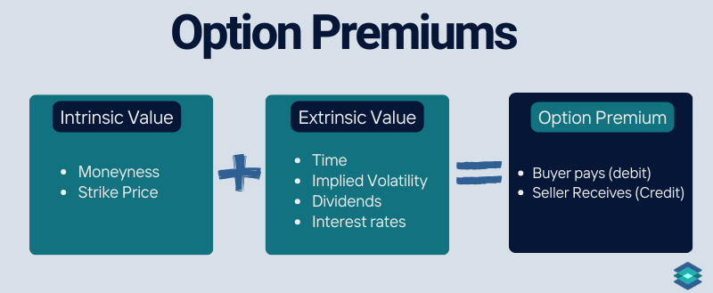

## Table of Contents

## What is an option premium?

An option premium is the price that a buyer pays to a seller for an options contract. This price is determined by various factors, including the current price of the underlying asset, the strike price of the option, the time until the option expires, and the expected volatility of the asset's price. The premium is essentially the cost of the right, but not the obligation, to buy or sell the underlying asset at a specified price before the option expires.

When you buy an option, you are hoping that the price of the underlying asset will move in a way that makes your option more valuable. If you buy a call option and the asset's price goes up, or if you buy a put option and the asset's price goes down, the value of your option increases. The option premium you paid initially is your investment, and if the option becomes more valuable, you can sell it for a profit. If the option expires worthless, you lose the premium you paid.

## How is the option premium determined?

The option premium is figured out by looking at a few important things. One big thing is the price of the thing the option is for, like a stock. If the stock's price is close to the option's strike price, the option might cost more. Another thing is how long the option lasts. If it lasts a long time, it might cost more because there's more time for the stock price to change in a good way. Also, how much the stock's price might jump around, called volatility, matters. If people think the stock's price might change a lot, the option could cost more.

Another part of figuring out the option premium is the interest rate and any money the stock pays out, like dividends. Higher interest rates can make call options cost more and put options cost less. Dividends can make call options cost less and put options cost more. All these things together help decide how much someone has to pay for an option. The fancy math behind it is called an option pricing model, like the Black-Scholes model, which uses all these factors to come up with the premium.

## What are the basic components of an option's price?

The price of an option, called the premium, depends on several things. One important thing is the price of the thing the option is for, like a stock. If the stock's price is close to the option's strike price, the option might be more expensive. Another thing is how long the option lasts. If it lasts a long time, it might cost more because there's more time for the stock price to change in a good way. Also, how much the stock's price might jump around, called volatility, matters. If people think the stock's price might change a lot, the option could cost more.

Another part of figuring out the option's price is the interest rate and any money the stock pays out, like dividends. Higher interest rates can make call options cost more and put options cost less. Dividends can make call options cost less and put options cost more. All these things together help decide how much someone has to pay for an option. The fancy math behind it is called an option pricing model, like the Black-Scholes model, which uses all these factors to come up with the premium.

## What is the difference between intrinsic value and time value in options?

Intrinsic value is the part of an option's price that comes from how much the option is worth right now if you used it. For a call option, it's the difference between the stock's price and the strike price, but only if the stock's price is higher. For a put option, it's the difference between the strike price and the stock's price, but only if the stock's price is lower. If the option wouldn't make money if you used it right now, the intrinsic value is zero.

Time value is the other part of an option's price. It's the extra amount you pay for the chance that the option might become more valuable before it expires. Time value depends on how long the option has until it expires and how much the stock's price might change. The more time left and the more the stock's price might jump around, the higher the time value can be. As the option gets closer to expiring, the time value goes down because there's less time for good things to happen.

## How does the underlying asset's price affect the option premium?

The price of the thing the option is for, like a stock, can make the option's price, or premium, go up or down. If the stock's price is close to the option's strike price, the option might cost more. For a call option, if the stock's price is higher than the strike price, it has intrinsic value and will be worth more. For a put option, if the stock's price is lower than the strike price, it also has intrinsic value and will be more expensive. So, when the stock's price moves in a way that makes the option worth something right now, the premium goes up.

But the stock's price also changes the time value part of the option's premium. Time value is what you pay for the chance that the option might become more valuable before it expires. If the stock's price is far away from the strike price, the option might still have a lot of time value because there's still a chance it could move in the right direction. But if the stock's price is really far from the strike price, the time value might be less because it seems less likely the option will end up being worth something. So, the stock's price affects both the intrinsic value and the time value, making the option's premium change.

## What role does volatility play in option pricing?

Volatility is a big deal when it comes to figuring out how much an option costs. It's all about how much the price of the thing the option is for, like a stock, might jump around. If people think the stock's price could change a lot, the option's price goes up. This is because the option could become more valuable if the stock's price moves in the right direction. So, if a stock is expected to be very up and down, the option's price will be higher because there's more chance for big changes.

This part of the option's price is called time value. Time value is what you pay for the chance that the option might become worth more before it runs out of time. If the stock is really volatile, there's more time value because there's a bigger chance the stock's price could move a lot before the option expires. So, when you're buying an option, you're not just paying for what it's worth right now, but also for the possibility that it could be worth a lot more later because of the stock's ups and downs.

## How does time to expiration impact the option premium?

The time until an option expires is a big part of what makes up its price, called the premium. The longer an option has before it expires, the more it might cost. This is because there's more time for the price of the thing the option is for, like a stock, to change in a way that makes the option worth more. So, if you're buying an option that lasts a long time, you might have to pay more for it because there's more chance for good things to happen.

As the time until the option expires gets shorter, the price of the option usually goes down. This is because there's less time left for the stock's price to move in the right direction. The part of the option's price that comes from the time left is called time value. Time value is what you pay for the chance that the option might become more valuable before it runs out of time. So, the closer the option gets to expiring, the less time value it has, and the less you might have to pay for it.

## What are interest rates and dividends, and how do they influence option pricing?

Interest rates and dividends are important when figuring out how much an option costs. Interest rates are what banks charge you for borrowing money or what they pay you for keeping your money with them. Dividends are payments that companies sometimes give to people who own their stocks, kind of like a reward for owning the stock. Both of these things can make the price of an option go up or down.

Higher interest rates can make call options cost more and put options cost less. This is because if you buy a call option, you're not using your money to buy the stock right away, so you can put that money in the bank and earn interest. On the other hand, if you sell a put option, you might have to buy the stock later, and you'll need to borrow money to do that, which costs more when interest rates are high. Dividends work the other way around. If a stock pays dividends, call options might cost less because the stock's price might go down when the dividend is paid out. But put options might cost more because the stock's price going down makes the put option more valuable.

## Can you explain the Black-Scholes model and its use in option pricing?

The Black-Scholes model is a fancy way to figure out how much an option should cost. It was made by people named Fischer Black, Myron Scholes, and Robert Merton back in the 1970s. The model uses a bunch of things like the price of the stock, how long the option lasts, how much the stock's price might jump around (that's called volatility), the interest rate, and any money the stock pays out (like dividends) to come up with the option's price. It's kind of like a recipe that mixes all these things together to give you the final price of the option.

People use the Black-Scholes model a lot because it helps them understand what an option should be worth. Traders and investors use it to decide if an option is a good deal or not. It's not perfect because it makes some guesses about how the world works, like assuming the stock's price moves in a certain way. But even with its guesses, it's been really helpful for a long time in the world of options trading. It's like a tool that gives you a good starting point to figure out how much to pay for an option.

## How do market conditions and sentiment affect option premiums?

Market conditions and how people feel about the market can really change how much an option costs. If the market is going crazy with lots of ups and downs, people might think the stock's price could change a lot, so they'll pay more for options. This is because options give you the chance to make money if the stock's price moves in the right way. Also, if everyone is feeling good about the market and thinks prices will go up, call options might cost more because more people want to buy them. On the other hand, if everyone is worried and thinks prices will go down, put options might cost more because more people want to protect themselves or bet on falling prices.

Even things like big news or events can make option prices go up or down. If there's a big election coming up or a company is about to say something important, people might think the stock's price could change a lot, so they'll pay more for options. This is because they want to be ready for whatever might happen. So, the way the market is doing and how people feel about it can make a big difference in how much you have to pay for an option.

## What advanced pricing models exist beyond Black-Scholes, and how do they differ?

Besides the Black-Scholes model, there are other fancy ways to figure out how much an option should cost. One of these is the Binomial model. This model breaks down the time until the option expires into little pieces and looks at what could happen at each step. It's like playing a game where you keep flipping a coin to see if the stock's price goes up or down. This model is good because it can handle things like the stock paying out dividends or if you can't sell the option until a certain time. Another model is the Monte Carlo simulation, which is like running a bunch of pretend games to see all the different ways the stock's price could move. This model is really helpful when you're dealing with options that are more complicated or when the stock's price might not move in the simple way that Black-Scholes assumes.

These other models are different from Black-Scholes because they try to fix some of its problems. Black-Scholes assumes the stock's price moves in a smooth, predictable way, but in real life, prices can jump around a lot. The Binomial model and Monte Carlo simulation can deal with these jumps better. They also let you look at more complicated situations, like options that can be used at different times or options on things that don't move in a simple way. So, while Black-Scholes is a good starting point, these other models give you more tools to understand how much an option should really cost in the wild world of the market.

## How can traders use option Greeks to manage and predict changes in option premiums?

Option Greeks are special tools that help traders understand how different things can change the price of an option. The main Greeks are Delta, Gamma, Theta, Vega, and Rho. Delta tells you how much the option's price will change if the stock's price moves a little bit. Gamma shows how Delta itself changes when the stock's price moves. Theta is all about how the option's price changes as time goes by, getting less valuable as it gets closer to expiring. Vega looks at how much the option's price changes when people think the stock's price might jump around more or less. And Rho is about how the option's price changes with interest rates. By keeping an eye on these Greeks, traders can guess how the option's price might change and make better choices.

Traders use these Greeks to manage their options. For example, if a trader sees that Delta is high, they know the option's price will move a lot with small changes in the stock's price. This can be good if they think the stock's price will go their way, but it can also be risky. Gamma helps them understand how sensitive Delta is, so they can adjust their positions if they think the stock's price will change a lot. Theta reminds them that time is ticking, so they might want to sell options that are losing value quickly. Vega is important if they think the stock's price might become more or less volatile, letting them choose options that will benefit from those changes. And Rho can help them if they think interest rates will change. By using these Greeks, traders can make smarter decisions and manage their risks better.

## What are the factors affecting option premium?

Option premiums are influenced by several key factors that determine the overall price of an option contract. These factors are crucial for traders and investors to understand in order to evaluate and predict the movements and pricing of options effectively.

1. **Intrinsic Value**: The intrinsic value of an option is the difference between the current market price of the underlying asset and the strike price of the option. For a call option, the intrinsic value is calculated as the current price of the asset minus the strike price. For a put option, it is the strike price minus the current asset price. An option is considered "in-the-money" if this value is positive, thereby contributing directly to the premium of the option.
$$
   \text{Intrinsic Value (Call)} = \max(0, \text{Current Price} - \text{Strike Price})

$$
$$
   \text{Intrinsic Value (Put)} = \max(0, \text{Strike Price} - \text{Current Price})

$$

2. **Time to Expiry**: The time value of an option, often referred to as extrinsic value, becomes significant with more time remaining until the option's expiration. Longer durations allow greater potential for the underlying asset to reach favorable prices, thus increasing the premium. This is because options lose time value as expiration nears, known as time decay or theta decay.

3. **Volatility**: Implied volatility represents the market's forecast of a likely movement in the asset price. Higher volatility increases the premium because it amplifies the probability of the option ending in-the-money. As volatility rises, the option's extrinsic value rises, thereby inflating the premium. The Black-Scholes model or similar options pricing models are often employed to quantify and predict the impact of volatility on an option's price.

4. **Interest Rates**: Changes in interest rates can influence option premiums through the cost of carry, which is the cost associated with holding the underlying asset. When interest rates rise, call option premiums tend to increase because the opportunity cost of investing funds is higher. Conversely, put options may become less expensive. This relationship highlights the need for traders to consider macroeconomic indicators in their strategies.

5. **Dividends**: Expected dividends from the underlying asset can affect option premiums. Anticipated dividend payments can decrease the value of call options, as dividends typically reduce the asset's price by the dividend amount, decreasing the potential for price appreciation. Conversely, put options may become more valuable if the price of the underlying asset is expected to decline due to dividend distribution.

Traders and investors often utilize complex pricing models and algorithms to integrate these factors, optimizing their trading strategies and enhancing predictive accuracy in option pricing.

## What is the relationship between Implied Volatility and Option Price?

Implied volatility represents the market's expectations of future price fluctuations of the underlying asset, derived from current option prices using models such as the Black-Scholes Model. The significance of implied volatility lies in its correlation with the extrinsic value of options. A surge in implied volatility heightens the extrinsic value of an option, making it more expensive, whereas a decrease results in lower extrinsic value and reduced option premiums.

To illustrate, consider the Black-Scholes formula for pricing European call options, where the price $C$ is determined by:

$$
C = S_0 N(d_1) - X e^{-rT} N(d_2)
$$

where:
- $S_0$ is the current stock price,
- $X$ is the strike price,
- $T$ is the time to expiration,
- $r$ is the risk-free interest rate,
- $N(d)$ represents the cumulative distribution function of the standard normal distribution,
- $d_1 = \frac{\ln(S_0/X) + (r + \frac{\sigma^2}{2})T}{\sigma \sqrt{T}}$,
- $d_2 = d_1 - \sigma \sqrt{T}$,
- $\sigma$ is the volatility of the stock's returns.

In this model, implied volatility ($\sigma$) is a critical parameter that significantly impacts the option's price. When implied volatility increases, $d_1$ and $d_2$ change, affecting the option premium through the influence on the standard normal cumulative distribution terms $N(d_1)$ and $N(d_2)$.

Traders leverage implied volatility metrics to gauge potential price movements and refine their trading strategies. By interpreting changes in implied volatility, traders can predict intrinsic market movements and optimize buy or sell decisions for options contracts. For example, a spike in implied volatility might signal robust market activity, prompting traders to adjust their strategies, such as adopting straddle or strangle tactics to benefit from anticipated volatility. This adaptability is essential for maximizing trading outcomes and mitigating risks associated with unexpected market shifts.

## What is a Financial Example in Option Premium Pricing?

In the world of options trading, understanding the implications of volatility on option premiums is essential for making informed investment decisions. Consider an investor who holds a call option on a stock with an initial implied volatility of 20%. The option premium, which combines intrinsic and extrinsic values, will be affected significantly by changes in this volatility.

When implied volatility increases, it suggests that the market expects more significant price swings in the underlying asset. Consequently, the extrinsic value, or the time value of the option, increases even if the intrinsic value remains constant. To illustrate this, let's analyze a scenario where the implied volatility rises from 20% to 50%.

Using the Black-Scholes model, one can estimate the increase in the option's premium resulting from such a change in implied volatility. The Black-Scholes formula for the price of a call option is:

$$
C = S_0 N(d_1) - X e^{-rT} N(d_2)
$$

Where:
- $S_0$ is the current stock price
- $X$ is the strike price
- $r$ is the risk-free interest rate
- $T$ is the time to expiration
- $N(\cdot)$ is the cumulative distribution function of the standard normal distribution
- $d_1 = \frac{\ln(S_0/X) + (r + \sigma^2/2)T}{\sigma\sqrt{T}}$
- $d_2 = d_1 - \sigma\sqrt{T}$
- $\sigma$ is the implied volatility

For simplicity, assume the following values:
- Current stock price ($S_0$): $100
- Strike price ($X$): $100
- Risk-free interest rate ($r$): 5%
- Time to expiration ($T$): 1 year

At a 20% implied volatility, the option premium calculated through the Black-Scholes model results in a lower premium value than at 50% implied volatility. As volatility increases, the probability of the stock price exceeding the strike price enhances, hence increasing the option's market value.

Here's a Python snippet to calculate the effect using the Black-Scholes model:

```python
from scipy.stats import norm
import numpy as np

def black_scholes_call(S, X, T, r, sigma):
    d1 = (np.log(S / X) + (r + 0.5 * sigma ** 2) * T) / (sigma * np.sqrt(T))
    d2 = d1 - sigma * np.sqrt(T)
    call_price = S * norm.cdf(d1) - X * np.exp(-r * T) * norm.cdf(d2)
    return call_price

# Parameters
S = 100  # Stock price
X = 100  # Strike price
T = 1    # Time to maturity
r = 0.05 # Risk-free rate

# Calculate option prices at different volatilities
implied_vol_20 = 0.2
implied_vol_50 = 0.5

premium_20 = black_scholes_call(S, X, T, r, implied_vol_20)
premium_50 = black_scholes_call(S, X, T, r, implied_vol_50)

print(f"Option premium at 20% volatility: ${premium_20:.2f}")
print(f"Option premium at 50% volatility: ${premium_50:.2f}")
```

In this example, the dramatic increase in implied volatility from 20% to 50% results in a substantial rise in option premium, underscoring the crucial role of market expectations in option pricing. This understanding is vital for precision in real-world trading strategies, aiding investors in anticipating premium adjustments and positioning their trades effectively.

## References & Further Reading

[1]: Hull, J. C. (2017). ["Options, Futures, and Other Derivatives"](https://www.semanticscholar.org/paper/Options%2C-Futures%2C-and-Other-Derivatives-Hull/89bdee500c8623864fc9eb7a471546aa713acc44). Pearson.

[2]: Black, F., & Scholes, M. (1973). ["The Pricing of Options and Corporate Liabilities."](https://www.cs.princeton.edu/courses/archive/fall09/cos323/papers/black_scholes73.pdf) Journal of Political Economy, 81(3), 637-654.

[3]: Wilmott, P. (2007). ["Paul Wilmott Introduces Quantitative Finance."](https://www.amazon.com/Paul-Wilmott-Introduces-Quantitative-Finance/dp/0470319585) Wiley.

[4]: Luenberger, D. G. (1997). ["Investment Science."](https://www.amazon.com/Investment-Science-David-G-Luenberger/dp/0199740089) Oxford University Press.

[5]: Jansen, S. (2020). ["Machine Learning for Algorithmic Trading: Second Edition."](https://www.amazon.com/Machine-Learning-Algorithmic-Trading-alternative/dp/1839217715) Packt Publishing.

[6]: Chan, E. P. (2009). ["Quantitative Trading: How to Build Your Own Algorithmic Trading Business."](https://github.com/ftvision/quant_trading_echan_book) Wiley.