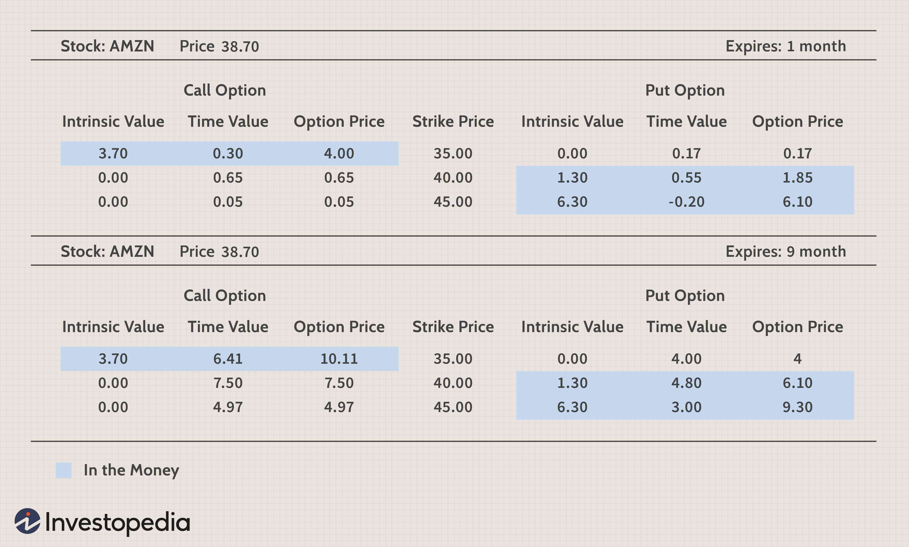

Option premium pricing is integral to options trading, as it dictates the cost of acquiring options and encapsulates both intrinsic and extrinsic values. The intrinsic value relates to the option's innate worth, based on the difference between the underlying asset's market price and the option's strike price. Meanwhile, the extrinsic value includes factors like time until expiration and anticipated market volatility. Accurately understanding these elements allows traders to predict and navigate the fluctuations in option prices effectively.

Incorporating this understanding is essential, particularly for traders employing algorithmic trading strategies. Such strategies heavily rely on data-driven models to make decisions about entering or exiting trades. Algorithmic trading uses mathematical models and high-speed computations to capitalize on even minute price movements, making an insightful comprehension of option premium pricing crucial. By gauging the intrinsic and extrinsic values appropriately, traders can devise more informed strategies that anticipate shifts in market conditions.



This article seeks to elucidate the fundamental elements influencing option premium prices, illustrating these concepts with financial examples. Furthermore, the connections between these pricing determinants and algorithmic trading strategies will be outlined to demonstrate how traders can achieve optimized trading results. Understanding the dynamics of option premium pricing is not just academic; it is a quintessential skill for achieving success in the fast-paced world of options trading.

## Table of Contents

## What Is an Option Premium?

An option premium is the price that an investor pays to acquire an option contract in the financial markets. It is a sum of two key components: intrinsic value and extrinsic value.

Intrinsic value is determined by the option's in-the-money status. For a call option, this is the amount by which the underlying asset's market price exceeds the option's strike price. Conversely, for a put option, it is the amount by which the strike price exceeds the market price of the underlying asset. Mathematically, this can be expressed as:

- For call options: \[ \text{Intrinsic Value} = \max(0, S - K)
$$
- For put options: \[ \text{Intrinsic Value} = \max(0, K - S)
$$

where $S$ is the current market price of the underlying asset, and $K$ is the strike price of the option.

Extrinsic value, also often referred to as the time value, encompasses several elements beyond the intrinsic value. It includes the time remaining until the option's expiration and the implied [volatility](/wiki/volatility-trading-strategies) of the underlying asset. The longer the time to expiration, the higher the probability of the option moving in-the-money, hence a higher extrinsic value. Moreover, higher implied volatility increases the potential for significant price movements in the underlying asset, leading to a higher option premium.

Understanding the composition of the option premium is crucial for traders and investors. It aids in making informed predictions about the future movements and pricing of options. By analyzing the intrinsic and extrinsic factors, market participants can better strategize and position themselves to capitalize on options trading opportunities.

## Factors Affecting Option Premium

Option premiums are influenced by several key factors that determine the overall price of an option contract. These factors are crucial for traders and investors to understand in order to evaluate and predict the movements and pricing of options effectively.

1. **Intrinsic Value**: The intrinsic value of an option is the difference between the current market price of the underlying asset and the strike price of the option. For a call option, the intrinsic value is calculated as the current price of the asset minus the strike price. For a put option, it is the strike price minus the current asset price. An option is considered "in-the-money" if this value is positive, thereby contributing directly to the premium of the option.
$$
   \text{Intrinsic Value (Call)} = \max(0, \text{Current Price} - \text{Strike Price})

$$
$$
   \text{Intrinsic Value (Put)} = \max(0, \text{Strike Price} - \text{Current Price})

$$

2. **Time to Expiry**: The time value of an option, often referred to as extrinsic value, becomes significant with more time remaining until the option's expiration. Longer durations allow greater potential for the underlying asset to reach favorable prices, thus increasing the premium. This is because options lose time value as expiration nears, known as time decay or theta decay.

3. **Volatility**: Implied volatility represents the market's forecast of a likely movement in the asset price. Higher volatility increases the premium because it amplifies the probability of the option ending in-the-money. As volatility rises, the option's extrinsic value rises, thereby inflating the premium. The Black-Scholes model or similar options pricing models are often employed to quantify and predict the impact of volatility on an option's price.

4. **Interest Rates**: Changes in interest rates can influence option premiums through the cost of carry, which is the cost associated with holding the underlying asset. When interest rates rise, call option premiums tend to increase because the opportunity cost of investing funds is higher. Conversely, put options may become less expensive. This relationship highlights the need for traders to consider macroeconomic indicators in their strategies.

5. **Dividends**: Expected dividends from the underlying asset can affect option premiums. Anticipated dividend payments can decrease the value of call options, as dividends typically reduce the asset's price by the dividend amount, decreasing the potential for price appreciation. Conversely, put options may become more valuable if the price of the underlying asset is expected to decline due to dividend distribution.

Traders and investors often utilize complex pricing models and algorithms to integrate these factors, optimizing their trading strategies and enhancing predictive accuracy in option pricing.

## Implied Volatility and Option Price

Implied volatility represents the market's expectations of future price fluctuations of the underlying asset, derived from current option prices using models such as the Black-Scholes Model. The significance of implied volatility lies in its correlation with the extrinsic value of options. A surge in implied volatility heightens the extrinsic value of an option, making it more expensive, whereas a decrease results in lower extrinsic value and reduced option premiums.

To illustrate, consider the Black-Scholes formula for pricing European call options, where the price $C$ is determined by:

$$
C = S_0 N(d_1) - X e^{-rT} N(d_2)
$$

where:
- $S_0$ is the current stock price,
- $X$ is the strike price,
- $T$ is the time to expiration,
- $r$ is the risk-free interest rate,
- $N(d)$ represents the cumulative distribution function of the standard normal distribution,
- $d_1 = \frac{\ln(S_0/X) + (r + \frac{\sigma^2}{2})T}{\sigma \sqrt{T}}$,
- $d_2 = d_1 - \sigma \sqrt{T}$,
- $\sigma$ is the volatility of the stock's returns.

In this model, implied volatility ($\sigma$) is a critical parameter that significantly impacts the option's price. When implied volatility increases, $d_1$ and $d_2$ change, affecting the option premium through the influence on the standard normal cumulative distribution terms $N(d_1)$ and $N(d_2)$.

Traders leverage implied volatility metrics to gauge potential price movements and refine their trading strategies. By interpreting changes in implied volatility, traders can predict intrinsic market movements and optimize buy or sell decisions for options contracts. For example, a spike in implied volatility might signal robust market activity, prompting traders to adjust their strategies, such as adopting straddle or strangle tactics to benefit from anticipated volatility. This adaptability is essential for maximizing trading outcomes and mitigating risks associated with unexpected market shifts.

## Financial Example in Option Premium Pricing

In the world of options trading, understanding the implications of volatility on option premiums is essential for making informed investment decisions. Consider an investor who holds a call option on a stock with an initial implied volatility of 20%. The option premium, which combines intrinsic and extrinsic values, will be affected significantly by changes in this volatility.

When implied volatility increases, it suggests that the market expects more significant price swings in the underlying asset. Consequently, the extrinsic value, or the time value of the option, increases even if the intrinsic value remains constant. To illustrate this, let's analyze a scenario where the implied volatility rises from 20% to 50%.

Using the Black-Scholes model, one can estimate the increase in the option's premium resulting from such a change in implied volatility. The Black-Scholes formula for the price of a call option is:

$$
C = S_0 N(d_1) - X e^{-rT} N(d_2)
$$

Where:
- $S_0$ is the current stock price
- $X$ is the strike price
- $r$ is the risk-free interest rate
- $T$ is the time to expiration
- $N(\cdot)$ is the cumulative distribution function of the standard normal distribution
- $d_1 = \frac{\ln(S_0/X) + (r + \sigma^2/2)T}{\sigma\sqrt{T}}$
- $d_2 = d_1 - \sigma\sqrt{T}$
- $\sigma$ is the implied volatility

For simplicity, assume the following values:
- Current stock price ($S_0$): $100
- Strike price ($X$): $100
- Risk-free interest rate ($r$): 5%
- Time to expiration ($T$): 1 year

At a 20% implied volatility, the option premium calculated through the Black-Scholes model results in a lower premium value than at 50% implied volatility. As volatility increases, the probability of the stock price exceeding the strike price enhances, hence increasing the option's market value.

Here's a Python snippet to calculate the effect using the Black-Scholes model:

```python
from scipy.stats import norm
import numpy as np

def black_scholes_call(S, X, T, r, sigma):
    d1 = (np.log(S / X) + (r + 0.5 * sigma ** 2) * T) / (sigma * np.sqrt(T))
    d2 = d1 - sigma * np.sqrt(T)
    call_price = S * norm.cdf(d1) - X * np.exp(-r * T) * norm.cdf(d2)
    return call_price

# Parameters
S = 100  # Stock price
X = 100  # Strike price
T = 1    # Time to maturity
r = 0.05 # Risk-free rate

# Calculate option prices at different volatilities
implied_vol_20 = 0.2
implied_vol_50 = 0.5

premium_20 = black_scholes_call(S, X, T, r, implied_vol_20)
premium_50 = black_scholes_call(S, X, T, r, implied_vol_50)

print(f"Option premium at 20% volatility: ${premium_20:.2f}")
print(f"Option premium at 50% volatility: ${premium_50:.2f}")
```

In this example, the dramatic increase in implied volatility from 20% to 50% results in a substantial rise in option premium, underscoring the crucial role of market expectations in option pricing. This understanding is vital for precision in real-world trading strategies, aiding investors in anticipating premium adjustments and positioning their trades effectively.

## Algorithmic Trading and Option Premiums

Algorithmic trading utilizes mathematical models and computational algorithms to execute trades on financial markets with speed and precision. This is particularly beneficial in options trading, where factors influencing option premium pricing, such as implied volatility and interest rates, are critical to making informed trading decisions. By integrating these factors into trading algorithms, traders can automate their strategies to optimize performance in various market conditions.

Understanding option premium pricing is essential when developing [algorithmic trading](/wiki/algorithmic-trading) strategies. The option premium, which is influenced by both intrinsic and extrinsic values, reflects market expectations and underlying asset dynamics. Algorithms that can anticipate changes in these values enable traders to exploit market inefficiencies and achieve more favorable trading outcomes. For instance, by factoring in implied volatility—the market's forecast of price movements—algorithms can adjust trading strategies to either capitalize on anticipated volatility spikes or hedge against potential downturns.

Moreover, interest rates play a significant role in option pricing and consequently impact trading algorithms. Rising interest rates can increase call option premiums, thus influencing the desirability of certain trades. An effective algorithm will incorporate [interest rate](/wiki/interest-rate-trading-strategies) data to adjust the valuation of options accordingly, ensuring that trade execution aligns with prevailing market conditions. 

The implementation of these sophisticated algorithms often involves programming languages such as Python, which are equipped with libraries and frameworks designed to simplify the process of developing and [backtesting](/wiki/backtesting) trading strategies. For instance, using Python's Scipy library can aid in optimizing parameters for an algorithm that predicts option premiums based on historical data of implied volatility and interest rates.

In conclusion, the integration of option premium pricing components into algorithmic trading enhances the ability of traders to navigate complex market environments efficiently. By continuously refining these algorithms with up-to-date market data, traders can maintain a competitive edge and achieve optimized trading results.

## Conclusion

Understanding the nuances of option premium pricing and the variables that influence it is crucial for traders, particularly those employing algorithmic trading strategies. By comprehensively analyzing the components such as intrinsic value, time to expiry, volatility, interest rates, and dividends, traders can enhance their ability to predict and react to market movements.

Integrating these insights into trading algorithms enables market participants to make data-driven decisions, thereby optimizing trading outcomes. For instance, incorporating implied volatility metrics can allow an algorithm to adjust its trading strategy dynamically based on predicted market behavior. Here is a basic example of how Python could be used to simulate a strategy that adjusts option trades based on changes in implied volatility:

```python
import numpy as np

# Function to adjust position based on implied volatility changes
def adjust_position(current_iv, threshold_iv, position):
    if current_iv > threshold_iv:
        # Increase position if current implied volatility exceeds the threshold
        return position * 1.1
    elif current_iv < threshold_iv:
        # Decrease position if current implied volatility is below the threshold
        return position * 0.9
    else:
        # Maintain current position
        return position

# Example usage
current_iv = 0.4
threshold_iv = 0.3
initial_position = 100
new_position = adjust_position(current_iv, threshold_iv, initial_position)

print(f"Adjusted Position: {new_position}")
```

As financial markets continue to evolve, trading strategies become more sophisticated, driven by advances in technology and data analysis. Staying informed and adaptable is crucial for success. Traders who master the intricacies of option premium pricing and remain agile in their strategy development can better navigate the increasing complexity of financial markets and thus enhance their trading performance.

## References & Further Reading

[1]: Hull, J. C. (2017). ["Options, Futures, and Other Derivatives"](https://www.semanticscholar.org/paper/Options%2C-Futures%2C-and-Other-Derivatives-Hull/89bdee500c8623864fc9eb7a471546aa713acc44). Pearson.

[2]: Black, F., & Scholes, M. (1973). ["The Pricing of Options and Corporate Liabilities."](https://www.cs.princeton.edu/courses/archive/fall09/cos323/papers/black_scholes73.pdf) Journal of Political Economy, 81(3), 637-654.

[3]: Wilmott, P. (2007). ["Paul Wilmott Introduces Quantitative Finance."](https://www.amazon.com/Paul-Wilmott-Introduces-Quantitative-Finance/dp/0470319585) Wiley.

[4]: Luenberger, D. G. (1997). ["Investment Science."](https://www.amazon.com/Investment-Science-David-G-Luenberger/dp/0199740089) Oxford University Press.

[5]: Jansen, S. (2020). ["Machine Learning for Algorithmic Trading: Second Edition."](https://www.amazon.com/Machine-Learning-Algorithmic-Trading-alternative/dp/1839217715) Packt Publishing.

[6]: Chan, E. P. (2009). ["Quantitative Trading: How to Build Your Own Algorithmic Trading Business."](https://github.com/ftvision/quant_trading_echan_book) Wiley.