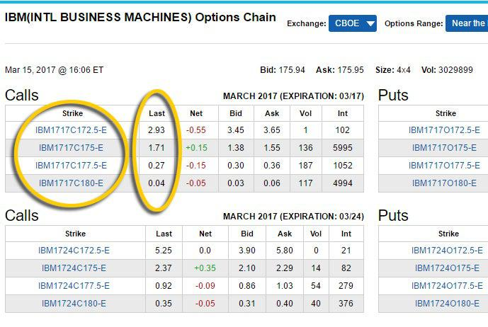

The financial markets have consistently adapted to technological advancements, with the pricing of options and algorithmic trading emerging as crucial components of contemporary trading strategies. Options pricing models and algorithmic trading have transformed the approach to trading, making it more data-driven and precise. The evolution of these elements has introduced significant efficiencies, enabling traders to make informed decisions and execute trades with precision.

Options pricing is concerned with determining the fair value of an option based on various factors such as the underlying asset's price, strike price, time to expiration, volatility, and prevailing interest rates. Traditional models like Black-Scholes and binomial pricing have been pivotal in providing frameworks for this valuation. These models incorporate intricate mathematical formulas to predict option prices analytically and numerically.



Simultaneously, algorithmic trading has revolutionized market participation. By leveraging algorithms, traders can execute orders at high speeds and volumes, enabling strategies that were previously unfeasible. Algorithms facilitate rapid data analysis, trend identification, and strategy execution, all of which are fundamental in optimizing trading performance. This form of trading minimizes human error and biases, ensuring that trades align with predefined strategies and market conditions.

The fusion of options pricing and algorithmic trading technologies offers unprecedented potential in optimizing trading models. By integrating algorithms with pricing models, traders can dynamically adjust strategies based on real-time data, enhancing responsiveness to market fluctuations. This convergence is setting the stage for future developments in financial markets, offering opportunities for greater transparency, accuracy, and efficiency in trading practices. 

By engaging with these technologies, traders are better positioned to harness the complexities and opportunities of modern financial markets, gaining competitive advantages and improving decision-making processes.

## Table of Contents

## Understanding Options in Financial Markets

Options are financial derivative instruments that grant their holders the right, though not the obligation, to buy or sell an underlying asset at a pre-determined price, known as the strike price, on or before a specified expiration date. This flexibility distinguishes options from other financial contracts, as it provides the holder the potential to benefit from favorable price movements while limiting downside risk. The underlying asset can vary from stocks and indices to commodities and currencies, providing broad applicability across financial markets.

Options are primarily categorized into two types: calls and puts. A call option gives the holder the right to purchase the underlying asset at the strike price, whereas a put option provides the right to sell the underlying asset at the strike price. These basic types facilitate a wide range of trading strategies that can be adapted to different market conditions and investor goals.

Key components of options include:

1. **Calls and Puts**: As described, these are the two main forms of options. A call option represents a bullish position, enabling profit from an increase in the underlying asset's price, while a put option represents a bearish stance and aims to benefit from a decrease in the underlying price.

2. **Strike Price**: This is the set price at which the underlying asset can be bought or sold if the option is exercised. It is a critical determinant in the intrinsic value of an option, which is the profit obtained if the option is exercised immediately: $\text{Intrinsic Value} = \max(0, \text{Current Price} - \text{Strike Price})$ for calls, and $\text{Intrinsic Value} = \max(0, \text{Strike Price} - \text{Current Price})$ for puts.

3. **Expiration Date**: This is the date on which the option contract becomes void. After this date, the option no longer holds any value. Options can be American-style, which allows exercising any time before expiration, or European-style, exercisable only at expiration.

Options serve several strategic purposes:

- **Hedging**: Investors utilize options to mitigate potential losses in their portfolios. For instance, buying a put option can protect against a decline in the value of a stock portfolio, acting as an insurance policy.

- **Speculation**: Traders often use options to capitalize on market movements with a relatively small capital outlay compared to outright stock purchases. This is because options can offer significant leverage, amplifying potential gains (and losses).

- **Leveraging Trading Positions**: Options can efficiently alter a portfolio's risk profile by enhancing returns through leverage. A smaller investment in options can help control a larger amount of the underlying asset, optimizing capital efficiency.

Given their versatility, options are an essential part of modern financial markets, allowing a broad spectrum of trading strategies to meet varying risk appetites and investment objectives. The structured yet flexible design of options makes them indispensable tools for market participants seeking to enhance returns and manage risk.

## Pricing Models for Options

Pricing models for options are crucial in determining the fair value of these derivative instruments. Various models have been developed to account for different market conditions and variables influencing option prices. Among these models, the Black-Scholes model, the binomial pricing model, and Monte Carlo simulations are widely utilized in financial markets.

### Black-Scholes Model

The Black-Scholes Model, formulated by Fischer Black, Myron Scholes, and Robert Merton, is a mathematical model used to estimate the price of European-style options. The model's foundation lies in the key assumption that stock prices follow a geometric Brownian motion with constant [volatility](/wiki/volatility-trading-strategies) and drift. The Black-Scholes formula is expressed as:

$$
C = S_0 N(d_1) - X e^{-rT} N(d_2)
$$

$$
d_1 = \frac{\ln(S_0/X) + (r + \sigma^2/2)T}{\sigma \sqrt{T}}
$$

$$
d_2 = d_1 - \sigma \sqrt{T}
$$

where:
- $C$ is the price of the call option,
- $S_0$ is the current stock price,
- $X$ is the strike price of the option,
- $T$ is the time to expiration,
- $r$ is the risk-free interest rate,
- $\sigma$ is the volatility of the stock,
- $N(\cdot)$ represents the cumulative distribution function of the standard normal distribution.

The key insight from the Black-Scholes model is understanding how variables such as volatility ($\sigma$) and time to expiration ($T$) affect option prices.

### Binomial Pricing Model

The binomial pricing model provides a discrete-time framework for valuing options, particularly advantageous for American options which can be exercised at any time before expiration. This model assumes that the underlying asset price can move to one of two possible values over each small time increment until the option's expiration. It constructs a binomial tree representing possible paths the stock price could take.

The option price is calculated by working backwards from the expiration date to the present, using risk-neutral valuation. Key advantages of the binomial model include its flexibility in handling American options and its adaptability to varying assumptions about volatility and dividends.

### Monte Carlo Simulations

Monte Carlo simulations offer a versatile approach to option pricing, particularly useful for options with complex features. This stochastic technique involves running a large number of simulations to model the random behavior of stock prices and derive a distribution of possible option payoffs. The expected payoff is then discounted at the risk-free rate to estimate the option price.

Monte Carlo simulations are especially beneficial when dealing with path-dependent options like Asian or barrier options, for which analytical solutions might be challenging to derive. This method can incorporate various factors such as changing volatility and interest rates.

### Considerations in Choosing a Pricing Model

When deciding on an appropriate pricing model, traders must consider the specific characteristics of the option and market conditions. The choice of model can significantly affect trading outcomes. Key factors such as the type of option (European vs. American), underlying asset volatility, and the option's time to expiration should all be considered to optimize pricing accuracy.

By understanding these different pricing models and their assumptions, traders can enhance their strategic decision-making and better manage financial risks associated with options trading.

## Algorithmic Trading in Options Markets

Algorithmic trading in options markets involves the use of computer algorithms to execute trades at optimal strategies with minimal human input. This approach leverages the power of computational technology to manage and execute large volumes of trades, enabling traders to process vast datasets and execute orders with unmatched speed and precision.

One of the core benefits of [algorithmic trading](/wiki/algorithmic-trading) is its capacity to analyze large datasets swiftly. Traditionally, human traders would manually assess market data to make trading decisions, a process that is both time-consuming and prone to error. Algorithms, however, can process large volumes of historical and real-time data in a fraction of the time, identifying patterns and opportunities that may be invisible to the human eye. This ability not only enhances decision-making but also significantly reduces the latency between the identification of a trading opportunity and the execution of a trade.

The speed of order execution is another critical advantage. By automating the trading process, algorithmic systems can execute large orders in milliseconds, minimizing the market impact and the risk of price slippage. This feature is particularly advantageous in high-frequency trading environments, where the rapid execution of orders can make a considerable difference in profitability.

Optimization of trading efficiency is further achieved through the use of algorithmic strategies that are designed to navigate complex market conditions. Algorithms execute trades based on pre-defined criteria, such as price, timing, or [volume](/wiki/volume-trading-strategy), ensuring consistency and discipline in trading practices. By systematically analyzing market data, these algorithms can adjust trading strategies in real-time, optimizing performance in response to changing market conditions.

Another significant role of algorithms is in automating strategy execution and managing risks. For example, algorithms can be programmed to hedge positions by executing offsetting trades, thereby reducing exposure to market fluctuations. Risk management protocols, such as stop-loss orders and dynamic hedging strategies, are seamlessly integrated into algorithmic trading systems, providing a robust safeguard against unexpected market movements.

Arbitrage opportunities can also be exploited more effectively through algorithmic trading. Algorithms are capable of detecting price discrepancies across different markets or financial instruments and executing trades simultaneously to capitalize on these inefficiencies. Such [arbitrage](/wiki/arbitrage) opportunities, which often occur within very short time frames, are best addressed by the speed and precision of algorithmic systems.

Here's a simple Python example of how an algorithm might be structured to identify and execute trades based on predefined conditions:

```python
import numpy as np

# Define a simple moving average function
def moving_average(data, window_size):
    return np.convolve(data, np.ones(window_size)/window_size, mode='valid')

# Sample price data (e.g., historical option prices)
price_data = [10, 12, 13, 15, 18, 17, 16, 22, 24, 23]

# Calculate the moving averages
short_term_avg = moving_average(price_data, window_size=2)
long_term_avg = moving_average(price_data, window_size=5)

# Define a trading signal based on moving average crossover
for i in range(len(long_term_avg)):
    if short_term_avg[i] > long_term_avg[i]:
        print("Buy signal at index:", i)
    elif short_term_avg[i] < long_term_avg[i]:
        print("Sell signal at index:", i)
```

In conclusion, algorithmic trading in options markets enhances efficiency, speed, and execution of trades. By automating both strategy execution and risk management, algorithms enable traders to capitalize on market opportunities swiftly and effectively, positioning them at a significant competitive advantage.

## Challenges and Opportunities in Algorithmic Options Trading

Market volatility and [liquidity](/wiki/liquidity-risk-premium) are two critical factors that can significantly impact the effectiveness of algorithmic trading systems in the options market. In periods of high volatility, prices can change rapidly and unpredictably, leading to increased risks of slippage, which is the difference between the expected price of a trade and the actual price at which the trade is executed. On the other hand, low liquidity conditions can result in wider bid-ask spreads, making it challenging to enter or [exit](/wiki/exit-strategy) positions at desired prices. These factors necessitate the development of robust algorithms capable of handling such market dynamics effectively.

Developing robust algorithmic trading systems requires thorough [backtesting](/wiki/backtesting) and evaluation to mitigate potential risks. Backtesting involves simulating a strategy using historical data to understand how it would have performed in the past. This process helps identify potential weaknesses and optimize strategy parameters before deploying the algorithm in live markets. For instance, backtesting can reveal how a strategy might react under various market conditions, allowing traders to refine parameters such as stop-loss limits and position sizing.

In algorithmic trading, the use of big data analytics and [machine learning](/wiki/machine-learning) provides substantial opportunities for enhancing algorithmic models. Big data analytics enable traders to analyze vast amounts of market data, uncover hidden patterns, and make more informed trading decisions. Machine learning, in particular, offers powerful tools for predicting price movements and optimizing trading strategies. Techniques such as supervised learning can be used to train models on historical price data to forecast future price movements.

Here is an example of a simple machine learning model using Python's scikit-learn library to predict option prices:

```python
import numpy as np
import pandas as pd
from sklearn.model_selection import train_test_split
from sklearn.ensemble import RandomForestRegressor
from sklearn.metrics import mean_squared_error

# Load historical options data
data = pd.read_csv('options_data.csv')

# Prepare feature matrix X and target vector y
X = data[['strike_price', 'expiration_date', 'implied_volatility']]
y = data['option_price']

# Split data into training and testing sets
X_train, X_test, y_train, y_test = train_test_split(X, y, test_size=0.2, random_state=42)

# Create and train a Random Forest model
model = RandomForestRegressor(n_estimators=100, random_state=42)
model.fit(X_train, y_train)

# Make predictions and evaluate the model
y_pred = model.predict(X_test)
mse = mean_squared_error(y_test, y_pred)

print(f'Mean Squared Error: {mse}')
```

In this example, features such as strike price, expiration date, and implied volatility are used to predict the option price. The model is trained on historical data and evaluated using the mean squared error metric to assess its predictive accuracy.

Opportunities in algorithmic options trading also include exploiting inefficiencies and arbitrage opportunities in the market. With advances in machine learning, traders can develop more adaptive algorithms that respond to real-time market changes, improving performance and capturing value from fleeting trading opportunities.

In conclusion, while market volatility and liquidity present challenges for algorithmic options trading systems, advancements in technology and data analytics offer considerable opportunities to enhance these systems. Successful implementation requires rigorous testing and a keen understanding of both market conditions and technological tools at traders' disposal.

## Implementing Algorithmic Options Trading Strategies

Implementing algorithmic options trading strategies is a sophisticated endeavor that involves the adoption of techniques such as market-making, trend-following, and [statistical arbitrage](/wiki/statistical-arbitrage). Each strategy leverages unique structural characteristics of the financial markets, requiring a robust understanding of market mechanics and computational prowess.

Market-making involves continuously providing buy and sell quotes on options, [earning](/wiki/earning-announcement) the spread between these quotes. This strategy necessitates advanced pricing models to calculate fair option values. It also requires efficient risk management protocols to handle the inventory of options positions. The following example illustrates a simplistic market-making algorithm in Python:

```python
import numpy as np

class MarketMaker:
    def __init__(self, bid_spread, ask_spread):
        self.bid_spread = bid_spread
        self.ask_spread = ask_spread

    def quote(self, option_price):
        bid = option_price - self.bid_spread
        ask = option_price + self.ask_spread
        return bid, ask

option_price = 100
maker = MarketMaker(bid_spread=1, ask_spread=1.5)
bid, ask = maker.quote(option_price)
print(f"Bid: {bid}, Ask: {ask}")
```

Trend-following strategies in options trading aim to capitalize on persistent price movements. These strategies rely heavily on historical price data and can employ various indicators such as moving averages or the Relative Strength Index (RSI). Implementing a trend-following strategy demands precise timing and computational resources to process and react to market signals quickly.

Statistical arbitrage exploits pricing inefficiencies between related options or between options and their underlying assets. This strategy requires extensive backtesting to identify statistically significant deviations and uses machine learning techniques to predict potential arbitrage opportunities. An example of a simple statistical arbitrage model is the pairs trading strategy, where traders move in and out of positions based on the relative pricing of two similar assets.

Real-time monitoring and dynamic strategy adjustment are critical to optimizing algorithmic options trading in rapid and fluctuating market conditions. Continuous monitoring allows traders to adapt to market changes, ensure liquidity, and manage risk effectively. High-frequency trading platforms necessitate low latency systems and algorithms that can recalculate fair values and adjust bids and offers in milliseconds.

To successfully implement these strategies, traders must possess a deep understanding of financial instruments and proficient coding skills. Mastery of programming languages like Python, R, or C++ is crucial for developing, testing, and deploying trading algorithms. Moreover, the ability to interpret data analytics and machine learning outputs provides an added advantage in refining trading strategies and enhancing overall performance.

## The Role of Regulatory Frameworks

Algorithmic trading, particularly in options markets, is tightly regulated to maintain both market stability and fairness among participants. Regulatory bodies such as the U.S. Securities and Exchange Commission (SEC), Commodity Futures Trading Commission (CFTC), and the European Securities and Markets Authority (ESMA) oversee these operations. They establish rules and guidelines aimed at minimizing risks associated with high-frequency trading and ensuring that all market players operate on a level playing field.

Traders engaged in algorithmic trading are required to comply with various standards, including risk management protocols designed to prevent excessive trading losses and ensure the integrity of trading systems. For instance, traders must implement pre-trade risk controls and post-trade reporting mechanisms. These measures help in monitoring real-time risk exposures and maintaining an audit trail for their trading activities.

Compliance with reporting obligations is another critical [factor](/wiki/factor-investing). Traders must provide details of their algorithmic trading strategies, including key features, risks, and the controls in place to mitigate those risks, to regulatory bodies. This ensures transparency and allows regulators to supervise and detect potentially disruptive trading behaviors effectively.

Understanding the regulatory environment is essential for successful algorithmic trading operations. A firm grasp of these rules allows traders to navigate the complex legal landscape, avoiding penalties and ensuring operational continuity. Moreover, staying informed about regulatory changes enables traders to adjust their strategies in accordance with new laws, which can provide a strategic advantage.

Ultimately, adhering to these regulatory frameworks not only helps in maintaining market order but also enhances the reputation and reliability of algorithmic trading firms. As regulations continue to evolve with technological advancements, traders need to remain vigilant and adaptable, ensuring compliance while exploiting new market opportunities.

## Future Trends in Financial Markets and Algo Trading

Advancements in [artificial intelligence](/wiki/ai-artificial-intelligence) (AI) and blockchain technology are poised to fundamentally transform options trading. AI brings sophisticated data processing and predictive analytic capabilities that are crucial for assessing market trends and crafting precise trading strategies. Meanwhile, blockchain technology offers a decentralized ledger system that enhances the transparency and security of transactions within the financial markets.

AI algorithms, equipped with machine learning and [deep learning](/wiki/deep-learning) capabilities, enable traders to process vast amounts of data with unparalleled speed and efficiency. These algorithms can identify patterns and correlations that may be imperceptible to human analysts. Machine learning models can be trained on historical data to predict future price movements and optimize options pricing models. For instance, neural networks and decision trees are frequently utilized for their ability to model complex relationships between variables.

Blockchains enhance the transparency and security of trading by creating immutable and decentralized records. Each transaction is securely encrypted and added to a block, forming a chain that is difficult to alter without consensus from the network. This transparency is crucial in both order execution processes and regulatory compliance, as it allows for easy auditability and trust in recorded transactions.

Furthermore, the integration of AI with blockchain could automate compliance procedures, reducing the operational costs and complexity associated with regulatory requirements. Smart contracts, which are self-executing contracts with the terms directly written into code, can streamline options trading by automatically executing trades when certain conditions are met, enhancing operational efficiency.

As financial markets become increasingly driven by technology, traders need to stay adaptable. This involves continuous education and an openness to adopting newer technologies as they become available. Being tech-savvy provides traders a competitive edge in efficiently leveraging these technologies for strategy development, risk management, and achieving better returns.

Moreover, advancements are expected in the processing power required to handle such sophisticated algorithms and blockchain transactions. Quantum computing, though in its nascent stages, holds potential to further accelerate data processing capabilities, providing even richer insights and more rapid transaction handling.

Future trading environments will likely be defined by the level of sophistication in both AI deployments and blockchain integration. Successful traders will be those who can effectively combine these technologies to enhance trading operations and adapt to evolving market dynamics.

## Conclusion

The convergence of financial markets, options pricing, and algorithmic trading is reshaping the trading landscape in significant ways. By understanding these elements, traders are better equipped to leverage algorithmic tools for improved decision-making and to gain a competitive edge in the markets. This integration allows for enhanced precision in executing trades, managing risks, and exploiting arbitrage opportunities more efficiently than ever before.

Algorithmic tools simplify the analysis of large datasets and execute trades at optimal times, taking advantage of microsecond fluctuations in market conditions that human traders cannot replicate. These systems use complex models including the Black-Scholes, binomial pricing models, and Monte Carlo simulations to determine the most favorable prices and strategies for trading options. The ability to process information swiftly and execute trades automatically minimizes the latency and human errors that typically occur in manual trading environments.

Yet, the key to success in this dynamic arena lies in a trader’s ability to continually learn and adapt to evolving market dynamics. The landscape of financial markets and algorithmic trading is characterized by rapid advancements in technology, such as artificial intelligence and blockchain. These technologies promise to further transform the trading environment by offering better transparency, security, and efficiency.

In conclusion, the future of trading is inherently tied to an understanding of modern trading tools and technologies, coupled with a proactive approach to continuous education and adaptation. Traders who embrace these changes and incorporate them into their trading strategies are more likely to succeed in an increasingly competitive market.

## References & Further Reading

[1]: Black, F., Scholes, M., & Merton, R. (1973). "The Pricing of Options and Corporate Liabilities." Journal of Political Economy, 81(3), 637-654.

[2]: Cox, J. C., Ross, S. A., & Rubinstein, M. (1979). "Option Pricing: A Simplified Approach." Journal of Financial Economics, 7(3), 229-263.

[3]: Hull, J. C. (2017). ["Options, Futures, and Other Derivatives,"](https://books.google.com/books/about/Options_Futures_and_Other_Derivatives_eB.html?id=2iopDwAAQBAJ) 10th Edition, Pearson.

[4]: Taleb, N. N. (1997). ["Dynamic Hedging: Managing Vanilla and Exotic Options."](https://www.amazon.com/Dynamic-Hedging-Managing-Vanilla-Options/dp/0471152803) Wiley.

[5]: Jarrow, R., & Petroni, K. (1999). "Algorithmic Trading in Corporate Bond Markets." Journal of Financial Services Research, 15, 1-26.

[6]: Geman, H. (2005). ["Commodities and Commodity Derivatives: Modelling and Pricing for Agriculturals, Metals, and Energy."](https://www.semanticscholar.org/paper/Commodities-and-Commodity-Derivatives%3A-Modelling-Geman/e20e4e93b7ef47399f0faf7a4a0c9d660763b850) Wiley Finance.

[7]: Derman, E., & Kamal, M. (2005). "The Black-Scholes Model of Derivatives Pricing." In "The Journal of Economic Perspectives," 18(3), 227-235.