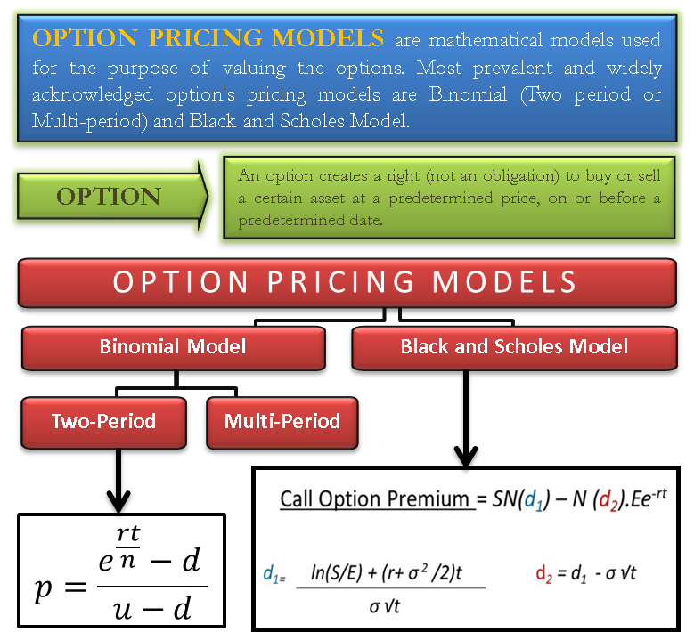

## Table of Contents

## What is an option in financial markets?

An option in financial markets is a contract that gives the buyer the right, but not the obligation, to buy or sell an asset at a specific price within a certain time period. This asset can be stocks, commodities, or currencies. The specific price is called the strike price, and the time period is known as the expiration date. Options are popular because they allow investors to make profits from price movements without needing to own the actual asset.

There are two main types of options: call options and put options. A call option gives the buyer the right to buy the asset at the strike price before the expiration date. This is useful if the buyer thinks the asset's price will go up. On the other hand, a put option gives the buyer the right to sell the asset at the strike price before the expiration date. This is useful if the buyer thinks the asset's price will go down. Both types of options can be used for different investment strategies, such as speculation or hedging against potential losses.

## Why are option pricing models important for investors and traders?

Option pricing models are important for investors and traders because they help figure out how much an option should cost. These models use math to guess the price based on things like how much the asset's price might move, how long until the option expires, and what the interest rates are. Knowing the right price helps traders decide if an option is a good deal or if it's too expensive. This can save them money and help them make better choices when buying or selling options.

Another reason option pricing models are useful is that they help traders plan their strategies. By using these models, traders can see how changes in the market might affect the price of their options. This lets them think about different scenarios and decide the best time to buy or sell. For example, if a trader thinks a stock's price will go up, they can use an option pricing model to see if buying a call option makes sense. This planning can lead to smarter trading and potentially more profits.

## What is the basic concept behind option pricing?

The basic idea behind option pricing is figuring out how much an option is worth. This is important because it helps traders know if they're getting a good deal. To do this, people use special math formulas that look at different things, like how much the price of the asset might move up or down, how long the option lasts before it expires, and what the interest rates are. These formulas help traders guess what the option should cost based on what's happening in the market.

One popular formula for option pricing is called the Black-Scholes model. It was made by some smart people to help traders understand option prices better. The Black-Scholes model looks at the current price of the asset, how much the price might change, how long until the option expires, the interest rate, and how much the option can be sold for if it's not used. By putting all these pieces together, the model gives traders a number that they can use to see if the option's price is fair. This helps them make better decisions when buying or selling options.

## What is the Black-Scholes Model and how does it work?

The Black-Scholes Model is a special math formula that helps people figure out how much an option should cost. It was made by some smart people named Fischer Black, Myron Scholes, and Robert Merton. The model looks at five important things to come up with the price: the current price of the asset, how much the price might change (which is called volatility), how long until the option expires, the interest rate, and the price at which the option can be used (called the strike price). By putting all these pieces together, the Black-Scholes Model gives traders a number that they can use to see if the option's price is fair.

When someone uses the Black-Scholes Model, they plug in the numbers for the five things mentioned above into the formula. The formula then does some math to come up with the option's price. For example, if you're looking at a call option for a stock, you'd put in the stock's current price, how much you think the stock's price might move, how many days are left until the option expires, the current interest rate, and the strike price. The model will then tell you what the call option should cost. This helps traders decide if buying or selling the option is a good idea based on what the market is doing.

## What are the key assumptions of the Black-Scholes Model?

The Black-Scholes Model makes a few guesses about how the market works to help figure out the price of an option. One big guess is that the price of the asset moves in a way that looks like a normal bell curve. This means the model thinks the price will go up and down in a smooth, predictable way, without any big jumps or surprises. Another guess is that you can buy or sell the asset anytime you want, without any trouble. This means the model thinks the market is always open and working well, with lots of people buying and selling.

Another important guess is that there are no costs like taxes or fees when you buy or sell the asset or the option. The model also thinks that you can borrow and lend money at the same interest rate, which is the same for everyone. Lastly, the model guesses that the asset doesn't pay any dividends or other payments during the time the option is active. These guesses help make the math easier, but they might not always match what happens in the real world.

## How do you calculate the price of a call option using the Black-Scholes formula?

To calculate the price of a call option using the Black-Scholes formula, you need to know five things: the current price of the stock (S), the strike price of the option (K), the time until the option expires in years (T), the risk-free interest rate (r), and the volatility of the stock (σ). The formula itself looks complicated, but it's just a way to combine these five pieces of information to find out how much the call option should cost. The formula is: C = S * N(d1) - K * e^(-rT) * N(d2), where C is the price of the call option, and N(d1) and N(d2) are parts of the formula that come from a special table called the cumulative standard normal distribution.

In the formula, d1 and d2 are calculated using these equations: d1 = (ln(S/K) + (r + σ^2/2) * T) / (σ * sqrt(T)), and d2 = d1 - σ * sqrt(T). The term ln(S/K) is the natural logarithm of the stock price divided by the strike price. The part (r + σ^2/2) * T helps account for the time value of money and the stock's volatility over time. Once you have d1 and d2, you use them to find N(d1) and N(d2) from the cumulative standard normal distribution table. These values help you figure out how likely it is that the option will be worth something when it expires. By plugging all these numbers into the Black-Scholes formula, you can get a good guess on what the call option should cost.

## What are some limitations of the Black-Scholes Model?

The Black-Scholes Model has some problems that traders need to know about. One big problem is that it guesses the stock's price will move in a smooth, normal way, but in real life, prices can jump or drop suddenly. This can make the model's price guess wrong. Another issue is that the model thinks you can buy or sell the stock anytime you want, but sometimes the market is closed or not working well, which can change the option's price. The model also doesn't think about extra costs like taxes or fees, which can make a big difference in what you actually pay.

Another limitation is that the Black-Scholes Model assumes the stock doesn't pay any dividends while the option is active. But many stocks do pay dividends, and this can affect the option's value. The model also thinks everyone can borrow and lend money at the same interest rate, but in real life, different people might get different rates. These guesses can make the model's price less accurate. Traders need to understand these limits to use the model wisely and not rely on it too much when making decisions.

## What are alternative option pricing models to Black-Scholes?

One popular alternative to the Black-Scholes Model is the Binomial Options Pricing Model. This model works by breaking down the time until the option expires into smaller steps. It guesses that the stock's price can either go up or down at each step. By looking at all the possible paths the stock price can take, the model figures out what the option might be worth at the end. Then, it works backward to find out what the option is worth right now. This model is easier to understand than Black-Scholes and can handle things like dividends and sudden price changes better.

Another option pricing model is the Monte Carlo Simulation. This model uses random guesses to see how the stock's price might move over time. It runs many different scenarios to see what the option's value could be at the end. Then, it takes the average of all these scenarios to guess the option's price right now. Monte Carlo Simulation is good for pricing options that are more complicated, like those with many different parts or conditions. It can also handle things like changes in interest rates or volatility better than Black-Scholes. Both these models help traders get a better idea of an option's price, but they each have their own strengths and weaknesses.

## How does the Binomial Options Pricing Model differ from Black-Scholes?

The Binomial Options Pricing Model and the Black-Scholes Model both help figure out how much an option should cost, but they do it in different ways. The Binomial Model breaks down the time until the option expires into smaller steps. It guesses that at each step, the stock's price can either go up or down. By looking at all the possible paths the stock price could take, the model figures out what the option might be worth at the end. Then, it works backward to find out what the option is worth right now. This makes the Binomial Model easier to understand and use, especially for options that pay dividends or when the stock's price might jump suddenly.

On the other hand, the Black-Scholes Model uses a special math formula to guess the option's price. It looks at the current price of the stock, how much the price might move, how long until the option expires, the interest rate, and the strike price all at once. The Black-Scholes Model thinks the stock's price moves smoothly and normally, without any big jumps. While this model is good for simple options, it doesn't handle things like dividends or sudden price changes as well as the Binomial Model. Both models have their own strengths and weaknesses, so traders might choose one over the other depending on what they need.

## What role do volatility and time to expiration play in option pricing?

Volatility is really important when figuring out how much an option should cost. It's all about how much the price of the stock might move up or down. If a stock's price jumps around a lot, that's called high volatility. When volatility is high, options cost more because there's a bigger chance the stock's price will move in a way that makes the option worth something. On the other hand, if the stock's price stays pretty steady, that's low volatility, and options will cost less because there's less chance of a big price move.

Time to expiration also plays a big role in option pricing. The longer an option has until it expires, the more time there is for the stock's price to move in a way that could make the option valuable. This means options with more time left until they expire usually cost more than those with less time. As the expiration date gets closer, the option's price can drop because there's less time for the stock's price to move in the right direction. So, both volatility and time to expiration are key things to think about when deciding how much an option should cost.

## How do market conditions and economic factors influence option pricing models?

Market conditions and economic factors can really change how much an option is worth. Things like how the stock market is doing, what's happening with interest rates, and even big news events can make a difference. If the stock market is going up and people are feeling good about it, options might cost more because there's a better chance the stock's price will keep going up. On the other hand, if the market is going down and people are worried, options might cost less because there's less chance of a big price move. Interest rates also matter because they affect how much money costs to borrow or save, which can change how much people are willing to pay for options.

Economic factors like inflation and how the economy is doing overall can also affect option prices. If inflation is high, it can make the cost of everything go up, including options. When the economy is doing well, people might be more willing to take risks and pay more for options. But if the economy is struggling, people might be more careful with their money and not want to spend as much on options. All these things together can make option pricing models more complicated because they have to guess how these factors will change the value of an option.

## What advanced techniques are used to refine option pricing models in practice?

To make option pricing models better, traders use some advanced tricks. One trick is called "implied volatility." Instead of guessing how much the stock's price might move, traders look at what the market thinks. They do this by seeing what other people are willing to pay for options. This helps them figure out a better price for their own options. Another trick is "delta hedging." This means traders buy or sell the stock to balance out the risk of their options. By doing this, they can make their option pricing more accurate because they're not just guessing anymore; they're using real market moves to help them.

Another advanced technique is using "stochastic volatility models." These models guess that the stock's price might move in a way that's not smooth or normal. They think the stock's price can jump around more than the Black-Scholes Model expects. This helps traders get a better price for options that might be affected by big, sudden changes in the stock's price. Also, some traders use "[machine learning](/wiki/machine-learning)" to improve their models. They feed the computer lots of data about how options have been priced in the past and let it find patterns. This can help them predict option prices better than just using math formulas alone. By using these advanced techniques, traders can make smarter choices and maybe even make more money.

## What is the Black-Scholes Model?

Developed by Fischer Black, Myron Scholes, and Robert Merton in 1973, the Black-Scholes model is a pioneering framework widely utilized in options pricing for its ability to provide a closed-form solution specifically for European call and put options. Fundamental to this model are several key assumptions: markets are efficient, meaning prices reflect all available information; there are no transaction costs; and interest rates remain constant over the option's life.

The Black-Scholes model employs a formula to calculate the theoretical price of options, factoring in crucial parameters:

$$
C = S_0N(d_1) - Xe^{-rt}N(d_2)
$$

$$
P = Xe^{-rt}N(-d_2) - S_0N(-d_1)
$$

Where:
- $C$ and $P$ represent the call and put option prices, respectively.
- $S_0$ is the current stock price.
- $X$ is the strike price of the option.
- $t$ represents the time to expiration (in years).
- $r$ is the risk-free interest rate.
- $N(\cdot)$ denotes the cumulative distribution function of the standard normal distribution.
- $d_1$ and $d_2$ are intermediate calculations given by:

$$
d_1 = \frac{\ln(\frac{S_0}{X}) + (r + \frac{\sigma^2}{2})t}{\sigma\sqrt{t}}
$$

$$
d_2 = d_1 - \sigma\sqrt{t}
$$

- $\sigma$ is the volatility of the stock's return.

These formulas assume that the stock price follows a geometric Brownian motion with constant [volatility](/wiki/volatility-trading-strategies) and that markets allow continuous trading of the underlying asset and risk-free borrowing and lending.

Through its closed-form solution, the Black-Scholes model accommodates the evaluation of theoretical option prices, facilitating informed trading and risk management decisions. Despite certain limitations, such as the assumption of constant volatility and interest rates, the model serves as a cornerstone in the field of financial derivatives. Its quantitative approach profoundly influences traders and analysts, guiding them in assessing the dynamics of options markets.

## What is the Binomial Option Pricing Model?

The Binomial Option Pricing Model, developed by John Cox, Stephen Ross, and Mark Rubinstein in 1979, presents an intuitive approach to valuing options by modeling potential future movements of underlying asset prices. Unlike continuous-time models, the binomial model uses a discrete-time framework, making it particularly suitable for pricing American options, which offer the flexibility to exercise at any point before expiry.

The model operates by constructing a binomial tree, where each node represents a potential future value of the underlying asset. At each time step, the asset price can either move up or down, creating a branching structure from the current asset price through different possible values. The tree captures the asset's potential future paths over time intervals, offering a visually and mathematically tractable method for valuation.

Key components of the model include:

1. **Time Intervals and Price Movements**: The life of the option is divided into several discrete time intervals. For each interval, the model assumes the asset price can move to one of two possible values: an upward movement with a probability $p$, or a downward movement with a probability $1-p$. These movements are calculated using up and down factors $u$ and $d$, respectively. Typically, these factors are derived from the asset's volatility and the length of the time step:
$$
   u = e^{\sigma \sqrt{\Delta t}}, \quad d = \frac{1}{u}

$$
   where $\sigma$ is the volatility, and $\Delta t$ is the length of each time interval.

2. **Option Valuation via Backward Induction**: Once the binomial tree is constructed, the option price is determined through backward induction. Starting from the option's expiration, where the payoff is known, the model works backwards through the tree to determine the option price at each preceding node. At each node, the option price is computed as the present value of the expected option payoff, discounted at the risk-free interest rate $r$:
$$
   C = e^{-r \Delta t} \left( pC_{\text{up}} + (1-p)C_{\text{down}} \right)

$$
   where $C_{\text{up}}$ and $C_{\text{down}}$ are the option values at the nodes resulting from an upward or downward price movement, respectively.

3. **American Option Exercise**: For American options, the decision to exercise early is evaluated at each node. At any given point, the exercise value is compared to the calculated value from holding the option, and the option price is set to the maximum of these two values.

The binomial option pricing model is widely appreciated for its simplicity and flexibility, serving as a fundamental tool in quantitative finance for valuing options with features that can be challenging to capture in more complex models.

## What is Monte Carlo Simulation?

Monte Carlo simulation is a robust numerical method widely employed in the valuation of options and other complex derivatives, particularly when no closed-form solution is available. This technique is rooted in the principles of randomness and statistical sampling, enabling the estimation of expected option payoffs by simulating numerous potential pathways that an underlying asset price might follow over time.

The simulation process begins by generating a multitude of potential future prices for the underlying asset, each derived from random samples of normal distributions. These price paths account for the inherent uncertainties and volatilities observed in financial markets. The expected payoff for an option is then calculated by averaging the payoffs over all simulated paths, adjusted for the present value using a risk-free rate. 

For instance, in pricing a European call option using Monte Carlo simulation, the procedure involves the following steps:

1. **Simulate Price Paths:** Start by dividing the option's life into $N$ time intervals. For each interval, generate possible future prices of the underlying asset using the formula:
$$
   S_{t+\Delta t} = S_t \cdot e^{(r - \frac{\sigma^2}{2})\Delta t + \sigma \sqrt{\Delta t} \cdot Z}

$$
   Here, $r$ is the risk-free rate, $\sigma$ is the volatility, and $Z$ is a random variable drawn from a standard normal distribution.

2. **Calculate Payoff for Each Path:** For each simulated path, calculate the payoff of the option at expiration. For a call option, this would be:
$$
   \text{Payoff} = \max(S_T - K, 0)

$$
   where $S_T$ is the simulated asset price at maturity and $K$ is the strike price.

3. **Compute the Present Value:** Discount each payoff back to the present value using the formula:
$$
   \text{Present Value} = \frac{\text{Payoff}}{(1 + r)^T}

$$
   where $T$ is the time to maturity.

4. **Estimate Option Price:** Compute the average of all present values to estimate the option price.

Monte Carlo simulation is invaluable for pricing derivatives with features like path dependency, such as Asian or Barrier options, as it inherently captures the effects of cumulative price paths. It also allows for incorporating multiple sources of uncertainty, such as stochastic volatility or interest rates, into the option pricing process. Despite its computational intensity, advances in computational power and parallel processing have made Monte Carlo simulation a practical option pricing tool in competitive markets.

## What is the Heston Model?

The Heston Model, introduced by Steven Heston in 1993, is a widely recognized approach for option pricing in financial markets that integrates stochastic volatility. Unlike the Black-Scholes model, which assumes constant volatility, the Heston Model acknowledges that volatility can change over time and is best described as a stochastic process. This feature provides a significant enhancement in pricing accuracy, especially in dynamic market conditions where volatility is not static.

The model assumes that the volatility of the asset price follows a mean-reverting square root process, which is mathematically represented as:

$$

dV_t = \kappa(\theta - V_t)dt + \sigma\sqrt{V_t}dW_t^v 
$$

Here, $V_t$ represents the instantaneous variance, $\kappa$ is the rate at which the process reverts to the long-term mean $\theta$, $\sigma$ measures the volatility of volatility or the volatility's standard deviation, and $dW_t^v$ is a Wiener process. The mean-reversion characteristic implies that over time, volatility will tend to return to a long-term average value, making the model appropriate for markets with fluctuating volatility conditions.

The asset price dynamics in the Heston Model are given by the stochastic differential equation:

$$

dS_t = \mu S_t dt + \sqrt{V_t}S_t dW_t^s 
$$

where $S_t$ is the stock price, $\mu$ is the drift term, and $dW_t^s$ is another Wiener process. Crucially, the two Wiener processes $dW_t^v$ and $dW_t^s$ are correlated with a constant correlation coefficient $\rho$, capturing the leverage effect in financial markets.

The Heston Model accommodates the empirical observation of volatility smiles and skews in the options markets, which the constant volatility assumption in the Black-Scholes framework fails to address. The flexibility of the Heston Model enables it to more accurately represent the realities of financial markets where volatility is not a constant, leading to more precise pricing models and improved hedging strategies.

## What is the Hull-White Model?

The Hull-White model, introduced by John Hull and Alan White in 1987, represents a significant extension of the Black-Scholes framework, designed to incorporate the complexities of stochastic interest rates. This model is particularly useful for pricing [interest rate](/wiki/interest-rate-trading-strategies) derivatives, offering a sophisticated approach to account for the fluctuating nature of interest rates over time.

A key feature of the Hull-White model is its assumption of a mean-reverting stochastic process for the short-term interest rate (r). The mean-reverting nature implies that the interest rate tends to gravitate towards a long-term average over time. This characteristic is captured through the following stochastic differential equation:

$$

dr(t) = [\theta(t) - a \cdot r(t)] dt + \sigma \cdot dW(t) 
$$

In this equation:
- $dr(t)$ denotes the change in the interest rate over a small time period $dt$.
- $\theta(t)$ is a time-dependent function representing the instantaneous rate towards which the process reverts.
- $a$ is the speed of mean reversion.
- $\sigma$ indicates the volatility of the interest rate changes.
- $dW(t)$ represents a Wiener process, introducing the randomness in the interest rate movements.

The adaptability of the Hull-White model allows it to accommodate varying term structures of interest rates, making it suitable for environments where future interest rates are uncertain and driven by economic factors. This flexibility is achieved by calibrating the model to current market prices of interest rate instruments to ensure accurate pricing and risk management.

Due to these characteristics, the Hull-White model is extensively used in the pricing of a wide array of interest rate derivatives, such as bond options, swaptions, and other securities sensitive to interest rate changes. Its ability to model the dynamics of interest rates more accurately than constant rate models offers traders and financial engineers a powerful tool to manage the risks associated with interest rate fluctuations.

## What is the SABR Model?

The Stochastic Alpha, Beta, Rho (SABR) model is a sophisticated tool used to model volatility smiles in financial markets, specifically addressing the stochastic nature of both the underlying asset's price and its volatility. Its design incorporates a framework that effectively models the skewed volatility patterns observed in interest rate derivatives markets.

At its core, the SABR model is expressed with the following stochastic differential equations (SDEs):

1. For the underlying asset price $F_t$:
$$
   dF_t = \sigma_t F_t^\beta dW_t

$$

2. For the volatility $\sigma_t$:
$$
   d\sigma_t = \alpha \sigma_t dZ_t

$$

Here, $W_t$ and $Z_t$ denote two correlated Wiener processes with a correlation coefficient $\rho$, representing the correlation between the underlying asset and volatility. The parameter $\beta$ dictates the elasticity of the volatility with respect to the price level, where $\beta = 0$ equates to a normal model and $\beta = 1$ refers to a lognormal model. The parameter $\alpha$ signifies the volatility of volatility, crucial for capturing the dynamics of the volatility surface across various underlying conditions.

One of the key strengths of SABR lies in its ability to capture market volatility skews, a phenomenon where implied volatilities are distributed unevenly, commonly seen in interest rate derivatives such as caps, floors, and swaptions. This makes the SABR model a flexible tool across different market environments and essential for accurately pricing derivatives in cases where volatility does not remain constant.

The model's parameters can be calibrated to market data, ensuring that it aligns with observed market behaviors and providing traders with reliable tools for risk assessment and strategy development. The use of numerical techniques such as Monte Carlo simulations or solving partial differential equations is typical when employing the SABR model to determine option prices or to gauge the sensitivity of options to changes in model parameters.

Overall, the SABR model's flexibility and robustness in capturing stochastic volatility behavior make it a cornerstone in quantitative finance, particularly for practitioners engaged in pricing, hedging, and managing risks associated with complex financial instruments.

## References & Further Reading

[1]: Black, F., & Scholes, M. (1973). ["The Pricing of Options and Corporate Liabilities."](https://www.cs.princeton.edu/courses/archive/fall09/cos323/papers/black_scholes73.pdf) Journal of Political Economy, 81(3), 637-654.

[2]: Cox, J. C., Ross, S. A., & Rubinstein, M. (1979). ["Option Pricing: A Simplified Approach."](https://www.sciencedirect.com/science/article/pii/0304405X79900151) Journal of Financial Economics, 7(3), 229-263.

[3]: Heston, S. L. (1993). ["A Closed-Form Solution for Options with Stochastic Volatility with Applications to Bond and Currency Options."](https://wwwf.imperial.ac.uk/~ajacquie/IC_Num_Methods/IC_Num_Methods_Docs/Literature/Heston.pdf) Review of Financial Studies, 6(2), 327-343.

[4]: Hull, J., & White, A. (1990). ["Pricing Interest-Rate-Derivative Securities."](https://www.jstor.org/stable/2962116) The Review of Financial Studies, 3(4), 573-592.

[5]: ["SABR Model: Derivation of the SABR Formula."](https://en.wikipedia.org/wiki/SABR_volatility_model)

[6]: ["Options, Futures, and Other Derivatives"](https://archive.org/details/john-hull-options-futures-and-other-derivatives-pearson-2021) by John C. Hull.

[7]: Glasserman, P. (2003). ["Monte Carlo Methods in Financial Engineering."](https://link.springer.com/book/10.1007/978-0-387-21617-1) Springer, New York, NY.

[8]: Wilmott, P. (2006). ["The Best of Wilmott 1: Incorporating the Quantitative Finance Review."](https://books.google.com/books/about/The_Best_of_Wilmott_1.html?id=imGSCYliKAYC) John Wiley & Sons.