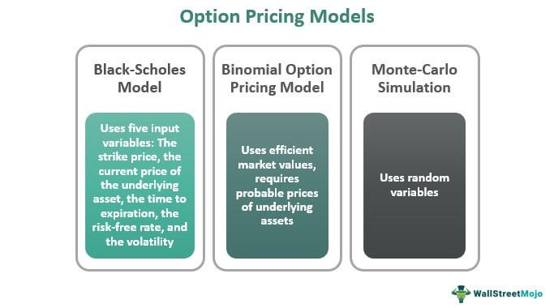

In the rapidly evolving world of finance, options trading has emerged as a foundational element both for managing risk and engaging in speculative investment. The essence of effective options trading lies in option pricing principles and the models that have been developed to deliver accurate market valuations. Understanding these models is crucial for investors aiming to capitalize on market opportunities or safeguard against financial uncertainties.

Option pricing and algorithmic trading represent two pivotal aspects of contemporary financial markets. While option pricing theories provide a framework for evaluating the potential future value of options contracts, algorithmic trading utilizes these theories to execute trades with precision and speed. This synergy between theory and practice allows traders to navigate the complexities of modern markets effectively, adapt to rapid changes, and enhance their trading performance.



Historically, the development of option pricing models has transformed how financial markets operate, providing traders with tools to quantitatively analyze risk and assess potential returns. Models like Black-Scholes, binomial, and Monte Carlo simulations have become instrumental in assessing the value of options, based on variables such as stock prices, strike prices, and market volatility.

As financial markets continue to evolve, the integration of algorithmic trading into option pricing strategies underscores the necessity for robust models capable of real-time data analysis. This technological convergence is not only reshaping strategies but also creating opportunities for innovation within the domain of options trading. Continuous advancements in option pricing theories and their application through algorithmic trading ensure that traders and institutions remain agile in managing risks and seizing profitable opportunities in the financial landscape.

## Table of Contents

## Understanding Option Pricing Theory

Option pricing theory remains a fundamental aspect of financial markets, providing traders and investors with a framework for evaluating the value of options contracts. At its core, the theory involves estimating the likelihood that an options contract will finish in-the-money (ITM), dictating the strategic decisions made by traders.

An option, essentially a financial derivative, provides the holder the right, but not the obligation, to buy (call option) or sell (put option) an underlying asset at a predetermined price (strike price) before or at expiration. The monetary value of an option, hence, relies heavily on its probability of being exercised profitably by its expiration date.

Several key elements influence option prices:

1. **Underlying Asset’s Market Price**: The current price of the underlying asset is a principal determinant of the option's price. For instance, a call option becomes more valuable as the asset price exceeds the strike price, increasing the likelihood of a profitable exercise. Conversely, a put option gains value as the asset price falls below the strike price.

2. **Strike Price**: The strike price is the specified price at which the option holder can purchase (call) or sell (put) the underlying asset. It serves as a benchmark for determining the ITM status. Options with strike prices near the current market price typically have higher premiums due to the uncertainty of outcome at these levels.

3. **Market Volatility**: Volatility refers to the degree of variation in the underlying asset’s price over time. Higher volatility suggests a greater chance of substantial price movement, increasing the probability of the option finishing ITM. As a result, options on volatile stocks often command higher premiums as they carry increased risk and reward potential.

4. **Interest Rates**: Prevailing interest rates impact the pricing of options by influencing the cost of carrying an asset. Higher interest rates generally increase call option prices and decrease put option prices as the cost of borrowing funds for trading rises.

5. **Time to Expiration**: The duration until an option's expiration affects its price, often referred to as time value. Options with longer timeframes provide more opportunities for the underlying asset to reach a favorable price. Consequently, time decay accelerates as expiration approaches, diminishing the option's extrinsic value.

The theoretical valuation of options involves sophisticated models, combining these elements to quantify the fair value of an option. These valuations enable traders to make informed decisions, balancing potential gains with risk exposure. While not exhaustive, understanding these fundamental components lays the groundwork for deeper engagement with the dynamics of options pricing in financial markets.

## Key Models Used in Option Pricing

Several sophisticated models are employed to determine the theoretical value of options, each with its unique approach to capturing market dynamics and investor expectations.

### Black-Scholes Model

The Black-Scholes model, developed by Fischer Black, Myron Scholes, and Robert Merton in the early 1970s, is one of the most widely used frameworks for valuing European options. The model assumes that the price of the underlying asset follows a geometric Brownian motion with constant [volatility](/wiki/volatility-trading-strategies) and no dividends. It provides a closed-form solution for the price of a European call or put option. The formula for the price of a European call option is given by:

$$
C = S_0 N(d_1) - X e^{-rT} N(d_2)
$$

where:
- $C$ is the call option price.
- $S_0$ is the current stock price.
- $X$ is the strike price.
- $r$ is the risk-free interest rate.
- $T$ is the time to expiration.
- $N(\cdot)$ is the cumulative distribution function of the standard normal distribution.
- $d_1 = \frac{\ln(\frac{S_0}{X}) + (r + \frac{\sigma^2}{2})T}{\sigma \sqrt{T}}$
- $d_2 = d_1 - \sigma \sqrt{T}$
- $\sigma$ is the volatility of the stock's returns.

This model is admired for its simplicity and analytical elegance but is limited by its assumptions, particularly the notion of constant volatility.

### Binomial Option Pricing Model

The binomial model, introduced by John Cox, Stephen Ross, and Mark Rubinstein, offers a flexible approach that can value American options by considering the possibility of early exercise. It uses a discrete-time framework to model the evolution of the underlying asset's price over the option's life, dividing the time to expiration into several periods. In each period, the stock price could either move up or down, forming a binomial tree of possible future prices.

The model works by iteratively computing the option values at each final node and then working backwards through the tree to the present. At each node, the option is valued as the maximum of the intrinsic value (if exercising is optimal) and the expected discounted value of holding the option. The binomial model becomes a replica of the Black-Scholes model as the number of time steps increases to infinity.

Here is a basic implementation of the binomial option pricing model using Python:

```python
import numpy as np

def binomial_option_pricing(S, X, T, r, sigma, N, option_type='call'):
    dt = T / N
    u = np.exp(sigma * np.sqrt(dt))
    d = 1 / u
    p = (np.exp(r * dt) - d) / (u - d)

    # Initialize asset prices at maturity
    asset_prices = np.zeros(N+1)
    option_values = np.zeros(N+1)

    # Final option values at maturity
    for i in range(N+1):
        asset_prices[i] = S * (u ** i) * (d ** (N - i))
        if option_type == 'call':
            option_values[i] = max(0, asset_prices[i] - X)
        else:
            option_values[i] = max(0, X - asset_prices[i])

    # Work backwards through tree
    for j in range(N-1, -1, -1):
        for i in range(j+1):
            option_values[i] = np.exp(-r*dt) * (p * option_values[i+1] + (1-p) * option_values[i])

    return option_values[0]

# Example usage
S, X, T, r, sigma, N = 100, 100, 1, 0.05, 0.2, 3
print(f"Option Price: {binomial_option_pricing(S, X, T, r, sigma, N):.2f}")
```

### Monte Carlo Simulation

Monte Carlo simulations are employed to price options by simulating thousands of potential future asset price paths based on random sampling. This method is beneficial for pricing complex derivatives where analytical solutions are not possible. The primary advantage of Monte Carlo simulation lies in its flexibility, accommodating various sources of risk, which are often not captured by simpler models. However, it can be computationally intensive.

Option pricing through these models enables the assessment of risks and guides strategic decisions in trading and risk management, seeking to strike a balance between theoretical rigour and practical applicability.

## The Role of Algorithmic Trading in Option Pricing

Algorithmic trading revolutionizes the approach to options trading by utilizing computer algorithms capable of analyzing substantial volumes of market data at remarkable speed and efficiency. This technology is instrumental in the options markets, where it assists traders in identifying mispriced securities. By harnessing powerful algorithms, traders can discern [arbitrage](/wiki/arbitrage) opportunities and execute trades with precision, exploiting even the slightest discrepancies in option pricing.

Algorithms integrated with options pricing models play a crucial role in this process. These models, such as the Black-Scholes model, can be embedded within algorithms to automatically calculate the theoretical fair value of options based on real-time market data. For example, using Python, one can implement a basic Black-Scholes formula to evaluate options:

```python
from math import log, sqrt, exp
from scipy.stats import norm

def black_scholes_call(S, K, T, r, sigma):
    d1 = (log(S/K) + (r + 0.5 * sigma**2) * T) / (sigma * sqrt(T))
    d2 = d1 - sigma * sqrt(T)
    call_price = S * norm.cdf(d1) - K * exp(-r * T) * norm.cdf(d2)
    return call_price

# Example usage:
S = 100  # Current stock price
K = 95   # Option strike price
T = 1    # Time to expiration in years
r = 0.05 # Risk-free interest rate
sigma = 0.2  # Volatility

call_price = black_scholes_call(S, K, T, r, sigma)
print("Call Option Price: ", call_price)
```

Incorporating the Black-Scholes model into algorithmic platforms allows for rapid assessment of whether an option is over- or underpriced compared to its theoretical value, enabling swift trading decisions to capitalize on discrepancies.

Moreover, [algorithmic trading](/wiki/algorithmic-trading) systems can leverage real-time data feeds to adjust to ongoing market conditions. These systems apply advanced analytics and [machine learning](/wiki/machine-learning) techniques to monitor volatility fluctuations continuously, adapting strategies in response to market dynamics. This capability to process real-time information ensures that algorithmic trading systems remain responsive to emerging trends and potential price shifts, optimizing trading outcomes.

The integration of real-time analytics and computational power enables traders to manage large portfolios and execute millions of trades with minimal latency, enhancing both the scope and profitability of trading strategies in the options market. As technology progresses, algorithmic trading continues to heighten efficiency and accuracy in option pricing and trading.

## Advanced Topics in Option Pricing

Advanced methods in option pricing address the complexities of financial markets that traditional models often overlook. One such approach is the Heston model, which introduces stochastic volatility into the pricing framework. Unlike the constant volatility assumption in the Black-Scholes model, the Heston model allows volatility to fluctuate over time, better aligning with observed market behavior where volatility tends to cluster. Mathematically, the Heston model describes the dynamics of both the asset price $S_t$ and its variance $v_t$ as follows:

$$
d S_t = \mu S_t \, dt + \sqrt{v_t} S_t \, dW_t^1
$$
$$
d v_t = \kappa (\theta - v_t) \, dt + \sigma \sqrt{v_t} \, dW_t^2
$$

where $\mu$ is the drift rate, $\kappa$ is the rate at which the variance reverts to the mean $\theta$, $\sigma$ is the volatility of the volatility, and $dW_t^1$ and $dW_t^2$ are correlated Wiener processes with correlation $\rho$.

Jump-diffusion models extend the Black-Scholes framework by incorporating sudden, large changes in asset prices, known as jumps. These models are particularly valuable during market events that cause abrupt price shifts. The Merton jump-diffusion model, for example, adds a jump component to the standard geometric Brownian motion. The resulting asset price dynamics can be expressed as:

$$
dS_t = (\mu - \lambda k) S_t \, dt + \sigma S_t \, dW_t + J S_{t-} \, dq_t
$$

where $\lambda$ is the jump intensity, $k$ is the average jump size, and $J$ represents the jump factor occurring at random times governed by a Poisson process $q_t$.

Variance and volatility swaps offer trading strategies that leverage predicted future volatility. A variance swap involves exchanging an observed realized variance for a fixed variance rate, allowing traders to hedge or speculate on volatility without setting a specific directional bet on the market. This is executed by considering the square of the observed volatility:

$$
\text{Realized Variance} = \frac{1}{N}\sum_{i=1}^{N}\left(\frac{S_{i+1} - S_i}{S_i}\right)^2
$$

where $N$ is the number of price observations over the swap period. Volatility swaps are similar, but they provide a payoff based on the per annum volatility, which is the square root of the realized variance.

These advanced option pricing models and derivatives enable traders to capture a more nuanced view of market behaviors, offering enhanced tools for mitigating risks and optimizing investment outcomes in volatile settings.

## Applications of Option Pricing in Financial Markets

Option pricing theory is integral to numerous applications across financial markets, influencing risk management, hedging strategies, strategic investments, and product innovation. At its core, it provides a quantitative framework for evaluating how options can be used to mitigate risks or capitalize on market movements. 

Risk management and hedging are among the most substantial applications. By estimating an option's fair value, financial institutions can devise structured products to protect portfolios against unwanted market movements. For example, an investor holding a significant stock position might use options to hedge against potential declines in the stock's value, thus stabilizing the portfolio's overall value. This is achieved by acquiring options with characteristics that counterbalance potential losses in the underlying assets.

In high-frequency trading ([HFT](/wiki/high-frequency-trading-strategies)) environments, the role of sophisticated option pricing models becomes even more critical. These models enable traders to execute transactions within milliseconds, a time frame that can vastly influence profitability. For instance, arbitrage opportunities might arise briefly due to disparities in perceived and actual option values. Algorithms employing advanced option pricing models scan for such disparities, allowing traders to rapidly buy undervalued options or sell overvalued ones. The famous Black-Scholes model, with its analytical tractability, is popularly integrated into algorithmic trading systems, yet more nuanced models that account for market volatility and jump risks are increasingly in demand.

Furthermore, decentralized finance (DeFi) platforms are pioneering new territories by merging traditional financial concepts with blockchain technology. Crypto derivatives, which include options on digital currencies, require the adaptation of classic option pricing models to accommodate the unique features of cryptocurrencies, such as extreme volatility and price jumps. Models applied in these environments must not only provide accurate valuations but must also execute efficiently in smart contracts on blockchain ledgers. This unfolding marriage of DeFi with option pricing is prompting innovations in how digital asset volatility is managed and traded. 

The Monte Carlo simulation, often utilized for complex derivatives, and stochastic volatility models, such as the Heston model, have been adapted for more advanced scenarios, including those encountered in the crypto sphere. Financial engineers continually refine these models to better reflect the nuances of digital assets.

In conclusion, option pricing theory serves as a foundational element in the evolution of finance, substantially impacting risk management and speculative strategies. It supports sophisticated trading environments and adapts to innovations such as crypto derivatives, demonstrating its versatility and enduring relevance in financial markets.

## Conclusion

Option pricing theories and models are indispensable for navigating financial markets. They provide a structured approach to evaluating the potential outcomes of options contracts, significantly impacting risk management and speculative strategies. As technology advances, the integration of these models with algorithmic trading systems continually reshapes financial strategies, offering more precise and efficient trading opportunities.

The Black-Scholes model, introduced in 1973, revolutionized the field by providing a closed-form solution for pricing European options. Despite its foundational role, the model's assumptions—such as constant volatility and log-normal distribution of stock prices—do not always align with real market conditions. As a result, newer models have emerged to address these limitations, incorporating factors like stochastic volatility and jump diffusion to better capture market dynamics.

Algorithmic trading, characterized by high-speed data processing and execution, has further transformed the application of option pricing models. By leveraging real-time data, algorithms can dynamically adjust to market fluctuations, enhancing trading outcomes and identifying arbitrage opportunities. This synergy between traditional option pricing theories and modern technologies underscores the need for financial institutions and traders to adapt continuously.

Staying abreast of these innovations not only ensures better risk management but also helps exploit emerging market opportunities. Traders and institutions equipped with advanced models and efficient trading systems can achieve more substantial returns by anticipating market movements with greater accuracy. Moreover, as the landscape of financial assets expands, including the rise of crypto derivatives, adapting option pricing models to accommodate these new instruments becomes increasingly critical.

In summary, while classical models like Black-Scholes have paved the way for understanding options, the ongoing evolution in financial markets necessitates an adaptable approach. Engaging with these advancements allows market participants to navigate complex trading environments successfully, bolstering their ability to manage risks and capitalize on potential gains.

## References & Further Reading

[1]: Black, F., & Scholes, M. (1973). ["The Pricing of Options and Corporate Liabilities."](https://www.cs.princeton.edu/courses/archive/fall09/cos323/papers/black_scholes73.pdf) Journal of Political Economy, 81(3), 637-654.

[2]: Cox, J. C., Ross, S. A., & Rubinstein, M. (1979). ["Option Pricing: A Simplified Approach."](https://www.sciencedirect.com/science/article/pii/0304405X79900151) Journal of Financial Economics, 7(3), 229-263.

[3]: Hull, J. C. (2011). ["Options, Futures, and Other Derivatives."](https://www.amazon.com/Options-Futures-Derivatives-DerivaGem-Package/dp/0132777428) (8th ed.). Pearson Education.

[4]: Merton, R. C. (1976). ["Option Pricing When Underlying Stock Returns Are Discontinuous."](https://www.sciencedirect.com/science/article/pii/0304405X76900222) Journal of Financial Economics, 3(1-2), 125-144.

[5]: Heston, S. L. (1993). ["A Closed-Form Solution for Options with Stochastic Volatility with Applications to Bond and Currency Options."](https://wwwf.imperial.ac.uk/~ajacquie/IC_Num_Methods/IC_Num_Methods_Docs/Literature/Heston.pdf) Review of Financial Studies, 6(2), 327-343.

[6]: Glasserman, P. (2004). ["Monte Carlo Methods in Financial Engineering."](https://link.springer.com/book/10.1007/978-0-387-21617-1) Springer. 

[7]: Jansen, S. (2020). ["Machine Learning for Algorithmic Trading: Predictive models to extract signals from market and alternative data for systematic trading strategies with Python."](https://www.amazon.com/Machine-Learning-Algorithmic-Trading-alternative/dp/1839217715) Packt Publishing.

[8]: Chan, E. P. (2008). ["Quantitative Trading: How to Build Your Own Algorithmic Trading Business."](https://github.com/ftvision/quant_trading_echan_book) Wiley.