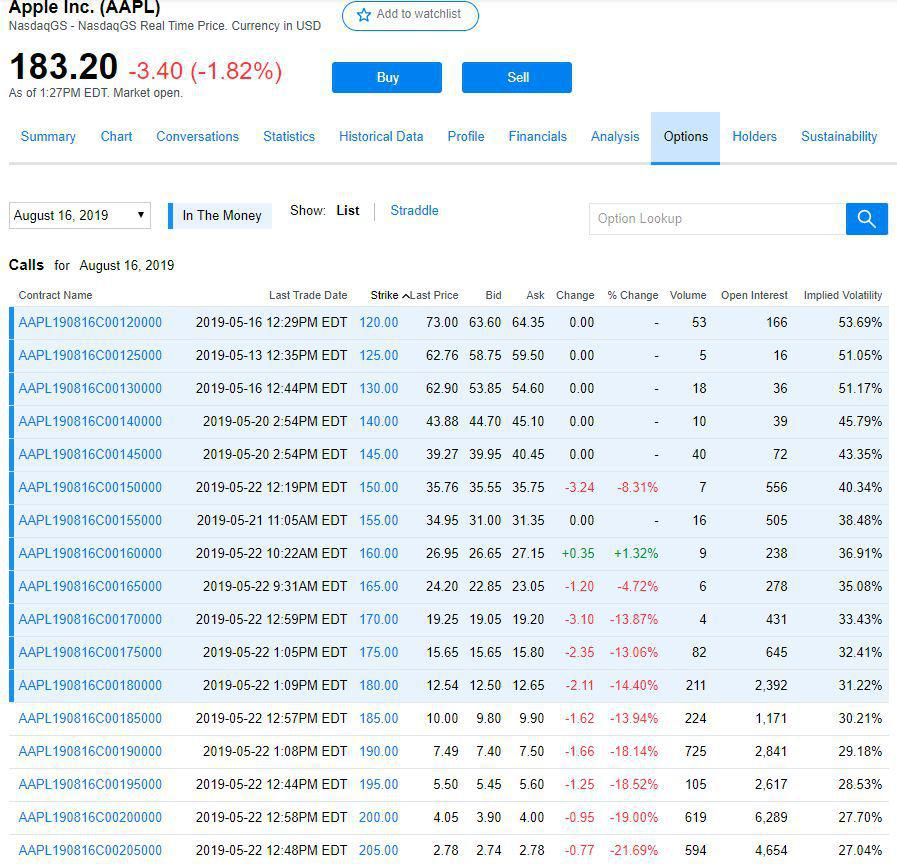

Understanding complex financial terms such as vesting schedules and options is crucial for modern investors and employees who receive stock-based compensation. These concepts are pivotal in evaluating and maximizing the benefits derived from stock options, a common form of employee compensation designed to incentivize and retain talent within a company. 

Vesting schedules determine when employees gain full ownership of their granted stock options, impacting their financial planning and career decisions. They can significantly affect an employee's decision to remain with an organization, aligning their interests with the company’s long-term goals. Various vesting schedules, such as cliff vesting and graded vesting, present distinct timelines and conditions that influence the extent of employee commitment and loyalty incentives.



In tandem, option schedules are instrumental in defining the specifics of stock options granted to employees. They encapsulate essential details such as exercise price and vesting timelines, which are crucial for comprehending both the potential benefits for employees and the financial strategies of a company. Public companies are required by financial regulations to disclose these schedules within their filings, offering insights into their future financial obligations and potential dilution of stock due to option exercises. This transparency is vital for stakeholders who rely on such information to assess a company’s health and the potential risks to their investments.

Moreover, algorithmic trading has revolutionized the way trades are executed in financial markets, using automated platforms to make investment decisions based on complex algorithms. These algorithms can significantly impact stock and options markets by allowing for rapid, data-driven trading decisions that can outperform traditional manual methods. Understanding the interplay between algorithmic trading and option schedules can enhance investment strategies, optimizing both timing and execution efficiency.

This article explores the intricate concepts of vesting schedules in options and the role of algorithmic trading, examining how these elements interact within comprehensive financial strategies. By understanding these components, both individual investors and corporations can better leverage stock-based compensation for improved financial outcomes and strategic alignment.

## Table of Contents

## What is a Vesting Schedule?

A vesting schedule is a timetable that specifies the period over which employees gain full ownership of certain benefits, such as stock options or retirement funds. This schedule is pivotal in aligning employee incentives with company goals, as it promotes retention and sustained performance. 

In a vesting schedule, employees do not have immediate access to the full benefits upon receiving a grant. Instead, they must work for a predetermined period to earn full ownership. This earned ownership process is termed "vesting," ensuring that employees remain with the company for a required duration before they can fully access their benefits.

### Types of Vesting Schedules

There are primarily two common types of vesting schedules: cliff vesting and graded vesting, each with distinct characteristics regarding timelines and ownership conditions.

1. **Cliff Vesting**: With this approach, employees receive full ownership of their benefits at a specific time, known as the "cliff." Until this point, they do not have access to the benefits. For example, an employee might receive full vesting of stock options after three years of service. If the employee leaves the company before this duration, they forfeit the benefits. Cliff vesting is often used to incentivize employees to remain with the organization for a meaningful time before gaining access.

2. **Graded Vesting**: This schedule allows employees to incrementally gain ownership over time. For instance, an employee might vest 20% of their stock options each year over a five-year period. This gradual approach means that employees gain some portion of their benefits consistently, reducing the likelihood of losing all benefits due to short-term changes in employment status.

Understanding how these vesting schedules function is critical for employees planning their long-term financial strategies and for companies looking to design effective employee retention programs. By providing a structured timeline for benefit acquisition, vesting schedules serve as a compelling tool for fostering loyalty and ensuring that employees contribute meaningfully to an organization over time. 

In conclusion, comprehending the intricacies of vesting schedules aids in evaluating employee incentives and making informed decisions regarding employment and financial trajectories.

## Understanding Option Schedules

Option schedules provide a structured overview of the stock options that are granted to employees, serving as a critical component of employee compensation packages. These schedules specify key details such as the exercise price, which is the price at which employees can purchase the stock, and the vesting schedule, which determines when the employee gains ownership of the stock options. 

Public companies are required to disclose their option schedules in their financial statements, typically as part of Securities and Exchange Commission (SEC) filings. This requirement ensures a level of transparency that is crucial for investors, as it can highlight potential stock dilution risks that may arise when a large number of options are exercised. Dilution occurs when the issuance of additional shares reduces the value of existing shares. Monitoring option schedules allows investors to assess the potential impact on share value comprehensively.

Analyzing option schedules is not solely beneficial to investors. It is also a vital practice for the companies themselves, allowing them to identify any future liabilities associated with the stock options. When employees exercise their options, the company must have the stock available, leading to financial obligations that must be accounted for in advance. This analysis plays a significant role in maintaining proper accounting practices, as it ensures that companies correctly identify and manage option-related expenses, such as compensation costs reflected in employee benefit expenses.

Moreover, the details provided in option schedules influence corporate decision-making by offering insights into the overall health and strategy of the company. For example, granting options with extended vesting periods can be a strategy to promote long-term employee retention, aligning employee interests with those of the company. The structure of the option schedules can thus reflect the strategic intentions of a company's leadership regarding workforce stability and financial health. 

Understanding the technical details embedded within option schedules is essential for stakeholders to make informed decisions related to investments, corporate finance, and employee compensation strategies.

## Algorithmic Trading and Its Role

Algorithmic trading leverages computer systems to execute trades automatically based on predetermined criteria, revolutionizing the stock and options markets by enhancing speed and precision. At its core, this trading method uses algorithms—sets of rules or instructions—to evaluate market variables, identify opportunities, and execute trades, often in fractions of a second. The use of high-frequency trading, a subset of [algorithmic trading](/wiki/algorithmic-trading), exemplifies how quick execution can capture minute price discrepancies for profit, underscoring the efficiency of algorithmic approaches compared to traditional manual methods.

Algorithmic trading minimizes human error and emotional interference, providing a significant advantage. Automated systems can process vast amounts of market data in real time, enabling them to adapt rapidly to price movements and execute trades in optimal conditions. This capability enhances [liquidity](/wiki/liquidity-risk-premium) in the markets and can contribute to more stable pricing mechanisms. For instance, algorithms can analyze complex factors like market [volatility](/wiki/volatility-trading-strategies), [order book](/wiki/order-book-trading-strategies) depth, and historical price patterns to inform trading decisions.

Incorporating algorithmic trading into strategies involving option schedules can optimize investment outcomes. An option schedule outlines when stock options may be exercised, typically tied to a vesting schedule. By using algorithmic trading strategies, investors and companies can ensure that the exercise of options aligns with favorable market conditions, potentially increasing the realized value of stock options. Algorithms can be programmed to monitor market conditions continuously and execute trades when predetermined criteria are met, ensuring that trades occur at the most advantageous times.

For instance, consider a scenario where an employee's stock options are about to vest, and the market is volatile. An algorithm could be designed to execute the purchase and sale of these options when specific favorable pricing thresholds are met, maximizing potential gains or minimizing losses. This form of strategic automation is crucial for aligning employee incentives with corporate financial performance, optimizing compensation plans' value to both employees and employers.

Moreover, algorithmic trading supports compliance and transparency by maintaining detailed records of trading activities, thus facilitating audits and regulatory reviews. The ability to back-test trading algorithms against historical data allows firms to refine their strategies continuously, enhancing performance and risk management. By understanding how algorithmic trading interacts with option schedules, stakeholders can devise optimized approaches to stock-based compensation and investment strategies, ensuring that they take full advantage of market opportunities.

## Interplay Between Vesting Schedules and Algo Trading

Algorithmic trading, characterized by the use of automated systems to execute trades based on predetermined algorithms, plays a significant role in optimizing the timing of stock option exercises. As vesting schedules dictate when employees can exercise their stock options, algorithmic trading can be leveraged to ensure these exercises occur under favorable market conditions. By analyzing vast amounts of market data in real time, algorithmic systems can identify optimal points for exercising options based on criteria such as stock price movements, market volatility, and trading [volume](/wiki/volume-trading-strategy).

The integration of algorithmic solutions facilitates the efficient management of vesting schedules by automating the exercise process. This automation ensures that exercises happen seamlessly when conditions are most advantageous, thus enhancing transparency in the execution of employee stock options. Employees benefit from this system by receiving a fair market price at the time of execution, as algorithms can quickly capitalize on short-lived market fluctuations that might not be apparent or actionable through manual intervention.

Moreover, the interplay between vesting schedules and algorithmic trading aligns employee incentives with the broader company performance and market conditions. For instance, a well-timed exercise of stock options reflecting company performance and favorable market conditions can increase employee satisfaction and retention. This alignment is crucial since it promotes a culture where employees are more invested in the success of the company, fostering a unified approach toward achieving corporate goals.

In practice, companies might implement a strategy comparable to the following Python code snippet, where an algorithm decides whether to exercise options based on predefined conditions:

```python
def should_exercise_option(current_price, target_price, market_volatility):
    # Condition to consider exercising options
    exercise_condition = (current_price >= target_price) and (market_volatility < certain_threshold)
    return exercise_condition

# Example usage
current_price = 105
target_price = 100
market_volatility = 0.05

if should_exercise_option(current_price, target_price, market_volatility):
    print("Exercise options now!")
else:
    print("Wait for better conditions.")
```

Through such strategies, companies can achieve optimal execution for their stock-based compensation programs, ensuring both efficiency and compliance with financial regulations. This strategic interplay not only benefits the individuals involved by maximizing their potential gains but also supports overall corporate transparency and performance.

## Advantages and Challenges

Vesting schedules and algorithmic trading present notable advantages in the financial and business landscape. Vesting schedules, a common tool in employee compensation, help incentivize employee retention by gradually granting ownership of stock options or benefits. This long-term encouragement aligns employee interests with company performance, creating a dedicated workforce committed to achieving corporate goals. On the other hand, algorithmic trading enhances market engagement by enabling faster, data-driven trades. The ability of algorithms to analyze vast amounts of data and execute trades with speed and precision often leads to increased market efficiency and potentially better investment outcomes.

Despite these advantages, both vesting schedules and algorithmic trading introduce complexities that require careful management. One primary challenge lies in navigating the sophisticated oversight needed to manage these systems effectively. For companies implementing vesting schedules, understanding and complying with financial regulations surrounding stock compensation is crucial. This involves ensuring that vesting plans are structured in a manner that meets legal requirements and effectively retains talent.

Algorithmic trading also demands a deep understanding of market behavior and compliance with evolving financial regulations. Developing and maintaining robust algorithms that can adapt to market changes and ensure compliance with trading laws requires significant expertise. Additionally, as algorithms can exacerbate market volatility due to rapid trading, companies and individual traders must implement safeguards to mitigate such risks.

Furthermore, both vesting schedules and algorithmic trading bring forth tax implications and financial risks that must be carefully considered. For employees, the timing of when vested options are exercised can impact their tax liabilities significantly. Optimizing for favorable tax outcomes involves strategic planning and understanding the tax code in one's jurisdiction. Similarly, algorithmic trading strategies could lead to short-term capital gains, which are often taxed at higher rates than long-term gains, making tax planning essential.

In conclusion, while vesting schedules and algorithmic trading offer substantial benefits, their successful implementation and management necessitate a comprehensive understanding of their complexities, regulatory environment, and financial risks. By recognizing and addressing these challenges, both companies and individual investors can harness these tools to achieve strategic objectives and enhance financial performance.

## Conclusion

A nuanced understanding of vesting schedules and option schedules is crucial for anyone seeking to maximize the benefits of stock-based compensation programs. Vesting schedules dictate the timeline over which employees gain full ownership of their stock options, sending clear incentives for employee retention and loyalty. By detailing the terms under which stock options become exercisable, these schedules play a key role in aligning employee interests with those of the company, fostering long-term commitment and strategic alignment.

Option schedules, on the other hand, provide comprehensive details about stock options granted to employees, including the exercise price and the associated vesting schedule. Public companies are required to disclose option schedules, ensuring transparency in financial reporting and offering insights into potential stock dilution risks. Understanding these schedules allows both companies and individuals to effectively manage future liabilities and grasp the broader financial implications that come with such compensation plans.

Incorporating algorithmic trading strategies into the management of vesting and option schedules further enhances investment outcomes. Algorithmic trading, utilizing automated trading decisions based on pre-defined criteria, can optimize the timing and execution of trades, capitalizing on favorable market conditions and minimizing potential drawbacks. For example, automatically exercising stock options when market prices reach a target can maximize potential gains or reduce risks associated with holding the options too long.

The landscape of stock-based compensation and trading is complex and continually evolving. Individuals and corporations must keep abreast of these financial tools to ensure sustained growth and compliance with regulatory standards. By staying informed and leveraging these mechanisms skillfully, stakeholders can optimize their financial strategies, enhance market engagement, and ultimately bolster their economic prospects.

## References & Further Reading

[1]: Malkiel, B. G. (2019). ["A Random Walk Down Wall Street: The Time-Tested Strategy for Successful Investing"](https://www.amazon.com/Random-Walk-Down-Wall-Street/dp/1324002182). W.W. Norton & Company.

[2]: Bodie, Z., Kane, A., & Marcus, A. J. (2018). ["Investments"](https://www.amazon.com/Investments-Zvi-Bodie/dp/1260013839). McGraw-Hill Education.

[3]: Gastineau, G. L. (2002). ["The Exchange-Traded Funds Manual"](https://archive.org/details/exchangetradedfu0000gast). John Wiley & Sons.

[4]: O'Shaughnessy, J. (2012). ["What Works on Wall Street: The Classic Guide to the Best-Performing Investment Strategies of All Time"](https://www.amazon.com/What-Works-Wall-Street-Fourth/dp/0071625763). McGraw-Hill Education.

[5]: Lhabitant, F. S. (2004). ["Hedge Funds: Quantitative Insights"](https://www.wiley.com/en-us/Hedge+Funds%3A+Quantitative+Insights-p-9780470687772). Wiley.