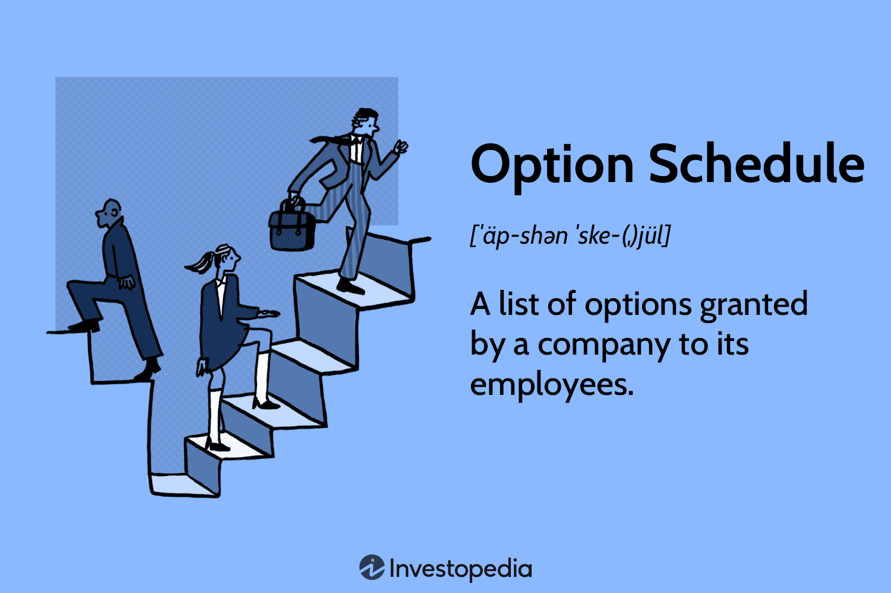

## Table of Contents

## What is an option schedule?

An option schedule is a plan that shows when employees can buy company stock at a set price. It is often used in startups and tech companies to reward workers. The schedule tells employees when they can start buying the stock, how much they can buy, and over what period of time. This is important because it helps employees know when they can benefit from the company's growth.

Usually, an option schedule has a vesting period. This means employees have to work for the company for a certain time before they can buy the stock. A common vesting period is four years, with a one-year cliff. This means that after one year, employees can buy a part of the stock, and then they can buy more each month or year until the end of the four years. This encourages employees to stay with the company longer.

## Why is an option schedule important in project management?

An option schedule is important in project management because it helps keep the project on track. It tells everyone when different parts of the project need to be done. This way, everyone knows what they need to do and when. It also helps the project manager make sure that the project stays within the planned time and budget. If something is taking too long or costing too much, the project manager can see it on the option schedule and fix it before it becomes a big problem.

Another reason an option schedule is important is that it helps the team work together better. When everyone can see the schedule, they know what other people are working on and how their own work fits into the big picture. This can help avoid confusion and make sure that everyone is working towards the same goal. It also makes it easier for the team to plan ahead and get ready for the next steps in the project.

## How does an option schedule differ from a regular project schedule?

An option schedule and a regular project schedule are both used to plan and manage projects, but they have some key differences. A regular project schedule lists all the tasks that need to be done, when they should start and finish, and who is responsible for them. It's like a detailed roadmap that helps everyone on the team know what to do and when to do it. This type of schedule is used in almost all projects to keep things organized and on track.

An option schedule, on the other hand, is more about giving employees the chance to buy company stock at a set price. It's not about listing tasks or deadlines for a project, but rather about rewarding employees and encouraging them to stay with the company. The option schedule tells employees when they can start buying the stock, how much they can buy, and over what period of time. This is important in companies, especially startups, where stock options are a big part of employee benefits.

In summary, while a regular project schedule is essential for managing the day-to-day tasks and timelines of a project, an option schedule is focused on employee incentives and long-term commitment to the company. Both are important tools, but they serve different purposes and are used in different contexts within a business.

## What are the key components of an option schedule?

An option schedule has a few main parts that help it work well. The first part is the vesting period. This is the time an employee needs to work at the company before they can start buying the stock. A common vesting period is four years, with a one-year cliff. This means that after one year, the employee can buy some of the stock, and then they can buy more each month or year until the end of the four years. The vesting period is important because it encourages employees to stay with the company longer.

The second part of an option schedule is the exercise price. This is the set price at which employees can buy the company's stock. It's usually lower than the market price, so it's a good deal for the employees. The exercise price stays the same even if the market price goes up, which means employees can make money if the company does well. The last part is the expiration date. This is the last day employees can buy the stock. If they don't buy it by this date, they lose the chance. These parts together make up the option schedule and help employees know when and how they can benefit from the company's growth.

## How do you create an option schedule?

To create an option schedule, start by deciding on the vesting period. This is how long employees need to work at the company before they can start buying stock. A common vesting period is four years with a one-year cliff. This means that after one year, employees can buy some of the stock, and then they can buy more each month or year until the end of the four years. Next, set the exercise price. This is the price at which employees can buy the stock. It should be lower than the market price so it's a good deal for them. The exercise price stays the same even if the market price goes up.

Then, decide on the expiration date. This is the last day employees can buy the stock. If they don't buy it by this date, they lose the chance. Once you have these parts, put them together in a clear plan. Make sure to explain the vesting period, the exercise price, and the expiration date to the employees so they understand when and how they can buy the stock. This helps them know when they can benefit from the company's growth and encourages them to stay with the company longer.

## Can you explain the process of updating an option schedule?

Updating an option schedule can be needed when things change at the company. Maybe the company wants to make the vesting period shorter to keep employees happy, or the exercise price needs to change because the market price of the stock has gone up a lot. To update the schedule, first, the company needs to decide what needs to change. They might talk to their lawyers or financial advisors to make sure the changes are fair and legal.

Once the company knows what changes to make, they need to tell the employees about the new schedule. This can be done through a meeting or by sending an email. It's important to explain the changes clearly so everyone understands how it affects their stock options. The updated schedule should then be added to the employee handbook or any place where the old schedule was kept, so everyone can see the new rules.

## What are common challenges faced when implementing an option schedule?

One common challenge when implementing an option schedule is making sure everyone understands it. Employees might not know what a vesting period or an exercise price is. They might not understand when they can buy the stock or how much it will cost. This can lead to confusion and frustration. The company needs to explain the schedule clearly and answer any questions employees have. They might need to hold meetings or send out detailed emails to make sure everyone gets it.

Another challenge is keeping the option schedule fair and legal. The company needs to make sure the schedule follows all the rules and laws about stock options. This can be hard because the rules can be different in different places. The company might need to talk to lawyers to make sure they are doing everything right. Also, the company needs to make sure the schedule is fair to all employees. If some employees feel like the schedule is not fair, it can cause problems and make them unhappy.

## How can software tools assist in managing an option schedule?

Software tools can make managing an option schedule easier. They can keep track of when employees can start buying stock and how much they can buy. This helps the company make sure everyone gets their stock options at the right time. The software can also send reminders to employees about important dates, like when the vesting period ends or when the stock options expire. This way, employees don't miss out on their chances to buy stock.

Another way software tools help is by making it easy to update the option schedule. If the company needs to change the vesting period or the exercise price, the software can do this quickly. It can also keep a record of all the changes, so the company can see how the schedule has changed over time. This makes it easier to keep everything fair and legal. Plus, the software can create reports that show how many employees have used their stock options and how many have not. This helps the company see if the option schedule is working well.

## What are the best practices for maintaining an effective option schedule?

To keep an option schedule working well, it's important to make sure everyone understands it. The company should explain the vesting period, exercise price, and expiration date clearly. They can do this by holding meetings or sending out emails. It's also good to answer any questions employees have. This helps avoid confusion and makes sure everyone knows when they can buy stock and how much it will cost. Keeping the schedule simple and easy to understand is key.

Another important thing is to keep the option schedule fair and legal. The company should check with lawyers to make sure the schedule follows all the rules. They should also make sure the schedule is fair to all employees. If some employees feel like the schedule is not fair, it can cause problems. The company should update the schedule when needed and tell everyone about the changes. Using software tools can help keep track of everything and make updates easier. This way, the company can make sure the option schedule stays effective and helps keep employees happy and motivated.

## How does an option schedule impact project risk management?

An option schedule can help with project risk management by making sure employees stay with the company longer. When employees know they can buy stock at a good price after working for a certain time, they are more likely to stay. This means the project team stays the same, which can lower the risk of losing important team members. If the team stays together, they can work better and finish the project on time.

However, an option schedule can also add some risks. If employees don't understand the schedule or feel it's not fair, they might get unhappy. This can lead to problems in the team and make it harder to manage the project. The company needs to explain the schedule clearly and make sure it's fair to everyone. This way, the option schedule can help manage risks instead of making them worse.

## Can you provide an example of how an option schedule was used successfully in a project?

At a tech startup called BrightTech, they used an option schedule to help finish their new app on time. The company gave stock options to the team working on the app. They said the employees could start buying stock after one year, and then a bit more each month for three more years. This made the team want to stay and work hard because they knew they could make money if the app did well. Everyone understood the schedule and thought it was fair, so they all worked together to make the app a success.

Because of the option schedule, the team stayed the same all through the project. No one left, so they could keep working without any breaks. This helped them finish the app faster than they thought they would. When the app came out, it did really well, and the company's stock price went up a lot. The employees were happy because they could buy stock at a lower price and make money. The option schedule helped BrightTech manage their project risks and make their app a big success.

## What advanced techniques can be used to optimize an option schedule for complex projects?

For complex projects, one advanced technique to optimize an option schedule is to use a tiered vesting system. This means that instead of having one big vesting period, the company can break it into smaller parts. For example, employees might get some stock options after six months, more after a year, and even more after two years. This can keep employees motivated throughout the whole project because they get rewards at different times. It also helps the company manage risks better because they can adjust the schedule as the project goes on.

Another technique is to link the option schedule to project milestones. This means that employees can get stock options when they finish important parts of the project. For example, if the team finishes the first version of a new product, they might get some stock options right away. This can make employees work harder to reach these milestones because they know they will get rewarded. It also helps the company keep the project on track and make sure everyone is working towards the same goals.

## References & Further Reading

[1]: Malkiel, B. G. (2019). ["A Random Walk Down Wall Street: The Time-Tested Strategy for Successful Investing"](https://www.amazon.com/Random-Walk-Down-Wall-Street/dp/1324002182). W.W. Norton & Company.

[2]: Bodie, Z., Kane, A., & Marcus, A. J. (2018). ["Investments"](https://www.amazon.com/Investments-Zvi-Bodie/dp/1260013839). McGraw-Hill Education.

[3]: Gastineau, G. L. (2002). ["The Exchange-Traded Funds Manual"](https://archive.org/details/exchangetradedfu0000gast). John Wiley & Sons.

[4]: O'Shaughnessy, J. (2012). ["What Works on Wall Street: The Classic Guide to the Best-Performing Investment Strategies of All Time"](https://www.amazon.com/What-Works-Wall-Street-Fourth/dp/0071625763). McGraw-Hill Education.

[5]: Lhabitant, F. S. (2004). ["Hedge Funds: Quantitative Insights"](https://www.wiley.com/en-us/Hedge+Funds%3A+Quantitative+Insights-p-9780470687772). Wiley.