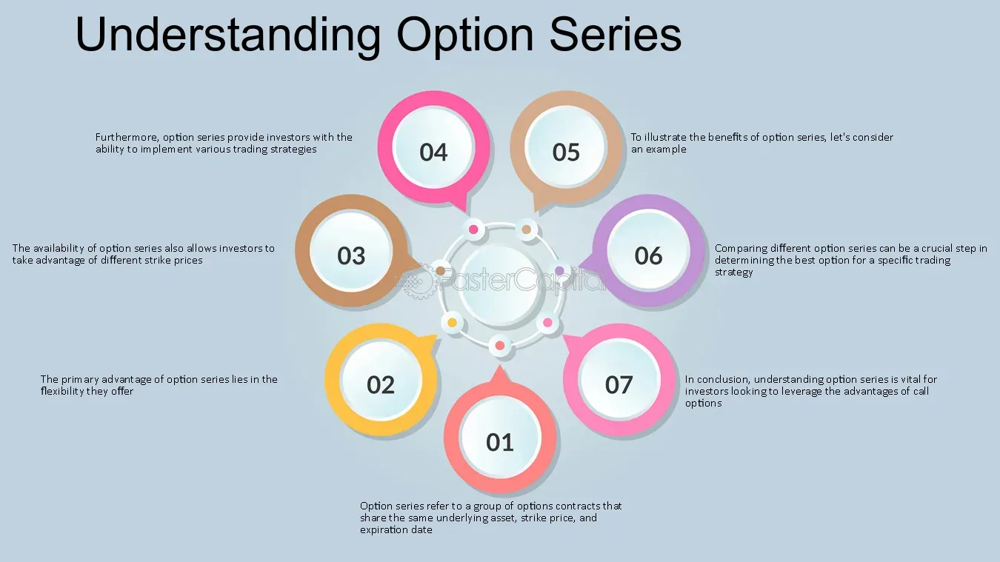

## Table of Contents

## What is an option series?

An option series is a group of options contracts that have the same expiration date and the same strike price. These contracts can be either call options, which give the buyer the right to buy the underlying asset, or put options, which give the buyer the right to sell the underlying asset. The term "series" helps traders and investors to easily identify and compare different options that share these key characteristics.

For example, if you are looking at options for a stock like Apple, an option series might include all the call options for Apple that expire on the same date and have the same strike price. This makes it easier to see how the value of these options changes over time or in response to market movements. By grouping options into series, it becomes simpler to manage and analyze potential investment strategies.

## How does an option series differ from a single option?

An option series is a collection of options that share the same expiration date and strike price. This means that all the options in a series are for the same underlying asset, like a stock, and they all expire at the same time. They can be either call options, which let you buy the asset, or put options, which let you sell it. By grouping options this way, it's easier to see how they behave together and compare them.

A single option, on the other hand, is just one contract. It has its own specific expiration date and strike price, and it can be a call or a put. When you look at a single option, you're focusing on that one contract's details and how it might perform. While an option series gives you a broader view of similar options, a single option lets you zoom in on one specific opportunity.

## What are the key components of an option series?

An option series is made up of options that all have the same expiration date and strike price. This means that every option in the series will expire at the same time, like on the third Friday of a month. The strike price is the price at which the option can be used to buy or sell the underlying asset, like a stock. For example, if you have a series of call options for a stock with a strike price of $50 and an expiration date of June 20th, all the options in that series will have those same two features.

The other important part of an option series is whether the options are calls or puts. A call option gives you the right to buy the underlying asset at the strike price, while a put option gives you the right to sell it. So, an option series can be either all call options or all put options, but not mixed. This grouping helps traders and investors easily compare and analyze options that are similar, making it simpler to plan their investment strategies.

## How are option series used in trading?

Option series are used by traders to make decisions about buying or selling options. When a trader looks at an option series, they see all the options for a certain stock that have the same expiration date and strike price. This helps them compare the prices and see how the options are doing. For example, if a trader is thinking about buying a call option for a stock, they can look at all the call options with the same expiration date and strike price to see which one is the best deal.

Traders also use option series to plan their strategies. They can see how the options in a series change over time and decide when to buy or sell. For example, if a trader sees that the options in a series are going up in value, they might decide to buy them before the price gets too high. Or, if they see the options are going down, they might sell them to avoid losing money. By looking at an option series, traders can make smarter choices and manage their investments better.

## What is the significance of expiration dates in an option series?

Expiration dates are really important in an option series because they tell you when the options will stop being valid. Every option in a series has the same expiration date, like the third Friday of a month. This means that if you have an option from that series, you need to decide whether to use it or let it go before that date. If you don't do anything by the expiration date, the option will expire and you won't be able to use it anymore.

Traders pay close attention to expiration dates because they affect how much an option is worth. As the expiration date gets closer, the value of the option can change a lot. If the option is a call and the stock price is going up, the option might become more valuable. But if the stock price stays the same or goes down, the option might lose value. Knowing the expiration date helps traders plan when to buy or sell their options to make the most money or avoid losing too much.

## How do strike prices affect the value of options within a series?

Strike prices are a big deal when it comes to the value of options in a series. The strike price is the price at which you can buy or sell the stock if you use the option. If the stock's price is higher than the strike price of a call option, that option becomes more valuable because you can buy the stock for less than it's worth on the market. On the other hand, if the stock's price is lower than the strike price, the call option loses value because it wouldn't make sense to buy the stock at a higher price than it's worth.

For put options, it works the opposite way. If the stock's price is lower than the strike price, the put option becomes more valuable because you can sell the stock for more than it's worth on the market. But if the stock's price is higher than the strike price, the put option loses value because selling the stock at a lower price wouldn't be a good deal. So, the strike price is really important because it helps you figure out if an option is worth buying or selling, depending on where the stock's price is compared to the strike price.

## What are the different types of option series (e.g., call, put)?

An option series can be either a call option series or a put option series. A call option series is a group of call options that all have the same expiration date and strike price. Call options give you the right to buy the stock at the strike price before the expiration date. If the stock's price goes up above the strike price, these call options can become more valuable because you can buy the stock for less than it's worth on the market.

On the other hand, a put option series is a group of put options that all have the same expiration date and strike price. Put options give you the right to sell the stock at the strike price before the expiration date. If the stock's price goes down below the strike price, these put options can become more valuable because you can sell the stock for more than it's worth on the market. Both types of option series help traders see how similar options are doing and make decisions about buying or selling them.

## How can an investor use an option series to manage risk?

An investor can use an option series to manage risk by buying options that help protect their investments. For example, if an investor owns a stock and is worried that the price might go down, they can buy a put option from the same series as a kind of insurance. This put option gives them the right to sell the stock at the strike price, even if the market price drops lower. By doing this, the investor can limit their losses because they know they can sell the stock at the strike price if things go bad.

Another way to manage risk with an option series is by using a strategy called a spread. This involves buying and selling options from the same series at different strike prices. For example, an investor might buy a call option with a lower strike price and sell a call option with a higher strike price. This can help limit the amount of money they could lose because the cost of the option they bought is partly covered by the money they get from selling the other option. By carefully choosing options from the same series, investors can create strategies that help them manage their risk and protect their investments.

## What are the tax implications of trading option series?

When you trade options, you need to think about taxes. If you hold an option for less than a year before selling it, any profit you make is considered a short-term capital gain. This is taxed at your regular income tax rate, which can be pretty high. But if you hold the option for more than a year, the profit is a long-term capital gain, which usually has a lower tax rate. So, how long you keep your options can make a big difference in how much tax you pay.

Another thing to know is that if you use options to hedge your investments, like buying put options to protect your stocks, the tax treatment can get a bit tricky. Sometimes, the IRS might see this as part of your overall investment strategy and tax it differently. It's a good idea to keep good records of all your option trades and talk to a tax professional. They can help you figure out the best way to handle your taxes and make sure you're not paying more than you need to.

## How do market conditions influence the performance of an option series?

Market conditions play a big role in how well an option series does. If the market is going up and the price of the stock is rising, call options in the series can become more valuable. This is because call options give you the right to buy the stock at a set price, and if the stock's price is higher than that, you can make a profit. On the other hand, if the market is going down and the stock price is falling, put options in the series can gain value. Put options let you sell the stock at a set price, so if the market price drops below that, you can sell the stock for more than it's worth on the market.

Volatility, or how much the stock price moves up and down, also affects options. When the market is very volatile, the value of options can go up because there's a bigger chance the stock price will move a lot before the option expires. This is good for options sellers because they can charge more for the options. But if the market is calm and the stock price doesn't move much, options might not be worth as much because there's less chance of a big price change. So, understanding market conditions can help you decide when to buy or sell options in a series.

## What advanced strategies can be employed using multiple option series?

One advanced strategy using multiple option series is called a "straddle." This involves buying both a call option and a put option from different series, but with the same expiration date and the same strike price. The idea is to make money no matter which way the stock price moves. If the stock price goes up a lot, the call option becomes more valuable and you can sell it for a profit. If the stock price goes down a lot, the put option becomes more valuable and you can sell it for a profit. The key is that the stock has to move a lot in either direction for you to make money, because you have to pay for both options.

Another strategy is called a "butterfly spread." This involves using three different option series, all with the same expiration date but different strike prices. You buy one call option with a low strike price, sell two call options with a middle strike price, and buy another call option with a high strike price. The goal is to make money if the stock price stays close to the middle strike price. If it does, the options you sold lose less value than the options you bought gain, so you make a profit. This strategy can be good if you think the stock won't move much, but it's more complicated and needs careful planning.

## How do regulatory changes impact the trading of option series?

Regulatory changes can have a big impact on how people trade option series. When rules change, it can affect what kinds of options are available, how much they cost, and how they can be used. For example, if a new rule says that options have to have a higher minimum price, it might make them more expensive to buy. Or if a rule changes how much money you need to have to trade options, it could mean fewer people can do it. These changes can make traders rethink their strategies and might even make them switch to different kinds of investments.

Another way regulatory changes can affect option series is by changing how they are reported and taxed. If the rules about how to report option trades change, it can make things more complicated for traders. They might need to keep better records or fill out different forms. Also, if tax laws change, it could mean that the profits from trading options are taxed differently. This can make options more or less attractive to traders, depending on how the new rules affect their bottom line. Keeping up with these changes is important for anyone who trades options.

## References & Further Reading

[1]: Bergstra, J., Bardenet, R., Bengio, Y., & Kégl, B. (2011). ["Algorithms for Hyper-Parameter Optimization."](https://dl.acm.org/doi/10.5555/2986459.2986743) Advances in Neural Information Processing Systems 24.

[2]: ["Advances in Financial Machine Learning"](https://www.amazon.com/Advances-Financial-Machine-Learning-Marcos/dp/1119482089) by Marcos Lopez de Prado

[3]: ["Evidence-Based Technical Analysis: Applying the Scientific Method and Statistical Inference to Trading Signals"](https://www.amazon.com/Evidence-Based-Technical-Analysis-Scientific-Statistical/dp/0470008741) by David Aronson

[4]: ["Machine Learning for Algorithmic Trading"](https://github.com/stefan-jansen/machine-learning-for-trading) by Stefan Jansen

[5]: ["Quantitative Trading: How to Build Your Own Algorithmic Trading Business"](https://www.amazon.com/Quantitative-Trading-Build-Algorithmic-Business/dp/1119800064) by Ernest P. Chan