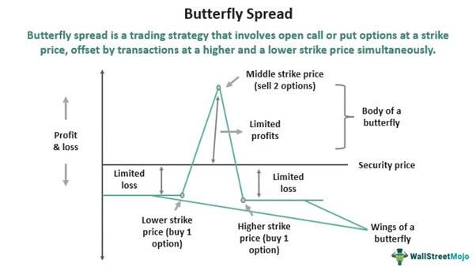

In today's fast-paced financial markets, investors are constantly seeking innovative ways to optimize their portfolios and enhance their trading efficiency. Algorithmic trading, commonly referred to as algo trading, is one such method that has gained significant popularity among market participants. This approach involves the use of computer programs that follow a defined set of instructions for placing trades. These algorithms can vary in complexity, from simple moving averages to intricate statistical models, but they all share the goal of executing trades at the best possible price with the utmost speed and accuracy.

The appeal of algo trading lies in its ability to operate in situations where human intervention might be too slow or prone to error. By reducing the emotional factors that can cloud decision-making, algorithmic trading allows for more disciplined and consistent trade execution. This can be particularly advantageous in volatile markets, where rapid fluctuations in asset prices require swift and decisive responses.



Moreover, algo trading is conducive to a broad spectrum of investment strategies, catering to both retail and institutional investors. Whether used for market making, trend following, or arbitrage, algo trading solutions can be tailored to meet specific investment objectives. The integration of algorithmic models can improve risk management by automating stop-loss orders and position sizing adjustments, ensuring that trading activities align with predetermined risk parameters.

This article examines the role of algo trading within the spectrum of modern investment options, providing insights into how it operates and the benefits it presents for diverse investors. As technology continues to advance, the capabilities and reach of algorithmic trading are expected to grow, offering new opportunities for enhancing portfolio performance and operational efficiency.

## Table of Contents

## Understanding Algo Trading

Algorithmic trading, often abbreviated as algo trading, utilizes sophisticated computer algorithms to carry out trading activities in financial markets. These algorithms follow pre-set rules and conditions to execute trades efficiently, thereby removing the emotional and psychological influences that often lead to irrational decision-making in traditional trading.

The primary advantage of algo trading lies in its ability to execute orders at a speed and frequency that is impossible for a human trader. The accuracy in trade execution is enhanced through predetermined parameters, which might include timing, price, quantity, or any mathematical model-based criterion. For instance, an algorithm can be programmed to buy a stock if its 50-day moving average exceeds its 200-day moving average, implementing a simple [momentum](/wiki/momentum) strategy.

```python
import numpy as np

def moving_average_crossover(prices, short_window=50, long_window=200):
    # Calculate short and long moving averages
    short_moving_avg = np.convolve(prices, np.ones(short_window)/short_window, mode='valid')
    long_moving_avg = np.convolve(prices, np.ones(long_window)/long_window, mode='valid')

    # Generate trading signals
    buy_signals = short_moving_avg > long_moving_avg
    return buy_signals
```

Algorithmic trading supports a broad spectrum of trading strategies. One common strategy is statistical [arbitrage](/wiki/arbitrage), which involves exploiting pricing inefficiencies between similar financial instruments across different markets. Another is [market making](/wiki/market-making), where the algorithm provides [liquidity](/wiki/liquidity-risk-premium) by placing buy and sell orders simultaneously, profiting from the bid-ask spread.

Complexity can increase significantly, with algorithms engaging in multi-leg options strategies that may involve simultaneous execution of various option trades to hedge positions or speculate on market movements. Algo trading is highly adaptive, able to adjust strategies based on real-time data and market conditions, ensuring optimal trade execution.

By automating the trading process, algorithmic systems are designed to monitor market conditions continuously and react instantly to market opportunities. This capability enhances the precision and timing of trades, which are critical in strategies requiring immediate response to market fluctuations. Thus, algo trading serves as a powerful tool in the modern investor's arsenal, enabling them to achieve efficiencies unattainable by traditional means.

## Investment Options with Algo Trading

Algorithmic trading, or algo trading, is an advanced trading strategy that utilizes computer algorithms to automate decision-making in financial markets. It encompasses a broad spectrum of asset classes, including stocks, options, cryptocurrencies, and more, offering investors a dynamic and efficient approach to trading.

One of the primary applications of algo trading is in the stock market, where algorithms are employed to execute high-frequency trading ([HFT](/wiki/high-frequency-trading-strategies)) strategies. By processing market data and reacting to price changes in fractions of a second, algo trading maximizes the precision and timing of trade executions. This speed is especially crucial in low-margin stock trading, where even a slight delay can affect profitability.

In the options market, algo trading is used to hedge positions effectively. Algorithms can instantly calculate the Greeks (Delta, Gamma, Theta, Vega, Rho) and adjust positions to maintain a delta-neutral state, thus minimizing risk exposure. This applied precision in hedging allows investors to protect their portfolios against adverse market movements.

Cryptocurrencies have emerged as another popular asset class for algo trading. The 24/7 nature and [volatility](/wiki/volatility-trading-strategies) of [cryptocurrency](/wiki/cryptocurrency) markets make them ideal for algorithmic strategies. Automated trading bots can capitalize on arbitrage opportunities between different exchanges, exploiting price discrepancies to generate profits. This is often executed through strategies such as market making, [trend following](/wiki/trend-following), or mean reversion.

Algo trading also facilitates arbitrage in exchange-traded funds (ETFs) and bonds. With ETFs, algorithms can detect and capitalize on price differences between the [ETF](/wiki/etf-trading-strategies) itself and the underlying basket of stocks, ensuring market efficiency. In bond markets, algorithms evaluate yield spreads between various government and corporate bonds, allowing traders to exploit pricing inefficiencies.

Beyond individual asset classes, algo trading enhances the execution of complex strategies that require rapid responses to market events. For example, pairs trading strategies involve identifying and trading on correlated pairs of securities. Algorithms continuously monitor and execute trades when the price divergence between the pair deviates from the historical mean.

Python is a favored language for developing algo trading strategies due to its extensive libraries and ease of use. Libraries such as NumPy and pandas provide the tools for financial data analysis, while packages like Zipline and PyAlgoTrade offer frameworks for [backtesting](/wiki/backtesting) strategies against historical market data. Below is a simple example of a moving average crossover strategy using Python:

```python
import pandas as pd

# Load historical market data
data = pd.read_csv('market_data.csv')
data['SMA_20'] = data['Close'].rolling(window=20).mean()
data['SMA_50'] = data['Close'].rolling(window=50).mean()

# Generate signals
data['Signal'] = 0
data['Signal'][20:] = np.where(data['SMA_20'][20:] > data['SMA_50'][20:], 1, -1)

# Trading logic
data['Position'] = data['Signal'].shift()
data['Returns'] = data['Close'].pct_change() * data['Position']
```

This script computes Simple Moving Averages (SMA) for two different time periods and generates buy or sell signals based on their crossover, automating the strategy execution. This offers investors a robust mechanism to develop and optimize their trading tactics, ensuring timely responsiveness to market dynamics.

## Benefits of Algorithmic Trading

Algorithmic trading significantly enhances trade execution speed and accuracy by automating the trading process. The use of computer algorithms ensures consistent application of trading strategies, reducing the influence of human emotions that might lead to poor decision-making. This automation allows trades to be executed at optimal times, often within milliseconds, capitalizing on small price discrepancies that human traders might miss.

One of the pivotal advantages of [algorithmic trading](/wiki/algorithmic-trading) is backtesting, which involves applying trading strategies to historical market data to evaluate their effectiveness. This process helps investors refine their strategies, ensuring they are robust and capable of performing well under various market conditions. Through backtesting, investors can adjust parameters and eliminate strategies that fail to yield satisfactory results, thereby increasing the likelihood of future profitability.

Algorithmic trading also plays a crucial role in cost reduction. By automating the trading process, it diminishes the need for manual intervention, thereby lowering transaction costs. Furthermore, algos can access multiple markets and execute orders across various exchanges simultaneously, ensuring the most favorable prices are obtained. This ability to navigate different market environments is a decisive [factor](/wiki/factor-investing) in reducing costs.

Risk management is significantly enhanced through algorithmic trading. Automated stop-loss orders ensure that trades are automatically closed when they reach a pre-defined loss threshold, protecting investors from unexpected market downturns. Moreover, dynamic position sizing, adjusting the amount of capital allocated to a trade based on the current risk and market conditions, is another benefit. These features provide a structured risk management framework, which is essential for maintaining portfolio stability.

Overall, the precision and efficiency of algorithmic trading provide investors with a competitive edge, allowing for optimized trade execution and effective risk management strategies. As a result, algo trading can significantly enhance an investor's ability to achieve desired financial objectives.

## Risk Considerations

Algorithmic trading, while offering numerous advantages, presents several risks that investors must carefully consider. One primary concern is the potential for technical glitches. These can arise from software bugs, server failures, or network disruptions, which can lead to errors in trade execution, including the inadvertent placement of incorrect trades or the failure to execute intended trades at the optimal time. These issues necessitate constant monitoring of systems to ensure their proper functioning and quick detection of any anomalies.

Market anomalies pose another significant risk. Algorithms often rely on historical data and statistical models to predict market movements and trends. However, unexpected events, such as sudden geopolitical developments or market shifts not accounted for within the algorithm, can lead to unintended trading outcomes. Such outcomes can significantly impact an investor’s portfolio, especially if the algorithm is not designed to handle such anomalies.

Compliance with regulatory standards is crucial in algorithmic trading. As algorithms execute trades automatically, they must adhere to financial regulations to avoid legal penalties. Investors must ensure their algorithms comply with rules regarding market manipulation, transparency, and fairness. Failure to do so can result in legal repercussions and financial losses. Regular audits and updates to the algorithm can help mitigate these risks, ensuring adherence to the ever-evolving regulatory landscape.

Furthermore, the rapid pace at which trades are executed in algorithmic trading increases the potential for significant losses in a short period. This efficiency, while beneficial under normal conditions, can exacerbate losses during volatile market periods. Implementing rigorous risk management strategies, such as automated stop-loss orders and real-time performance monitoring, can help manage exposure and limit potential losses.

In conclusion, while algorithmic trading enhances trade execution speed and precision, it requires diligent oversight to mitigate the associated risks. Constant system monitoring, adherence to regulations, and robust risk management practices are essential in leveraging the benefits of algorithmic trading while minimizing potential downsides.

## Integrating Algo Trading in Investment Portfolios

Incorporating algorithmic trading into a portfolio necessitates an understanding of investment goals and the risk tolerance of the investor. Algo trading can significantly enhance traditional investment strategies by introducing diversification and hedging opportunities. This means that an investor can reduce exposure to specific risks while potentially increasing returns through a balanced approach.

### Balancing Automation with Manual Oversight

Investors must strike a balance between automated and manual investments to optimize performance and effectively manage risk. Automated investments can analyze extensive datasets and execute trades based on precise criteria, minimizing human error and bias. However, manual oversight is crucial to account for market nuances that algorithms may not fully capture. 

Consider a portfolio where 70% of funds are allocated for long-term investments in stocks, with 30% in an algorithmic trading system focused on high-frequency trades in the currency market. This setup benefits from the stability of long-term investments and the potential for quick gains through algorithmic strategies.

### Risk Management through Algorithmic Strategies

Algorithmic trading aids in risk management, offering the ability to incorporate stop-loss orders and dynamic position sizing within the trading algorithm. For example, implementing a stop-loss order of 5% below purchase price in an algorithm can limit potential losses without requiring constant manual monitoring. Python can be utilized to develop such algorithms with libraries like Pandas and NumPy for data analysis and order execution:

```python
import pandas as pd
import numpy as np

# Set a stop-loss percentage
stop_loss_pct = 0.05

# Sample function to calculate stop-loss price
def calculate_stop_loss(price):
    return price * (1 - stop_loss_pct)

# Example stock price
purchase_price = 100
stop_loss_price = calculate_stop_loss(purchase_price)
print(f"The calculated stop-loss price is: ${stop_loss_price}")
```

### Enhancing Traditional Strategies

Algorithmic trading can seamlessly integrate with traditional investment strategies by leveraging hedging techniques. For instance, options contracts can be utilized to hedge against potential downturns in the stock market, providing a safety net while maintaining market engagement.

In conclusion, merging algo trading with a traditional investment portfolio requires a clear strategic vision and careful planning. Through diversification, enhanced risk management, and a balanced approach, investors can achieve optimized performance and maintain control over their investment portfolios.

## Conclusion

Algo trading offers an effective avenue for modern investors seeking precision, efficiency, and speed in their trading activities. By leveraging computational power, investors can execute complex strategies with a level of accuracy and swiftness unattainable through manual trading. The automation of trade execution not only reduces the likelihood of human error but also enables the continuous monitoring of the markets for optimal entry and [exit](/wiki/exit-strategy) points.

As technology continues to evolve, the scope and capabilities of algorithmic trading are expected to expand further. The integration of [machine learning](/wiki/machine-learning) and [artificial intelligence](/wiki/ai-artificial-intelligence) is anticipated to revolutionize how trading algorithms are developed, enabling systems to adapt and refine strategies based on real-time data and historical performance. This dynamic adaptation could enhance predictive accuracy and facilitate more sophisticated risk management techniques.

Moreover, the increasing availability of big data and improvements in processing speeds will allow traders to analyze market trends more comprehensively, offering the potential to uncover previously inaccessible investment opportunities. Future advancements in quantum computing may also play a pivotal role, potentially revolutionizing how algorithms model financial systems and manage complex calculations.

In conclusion, algo trading stands at the forefront of trading innovation, providing investors with tools to navigate the rapidly changing financial landscape more effectively. As technological advancements continue, algorithmic trading is poised to become an even more integral part of investment strategy, offering enhanced capabilities that promise to reshape the trading paradigm.

## References & Further Reading

[1]: Bergstra, J., Bardenet, R., Bengio, Y., & Kégl, B. (2011). ["Algorithms for Hyper-Parameter Optimization."](https://dl.acm.org/doi/10.5555/2986459.2986743) Advances in Neural Information Processing Systems 24.

[2]: ["Advances in Financial Machine Learning"](https://www.amazon.com/Advances-Financial-Machine-Learning-Marcos/dp/1119482089) by Marcos Lopez de Prado

[3]: ["Evidence-Based Technical Analysis: Applying the Scientific Method and Statistical Inference to Trading Signals"](https://www.amazon.com/Evidence-Based-Technical-Analysis-Scientific-Statistical/dp/0470008741) by David Aronson

[4]: ["Machine Learning for Algorithmic Trading"](https://github.com/stefan-jansen/machine-learning-for-trading) by Stefan Jansen

[5]: ["Quantitative Trading: How to Build Your Own Algorithmic Trading Business"](https://www.amazon.com/Quantitative-Trading-Build-Algorithmic-Business/dp/1119800064) by Ernest P. Chan