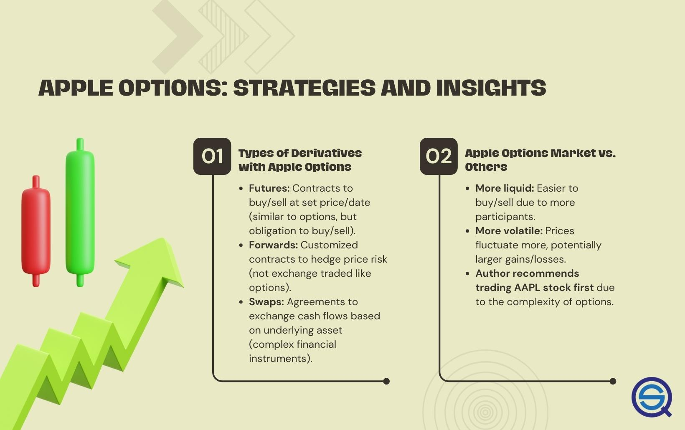

## Table of Contents

## What is options trading and how does it work?

Options trading is a way to invest in the stock market by buying and selling options, which are contracts that give you the right, but not the obligation, to buy or sell an asset at a specific price before a certain date. These assets can be stocks, indexes, or commodities. When you buy an option, you're betting on whether the price of the asset will go up or down. If you think the price will go up, you buy a call option. If you think the price will go down, you buy a put option.

Options work by giving investors flexibility and leverage. For example, if you buy a call option, you can buy the stock at a lower price than it's currently trading at, and then sell it at the higher market price to make a profit. If the stock price doesn't go up, you only lose the money you paid for the option. This can be less risky than buying the stock outright because your potential loss is limited to the cost of the option. However, options can also be complex and risky, so it's important to understand them well before trading.

## What are the basic types of options: calls and puts?

A call option gives you the right to buy a stock at a certain price before a specific date. Imagine you think a stock's price will go up. You can buy a call option for that stock. If the stock price does go up, you can buy the stock at the lower price you agreed on in the option and then sell it at the higher market price. This way, you make a profit. If the stock price doesn't go up, you just lose the money you paid for the option, which is usually less than buying the stock outright.

A put option gives you the right to sell a stock at a certain price before a specific date. Let's say you think a stock's price will go down. You can buy a put option for that stock. If the stock price does go down, you can buy the stock at the lower market price and then sell it at the higher price you agreed on in the option. This way, you make a profit. If the stock price doesn't go down, you just lose the money you paid for the option, which is usually less than the potential loss if you had owned the stock.

## How can I start trading options with AAPL?

To start trading options with AAPL (Apple Inc.), you first need to open a brokerage account that allows options trading. Many online brokers offer this service, so choose one that fits your needs and complete the account setup process. Once your account is open, you'll need to get approved for options trading. This usually involves filling out an options trading application and answering some questions about your investment experience and risk tolerance. After you're approved, you can fund your account and start trading.

When you're ready to trade AAPL options, you'll need to decide whether you want to buy call options or put options. If you think AAPL's stock price will go up, you'd buy a call option. This gives you the right to buy AAPL stock at a set price before a certain date. If the stock price does go up, you can buy the stock at the lower price and sell it at the higher market price to make a profit. If you think AAPL's stock price will go down, you'd buy a put option. This gives you the right to sell AAPL stock at a set price before a certain date. If the stock price does go down, you can buy the stock at the lower market price and sell it at the higher price you agreed on in the option to make a profit. Remember, if the stock price doesn't move as you expected, you'll only lose the money you paid for the option.

## What are the key terms like strike price, expiration date, and premium in options trading?

The strike price is the price at which you can buy or sell the stock if you decide to use your option. It's like a target price that you set when you buy the option. If you buy a call option, the strike price is the price you can buy the stock at. If you buy a put option, the strike price is the price you can sell the stock at. The strike price is important because it helps you decide if you want to use your option or not. If the stock price is higher than the strike price for a call option, or lower than the strike price for a put option, you might want to use your option to make a profit.

The expiration date is the last day you can use your option. After this date, the option is no longer valid. It's like a deadline for your option. You need to decide if you want to use your option before this date. If the stock price hasn't moved in the direction you expected by the expiration date, you'll lose the money you paid for the option. The expiration date is important because it gives you a time limit to make your decision.

The premium is the price you pay to buy the option. It's like the cost of the option contract. The premium is affected by things like how much time is left until the expiration date, how much the stock price is expected to move, and the difference between the stock price and the strike price. When you buy an option, you pay the premium upfront. If you decide not to use your option, you lose the premium. But if you use your option and make a profit, the premium is part of your cost.

## How does the stock price of AAPL affect the value of options?

The stock price of AAPL directly affects the value of its options. When you buy a call option for AAPL, you're hoping the stock price will go up. If AAPL's stock price rises above the strike price of your call option, the option becomes more valuable because you can buy the stock at a lower price and sell it at the higher market price. On the other hand, if AAPL's stock price stays the same or goes down, your call option loses value because it's less likely you'll make a profit by using it.

For put options, it works the opposite way. If you buy a put option for AAPL, you're hoping the stock price will go down. If AAPL's stock price falls below the strike price of your put option, the option becomes more valuable because you can buy the stock at the lower market price and sell it at the higher strike price. But if AAPL's stock price stays the same or goes up, your put option loses value because it's less likely you'll make a profit by using it. So, the value of AAPL options goes up or down based on how the stock price moves compared to the strike price.

## What are the common strategies for trading AAPL options, such as covered calls and protective puts?

One common strategy for trading AAPL options is called a covered call. This strategy involves owning AAPL stock and then selling call options on that stock. When you sell a call option, you get paid a premium, which is like extra money. If AAPL's stock price stays the same or goes down, you keep the premium and the stock. But if AAPL's stock price goes up a lot, the person who bought the call option might want to buy your stock at the strike price. You have to sell it to them, but you still get to keep the premium. This strategy can help you make some extra money if you think AAPL's stock price won't go up too much.

Another strategy is called a protective put. This strategy is like buying insurance for your AAPL stock. If you own AAPL stock and you're worried the price might go down, you can buy a put option. The put option gives you the right to sell your AAPL stock at the strike price, even if the market price drops lower. You pay a premium for the put option, but if AAPL's stock price does go down, you can use the put option to sell your stock at the higher strike price and limit your loss. If AAPL's stock price stays the same or goes up, you just lose the premium you paid for the put option, but you still have your stock. This strategy can help protect your investment if you think AAPL's stock price might go down.

## How can I use options to hedge my AAPL stock positions?

You can use options to hedge your AAPL stock positions by buying put options. This is like buying insurance for your stock. If you own AAPL stock and you're worried the price might go down, you can buy a put option. The put option gives you the right to sell your AAPL stock at the strike price, even if the market price drops lower. You pay a premium for the put option, but if AAPL's stock price does go down, you can use the put option to sell your stock at the higher strike price and limit your loss. If AAPL's stock price stays the same or goes up, you just lose the premium you paid for the put option, but you still have your stock. This strategy can help protect your investment if you think AAPL's stock price might go down.

Another way to hedge your AAPL stock positions is by using a collar strategy. This involves owning AAPL stock, buying a put option to protect against a drop in the stock price, and selling a call option to help pay for the put option. The put option acts as insurance, letting you sell your stock at the strike price if the stock price falls. The call option you sell gives someone else the right to buy your stock at a higher strike price if the stock price goes up. If AAPL's stock price stays between the two strike prices, you keep the premium from the call option and your stock, and you're protected from a big drop in the stock price. This strategy can help you manage risk and potentially lower the cost of hedging your AAPL stock.

## What are the risks associated with trading AAPL options?

Trading AAPL options can be risky. One big risk is that you could lose all the money you paid for the option. If you buy a call option and AAPL's stock price doesn't go up, or if you buy a put option and the stock price doesn't go down, your option could become worthless by the expiration date. This means you lose the premium you paid for the option. Options can be very different from buying the stock itself because they have a time limit and can lose value quickly.

Another risk is that options can be complicated and hard to understand. If you don't know how options work, you might make bad decisions and lose money. Also, options can be affected by things like changes in the stock market, interest rates, and the overall economy. These things can make options prices go up and down a lot, which can be risky. So, it's important to learn about options and be careful when you trade them.

## How does implied volatility impact AAPL options pricing?

Implied volatility is a big deal when it comes to how much AAPL options cost. It's like a guess about how much AAPL's stock price might move in the future. When people think AAPL's stock price will move a lot, the implied volatility goes up. This makes the options more expensive because there's a bigger chance the stock price will hit the strike price before the expiration date. If the implied volatility is high, you'll have to pay more for the option, whether it's a call or a put.

On the other hand, if people think AAPL's stock price won't move much, the implied volatility goes down. This makes the options cheaper because there's less chance the stock price will hit the strike price. So, if the implied volatility is low, you'll pay less for the option. Implied volatility can change a lot based on news about AAPL, the economy, or other things that might affect the stock price. It's something to keep an eye on when you're thinking about trading AAPL options.

## What advanced strategies can I use with AAPL options, such as iron condors or butterflies?

An iron condor is a strategy you can use with AAPL options if you think the stock price will stay in a certain range. It involves selling an out-of-the-money call option and an out-of-the-money put option, and then buying a further out-of-the-money call and put to limit your risk. If AAPL's stock price stays between the strike prices of the options you sold, you can make a profit from the premiums you collected. But if the stock price moves too far in either direction and goes past the strike prices of the options you bought, you might lose money. This strategy can be good if you expect AAPL's stock price to be pretty steady.

A butterfly spread is another strategy you can use with AAPL options. It involves buying an in-the-money call option, selling two at-the-money call options, and buying an out-of-the-money call option, all with the same expiration date. If AAPL's stock price is right around the strike price of the at-the-money options at expiration, you can make a profit. The maximum profit is the difference between the premiums you paid and collected, minus the cost of the options. But if the stock price moves too far away from the at-the-money strike price, you might lose money. This strategy can be good if you think AAPL's stock price will move to a specific level by the expiration date.

## How can I analyze AAPL's options chain to make informed trading decisions?

To analyze AAPL's options chain and make informed trading decisions, start by looking at the strike prices and expiration dates. The options chain lists all the available call and put options for AAPL, showing you the strike prices, expiration dates, and the premiums you'd have to pay or receive for each option. Pay attention to the strike prices that are close to AAPL's current stock price because those options are more likely to be used. Also, look at the expiration dates to see how much time you have before the options expire. Shorter-term options are cheaper but riskier because there's less time for the stock price to move in your favor.

Next, consider the implied volatility of the options. Implied volatility shows how much people think AAPL's stock price might move in the future. If the implied volatility is high, the options will be more expensive because there's a bigger chance the stock price will hit the strike price before the expiration date. If it's low, the options will be cheaper because there's less chance the stock price will move a lot. You can also look at the open interest and [volume](/wiki/volume-trading-strategy) of the options to see how popular they are. High open interest and volume can mean there's a lot of interest in those options, which might make them easier to trade. By understanding these parts of the options chain, you can make better decisions about which options to buy or sell.

## What are the tax implications of trading AAPL options?

When you trade AAPL options, you need to think about taxes. If you make money from trading options, you'll have to pay taxes on your profits. The tax rate depends on how long you held the options before selling them. If you held them for less than a year, your profits are considered short-term capital gains, and you'll pay your regular income tax rate on them. If you held them for more than a year, your profits are considered long-term capital gains, and you'll pay a lower tax rate, usually between 0% and 20%, depending on your income.

Another thing to know is that if you lose money trading AAPL options, you can use those losses to lower your taxes. You can use your losses to offset any gains you made from other investments. If your losses are more than your gains, you can even use up to $3,000 of those losses to lower your taxable income. Any losses you can't use in the current year can be carried over to future years to help with your taxes then. It's a good idea to keep good records of all your trades so you can report everything correctly on your tax return.

## What are the key factors influencing option prices?

Option prices are fundamentally influenced by several key factors: the underlying stock price, time until expiration, market [volatility](/wiki/volatility-trading-strategies), and interest rates.

1. **Underlying Stock Price**: The value of an option is closely tied to the price of the underlying stock. For call options, if the stock price rises above the strike price, the option becomes more valuable, as it allows the purchase of stock at a lower price. Conversely, for put options, a decrease in the stock price below the strike price increases the option’s value since it permits selling the stock at a higher price.

2. **Time Until Expiration**: The time remaining until an option's expiration, often referred to as "time to maturity," impacts the option's premium through what is known as "time decay" or "theta". As the expiration date approaches, the extrinsic value of the option diminishes, eventually eroding completely as the option expires. This decay accelerates particularly in the final weeks before expiration.

3. **Market Volatility**: Volatility plays a vital role in option pricing. High market volatility increases the likelihood that an option will expire in-the-money, thereby increasing its premium. The Black-Scholes model, a popular method for option pricing, incorporates volatility as a critical input:
$$
   C = S_0N(d_1) - Xe^{-rT}N(d_2)

$$

   Where $C$ is the call option price, $S_0$ is the current stock price, $X$ is the strike price, $r$ is the risk-free [interest rate](/wiki/interest-rate-trading-strategies), $T$ is the time to expiration, and $N$ represents the cumulative distribution function of the standard normal distribution. 

4. **Interest Rates**: Interest rates affect the cost of carry in options trading. When interest rates rise, the cost of holding a position increases, which generally affects the pricing of call and put options inversely. Higher interest rates typically lead to higher call option prices and lower put option prices.

These factors interact in complex ways, and a change in one parameter can lead to significant shifts in option prices. For traders, understanding these dynamics is crucial for devising strategic entry and [exit](/wiki/exit-strategy) points in their options trading strategies, aiming to optimize for potential gains while minimizing risks.

## What are the tools and resources available for algo trading with Apple options?

For [algorithmic trading](/wiki/algorithmic-trading) with Apple stock options, incorporating advanced tools and resources is essential for optimizing trading strategies and managing risks effectively. Traders can utilize a range of technical and [fundamental analysis](/wiki/fundamental-analysis) tools that enhance their ability to make informed decisions in the volatile options market.

Python, R, and MATLAB are widely used programming languages for developing trading algorithms due to their extensive libraries and strong community support. Python, in particular, is favored for its simplicity and versatility. Libraries such as NumPy and Pandas aid in efficient data manipulation, while libraries like SciPy and StatsModels allow for sophisticated statistical analysis. The visualization capabilities provided by Matplotlib and Seaborn are crucial for plotting data and trends, supporting traders in gaining deeper insights into market dynamics.

For simulating trading strategies and testing algorithms without financial exposure, platforms offering real-time data and trading simulations prove invaluable. These platforms allow traders to test their strategies under hypothetical scenarios, providing a sandbox environment to analyze the effectiveness of different approaches before engaging in live trading. Historical data [backtesting](/wiki/backtesting) helps in validating the robustness and profitability of the strategies developed.

Accurate options pricing and strategy optimization can be facilitated through the application of models and simulations. The Black-Scholes model is a foundational analytical tool used to estimate the theoretical value of options, providing insights into the impact of different variables such as volatility and time decay on option pricing. The Black-Scholes formula for a call option is given by:

$$
C = S_0 N(d_1) - X e^{-rt} N(d_2)
$$

where:
- $C$ is the call option price,
- $S_0$ is the current stock price,
- $X$ is the strike price,
- $t$ is the time to expiration,
- $r$ is the risk-free interest rate,
- $N$ is the cumulative distribution function of the standard normal distribution,
- $d_1 = \frac{\ln(S_0/X) + (r + \sigma^2/2)t}{\sigma\sqrt{t}}$,
- $d_2 = d_1 - \sigma\sqrt{t}$,
- $\sigma$ is the stock's volatility.

Monte Carlo simulation is another powerful technique for modeling the probabilistic nature of option prices. By simulating numerous potential future price paths for Apple stock under various conditions, traders can ascertain the statistical distribution of option payoffs and refine their risk assessments and strategy optimizations.

Modern [machine learning](/wiki/machine-learning) techniques, including regression models, decision trees, and neural networks, provide sophisticated methods for identifying patterns and signals in large datasets. These techniques enable traders to predict market movements and optimize trading strategies beyond traditional statistical methods.

Incorporating these tools and resources allows traders to develop a comprehensive toolkit for algorithmic trading, equipping them to navigate the complexities of the Apple options market efficiently and effectively.

## References & Further Reading

[1]: Black, F., & Scholes, M. (1973). ["The Pricing of Options and Corporate Liabilities."](https://www.cs.princeton.edu/courses/archive/fall09/cos323/papers/black_scholes73.pdf) Journal of Political Economy, 81(3), 637-654.

[2]: Lopez de Prado, M. (2018). ["Advances in Financial Machine Learning."](https://books.google.com/books/about/Advances_in_Financial_Machine_Learning.html?id=oU9KDwAAQBAJ) Wiley.

[3]: Chan, E. P. (2009). ["Quantitative Trading: How to Build Your Own Algorithmic Trading Business."](https://github.com/ftvision/quant_trading_echan_book) Wiley.

[4]: Jansen, S. (2020). ["Machine Learning for Algorithmic Trading: Predictive models to extract signals from market and alternative data for systematic trading strategies with Python, 2nd Edition."](https://www.amazon.com/Machine-Learning-Algorithmic-Trading-alternative/dp/1839217715) Packt Publishing.

[5]: Ruppert, D. (2004). ["Statistics and Data Analysis for Financial Engineering."](https://link.springer.com/book/10.1007/978-1-4939-2614-5) Springer. 

[6]: Dunn, P., & Everitt, B. (2005). ["A Handbook of Statistical Analyses using R"](https://www.taylorfrancis.com/books/mono/10.1201/b17081/handbook-statistical-analyses-using-torsten-hothorn-brian-everitt) Chapman & Hall/CRC.

[7]: Harris, R. (2003). ["Trading and Exchanges: Market Microstructure for Practitioners."](https://academic.oup.com/book/52292) Oxford University Press.

[8]: Aronson, D. (2006). ["Evidence-Based Technical Analysis: Applying the Scientific Method and Statistical Inference to Trading Signals."](https://www.wiley.com/en-us/Evidence+Based+Technical+Analysis%3A+Applying+the+Scientific+Method+and+Statistical+Inference+to+Trading+Signals-p-9780470008744) Wiley.