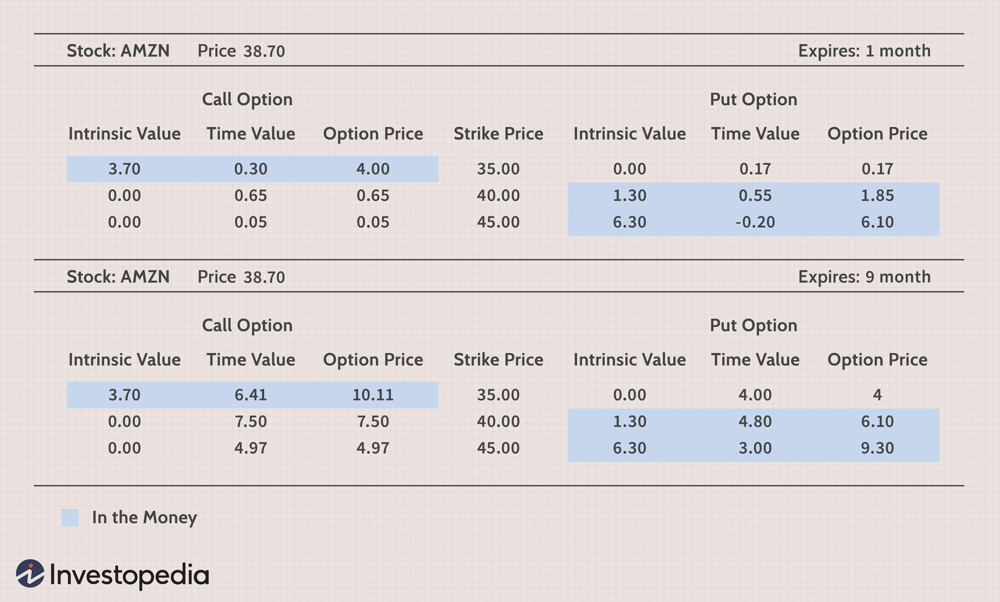

Amazon (AMZN) stock options represent an appealing investment opportunity for traders seeking to benefit from the fluctuating prices of one of the globe's biggest technology companies. Options give investors the right, but not the obligation, to buy or sell a stock at a predetermined price. Through the utilization of options, traders can hedge against unfavorable stock price movements or capitalize on anticipated changes. This flexibility makes options a valuable tool in investment strategies.

Algorithmic trading, which involves the execution of trades through computer-driven instructions, has revolutionized how stock options are traded. The speed and precision offered by these algorithms amplify the potential for profit while also enabling aspects of risk management. Algorithms can quickly analyze market conditions, adjust positions, and execute trades more rapidly than human traders.



This article examines the integration of algorithmic strategies with Amazon stock options, assessing how these strategies can be leveraged for effective risk management and potential profit maximization. As the financial markets grow more technologically advanced, understanding and utilizing these tools becomes increasingly essential for investors aiming to navigate the complex landscape of stock options trading.

## Table of Contents

## Understanding Amazon Stock Options

Amazon stock options are financial derivatives that grant investors the right, but not the obligation, to buy or sell Amazon shares at a predetermined price within a specific time frame. These options are integral to trading, offering flexibility and strategic opportunities. 

### Basics of Stock Options

Stock options are categorized into two main types: calls and puts. A call option provides the holder with the right to purchase the underlying stock, such as Amazon, at the strike price before the option's expiration. Conversely, a put option gives the investor the right to sell the stock at the strike price within the option's lifespan. These contracts allow traders to capitalize on anticipated stock price movements without owning the actual shares until exercised.

### Key Terminology

1. **Strike Price**: This is the predetermined price at which the option holder can buy (call option) or sell (put option) the underlying Amazon stock. The strike price is crucial as it determines the option's intrinsic value and potential profit. For example, an investor might buy a call option with a strike price of $3,000 on Amazon stock, betting that future market prices will exceed this level.

2. **Expiration Date**: This date marks the end of the option's life, after which the option expires worthless if not exercised. Investors must carefully consider the expiration date since options decrease in time value as they near this deadline. Amazon stock options typically see a range of expiration dates, from weekly to several months out.

3. **Option Premium**: The premium is the price paid by the buyer to the option writer (seller) for acquiring the option's rights. It comprises intrinsic value and time value, and it fluctuates based on the underlying stock's volatility, time to expiration, and market demand. For instance, a volatile period for Amazon might see higher premiums for its options due to increased market expectations of price movements.

### Application to Amazon Stock

Given Amazon's substantial market capitalization and frequent price fluctuations, its stock options provide a substantial opportunity for both hedging and speculative strategies. For example, an investor might purchase a call option on Amazon anticipating a positive earnings report, potentially leading to significant profits without the need for large capital outlays to purchase shares outright. Conversely, put options could be utilized to protect against downside risk in Amazon's stock value, serving as a hedge within an investment portfolio.

In summary, understanding the fundamental attributes of stock options—calls, puts, strike prices, expiration dates, and option premiums—is essential for engaging with Amazon stock options. These financial instruments offer a pathway to benefit from Amazon's market movements, whether through direct profit from anticipated price changes or risk management strategies.

## Common Options Trading Strategies for Amazon

Investors seeking to trade Amazon (AMZN) stock options can utilize several strategies to capitalize on the stock's price movements. These strategies can be effectively integrated into an [algorithmic trading](/wiki/algorithmic-trading) framework, which enhances the precision and speed of trade executions.

### Call Options

Buying call options is a popular strategy when an investor anticipates an increase in Amazon's stock price. A call option gives the investor the right to purchase the stock at a predetermined strike price before the option expires. If the stock price exceeds the strike price, the investor can exercise the option for a profit. For example, if an investor buys a call option with a strike price of $3,200 and the stock rises to $3,300, the intrinsic value of the option is $100 per share, which can lead to substantial returns after accounting for the option premium paid.

### Put Options

Conversely, buying put options allows investors to profit from a decline in Amazon's stock price. A put option grants the holder the right to sell the stock at a specified strike price. If the stock price falls below the strike price, the option's value increases. For instance, purchasing a put option with a strike price of $3,200 would be profitable if the stock drops to $3,100. Algorithmic trading can automate the process of scanning for optimal entry and [exit](/wiki/exit-strategy) points based on pre-set criteria, ensuring timely execution.

### Writing Covered Calls

Writing covered calls involves holding the underlying Amazon stock and selling call options on it. This strategy can generate additional income through option premiums while mitigating downside risk. However, it caps the potential upside as the stock might be called away if its price exceeds the strike price. Algorithms can optimize the selection of strike prices and expiration dates to maximize premiums collected while managing the risk of losing the underlying stock.

### Implementing Algorithmic Trading Strategies

Algorithmic trading systems can enhance these traditional strategies by processing vast amounts of data and executing trades at high speeds. Algorithms can be programmed with specific rules that define the conditions under which call or put options should be bought or sold. Below is a simplified example of a Python script that could form the basis of such a system:

```python
def should_buy_call(option_price, stock_price, strike_price):
    # Example condition to buy a call option
    return stock_price > strike_price and option_price < stock_price - strike_price

def should_buy_put(option_price, stock_price, strike_price):
    # Example condition to buy a put option
    return stock_price < strike_price and option_price < strike_price - stock_price

def execute_trade(trade_type, option):
    # Simulated function to execute a trade
    print(f"Executing {trade_type} option trade for {option}")

# Example data
options = [
    {"type": "call", "option_price": 10, "stock_price": 3300, "strike_price": 3200},
    {"type": "put", "option_price": 15, "stock_price": 3100, "strike_price": 3200}
]

for option in options:
    if option["type"] == "call" and should_buy_call(option["option_price"], option["stock_price"], option["strike_price"]):
        execute_trade("call", option)
    elif option["type"] == "put" and should_buy_put(option["option_price"], option["stock_price"], option["strike_price"]):
        execute_trade("put", option)
```

This code snippet illustrates how conditions for executing call and put trades could be assessed and executed programmatically. Leveraging technology in this way reduces human error, optimizes decision-making, and captures favorable market conditions that might only exist briefly.

By integrating these options strategies within algorithmic frameworks, investors can systematically pursue opportunities presented by Amazon's stock price [volatility](/wiki/volatility-trading-strategies), aligning their trading maneuvers with their financial objectives.

## Algorithmic Trading: Enhancing Options Trading

Algorithmic trading involves the use of computer algorithms to automate trading processes, enabling the rapid execution of transactions based on predefined trading strategies. This approach enhances the efficiency and efficacy of trading Amazon stock options by leveraging the power of technology to respond to real-time market data and conditions.

**Programming Trading Strategies**

Trading strategies for Amazon options can be programmed into algorithms, which then execute trades when specific market conditions are met. These strategies typically involve mathematical models and quantitative analysis to determine optimal entry and exit points. For instance, algorithms might be designed to initiate a buy call option when the moving average of Amazon's stock price crosses a particular threshold. Python, a language commonly used in algorithmic trading, offers several libraries, such as NumPy, pandas, and TA-Lib, to help traders develop and test their strategies.

Here is a simple example of how an algorithm can be structured using Python:

```python
import pandas as pd

# Hypothetical function to fetch Amazon stock data
stock_data = fetch_amazon_stock_data()

# Define a moving average strategy
short_window = 40
long_window = 100

# Calculate moving averages
stock_data['short_mavg'] = stock_data['Close'].rolling(window=short_window, min_periods=1).mean()
stock_data['long_mavg'] = stock_data['Close'].rolling(window=long_window, min_periods=1).mean()

# Create signal
stock_data['signal'] = 0
stock_data['signal'][short_window:] = np.where(stock_data['short_mavg'][short_window:] > stock_data['long_mavg'][short_window:], 1, 0)

# Positions based on signal
stock_data['position'] = stock_data['signal'].diff()

# Display Data
print(stock_data[['Close', 'short_mavg', 'long_mavg', 'signal', 'position']])
```

**Tools and Technologies**

Several tools and platforms facilitate algorithmic trading of Amazon options. Trading platforms like [Interactive Brokers](/wiki/interactive-brokers-api) and TD Ameritrade offer APIs that connect to stock exchanges, providing real-time data and the ability to execute trades programmatically. These platforms support the integration of custom algorithms and offer [backtesting](/wiki/backtesting) capabilities to assess the performance of strategies using historical data.

High-frequency trading ([HFT](/wiki/high-frequency-trading-strategies)) is another dimension where algorithms shine, allowing for the execution of trades within milliseconds, exploiting the smallest price discrepancies that manual traders often miss. The implementation of [machine learning](/wiki/machine-learning) models can further refine these trading strategies by learning from data patterns, improving predictive power, and adapting to changing market dynamics.

**Optimization and Execution**

The integration of algorithms in options trading leads to optimized decision-making and significant improvements in execution speed. This not only minimizes human error but also enhances the trader's ability to capitalize on transient market opportunities. By continuously monitoring market conditions, algorithms can swiftly adjust strategies, ensuring traders remain competitive.

Overall, the application of algorithmic trading to Amazon options substantially enhances trading efficiency, offering precision and the ability to execute complex strategies that might be challenging for human traders alone. This technological advancement continues to redefine the landscape of options trading, promising further innovations and opportunities.

## Risks and Challenges in Algorithmic Options Trading

Algorithmic options trading, while offering distinct advantages, also presents unique risks and challenges that require careful consideration, especially for those trading Amazon stock options. The efficiency and speed provided by algorithms can be offset by specific technical and market-based risks.

### Technical Failures and Systemic Issues
Algorithmic trading is inherently reliant on technology. This reliance introduces the risk of technical failures, which can result from software bugs, hardware malfunctions, or connectivity issues. A malfunction in the algorithm can lead to unintended trades, significant financial losses, or even market disruptions, as witnessed in historical flash crashes (e.g., the "Flash Crash" of 2010)[^1]. 

To mitigate these risks, traders often employ robust testing procedures using historical data to ensure that the algorithm behaves as expected under various market conditions. Regular system updates and maintenance are crucial, along with fail-safes such as circuit breakers, which halt trading when certain thresholds are met. 

### Increased Volatility Impact
Algorithmic trading can exacerbate market volatility. Algorithms can react at tremendous speeds to market data, which sometimes leads to increased short-term volatility, particularly for high-[volume](/wiki/volume-trading-strategy) stocks like Amazon. Such movements may trigger a cascade of algorithmic responses, amplifying price swings and creating an unstable trading environment.

To manage this risk, traders can implement volatility filters within their algorithms. These filters monitor market conditions and adjust trading strategies accordingly. For example, algorithms can be programmed to pause trading during periods of extreme volatility or to execute trades gradually to minimize market impact.

### Market Liquidity and Slippage
Liquidity risk is another concern in algorithmic trading. Algorithms typically rely on liquid markets to execute trades swiftly. However, in thinly traded markets or during periods of low [liquidity](/wiki/liquidity-risk-premium), the algorithm might struggle to execute trades at desired prices, resulting in slippage. This can be particularly pertinent when dealing with options with less volume compared to the underlying stocks.

To address this, algorithms can be designed to assess current market liquidity and adjust order sizes or prices dynamically. Implementing a measure such as the “Immediate-or-Cancel” (IOC) order type can help in executing only those trades that meet liquidity conditions.

### Data Quality and Latency
The success of an algorithmic strategy heavily depends on the quality and timeliness of the data inputs. Faulty data or latency in receiving market data can result in incorrect trading decisions. For example, a delay in price data can lead an algorithm to buy or sell at prices that were relevant only moments ago, affecting profitability.

Overcoming data quality issues involves ensuring access to high-quality, low-latency data feeds and continuously monitoring data streams for anomalies. Utilizing distributed computing systems can also help in processing large data sets quickly to enhance decision-making.

### Regulatory Compliance and Ethical Considerations
The evolving regulatory landscape poses its own set of challenges for algorithmic traders. Regulators are increasingly scrutinizing algorithmic trading activities to prevent market manipulation and ensure fairness. Traders need to ensure that their algorithms comply with regulations such as the SEC’s Market Access Rule and other jurisdiction-specific guidelines to avoid penalties.

Incorporating compliance checks into trading algorithms can help ensure adherence to regulatory standards. Additionally, maintaining transparent records of algorithmic decisions and modifications supports ethical accountability and aids in audits and investigations.

In conclusion, navigating the risks and challenges in algorithmic options trading involves a multi-faceted approach incorporating technology, strategy adaptation, and compliance measures. As algorithmic trading continues to evolve, staying informed and prepared for these challenges remains critical for successful participation in the markets.

[^1]: [U.S. Securities and Exchange Commission Report on the May 6, 2010 Flash Crash](https://www.sec.gov/news/studies/2010/marketevents-report.pdf)

## Benefits of Trading Amazon Options with Algorithms

Algorithmic trading presents numerous compelling benefits for trading Amazon stock options. Its integration into financial markets has fundamentally transformed how options are traded, emphasizing speed, precision, and flexibility in executing complex strategies. These advantages create opportunities for traders to capitalize on Amazon's stock price movements more efficiently than manual trading methods.

### Speed and Efficiency

One of the primary benefits of algorithmic trading is its unparalleled speed. Algorithms can process vast quantities of data and execute trades in milliseconds, much faster than any human trader. This speed is particularly advantageous when trading Amazon stock options, as it allows traders to quickly respond to market fluctuations and execute trades at optimal prices. For example, during periods of high volatility, such as an earnings release, algorithms can execute trades to capitalize on rapid price movements, potentially capturing profits before the market stabilizes.

### Precision and Reduced Human Error

Algorithmic systems are adept at executing trades with high precision, reducing the likelihood of errors that commonly occur in manual trading. Algorithms follow pre-defined instructions, ensuring each trade adheres strictly to the intended strategy. This precision is crucial in options trading, where market conditions can change swiftly, and small miscalculations can lead to significant financial losses. For Amazon options, where prices can be highly volatile, the precision offered by algorithms minimizes the risk of executing trades based on incorrect market assessments.

### Complex Strategic Implementation

Algorithms enable traders to employ sophisticated strategies that would be complex or unfeasible to execute manually. Strategies such as delta hedging, spread trading, and [arbitrage](/wiki/arbitrage) can be systematically implemented through algorithmic trading. For instance, a trader might utilize an algorithm to simultaneously engage in a strangle strategy—buying both a call and a put option at different strike prices, anticipating a large move in Amazon's stock price. The algorithm automatically adjusts the position to maintain the desired strategic exposure regardless of how the underlying stock performs.

### Case Studies and Hypothetical Scenarios

Several case studies illustrate the significant advantages of algorithmic trading in options markets. For instance, consider a scenario where an algorithm is programmed to detect an arbitrage opportunity involving Amazon options in different markets. The algorithm can swiftly execute a series of trades to exploit discrepancies in option pricing, achieving profits that would be difficult to secure manually.

### Python Example: Implementing a Simple Strangle Strategy

Here is a basic Python script to illustrate how an algorithm might be used to implement a strangle strategy for Amazon options using hypothetical data:

```python
import random

# Hypothetical option price generator
def generate_option_prices():
    call_price = random.uniform(1.0, 20.0)
    put_price = random.uniform(1.0, 20.0)
    return call_price, put_price

# Strangle strategy algorithm
def execute_strangle_strategy(target_movement, capital):
    for period in range(10):
        call_price, put_price = generate_option_prices()
        if abs(call_price - put_price) >= target_movement:
            # Assume buying one contract each
            cost = call_price + put_price
            if capital >= cost:
                capital -= cost
                print(f"Executed strangle: Call @ ${call_price}, Put @ ${put_price}, Remaining Capital: ${capital:.2f}")

# Run strategy with a target price movement and capital allocation
execute_strangle_strategy(target_movement=5.0, capital=1000.0)
```

This script simulates a simple strategy where the algorithm executes trades when the difference between the strike prices of call and put options exceeds a target movement threshold. This strategy is a simplified example, and in practice, more sophisticated models would be employed.

### Conclusion

In conclusion, algorithmic trading enhances options trading, particularly with large-cap stocks like Amazon. The speed, precision, and capability to execute complex strategies provide traders with powerful tools to navigate and potentially profit from the dynamic financial markets. As technologies continue to evolve, the potential for algorithmic trading to further revolutionize options trading remains significant.

## Conclusion and Future of Amazon Options in Algorithmic Trading

Amazon options trading, when integrated with algorithmic frameworks, stands as a promising field for investors aiming to capitalize on technological advancements. The convergence of options trading and algorithmic technology allows investors to harness benefits such as increased transaction speed, enhanced precision, and the ability to manage complex strategies beyond human capabilities. The flexibility offered by trading algorithms can transform the way investors engage with the volatile movements of Amazon stock, providing a competitive edge.

Reflecting on the future of algorithmic trading for options, several potential innovations are anticipated. Advancements in [artificial intelligence](/wiki/ai-artificial-intelligence) and machine learning are likely to play a significant role. These technologies can enhance the predictive capabilities of trading algorithms, enabling them to analyze larger datasets and identify trading opportunities with improved accuracy. Consequently, traders may see an increase in profitability and risk management efficacy.

Another area of growth is the development of more sophisticated trading algorithms that incorporate sentiment analysis from sources like social media and news platforms. Such integrations can provide real-time insights into market sentiment, enriching the decision-making efficacy of trading systems. Furthermore, with the continuous evolution of quantum computing, there is potential for groundbreaking shifts in how algorithms process information, although practical applications remain in the nascent stage.

Shifts in the regulatory environment will also influence the future of algorithmic options trading. As technology advances, regulatory bodies are increasingly focusing on the transparency and stability of automated trading systems. Ensuring compliance with evolving regulations will be crucial for traders to avoid legal implications and maintain the integrity of market operations. Proactive adaptation to regulatory changes may become a competitive advantage.

Finally, investors are urged to stay informed about ongoing technological developments that could reshape the options trading landscape. Continuous education and adaptation to emerging tools and techniques will be vital for maintaining a strategic edge. As the intersection of technology and finance becomes increasingly interconnected, the potential for innovation in algorithmic trading of Amazon options remains vast and compelling.

## References & Further Reading

[1]: Bergstra, J., Bardenet, R., Bengio, Y., & Kégl, B. (2011). ["Algorithms for Hyper-Parameter Optimization."](https://papers.nips.cc/paper/4443-algorithms-for-hyper-parameter-optimization) Advances in Neural Information Processing Systems 24.

[2]: ["Advances in Financial Machine Learning"](https://www.amazon.com/Advances-Financial-Machine-Learning-Marcos/dp/1119482089) by Marcos Lopez de Prado

[3]: ["Evidence-Based Technical Analysis: Applying the Scientific Method and Statistical Inference to Trading Signals"](https://www.amazon.com/Evidence-Based-Technical-Analysis-Scientific-Statistical/dp/0470008741) by David Aronson

[4]: ["Machine Learning for Algorithmic Trading"](https://github.com/stefan-jansen/machine-learning-for-trading) by Stefan Jansen

[5]: ["Quantitative Trading: How to Build Your Own Algorithmic Trading Business"](https://books.google.com/books/about/Quantitative_Trading.html?id=j70yEAAAQBAJ) by Ernest P. Chan

[6]: [U.S. Securities and Exchange Commission Report on the May 6, 2010 Flash Crash](https://www.sec.gov/news/studies/2010/marketevents-report.pdf)