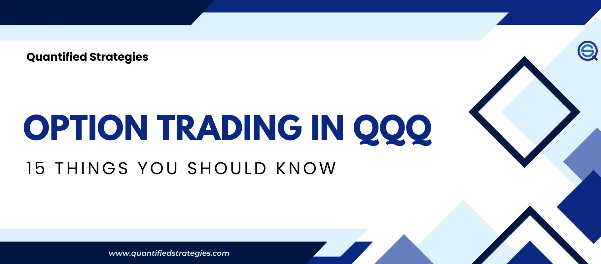

## Table of Contents

## What is the QQQ and why is it important for option trading?

The QQQ, also known as the Invesco QQQ Trust, is an exchange-traded fund (ETF) that tracks the Nasdaq-100 Index. This index includes 100 of the largest non-financial companies listed on the Nasdaq stock exchange, such as technology giants like Apple, Microsoft, and Amazon. Because it represents a broad range of major tech and other leading companies, the QQQ is often used as a benchmark for the performance of the technology sector and the broader market.

The QQQ is important for option trading because it is one of the most actively traded ETFs, which means it has high liquidity. High liquidity makes it easier to buy and sell options at favorable prices. Additionally, because the QQQ tracks a well-known index, it is less volatile than individual stocks, which can make it a safer choice for options traders looking to manage risk. Many traders use QQQ options to hedge their portfolios or to speculate on the direction of the tech sector and the overall market.

## How do options work, and what are the basic terms I need to know?

Options are contracts that give you the right, but not the obligation, to buy or sell an asset at a specific price before a certain date. There are two types of options: calls and puts. A call option lets you buy the asset at the agreed price, while a put option lets you sell it. When you buy an option, you pay a price called the premium. The asset's price at which you can buy or sell is called the strike price, and the date by which you must use the option is called the expiration date.

Some basic terms you need to know are "in the money," "at the money," and "out of the money." An option is "in the money" if it would be profitable to exercise it right now. For a call option, this means the asset's current price is higher than the strike price. For a put option, it means the asset's current price is lower than the strike price. An option is "at the money" if the asset's current price is the same as the strike price. It's "out of the money" if exercising the option would not be profitable at the moment. Understanding these terms helps you make better decisions when trading options.

## What are the benefits of trading options on the QQQ?

Trading options on the QQQ can be very helpful because it's a popular [ETF](/wiki/etf-trading-strategies) that follows the Nasdaq-100 Index. This means you can use QQQ options to bet on how the tech sector and the overall market are doing. Since the QQQ is traded a lot, it's easy to buy and sell options without big price changes. This makes it easier to get in and out of trades when you want to.

Another good thing about QQQ options is that they can help you manage risk. Because the QQQ tracks a big group of companies, it's usually less risky than betting on just one stock. You can use QQQ options to protect your other investments or to make money if you think the market will go up or down. This flexibility makes QQQ options a useful tool for many different kinds of traders.

## How can beginners start trading options on the QQQ?

To start trading options on the QQQ, beginners should first open a brokerage account that allows options trading. Many popular brokers offer this service, so it's important to choose one that fits your needs and has good educational resources. Once you have an account, you'll need to get approved for options trading. This usually involves filling out a form where you tell the broker about your experience and how much risk you're okay with. After you're approved, you can start looking at QQQ options.

When you're ready to trade, you'll want to learn about the different types of options, like calls and puts, and understand terms like strike price and expiration date. It's a good idea to start with small trades to get the hang of it. You can use online tools and resources from your broker to help you decide which options to buy or sell. Remember, trading options can be risky, so it's important to only use money you can afford to lose and to keep learning as you go.

## What are the different types of options strategies that can be used with QQQ?

There are several options strategies you can use with QQQ, and each one can help you reach different goals. One simple strategy is buying call options if you think the QQQ will go up in price. This gives you the right to buy the QQQ at a set price before the option expires. If the QQQ price goes up a lot, you can make a good profit. Another simple strategy is buying put options if you think the QQQ will go down. This gives you the right to sell the QQQ at a set price, which can help you make money if the market drops.

More advanced strategies include covered calls and protective puts. A covered call involves owning the QQQ and then selling call options against it. This can help you earn extra income from the premiums, but you might have to sell your QQQ if the price goes up a lot. A protective put involves buying put options while you own the QQQ. This acts like insurance, helping to limit your losses if the QQQ price falls. Both of these strategies can help manage risk while still giving you a chance to make money.

Another strategy is the straddle, where you buy both a call and a put option with the same strike price and expiration date. This can be useful if you think the QQQ will move a lot in either direction but you're not sure which way. If the QQQ makes a big move up or down, one of your options will become valuable, potentially making you a profit. These strategies show how flexible options trading can be, letting you adapt to different market conditions and goals.

## How does the liquidity of QQQ options affect trading strategies?

The [liquidity](/wiki/liquidity-risk-premium) of QQQ options is really important because it makes it easier to buy and sell them without big price changes. When an option is liquid, there are a lot of people trading it, so you can usually get in and out of your trades quickly. This is good for beginners because it means you can change your mind or close your position without losing a lot of money on the price difference. It also means you can use more advanced strategies like spreads, where you buy and sell different options at the same time, because you can find someone to trade with easily.

Because QQQ options are so liquid, you can use them for many different strategies. For example, if you want to make a quick trade based on a news event, the high liquidity means you can act fast without worrying too much about the price. It also makes it easier to use strategies like covered calls or protective puts, where you need to be able to buy or sell options smoothly. Overall, the liquidity of QQQ options gives you more flexibility and helps you manage your trades better.

## What are the key factors to consider when selecting strike prices and expiration dates for QQQ options?

When choosing strike prices for QQQ options, you need to think about what you expect the QQQ to do. If you think it will go up a lot, you might pick a strike price that's higher than where it is now. This way, if you're right, you can make more money. But if you think it will only go up a little, you might choose a strike price that's closer to the current price. This can be cheaper to buy but might not make as much money if the QQQ goes up a lot. Also, think about how much risk you want to take. A strike price far from the current price can be riskier but can also give you bigger rewards.

For expiration dates, you need to decide how long you want to hold the option. Shorter expiration dates can be cheaper but give you less time for the QQQ to move in your favor. If you think the QQQ will move quickly, a short expiration might be good. But if you think it will take longer, you might want a longer expiration date. This can cost more, but it gives you more time to be right. Also, think about how the time until expiration affects the option's price. The longer the time, the more expensive the option usually is, but it also gives you more flexibility.

## How can technical analysis be applied to enhance QQQ option trading?

Technical analysis can help you make better decisions when trading QQQ options by looking at past price movements and patterns. You can use charts to see where the QQQ has been and try to guess where it might go next. For example, if you see the QQQ price going up and down in a certain pattern, you might think it will keep doing that. This can help you pick the right strike price for your options. Also, technical indicators like moving averages can show you if the QQQ is in a trend. If the QQQ is above its moving average, it might keep going up, so you could buy call options. If it's below, it might keep going down, so you could buy put options.

Another way technical analysis can help is by showing you good times to buy or sell options. For example, if the QQQ price gets close to a level where it has bounced back before, that might be a good time to buy options. You can also use tools like the Relative Strength Index (RSI) to see if the QQQ is overbought or oversold. If the RSI is high, the QQQ might be due for a drop, so you could buy put options. If it's low, the QQQ might be ready to go up, so you could buy call options. By using these technical tools, you can make smarter choices about when to trade QQQ options and which ones to pick.

## What are the risks associated with trading QQQ options, and how can they be managed?

Trading QQQ options can be risky because the value of options can change a lot in a short time. If you guess wrong about where the QQQ price is going, you could lose all the money you spent on the option. Also, options have an expiration date, so if the QQQ doesn't move in the direction you want before that date, your option could become worthless. Another risk is that options can be hard to understand if you're new to trading, and making a mistake can cost you a lot.

To manage these risks, you can start by only using money you can afford to lose. It's also a good idea to learn as much as you can about options and how they work. You can use strategies like buying options instead of selling them, because buying limits your loss to the price you paid for the option. Another way to manage risk is by using stop-loss orders, which can help you sell your options if the price goes against you. Finally, diversifying your trades and not putting all your money into one option can help spread out the risk and protect your investments.

## How do market conditions and economic indicators influence QQQ option trading?

Market conditions and economic indicators can really affect how you trade QQQ options. When the market is doing well and people feel good about the economy, the QQQ price might go up. This can be a good time to buy call options because you think the QQQ will keep going up. On the other hand, if there's bad news or the economy is not doing well, the QQQ price might go down. This could be a good time to buy put options because you think the QQQ will keep going down. Economic indicators like job reports, interest rates, and company earnings can also move the QQQ price. If these indicators show the economy is growing, the QQQ might go up, and if they show the economy is shrinking, the QQQ might go down.

You can use these market conditions and economic indicators to make better choices about when to trade QQQ options and which ones to pick. For example, if a big company in the Nasdaq-100 Index reports good earnings, that might make the QQQ go up, so you could buy call options. If the Federal Reserve raises interest rates, that might make the QQQ go down, so you could buy put options. By keeping an eye on these indicators and understanding how they affect the market, you can plan your trades better and manage your risks.

## What advanced strategies can be employed for experienced traders in QQQ options?

Experienced traders can use more advanced strategies like iron condors and butterflies when trading QQQ options. An iron condor involves selling a call spread and a put spread at the same time. You do this by selling an out-of-the-money call and buying a further out-of-the-money call, and selling an out-of-the-money put and buying a further out-of-the-money put. This strategy works best when you think the QQQ will stay in a certain price range. It can make you money from the premiums you get, but if the QQQ moves too far in either direction, you could lose money. A butterfly spread is another strategy where you buy an in-the-money option, sell two at-the-money options, and buy an out-of-the-money option. This can be a good way to make money if you think the QQQ will stay close to a certain price.

Another advanced strategy is the calendar spread, where you buy and sell options with different expiration dates but the same strike price. For example, you could sell a short-term option and buy a longer-term option. This can make money if the QQQ stays close to the strike price until the short-term option expires, but then moves in your favor before the long-term option expires. Experienced traders can also use delta hedging to manage risk. Delta is a measure of how much an option's price will change when the QQQ price changes. By adjusting your positions based on delta, you can try to make your overall position less risky. These strategies need a good understanding of options and the market, but they can help experienced traders make more money and manage their risks better.

## How can one use QQQ options for hedging purposes in a broader investment portfolio?

Using QQQ options for hedging can help protect your broader investment portfolio from big drops in the market. If you own a lot of stocks or other investments that could go down if the market falls, you can buy put options on the QQQ. The QQQ tracks the Nasdaq-100 Index, which includes many big tech companies, so it's a good way to hedge against a drop in the tech sector or the overall market. If the market goes down, the value of your put options will go up, which can help offset the losses in your other investments. This way, you can feel more secure about your portfolio, knowing that you have some protection if things go wrong.

To use QQQ options for hedging, you need to think about how much protection you want and how much you're willing to spend. Buying put options costs money, called the premium, so you need to balance the cost of the options with the amount of protection they give you. You can choose the strike price and expiration date of the put options based on how much you think the market might drop and how long you want the protection to last. By carefully [picking](/wiki/asset-class-picking) your options, you can create a hedge that fits your needs and helps keep your portfolio safe without spending too much.

## References & Further Reading

[1]: ["Option Volatility and Pricing: Advanced Trading Strategies and Techniques"](https://www.amazon.com/Option-Volatility-Pricing-Strategies-Techniques/dp/0071818774) by Sheldon Natenberg

[2]: ["Algorithmic Trading and DMA: An introduction to direct access trading strategies"](https://www.amazon.com/Algorithmic-Trading-DMA-introduction-strategies/dp/0956399207) by Barry Johnson

[3]: ["The Complete Guide to Option Selling: How Selling Options Can Lead to Stellar Returns in Bull and Bear Markets"](https://www.amazon.com/Complete-Guide-Option-Selling-Options/dp/0071837620) by James Cordier and Michael Gross

[4]: ["Options, Futures, and Other Derivatives"](https://www.amazon.com/Options-Futures-Other-Derivatives-10th/dp/013447208X) by John C. Hull

[5]: ["Algorithmic Trading: Winning Strategies and Their Rationale"](https://www.wiley.com/en-us/Algorithmic+Trading%3A+Winning+Strategies+and+Their+Rationale-p-9781118460146) by Ernest P. Chan