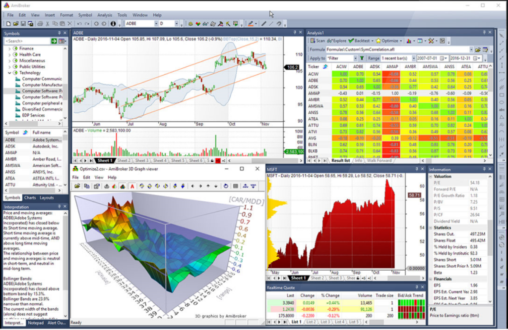

The QQQ Wheel Strategy is an intriguing concept in algorithmic trading, offering a systematic approach to generating income through options on the Invesco QQQ Trust (QQQ), which tracks the Nasdaq-100 Index. This strategy combines elements of options trading and equity investment, allowing traders to potentially benefit from both premium collection and stock appreciation.

Primarily, the QQQ Wheel Strategy is implemented by selling put options on QQQ, an exchange-traded fund (ETF) that reflects the performance of 100 of the largest non-financial companies listed on the Nasdaq stock market. The premium collected from selling these put options is the initial source of income. If the option expires worthless, the trader retains the premium as profit. However, if the put option is exercised, the trader acquires QQQ shares at the strike price, often at a discount compared to current market prices.



Once the shares are owned, the next step of the strategy involves selling covered call options to generate additional income from the owned stocks. This cyclic process of selling puts, acquiring shares, and then selling calls is what constitutes the 'wheel' effect of this strategy.

The structured nature of the QQQ Wheel Strategy, coupled with its focus on a popular and liquid ETF, makes it attractive to many traders, particularly in the context of algorithmic trading. Algorithmic systems can automate the repetitive tasks of option selling and buying, optimizing timing and execution based on predefined rules and market conditions. With the increasing prominence of algorithmic trading, strategies like the QQQ Wheel are gaining attention as they provide both a systematic process and the flexibility to adapt to changing market environments. Understanding the finer details of this strategy can significantly enhance a trader’s ability to capitalize on market opportunities, reinforcing the value of combining options expertise with algorithmic execution for consistent results.

## Table of Contents

## What is the QQQ Wheel Strategy?

The QQQ Wheel Strategy is centered around the consistent selling of options on the QQQ ETF, which tracks the Nasdaq-100 index. This strategy primarily focuses on generating regular income by selling put options. The process begins with the trader selling a put option on the QQQ ETF. The premium collected from selling these puts represents the initial income stream of the strategy. The fundamental aim here is to accumulate this income consistently, potentially outperforming the overall index through strategic management of options contracts.

When the put options expire worthless—meaning the market price of QQQ remains above the strike price at expiration—the trader retains the premium as profit. This scenario represents the ideal outcome in a bullish or stable market as the trader not only gains the premium but also avoids the obligation to execute the trade.

However, in cases where the market price of QQQ closes below the strike price, the put option may be exercised, necessitating the purchase of the underlying QQQ shares at the agreed strike price. This automatic acquisition means that the trader now holds QQQ shares, potentially at a discount if initially sold at higher premiums. This acquisition phase introduces stock ownership into the cycle, where the trader then transitions to selling covered call options on the acquired QQQ shares. The premiums from these calls further contribute to the income generated by the strategy.

Despite its outward simplicity, employing the QQQ Wheel Strategy effectively demands a comprehensive understanding of market dynamics and rigorous risk assessment. Traders must be adept at gauging implied [volatility](/wiki/volatility-trading-strategies) and the potential movement of the Nasdaq-100 index to optimize their entry and [exit](/wiki/exit-strategy) points effectively. Moreover, careful selection of strike prices and expiration dates of options is crucial to maximizing profitability and minimizing risk.

In essence, the QQQ Wheel Strategy transforms options trading into a repetitive cycle, balancing between selling puts and covered calls, thereby continuously extracting profit from market movements.

## How the QQQ Wheel Strategy Works

The QQQ Wheel Strategy is a systematic approach that begins with the trader selling put options on the Invesco QQQ Trust (QQQ), an exchange-traded fund ([ETF](/wiki/etf-trading-strategies)) that tracks the Nasdaq-100 Index. A put option is a financial contract that gives the holder the right, but not the obligation, to sell an asset at a predetermined price before a specified expiration date.

When selling put options, the trader collects a premium—the price paid by the buyer for the option. If the underlying QQQ ETF remains above the option's strike price until expiration, these options expire worthless, allowing the trader to retain the premium as profit. This is a desirable outcome for the trader as it represents income without the need for further action.

However, if the QQQ ETF falls below the strike price, the put option is likely to be exercised by the buyer. This requires the trader to purchase shares of the QQQ ETF at the agreed-upon strike price, which may be above the current market price, leading to potential stock ownership. Although this may initially appear disadvantageous, it allows the trader to acquire shares potentially below their intrinsic value over the long term.

Once the trader owns shares of the QQQ ETF, they can implement the second part of the strategy by selling covered call options on the acquired shares. A covered call involves selling call options, which gives the buyer the right to purchase the stock at a set price before the expiration date. The trader receives a premium for selling these call options, generating additional income. If the ETF price does not rise above the call option's strike price, the option expires worthless, and the trader keeps both the shares and the premium. Conversely, if the stock price exceeds the strike price, the trader must sell the shares at the predetermined price, potentially realizing a profit on the initial purchase.

The 'wheel' continues as the trader alternates between selling puts and covered calls, creating a potential for continuous income. This cyclical process revolves around the careful management of options and stock positions over time, aiming to maximize the return on investment through deliberate and disciplined trading practices.

## Benefits of the QQQ Wheel Strategy

The QQQ Wheel Strategy offers several benefits to traders, particularly in generating steady income through option premiums. By selling put options on the QQQ ETF, traders can collect premiums, providing a consistent revenue stream. This income generation is a significant attraction for many investors, especially those looking for regular returns.

Furthermore, the strategy enables traders to potentially acquire high-quality stocks, like those in the QQQ ETF, at a discount. When put options are exercised, traders might purchase the underlying asset at a lower price than its market value, presenting an opportunity to buy valuable stocks at favorable rates. This possibility of owning stocks at a reduced cost can be appealing for long-term investors seeking to build robust portfolios.

The QQQ Wheel Strategy also provides a chance to profit across various market conditions. Whether the market is bullish, bearish, or range-bound, traders can adapt the strategy to capitalize on prevailing trends. By cycling through selling puts and covered calls, the approach remains versatile, allowing traders to adjust their positions based on market shifts, thus benefiting from multiple scenarios.

Simplicity is another advantage of the QQQ Wheel Strategy. By converting complex trading strategies into a repetitive cycle, traders can systematically engage in buying and selling options and stocks. This simplification makes the strategy accessible to traders who might find more intricate approaches daunting, yet still wish to benefit from strategic investing.

Lastly, the QQQ Wheel Strategy can be integrated alongside other trading strategies for diversification. By employing multiple techniques, traders can spread risk and enhance the robustness of their trading portfolio. Combining the QQQ Wheel with other methods can create a balanced approach to managing market exposure and increasing potential returns.

## Risks and Considerations

Market volatility presents a significant challenge to the QQQ Wheel Strategy. Volatility impacts both the pricing of options and the underlying QQQ shares. During periods of high volatility, the premiums received from selling options might increase, offering higher instant income, but this comes with a greater risk of options being exercised. If the market declines sharply, traders who have sold put options might find themselves buying QQQ shares at a loss, potentially exacerbating financial risk.

Monitoring option expirations and market conditions is crucial. Traders employing this strategy should be vigilant about option expiry dates to either let them expire worthless, which is ideal, or prepare for potential assignment if stock prices fall below the strike price. Failing to do so can result in unintended positions or missed opportunities for income generation.

In scenarios where the market is declining, and shares are acquired through exercised puts, the risk of holding depreciating assets grows. This requires a solid risk management plan, such as setting stop-losses or employing alternative protective measures to mitigate losses.

Tax implications are another important consideration. Premiums received from selling options are generally considered short-term capital gains, which may be taxed at a higher rate than long-term gains. Additionally, selling shares acquired through exercised puts might incur capital gains taxes if sold at a higher price than the purchase price. Proper accounting and tax planning are essential to maintain the profitability of the strategy.

Understanding both implied and historical volatility is paramount for traders implementing the QQQ Wheel Strategy. Implied volatility provides an estimate of the market's expectation of future volatility and directly influences option premium prices. Traders need to assess this against historical volatility to gauge whether current option prices are favorable. Tools and models, such as the Black-Scholes model, can assist in evaluating option pricing and potential trades.

In summary, the QQQ Wheel Strategy requires a proactive approach to risk and market assessment, with careful consideration of volatility, tax, and financial implications. This strategy is suitable for traders who are well-prepared to address the dynamics involved in options trading.

## Implementing the QQQ Wheel Strategy in Algo Trading

Algorithmic trading presents a robust framework for executing the QQQ Wheel Strategy by automating the process of selling options, purchasing assets, and managing stock positions. By leveraging technology, traders can enhance the efficiency of this strategy while minimizing manual intervention. This section explores how [algorithmic trading](/wiki/algorithmic-trading) can optimize the QQQ Wheel Strategy.

Automation is central to implementing the QQQ Wheel Strategy in algo trading. By crafting algorithms that automatically sell put options or covered calls on the QQQ ETF, traders can secure option premiums without the need for continuous oversight. This automation ensures that trades are executed consistently, removing the emotional bias that may occur with manual trading.

Risk management is another critical facet that algorithms can effectively handle by integrating predefined parameters for trades. For instance, setting stop-loss or take-profit levels allows traders to cap potential losses or lock in gains automatically. This approach mitigates the exposure to unfavorable market movements. An example of a simple risk management condition in Python might use the following pseudocode:

```python
def execute_trade(option_price, stop_loss, take_profit):
    if option_price <= stop_loss:
        sell_option()
    elif option_price >= take_profit:
        sell_option()
```

Backtesting is indispensable in the refinement of the QQQ Wheel Strategy within an algorithmic trading environment. By analyzing historical data, traders can validate the performance of their algorithms under various market conditions, allowing for adjustments and optimizations to enhance strategy effectiveness. For instance, testing against different periods of market volatility can provide insights into the strategy's robustness and identify potential weaknesses.

Furthermore, algorithmic trading provides the capability to execute trades at optimal times with high precision. This aspect is crucial in options trading, where timing can significantly impact the profitability of trades, especially when premiums fluctuate throughout the trading day. Algorithms can exploit these price movements, ensuring that traders capitalize on the most advantageous entry and exit points.

In summary, algorithmic trading streamlines the QQQ Wheel Strategy by automating trade execution, managing risk through defined parameters, validating the strategy through [backtesting](/wiki/backtesting), and optimizing trade timing. Through these methods, traders can effectively bolster the efficiency and profitability of the QQQ Wheel Strategy in today's dynamic markets.

## Conclusion

The QQQ Wheel Strategy offers a compelling method for generating income through trading by leveraging the consistent receipt of option premiums. For traders aiming to implement this strategy successfully, a comprehensive understanding of options trading and risk management is indispensable. This encompasses familiarity with market behavior, the ability to assess and mitigate risks, and an appreciation of the nuances involved in options transactions.

The advent of algorithmic trading provides a powerful tool to enhance the execution and refinement of the QQQ Wheel Strategy. Through automation, traders can efficiently manage the complex cycle of selling puts, acquiring stocks, and selling covered calls. Algorithms can help in setting predefined parameters for trades, ensuring consistency, and reducing human errors. They are also vital in backtesting strategies to validate their effectiveness based on historical data, optimizing them for future trades.

To capitalize on the potential benefits of the QQQ Wheel Strategy, traders must ensure their strategy setups are properly aligned with their trading objectives and market conditions. This involves continuous monitoring and adjustment of algorithmic parameters and market strategies to adapt to changing market environments.

Ongoing education and staying informed about market trends and volatility are crucial elements for success. Traders should be proactive in educating themselves about market forces and technological advancements that could impact the implementation of their strategies. By remaining knowledgeable and flexible, they can better harness the strategy's potential, ensuring sustained income and long-term trading success.

## References & Further Reading

[1]: ["Option Volatility and Pricing: Advanced Trading Strategies and Techniques"](https://www.amazon.com/Option-Volatility-Pricing-Strategies-Techniques/dp/0071818774) by Sheldon Natenberg

[2]: ["Algorithmic Trading and DMA: An introduction to direct access trading strategies"](https://www.amazon.com/Algorithmic-Trading-DMA-introduction-strategies/dp/0956399207) by Barry Johnson

[3]: ["The Complete Guide to Option Selling: How Selling Options Can Lead to Stellar Returns in Bull and Bear Markets"](https://www.amazon.com/Complete-Guide-Option-Selling-Options/dp/0071837620) by James Cordier and Michael Gross

[4]: ["Options, Futures, and Other Derivatives"](https://www.amazon.com/Options-Futures-Other-Derivatives-10th/dp/013447208X) by John C. Hull

[5]: ["Algorithmic Trading: Winning Strategies and Their Rationale"](https://www.wiley.com/en-us/Algorithmic+Trading%3A+Winning+Strategies+and+Their+Rationale-p-9781118460146) by Ernest P. Chan