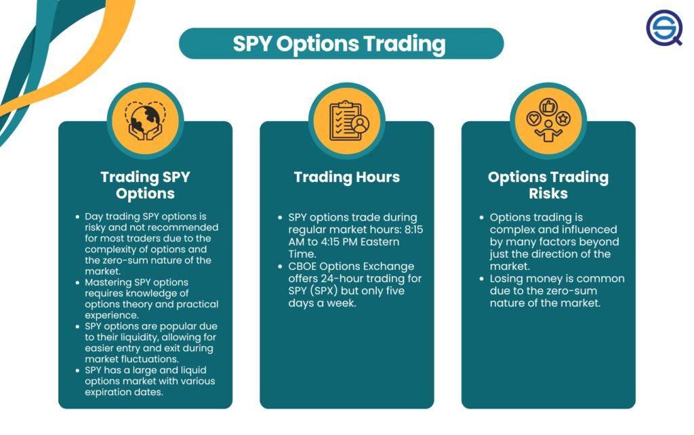

Trading SPY options has become an integral part of algorithmic trading, offering financial market participants an avenue to exploit the intricacies of the stock market with precision and speed. SPY options are derivatives based on the SPDR S&P 500 ETF Trust, a fund that tracks the performance of the S&P 500 index, comprising the 500 largest publicly traded companies in the United States. The widespread popularity of SPY options can be attributed to the robustness and liquidity of the underlying SPY ETF, making them a staple for traders looking to hedge, speculate, or manage portfolio risk effectively. 

The appeal of SPY options lies in their versatility and accessibility. Traders can employ diverse strategies across various market conditions, given the abundant liquidity and extended trading hours of SPY options. This liquidity ensures tight bid-ask spreads, reducing the cost of entering and exiting trades, thus making SPY options an attractive choice for high-frequency traders and large financial institutions alike. Moreover, their availability allows traders to react swiftly to global market events that transpire outside conventional market hours.



Algorithmic trading involves utilizing computer algorithms to automate trading decisions based on pre-defined strategies and criteria. It has revolutionized the landscape of financial trading by enhancing the capability to process large datasets, identify patterns, and execute trades at speeds unreachable by human traders. The primary benefits of algorithmic trading include enhanced accuracy, decreased latency, and the ability to perform simultaneous transactions that minimize the risk of manual errors. This level of automation allows traders to implement complex trading strategies with precision, thereby optimizing potential returns while managing the associated risks.

Incorporating algorithmic trading into SPY options offers traders the potential to exploit pricing inefficiencies and market trends with unparalleled efficiency. This integration harnesses the advantages of algorithmic strategies, such as speed and data analysis, to navigate the volatile terrain of options trading effectively. Consequently, the confluence of SPY options with algorithmic trading methods not only facilitates improved trading performance but also serves as a catalyst for developing robust, data-driven strategies in the ever-evolving financial markets landscape.

## Table of Contents

## Understanding SPY Options

SPY options are derivative financial instruments that represent options contracts on the SPDR S&P 500 ETF Trust (SPY), which aims to track the performance of the S&P 500 Index. SPY options provide traders with the right, but not the obligation, to buy (call options) or sell (put options) the SPY ETF at a predetermined price (exercise or strike price) before or on a specified expiration date. Each SPY option contract typically represents 100 shares of the underlying ETF, making it a flexible tool for leveraging market moves.

The popularity of SPY options stems from their high liquidity and extended trading hours. These options are among the most actively traded, a characteristic that translates into tighter bid-ask spreads and reduced trading costs. They are traded on major options exchanges, including the Chicago Board Options Exchange (CBOE), and are available for trading during regular market hours — 9:30 AM to 4:00 PM Eastern Time — and extended hours in some cases. This accessibility enhances their appeal, enabling traders to execute large [volume](/wiki/volume-trading-strategy) trades with minimal market impact.

Liquidity provides the platform for efficient price discovery in SPY options, but obtaining a statistical edge is crucial for success in trading these derivatives. A statistical edge refers to the probability of a trading strategy performing better than random chance. Developing such an edge is possible through rigorous analysis and modeling, where historical price and [volatility](/wiki/volatility-trading-strategies) data of the SPY options are scrutinized to find recurring patterns or inefficiencies that can be exploited.

Backtesting is a core part of this process, allowing traders to simulate a trading strategy using historical data to evaluate its effectiveness. By recreating trades under various market conditions, traders can measure potential risks and returns, optimizing their strategies before deploying them in live markets. For instance, if using Python, traders might leverage libraries such as pandas for data manipulation and [backtrader](/wiki/backtrader) for [backtesting](/wiki/backtesting):

```python
import pandas as pd
import backtrader as bt

# Load historical SPY data
data = pd.read_csv('SPY_option_data.csv', parse_dates=True, index_col='Date')

# Define a simple moving average strategy
class SMAStrategy(bt.Strategy):
    def __init__(self):
        self.sma = bt.indicators.SimpleMovingAverage(self.data.close, period=15)

    def next(self):
        if self.data.close[0] > self.sma[0]:
            self.buy(size=100)  # Simulate buying 1 option contract
        elif self.data.close[0] < self.sma[0]:
            self.sell(size=100)  # Simulate selling 1 option contract

# Initialize Cerebro engine
cerebro = bt.Cerebro()
cerebro.addstrategy(SMAStrategy)
cerebro.adddata(bt.feeds.PandasData(dataname=data))

# Run backtest
cerebro.run()
```

Through backtesting, traders refine their strategies by adjusting parameters, identifying strengths and weaknesses, and minimizing biases. This process is instrumental in developing a robust statistical edge, which when combined with the inherent [liquidity](/wiki/liquidity-risk-premium) and accessibility of SPY options, makes for a compelling trading opportunity.

## The Role of Algorithmic Trading in SPY Options

Algorithmic trading, a process by which computer algorithms manage the trading of financial instruments, has become integral in the trading of SPY options. This automated trading method utilizes predefined rules and mathematical models to execute trades, which contrasts with traditional human decision-making. The relevance of this approach in options trading, notably with SPY options, derives from its ability to enhance precision, speed, and analytical capacity.

SPY options, which are derivatives tied to the SPDR S&P 500 [ETF](/wiki/etf-trading-strategies) Trust, benefit significantly from [algorithmic trading](/wiki/algorithmic-trading) due to their inherent complexities and the opportunities they present for intricate trading strategies. Algorithmic trading enables market participants to process vast amounts of data, recognized patterns, and execute trades at speeds unattainable by humans, thereby capitalizing on fleeting market conditions that might influence SPY options' prices.

**Automation and Speed**  
One of the primary advantages of algorithmic trading in SPY options is its automation and speed. Computers can make decisions in milliseconds, an important feature in capturing short-lived [arbitrage](/wiki/arbitrage) opportunities. Algorithms are also indifferent to psychological biases, allowing strategies to adhere strictly to mathematical and statistical rules without succumbing to emotional responses. 

For instance, consider a scenario where an algorithm detects a mean reversion opportunity in the SPY options market. It can simultaneously calculate the expected return, determine risk-adjusted position sizes, and execute trades across various accounts without delay. This efficiency far exceeds manual trading capabilities, providing a formidable edge in high-frequency trading environments.

**Efficiency in Complexity Management**  
Algorithmic trading is essential for managing complex SPY options strategies, which may involve multiple legs, covering various strike prices and expiration dates. Such intricate strategies can be implemented seamlessly using well-designed algorithms that observe numerous market variables concurrently.

To manage risk effectively, algorithms can integrate real-time data analysis with options pricing models, such as the Black-Scholes model. Furthermore, they can dynamically adjust positions based on specific risk parameters by continuously monitoring options Greeks (Delta, Gamma, Theta, Vega, Rho). This ensures the strategy is aligned with the desired risk profile, thereby optimizing the portfolio against potential volatilities.

Python, for instance, offers libraries such as NumPy and Pandas for algorithmic modeling and data processing, enabling traders to create robust trading systems. Here's a simple code snippet that might be part of an algorithm to calculate the desired Delta of a SPY options portfolio:

```python
import numpy as np
from scipy.stats import norm

def calculate_delta(S, K, T, r, sigma, option_type='call'):
    # Black-Scholes Delta Calculation
    d1 = (np.log(S / K) + (r + 0.5 * sigma ** 2) * T) / (sigma * np.sqrt(T))
    if option_type == 'call':
        delta = norm.cdf(d1)
    else:
        delta = -norm.cdf(-d1)
    return delta

# Example Usage: 
S = 450  # Current SPY price
K = 455  # Strike price
T = 30/365  # Time to expiration in years
r = 0.01  # Risk-free rate
sigma = 0.20  # Volatility

delta = calculate_delta(S, K, T, r, sigma)
print("Delta:", delta)
```

**Risk Management**  
Automating trades with algorithms doesn't eliminate risk but reallocates it by imposing stringent adherence to predetermined criteria and systematic reviews of market conditions. This process helps in managing risks associated with SPY options by implementing dynamic risk assessments and automatic cut-offs to prevent excessive losses. Algorithms can automatically rebalance portfolios based on pre-set conditions that account for market dynamics, thus preserving capital and enhancing resilience.

Therefore, by integrating algorithmic trading with SPY options, strategies can be executed with unparalleled precision, speed, and control, offering superior management of both strategy complexity and inherent risks.

## Developing an Algorithmic Trading Strategy for SPY Options

Developing an algorithmic trading strategy for SPY options involves a structured approach that begins with defining the strategy's foundational rules, establishing entry and [exit](/wiki/exit-strategy) criteria, and culminates in rigorous back-testing and optimization. This systematic process is crucial for constructing a robust strategy that can navigate the complexities of SPY options trading.

### Defining Strategy Rules

The first step in developing an algorithmic trading strategy for SPY options is to establish clear and concise rules that the algorithm will follow. This involves determining the underlying market assumptions and identifying the specific conditions under which trades should be initiated or closed. Strategy rules should encompass various factors such as time frames, market indicators, and specific patterns or criteria that the algorithm will monitor. For instance, a trader might set rules that look for specific moving average crossovers or relative strength index (RSI) levels to trigger trades.

### Entry and Exit Criteria

Once the strategy rules are defined, the next step is to outline the entry and exit criteria. These criteria determine the precise conditions for initiating and closing a trade. Entry criteria might be based on technical indicators, price movements, or other data-driven insights that signal favorable trading conditions. Similarly, exit criteria should be established to protect against losses and secure profits, often incorporating stop-loss orders or target profit levels. These criteria should be well-defined to ensure the algorithm can operate autonomously and make timely decisions.

### Back-Testing and Optimization

Back-testing is a critical phase that involves testing the algorithm against historical market data to evaluate its performance. This process helps traders understand how their strategy would have performed in past market conditions, allowing them to identify potential weaknesses and areas for improvement. The following Python code snippet illustrates a basic framework for back-testing a trading strategy:

```python
import pandas as pd
import numpy as np

# Load historical data
data = pd.read_csv('spy_options_data.csv')

# Initialize signals
data['Signal'] = 0

# Define a simple strategy: Buy when moving average crossover occurs
short_window = 40
long_window = 100
data['Short_MA'] = data['Close'].rolling(window=short_window, min_periods=1).mean()
data['Long_MA'] = data['Close'].rolling(window=long_window, min_periods=1).mean()
data['Signal'][short_window:] = np.where(data['Short_MA'][short_window:] > data['Long_MA'][short_window:], 1, 0)

# Implement back-test
data['Position'] = data['Signal'].diff()

# Calculate returns
initial_capital = float(10000.0)
data['Portfolio Value'] = initial_capital * (1 + data['Signal'].shift(1) * (data['Close'].pct_change()))

# Print the final portfolio value
print(f"Final Portfolio Value: {data['Portfolio Value'].iloc[-1]:.2f}")
```

Optimization follows back-testing and involves fine-tuning the strategy parameters to enhance performance. This process may include adjusting technical indicator settings, balancing risk and reward, or deciding the optimal size of trades. Optimization should be conducted cautiously to avoid overfitting, where the strategy becomes too tailored to past data and loses effectiveness in real-world scenarios.

In summary, developing an algorithmic trading strategy for SPY options requires a methodical approach that includes setting clear rules, defining precise entry and exit points, and conducting thorough back-testing and optimization. This framework ensures the strategy is not only theoretically sound but also practically viable in the dynamic world of SPY options trading.

## Risk Management in Algorithmic SPY Options Trading

Effective risk management is a cornerstone of algorithmic trading in SPY options, ensuring that potential losses are minimized while maintaining the opportunity for gains. SPY options, which are based on the SPDR S&P 500 ETF Trust, offer a broad market exposure and are subject to various market conditions and volatility. Implementing robust risk management strategies is essential to navigate these challenges.

Dynamic hedging serves as a fundamental risk management technique in SPY options trading. By continuously adjusting the positions in the underlying asset and the options, traders can maintain a neutral portfolio and mitigate potential adverse movements in the market. The process involves balancing the portfolio’s delta, which represents the sensitivity of the option's price to changes in the price of the underlying asset. For instance, a delta-neutral strategy aims to offset the directional risk by ensuring that the portfolio's net delta is zero. This approach requires ongoing calculations and adjustments as market conditions change.

In addition to dynamic hedging, understanding and utilizing options Greeks is critical for risk management. The Greeks, comprising delta, gamma, theta, vega, and rho, quantify various risks associated with options trading:
- **Delta (Δ)** measures the change in the options price relative to the change in the price of the underlying asset.
- **Gamma (Γ)** corresponds to the rate of change in delta, reflecting the curvature of the option's price movement.
- **Theta (Θ)** represents the time decay of an option, showing how its price diminishes as expiration approaches.
- **Vega (V)** indicates the sensitivity of the option's price to changes in volatility.
- **Rho (ρ)** signifies the change in the option's price due to interest rate fluctuations.

Traders can adjust their strategies by monitoring these parameters to manage risk better and enhance decision-making processes.

Beyond the Greeks and hedging, several other protective measures play vital roles in managing risks:

1. **Stop-loss Orders**: Implement stop-loss orders to automatically sell positions that reach a predetermined loss threshold, thereby capping potential losses and protecting capital.

2. **Leverage Management**: Avoid excessive leverage by ensuring that the level of margin used does not expose the portfolio to unsustainable risk, especially during volatile market conditions.

3. **Diversification**: Diversifying the portfolio across various assets or strategies helps spread risk. By not concentrating investments in a single asset class or strategy, traders can reduce the impact of adverse movements in any one area.

Incorporating these risk management techniques enables traders to navigate the complexities of algorithmic trading in SPY options effectively. By balancing risk with potential reward and continuously evaluating market conditions, algorithmic traders can optimize their strategies for greater long-term success.

## Real-world Considerations and Challenges

Trading SPY options presents a variety of real-world challenges that traders must navigate to maintain profitable operations. One significant challenge is liquidity. While SPY options are among the most liquid options available due to the popularity of the SPDR S&P 500 ETF, traders can still encounter issues, especially during periods of heightened market volatility or when dealing with options with less popular strike prices and expiration dates. Insufficient liquidity can lead to increased bid-ask spreads, which, in turn, affects the cost efficiency of entering and exiting positions.

Slippage, the difference between the expected price of a trade and the actual price at which it is executed, is another critical issue. Slippage can significantly affect the profitability of a trading strategy, particularly in fast-moving markets or when large orders are involved. To mitigate slippage, traders often need to utilize advanced order types and execution algorithms designed to minimize impact on the market.

Technological failures present another layer of challenges in algorithmic SPY options trading. Issues such as latency, server downtime, and software bugs can compromise the performance of trading algorithms. Reliable and robust infrastructure is crucial for minimizing the risk of such failures. This includes employing redundant systems, real-time monitoring, and regular maintenance updates to prevent possible disruptions in the trading process.

Unforeseen market events, like geopolitical tensions or sudden macroeconomic shifts, can also have a profound impact on algorithmic trading strategies. These events can lead to extreme price movements that algorithms are not designed to handle, resulting in significant losses. To address these risks, strategies often incorporate elements of [machine learning](/wiki/machine-learning) that allow for adaptive learning and responsiveness. Additionally, it is important to have contingency plans or manual intervention protocols when market conditions deviate dramatically from historical patterns.

Overall, while algorithmic trading of SPY options offers advantages in terms of speed and efficiency, it is imperative for traders to address these real-world challenges proactively as part of their strategy development and daily operations.

## Conclusion and Final Thoughts

Combining SPY options with algorithmic trading techniques offers a multitude of synergistic benefits that enhance the trading process. SPY options—options on the SPDR S&P 500 ETF Trust—are known for their liquidity and narrow bid-ask spreads, making them an attractive choice for traders looking to capitalize on movements in the S&P 500 index. Algorithmic trading facilitates these operations by automating trades, allowing for rapid execution speeds and the ability to handle complex strategies that would be cumbersome to manage manually.

Algorithmic methods enable traders to optimize their strategies by applying sophisticated models and data analysis techniques that uncover profitable patterns in SPY options trading. This fusion allows for continuous monitoring of market conditions, thereby adapting trading strategies in real time to capture opportunities or mitigate risks as they arise. As such, the potential for improved pricing, execution efficiency, and risk management in SPY options trading is significantly amplified with algorithmic assistance.

Continued learning and the adjustment of strategies are essential aspects of success in algorithmic trading with SPY options. The financial markets are dynamic, with ever-changing conditions that require traders to stay informed and flexible. Regularly updating knowledge on algorithmic techniques, market anomalies, and trading strategies is crucial. Participating in webinars, online courses, and workshops are effective ways to sustain this growth.

For those looking to enhance their skills further, there are numerous resources available. Websites like Coursera and Udemy offer courses in algorithmic trading, Python programming for finance, and derivatives markets. Books such as "Algorithmic Trading: Winning Strategies and Their Rationale" by Ernie Chan and "Options, Futures, and Other Derivatives" by John C. Hull provide in-depth knowledge beneficial for mastering SPY options trading. Engaging with communities on platforms like QuantConnect or joining groups focused on algorithmic trading can also provide valuable insights and foster collaborative learning.

In conclusion, the integration of SPY options with algorithmic trading methods holds immense potential for improving trading outcomes. By leveraging the speed and precision of algorithmic systems, traders can gain an edge in the fast-paced financial markets. Continuous learning and strategic refinement are integral to maintaining this edge, enabling traders to adapt and thrive amidst the complexities of the trading world.

## References & Further Reading

[1]: Lopez de Prado, M. (2018). ["Advances in Financial Machine Learning."](https://books.google.com/books/about/Advances_in_Financial_Machine_Learning.html?id=oU9KDwAAQBAJ) Wiley.

[2]: Aronson, D. (2007). ["Evidence-Based Technical Analysis: Applying the Scientific Method and Statistical Inference to Trading Signals."](https://onlinelibrary.wiley.com/doi/book/10.1002/9781118268315) Wiley.

[3]: Jansen, S. (2020). ["Machine Learning for Algorithmic Trading: Predictive models to extract signals from market and alternative data for systematic trading strategies with Python, 2nd Edition."](https://www.amazon.com/Machine-Learning-Algorithmic-Trading-alternative/dp/1839217715) Packt Publishing.

[4]: Chan, E. (2008). ["Quantitative Trading: How to Build Your Own Algorithmic Trading Business."](https://rickorford.com/quantitative-trading/) Wiley.

[5]: Hull, J. C. (2017). ["Options, Futures, and Other Derivatives."](https://www.semanticscholar.org/paper/Options%2C-Futures%2C-and-Other-Derivatives-Hull/89bdee500c8623864fc9eb7a471546aa713acc44) Pearson.