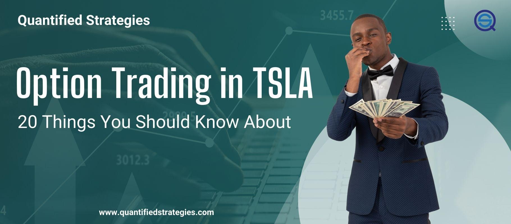

Options trading in Tesla (TSLA) has become a popular avenue for investors seeking to enhance returns while managing risk through the use of financial derivatives. In this context, options are contracts that grant the right—but not the obligation—to buy (call options) or sell (put options) shares of Tesla at a predetermined price, known as the strike price, before a specified expiration date. This framework allows traders to speculate on the future direction of Tesla's stock price or protect existing positions against adverse price movements.

The lucrative potential of options trading in Tesla stems from several factors. First, options offer leverage, allowing traders to control a larger position with a relatively smaller capital outlay, thereby amplifying potential returns. For instance, a call option might provide control over 100 shares of TSLA with a premium cost significantly lower than what it would take to buy those shares outright. Second, options are versatile instruments that can be employed in diverse strategies tailored to varying market conditions and personal investment goals.



However, realizing these profit opportunities requires a comprehensive understanding of the inherent risks and strategic nuances involved. Options trading is not without complexities; it demands familiarity with concepts such as volatility, time decay, and the Greeks—metrics that quantify an option's sensitivity to various factors like price changes and time to expiration. The intricate nature of these products can pose significant risks, including the potential for substantial losses, particularly if market movements are not anticipated accurately.

This article outlines key strategies used in trading Tesla options, focusing on their respective benefits and drawbacks. Additionally, it provides insights into best practices for incorporating algorithmic trading, an increasingly vital tool for executing strategies with speed and precision. Through a methodical approach and ongoing learning, traders can navigate the complexities of Tesla options and align their activities with broader financial objectives.

## Table of Contents

## Understanding Tesla Options and Algo Trading

Options trading is a sophisticated financial activity that involves the use of derivatives to gain leveraged exposure or hedge against price movements of underlying assets, such as Tesla Inc. (TSLA) shares. The fundamental elements of options trading consist of calls, puts, and spreads, which form the building blocks of various trading strategies.

**Option Types:**

1. **Call Options**: A call option provides the owner with the right, not the obligation, to buy the underlying Tesla stock at a specific strike price before the expiration date. Traders typically purchase call options when they anticipate a rise in Tesla's stock price. 

2. **Put Options**: Conversely, a put option grants the holder the right to sell Tesla shares at a predetermined price before the option's expiration. Investors use puts when they predict a decline in the price of TSLA stocks.

3. **Spreads**: Spreads involve simultaneous purchase and sale of options of the same class on the same underlying security, but differing in strike price or expiration date. They can be used to limit losses while reducing upfront costs compared to buying calls or puts outright. Types of spreads include bull spreads, bear spreads, and iron condors, among others.

**Algorithmic Trading in Tesla Options:**

Algorithmic trading refers to the use of automated systems to execute trading strategies at speeds and frequencies that are practically impossible for human traders. In Tesla options trading, algorithmic approaches facilitate the efficient execution of complex strategies by processing large volumes of data to identify trading opportunities.

**Benefits of Algorithmic Trading:**

1. **Speed**: Algorithms are capable of processing market data and executing trades within milliseconds, allowing traders to capitalize on short-lived opportunities that human traders might miss. This is particularly advantageous in the volatile environment of TSLA options, where prices can change rapidly.

2. **Precision**: With algorithmic trading, pre-defined conditions and criteria can be meticulously followed, reducing human errors and emotions that can skew trading decisions. This precision is crucial in Tesla options trading, where small price movements can significantly impact profits or losses.

Integrating [algorithmic trading](/wiki/algorithmic-trading) into Tesla options trading can enhance the efficacy of strategies by ensuring that trades are executed at the best possible prices. Moreover, it allows traders to backtest and refine their strategies against historical data to optimize performance and manage risk effectively. Through the use of algorithms, traders can systematically approach Tesla options trading, maintaining consistent and objective trading practices.

## Pros and Cons of Tesla Options Trading

Options trading in Tesla offers traders the opportunity to significantly amplify their investment returns through leverage and hedging strategies. Leverage allows traders to control a larger position with a relatively small amount of capital, potentially leading to high returns. For instance, purchasing a call option on Tesla shares provides the right, but not the obligation, to buy shares at a specified price, known as the strike price, before the option expires. This setup enables traders to capitalize on upward price movements without owning the stock outright, requiring less capital compared to buying the shares directly.

Hedging, another advantage of Tesla options, allows traders to protect their positions against unfavorable price movements. For example, a trader holding Tesla shares might buy put options to safeguard against potential declines in the stock price. The put options increase in value if Tesla's share price falls, offsetting some or all of the losses from the shares' decreased value. This is a practical way to manage risk in a volatile market environment.

However, despite the lucrative opportunities, Tesla options trading carries substantial risks. One significant risk is the potential for significant losses. Unlike owning the stock, where the maximum loss is the amount invested, options can become worthless at expiration if the underlying stock does not reach the strike price, leading to a total loss of the premium paid for the option.

Moreover, the complexity of options trading requires a thorough understanding and strategic planning. Options have various factors affecting their pricing, such as moneyness, [volatility](/wiki/volatility-trading-strategies), time decay, and more, which traders must consider to make informed decisions. This complexity can be daunting for newcomers who might not fully grasp the nuances of options strategies, leading to possible missteps and financial losses.

The financial commitment and learning curve for retail investors in Tesla options trading can also be substantial. Learning the mechanics of options, market dynamics, as well as developing effective trading strategies demands a significant time investment. Moreover, algorithmic trading tools, which can enhance decision-making, require an initial investment in technology and continuous adaptation to stay effective.

In conclusion, while Tesla options trading provides unique opportunities for leverage and hedging, it comes with its own set of challenges. Investors must weigh the potential for high returns against the risk of losses and the complexities involved, ensuring they are prepared both financially and intellectually to navigate this intricate trading landscape.

## Common Tesla Options Trading Strategies

Tesla options trading involves various strategies that help investors capitalize on market movements. Among these strategies, long calls, long puts, covered calls, and spreads are the most prevalent.

### Long Calls
A long call is an options trading strategy that involves purchasing a call option on Tesla stock. This strategy is ideal when an investor anticipates a significant upward movement in Tesla's stock price. By obtaining the right, but not the obligation, to buy the stock at a predetermined strike price, investors can benefit if the market price rises above this strike price before the option's expiration. The primary advantage of a long call is its potential for unlimited profits with a limited initial investment, which is the premium paid for the option. However, the risk is that if the stock price does not rise as expected, the investor could lose the entire premium.

### Long Puts
Conversely, a long put strategy is employed when an investor expects a downturn in Tesla's stock price. By purchasing a put option, the investor gains the right to sell the stock at a predetermined strike price. This strategy is advantageous in bearish market conditions, allowing investors to profit from a decline in stock price. The maximum loss is limited to the premium paid, offering a controlled risk environment.

### Covered Calls
A covered call strategy involves owning the underlying Tesla stock while simultaneously selling (writing) a call option on the same stock. This strategy is effective in neutral to slightly bullish markets as it generates additional income (from the premium) while potentially limiting the upside if the stock price exceeds the strike price. It serves as a method to enhance returns from a stockholding and offers partial downside protection due to the premium received.

### Spreads
Spreads utilize two or more options to create a trading strategy that limits potential losses and profits. Types of spreads used in Tesla options trading include bull call spreads, bear put spreads, and iron condors. Each involves intricate combinations of long and short positions, providing tailored risk-reward outcomes based on market predictions.

### Algorithmic Trading in Tesla Options
The execution of these strategies can be significantly enhanced by employing algorithmic trading. Algorithms execute trades based on predefined criteria, ensuring speed, accuracy, and elimination of emotional bias. For example:

```python
import numpy as np

def calculate_option_premium(S, K, T, r, sigma, option_type='call'):
    """ Function to calculate the Black-Scholes option premium """
    from scipy.stats import norm

    d1 = (np.log(S / K) + (r + 0.5 * sigma**2) * T) / (sigma * np.sqrt(T))
    d2 = d1 - sigma * np.sqrt(T)

    if option_type == 'call':
        option_price = (S * norm.cdf(d1, 0.0, 1.0) - K * np.exp(-r * T) * norm.cdf(d2, 0.0, 1.0))
    elif option_type == 'put':
        option_price = (K * np.exp(-r * T) * norm.cdf(-d2, 0.0, 1.0) - S * norm.cdf(-d1, 0.0, 1.0))

    return option_price

# Example use
option_premium = calculate_option_premium(S=200, K=210, T=1, r=0.05, sigma=0.25, option_type='call')
print(f"Option Premium: {option_premium}")
```

This Python code snippet demonstrates how algorithms can help in calculating option premiums using the Black-Scholes model. By integrating such computational tools, traders can make informed decisions quickly, ensuring efficient execution and alignment with market opportunities. 

Overall, understanding and strategically executing these options strategies offer the potential for improved investment outcomes in Tesla's often volatile market.

## Selecting the Appropriate Tesla Options Strategy

Selecting the appropriate Tesla options strategy involves careful consideration of various factors such as risk tolerance, market sentiment, and personal investment goals. Understanding these elements can significantly enhance the likelihood of success in the dynamic world of options trading.

### Factors to Consider

**Risk Tolerance**: Before committing to a particular strategy, traders should assess their risk tolerance. Options trading inherently involves substantial risk, and the potential for rapid and significant loss should not be overlooked. High-risk strategies like naked options might suit aggressive traders, while conservative investors may prefer covered calls or spreads that cap potential losses.

**Market Sentiment**: Gauging market sentiment is crucial for timing option trades effectively. Bullish sentiment may prompt the use of call options, expecting the stock price to rise. Conversely, bearish sentiment might lead one to employ put options. Tools such as the Relative Strength Index (RSI) and Moving Averages can help gauge such sentiment by indicating overbought or oversold conditions.

**Investment Goals**: Defining clear investment objectives, whether it is income generation, capital appreciation, or hedging existing positions, can guide the selection of the most appropriate strategy. For instance, long-term investors looking to mitigate risk might opt for protective puts, while those seeking additional income may use covered calls.

### Developing a Personalized Strategy Using Algorithmic Tools

Algorithmic tools can significantly assist in formulating a personalized options strategy by automating complex calculations and implementing trades at high speeds. Traders can develop algorithms to evaluate historical data, analyze current market trends, and execute trades based on predefined criteria, thus reducing emotional bias and enhancing precision.

Here's a simple Python script using the `pandas` library to analyze Tesla stock price movements and assist in decision-making for an options strategy:

```python
import pandas as pd
import numpy as np

# Load historical Tesla stock data
data = pd.read_csv('tesla_stock_data.csv')
data['Moving_Average'] = data['Close'].rolling(window=20).mean()

# Define a simple strategy
conditions = [
    (data['Close'] > data['Moving_Average']),  # Bullish signal
    (data['Close'] < data['Moving_Average'])   # Bearish signal
]
choices = ['Buy Call', 'Buy Put']

# Add strategy column
data['Strategy'] = np.select(conditions, choices, default='Hold')

# Output strategy decisions
print(data[['Date', 'Close', 'Strategy']].tail(10))
```

### Case Study Examples of Successful Tesla Options Strategies

Consider a hypothetical case study where a trader employs a combination of a covered call strategy with algorithmic assistance. By writing (selling) call options on Tesla stock they already own, the trader aims to generate additional income. The algorithm monitors the volatility and employs technical indicators to decide the optimal strike price and expiration date, thereby maximizing premium income while managing risk.

Another example could involve using vertical spreads, which capitalize on anticipated price movements within a specific range. An algorithm, in this case, could simulate various spread combinations and predict outcomes based on different volatility scenarios.

Both cases illustrate how aligning options strategies with risk tolerance, market sentiment, and investment objectives, while leveraging algorithms, can enhance the efficacy of Tesla options trading. Through careful analysis and strategic implementation, traders can tailor their approaches to their financial goals, ultimately achieving a higher success rate in options trading.

## Calculating Returns and Managing Risks

Calculating potential returns on Tesla (TSLA) options involves understanding the dynamics of option pricing and the underlying stock movement. The Black-Scholes model is frequently employed to estimate the theoretical value of options. This model considers variables such as the current stock price, the exercise price of the option, the time to expiration, risk-free [interest rate](/wiki/interest-rate-trading-strategies), and the volatility of Tesla's stock. The formula for a call option is:

$$
C = S_0 \cdot N(d_1) - X \cdot e^{-rT} \cdot N(d_2)
$$

Where:
- $C$ is the call option price
- $S_0$ is the current price of Tesla stock
- $X$ is the exercise price of the option
- $T$ is the time to expiration in years
- $r$ is the risk-free interest rate
- $N(d)$ is the cumulative distribution function of the standard normal distribution
- $d_1 = \frac{\ln(S_0/X) + (r + \sigma^2/2)T}{\sigma \sqrt{T}}$
- $d_2 = d_1 - \sigma \sqrt{T}$

To calculate returns, an options trader must also account for transaction costs, such as brokerage fees and taxes, which can reduce overall profitability.

Risk management is critical in Tesla options trading. Investors often employ stop-loss orders, which automatically execute a sale of an option when it reaches a predetermined price, limiting potential losses. Diversification is another strategy where traders spread investments across different options or asset classes to mitigate risks associated with any single position.

Backtesting plays a vital role in risk assessment and strategy refinement. It involves testing a trading strategy on historical data to evaluate its potential performance. Utilizing Python for [backtesting](/wiki/backtesting) can be beneficial, as shown in this example script:

```python
import pandas as pd
import numpy as np
import matplotlib.pyplot as plt

# Simulated Tesla stock prices and option strategies
tesla_prices = pd.Series(np.random.normal(700, 100, 252))
strike_price = 750
option_prices = pd.Series([max(price - strike_price, 0) for price in tesla_prices])

# Calculate daily returns
returns = option_prices.pct_change().fillna(0)

# Plot results
plt.figure(figsize=(10, 6))
plt.plot(option_prices, label='Option Prices')
plt.xlabel('Days')
plt.ylabel('Price')
plt.title('Tesla Option Price Fluctuations')
plt.legend()
plt.show()

# Calculate overall return and risk metrics
total_return = option_prices.iloc[-1] / option_prices.iloc[0] - 1
volatility = returns.std() * np.sqrt(252)

print(f"Total Return: {total_return:.2f}")
print(f"Annualized Volatility: {volatility:.2f}")
```

This code simulates Tesla option prices and calculates the returns and volatility, allowing traders to understand the risk-reward profile of their strategies. By systematically analyzing these metrics, traders can refine their strategies to achieve a balance between potential returns and acceptable risk levels.

## Best Practices for Tesla Options in Algo Trading

Leveraging technical analysis and market sentiment data are crucial best practices in Tesla options trading, especially when employing algorithmic strategies. Technical analysis involves the study of historical market data, primarily price and [volume](/wiki/volume-trading-strategy), to forecast future price movements. This analysis often includes the use of indicators such as moving averages, Relative Strength Index (RSI), and Bollinger Bands. These indicators help traders identify trends and potential reversal points, which are vital for making informed options trading decisions.

In algorithmic trading, incorporating these technical indicators into automated strategies can significantly enhance trading efficiency. For example, a simple moving average crossover strategy might involve purchasing a call option when a short-term moving average crosses above a long-term moving average, signaling a potential upward trend. 

Python, a popular language for algorithmic trading, facilitates the implementation of such strategies through libraries like Pandas for data manipulation and TA-Lib for technical analysis. A basic implementation might look like this:

```python
import pandas as pd
import talib

# Sample data assumed to be a DataFrame with 'close' prices
data['SMA_50'] = talib.SMA(data['close'], timeperiod=50)
data['SMA_200'] = talib.SMA(data['close'], timeperiod=200)

# Buy signal: When 50-day SMA is greater than 200-day SMA
data['Signal'] = 0.0
data['Signal'][50:] = np.where(data['SMA_50'][50:] > data['SMA_200'][50:], 1.0, 0.0)
```

Market sentiment analysis, on the other hand, examines the general mood of investors towards Tesla, gauged from social media, news articles, and other online platforms. Sentiment analysis can be automated using natural language processing (NLP) techniques to evaluate the positivity or negativity of text data. For instance, the VADER sentiment analysis tool in Python can process large volumes of text quickly, providing valuable sentiment scores that can influence trading strategies.

Continuous monitoring and adjustment of algorithm parameters are imperative to maintaining the effectiveness of trading strategies. Market conditions can change rapidly, and algorithms must be flexible enough to adapt to these shifts. Parameters such as stop-loss levels, take-profit margins, and technical indicator thresholds should be periodically reviewed and adjusted based on performance metrics and changes in market volatility. This ongoing refinement is akin to the process of overfitting in [machine learning](/wiki/machine-learning), where models must be adjusted to generalize well to unseen data.

Staying updated with Tesla-related market news and trends is another essential practice. Tesla, being a highly dynamic and influential company, often experiences price movements driven by product announcements, earnings reports, and other corporate developments. Traders should incorporate news sentiment into their algorithmic strategies to capture these fundamental catalysts. Automated news feeds and alerts can keep traders informed of major events, ensuring they remain agile in their trading approach.

In summary, the successful execution of Tesla options trading using algorithms relies on leveraging technical analysis, accurately assessing market sentiment, and maintaining a proactive approach to strategy adjustment and news monitoring. By following these best practices, traders can enhance their decision-making process, maintain a competitive edge, and optimize their trading outcomes.

## Challenges and Common Mistakes

Tesla options trading presents numerous opportunities, yet it also exposes traders to various challenges and common mistakes. Engaging in this market segment without adequate preparation and understanding can lead to significant pitfalls.

One prevalent issue is overtrading. Traders may become overconfident and execute too many trades in a short period, often driven by the allure of potential gains. This behavior can lead to premature exhaustion of capital, increased transaction costs, and suboptimal decision-making. To mitigate overtrading, it is essential to have a well-defined strategy and stick to it rigorously. Traders should establish entry and [exit](/wiki/exit-strategy) criteria based on comprehensive analysis and avoid straying from these guidelines.

Lack of preparation is another critical mistake. Successful options trading requires thorough research and a strong grasp of both financial and market dynamics. Traders should continuously update themselves with the latest news on Tesla and the automotive sector, as these can significantly impact stock and options prices. Furthermore, understanding fundamental concepts such as implied volatility, delta, gamma, and other Greeks is crucial for evaluating options pricing and risk.

Emotional trading often leads to poor decisions, characterized by impulsive and reactionary moves in response to market fluctuations. Systematic algorithmic trading approaches help avoid this pitfall. By relying on algorithms that are designed to execute trades based on predefined rules and conditions, traders can minimize emotional interference. These algorithms can be programmed using Python with libraries such as `NumPy` and `Pandas` to handle data processing, while `TA-Lib` can be used for technical analysis:

```python
import numpy as np
import pandas as pd
import talib

# Example code for a moving average strategy
def moving_average_strategy(data):
    short_window = 10
    long_window = 50

    signals = pd.DataFrame(index=data.index)
    signals['signal'] = 0.0

    # Short moving average
    signals['short_mavg'] = talib.SMA(data['Close'].values, short_window)
    # Long moving average
    signals['long_mavg'] = talib.SMA(data['Close'].values, long_window)

    # Generate signals
    signals['signal'][short_window:] = np.where(
        signals['short_mavg'][short_window:] > signals['long_mavg'][short_window:], 1.0, 0.0)

    # Generate trading orders
    signals['positions'] = signals['signal'].diff()

    return signals
```

Education is paramount. Traders should invest time in learning about options trading mechanisms, strategies, and market behavior. Numerous online platforms, courses, and forums provide valuable resources for gaining and enhancing knowledge. Staying informed about the tax implications of options trading is equally important, as they can significantly affect net profit. Tax rates vary depending on jurisdiction, and options are often taxed differently from standard stock trades. Consulting with a tax professional or using tax software designed for traders can offer clarity and ensure compliance.

In conclusion, addressing these challenges through disciplined strategies, education, and risk management enables traders to enhance their Tesla options trading experience. By integrating systematic approaches and maintaining a prepared mindset, traders can better navigate the complexities of the market and work towards achieving their financial objectives.

## Conclusion

Tesla options trading presents significant opportunities for investors when approached with well-informed and strategic decision-making. The incorporation of algorithmic strategies in options trading can vastly improve the accuracy and efficiency of trade executions, thereby enhancing decision-making capabilities. Algorithms offer the distinct advantage of minimizing human emotional biases, which often lead to impulsive trading decisions that can adversely affect performance. By implementing systematic trading methods, investors can effectively assess market conditions and make data-driven decisions that align with their financial objectives.

Continuous learning is essential for success in Tesla options trading. The financial markets are dynamic, with ever-changing factors that influence Tesla's stock performance. Investors must dedicate time to understanding new trading strategies and market trends to ensure that their strategies remain relevant and effective. Additionally, investors should regularly review and adapt their strategies, using insights gained from both successes and challenges, to better align with their personal financial goals.

By embracing a disciplined approach that combines algorithmic precision with ongoing education, traders can exploit the dynamic opportunities offered by Tesla options trading, ultimately enhancing their potential for achieving desired financial outcomes.

## FAQs on Tesla Options Trading

Options trading in Tesla (TSLA) can be a complex yet rewarding endeavor. Below are critical questions and insights that traders often have about this process.

### What are the key terms and strategies in Tesla options trading?

Options trading includes various terminologies that may seem daunting to newcomers. Here are important terms:

- **Call Option:** This is a contract giving the buyer the right, but not the obligation, to buy TSLA shares at a specific price (strike price) within a specified time frame.

- **Put Option:** A contract that allows the buyer to sell TSLA shares at the strike price before the expiration date.

- **Spread:** Involves buying and selling different options on the same underlying asset to exploit expected price movements with limited risk.

Popular strategies include:

- **Long Calls and Puts:** Useful for benefiting from price increases or decreases, respectively.

- **Covered Calls:** Involves holding the underlying TSLA shares while selling call options to generate additional income.

- **Strategic Spreads:** Reduce risk and enhance potential profits under various market conditions.

### How do I choose the right broker for Tesla options trading?

Selecting a broker is crucial for successful options trading. Consider the following when choosing a broker:

1. **Commission and Fees:** Different brokers have varied fee structures. Traders should seek brokers offering competitive rates and transparency in fee disclosure.

2. **Platform Usability:** A user-friendly platform with robust analytical tools is essential. Ensure the broker provides comprehensive resources for strategy development.

3. **Support and Resources:** Look for brokers offering educational resources, responsive customer support, and access to market research.

### What are the considerations for protecting profits?

Protecting profits in Tesla options trading involves several techniques:

- **Stop-Loss Orders:** Establish predetermined sell points to mitigate losses.

- **Diversification:** Spreading investments across various strategies reduces the impact of adverse price movements in any single position.

- **Hedging:** Using put options to hedge against potential declines in share prices.

### How do traders determine if Tesla options trading aligns with their financial objectives?

Taking part in Tesla options trading should align with individual risk tolerance and financial goals. Traders should:

- **Assess Risk Tolerance:** Determine the level of risk acceptable in alignment with financial goals.

- **Market Analysis:** Regular evaluation of market conditions and Tesla’s performance is vital.

- **Strategic Planning:** Develop a comprehensive plan including entry and exit points and risk management strategies.

Tesla options trading can enhance a portfolio, but it requires diligent planning and adherence to fundamental strategies to manage risk effectively. Whether you're new to this space or refining existing strategies, understanding core concepts and aligning them with financial goals is paramount.

## References & Further Reading

[1]: Black, F., & Scholes, M. (1973). "The Pricing of Options and Corporate Liabilities." Journal of Political Economy, 81(3), 637–654. [DOI: 10.1086/260062](https://www.cs.princeton.edu/courses/archive/fall09/cos323/papers/black_scholes73.pdf)

[2]: Hull, J. C. (2018). ["Options, Futures, and Other Derivatives"](https://www.pearson.com/nl/en_NL/higher-education/subject-catalogue/finance/Options-Futures-and-Other-Derivatives-Hull.html) (10th Edition). Pearson.

[3]: Jarrow, R. A., & Turnbull, S. M. (1996). "Derivatives Securities." South-Western College Publishing.

[4]: Lopez de Prado, M. (2018). ["Advances in Financial Machine Learning."](https://www.amazon.com/Advances-Financial-Machine-Learning-Marcos/dp/1119482089) Wiley.

[5]: Chan, E. (2009). ["Quantitative Trading: How to Build Your Own Algorithmic Trading Business."](https://github.com/ftvision/quant_trading_echan_book) Wiley Trading.

[6]: Aronson, D. R. (2006). ["Evidence-Based Technical Analysis: Applying the Scientific Method and Statistical Inference to Trading Signals."](https://www.amazon.com/Evidence-Based-Technical-Analysis-Scientific-Statistical/dp/0470008741) John Wiley & Sons.

[7]: Jansen, S. (2018). ["Machine Learning for Algorithmic Trading."](https://books.google.com/books/about/Hands_On_Machine_Learning_for_Algorithmi.html?id=tx2CDwAAQBAJ) Packt Publishing.

[8]: Pardo, R. (2011). ["The Evaluation and Optimization of Trading Strategies."](https://onlinelibrary.wiley.com/doi/book/10.1002/9781119196969) Wiley Trading.