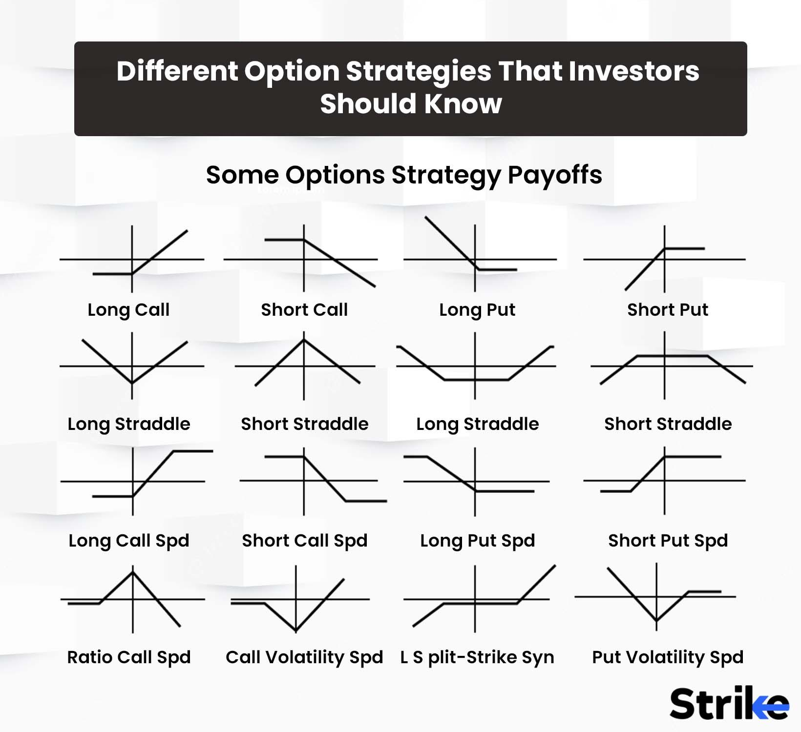

## Table of Contents

## What is option writing and how does it differ from option buying?

Option writing, also known as selling options, is when an investor creates and sells an option contract to another party. When you write an option, you are obligated to buy or sell the underlying asset at the strike price if the buyer decides to exercise the option. This can be risky because if the market moves against you, you could face significant losses. However, option writers receive a premium from the buyer upfront, which can be a source of income if the option expires worthless.

Option buying, on the other hand, is when an investor purchases an option contract from a writer. When you buy an option, you have the right, but not the obligation, to buy or sell the underlying asset at the strike price before the option expires. This gives you more flexibility and potentially unlimited profit if the market moves in your favor. The downside is that you pay a premium to the writer, and if the option expires worthless, you lose the entire premium.

In summary, the main difference between option writing and option buying lies in the obligations and potential risks and rewards. Option writers have the obligation to fulfill the contract if exercised, which can lead to higher risk but also the potential to earn premiums. Option buyers have the right to exercise the option, which offers more flexibility and potential for profit, but they risk losing the premium paid if the option expires worthless.

## What are the basic types of options: calls and puts?

A call option gives you the right to buy a stock at a certain price, called the strike price, before the option expires. When you buy a call option, you're hoping the stock price will go up. If it does, you can buy the stock at the lower strike price and then sell it at the higher market price to make a profit. If the stock price doesn't go up, you can just let the option expire and you'll only lose the money you paid for the option, which is called the premium.

A put option gives you the right to sell a stock at a certain price before the option expires. When you buy a put option, you're hoping the stock price will go down. If it does, you can buy the stock at the lower market price and then sell it at the higher strike price to make a profit. If the stock price doesn't go down, you can let the option expire and you'll only lose the premium you paid for the option.

Both call and put options can be used for different strategies. Calls are often used when you think a stock will rise, while puts are used when you think a stock will fall. They can also be used to hedge against potential losses in your stock portfolio.

## What is a long option strategy and how does it work?

A long option strategy means you buy an option, either a call or a put. When you buy a call option, you're betting that the price of the stock will go up. If it does, you can use your option to buy the stock at a lower price than it's currently trading at, and then sell it at the higher market price to make a profit. If the stock price doesn't go up, you can just let the option expire and you'll only lose the money you paid for the option.

When you buy a put option, you're betting that the price of the stock will go down. If it does, you can use your option to sell the stock at a higher price than it's currently trading at, and then buy it back at the lower market price to make a profit. If the stock price doesn't go down, you can let the option expire and you'll only lose the money you paid for the option. In both cases, the most you can lose is the money you paid for the option, which is called the premium.

## What is a short option strategy and what are the risks involved?

A short option strategy means you sell an option, either a call or a put. When you sell a call option, you're betting that the price of the stock won't go up much. If it doesn't, the buyer of the option won't use it, and you get to keep the money they paid you for the option. But if the stock price goes up a lot, the buyer can use the option to buy the stock from you at a lower price than it's trading at, and you'll lose money. When you sell a put option, you're betting that the price of the stock won't go down much. If it doesn't, the buyer won't use the option, and you get to keep the money they paid you. But if the stock price goes down a lot, the buyer can use the option to sell the stock to you at a higher price than it's trading at, and you'll lose money.

The risks with a short option strategy can be big. When you sell an option, you can lose a lot more money than you made from selling it. If you sell a call option and the stock price goes up a lot, you have to sell the stock at a lower price than it's trading at, which can cost you a lot of money. If you sell a put option and the stock price goes down a lot, you have to buy the stock at a higher price than it's trading at, which can also cost you a lot of money. This is why short option strategies are considered more risky than long option strategies, where the most you can lose is the money you paid for the option.

## How do premiums work in option writing and what factors affect them?

When you write an option, you get paid a premium by the person who buys the option from you. This premium is like a fee that the buyer pays for the right to use the option. The amount of the premium depends on a few things. One big thing is how likely it is that the option will be used. If the stock price is close to the strike price, the option is more likely to be used, so the premium will be higher. Another thing that affects the premium is how much time is left until the option expires. The more time there is, the more chance there is for the stock price to move, so the premium will be higher.

Other things that can change the premium are how much the stock price moves around, called [volatility](/wiki/volatility-trading-strategies), and the general interest rates. If the stock price moves a lot, the premium will be higher because there's more chance the option will be used. If interest rates go up, the premium might go up a bit too. All these things together decide how much money you get when you write an option. It's important to understand these factors because they help you figure out if writing an option is a good idea for you.

## What are the key differences between writing covered and naked options?

Writing a covered option means you own the stock you're writing an option for. When you write a covered call, you own the stock and you agree to sell it at a certain price if the buyer uses the option. This can be less risky because if the stock price goes up and the buyer uses the option, you just sell the stock you already own. You make money from the premium and maybe some profit from the stock. But if the stock price goes down, you might lose money on the stock, but you still keep the premium.

Writing a naked option means you don't own the stock you're writing an option for. When you write a naked call, you're promising to sell a stock you don't own at a certain price if the buyer uses the option. This can be very risky because if the stock price goes up a lot, you have to buy the stock at the higher price and sell it at the lower price you promised, which can cost you a lot of money. Writing naked puts is also risky because if the stock price goes down a lot, you have to buy the stock at the higher price you promised. So, naked options can lead to bigger losses than covered options.

## How can an investor use long and short strategies to hedge a portfolio?

An investor can use long and short strategies to hedge a portfolio by buying put options or selling call options. When you buy a put option, you're protecting your portfolio from a big drop in stock prices. If the stock price goes down, the put option lets you sell the stock at a higher price than it's trading at, which can help you lose less money. This is like having insurance for your stocks. If the stock price stays the same or goes up, you just lose the money you paid for the put option, but your stocks are still worth the same or more.

Selling call options, or writing covered calls, is another way to hedge. When you write a covered call, you agree to sell your stock at a certain price if the buyer uses the option. This can help you make some extra money from the premium you get, and it can also limit how much you lose if the stock price goes down. But if the stock price goes up a lot, you might have to sell your stock at a lower price than it's trading at, which means you won't make as much money as you could have. So, you need to think about how much you want to protect your portfolio and how much risk you're okay with.

## What are the tax implications of profits and losses from option writing?

When you make money from writing options, you have to pay taxes on those profits. The tax rate depends on how long you held the option. If you held it for less than a year, the profit is considered short-term capital gain, and you'll pay your regular income tax rate on it. If you held it for more than a year, it's a long-term capital gain, and you'll pay a lower tax rate, usually between 0% and 20%, depending on your income. The money you get from selling the option, called the premium, is also taxed as income when you receive it.

If you lose money from writing options, you can use those losses to reduce your taxes. You can subtract your losses from your gains for the year. If your losses are more than your gains, you can use up to $3,000 of the extra loss to reduce your other income, like your salary. If you still have losses left over after that, you can [carry](/wiki/carry-trading) them over to future years to use against future gains or income. This can help lower your taxes in those years.

## How does the time decay (theta) affect long and short option strategies?

Time decay, or theta, is how the value of an option goes down as it gets closer to the day it expires. When you buy an option, like a call or a put, time decay works against you. The longer you hold the option, the less it's worth because there's less time for the stock price to move in your favor. So, if you're using a long option strategy, you want the stock price to move quickly in the direction you want. If it doesn't, the option will lose value every day, and you might lose the money you paid for it.

When you write an option, time decay can help you. If you sell a call or a put option, you want the option to expire without being used. As time goes by, the option loses value, which is good for you because you keep the money, called the premium, that the buyer paid you. So, if you're using a short option strategy, time decay is your friend. It makes the option less likely to be used, and you can keep the premium as profit. Just remember, there's still risk if the stock price moves a lot against you.

## What advanced strategies combine long and short options, such as straddles and strangles?

A straddle is an advanced option strategy where you buy a call option and a put option at the same time, with the same strike price and expiration date. You do this when you think the stock price will move a lot, but you're not sure which way it will go. If the stock price goes up a lot, the call option will make you money. If it goes down a lot, the put option will make you money. But if the stock price doesn't move much, you'll lose the money you paid for both options. So, you need the stock to move a lot to make this strategy work.

A strangle is another advanced strategy where you buy a call option and a put option at the same time, but with different strike prices. The call option has a higher strike price, and the put option has a lower strike price. Like a straddle, you use a strangle when you think the stock price will move a lot, but you're not sure which way. The good thing about a strangle is that it's cheaper than a straddle because the options are less likely to be used. But you still need the stock to move a lot to make money, or you'll lose the money you paid for the options.

## How can volatility (vega) be used to enhance option writing strategies?

Volatility, or vega, is how much the price of an option changes when the stock price moves around a lot. When you write options, you can use volatility to make more money. If you think the stock price will stay the same or not move much, you can write options when the volatility is high. This means you'll get a bigger premium from the buyer because they're paying more for the chance that the stock price will move a lot. If the stock price doesn't move much, the option will expire without being used, and you get to keep the big premium.

On the other hand, if you think the stock price will move a lot, you might want to be careful about writing options. High volatility can make the option more likely to be used, which means you could lose money if the stock price moves against you. So, you need to think about how much the stock price might move and decide if the premium you get is worth the risk. By understanding and using volatility, you can make smarter choices about when to write options and how to manage the risks.

## What are the best practices for managing and adjusting long and short option positions?

When you have long option positions, like buying calls or puts, it's important to keep an eye on the stock price and how much time is left until the option expires. If the stock price is moving in the direction you want, you might want to sell the option to make a profit before it loses too much value from time decay. If the stock price isn't moving much or is going the wrong way, you might want to sell the option to cut your losses. You can also think about rolling the option, which means selling the current option and buying a new one with a different strike price or expiration date. This can give you more time for the stock price to move in your favor.

For short option positions, like writing calls or puts, you need to be ready to manage the risk if the stock price moves against you. One way to do this is by buying back the option you sold if the stock price is moving a lot. This can help you limit your losses, but it will cost you the premium you got when you sold the option. Another way to manage short positions is by using a stop-loss order, which automatically closes your position if the stock price reaches a certain level. You can also roll your short position by buying back the current option and selling a new one with a different strike price or expiration date. This can help you adjust to changes in the stock price and keep the premium coming in.

Both long and short option positions need careful watching and quick action. By staying on top of things and making smart adjustments, you can make the most of your options and keep your risks under control.

## References & Further Reading

[1]: Bergstra, J., Bardenet, R., Bengio, Y., & Kégl, B. (2011). ["Algorithms for Hyper-Parameter Optimization."](https://dl.acm.org/doi/10.5555/2986459.2986743) Advances in Neural Information Processing Systems 24.

[2]: ["Advances in Financial Machine Learning"](https://www.amazon.com/Advances-Financial-Machine-Learning-Marcos/dp/1119482089) by Marcos Lopez de Prado

[3]: ["Evidence-Based Technical Analysis: Applying the Scientific Method and Statistical Inference to Trading Signals"](https://www.amazon.com/Evidence-Based-Technical-Analysis-Scientific-Statistical/dp/0470008741) by David Aronson

[4]: ["Machine Learning for Algorithmic Trading"](https://github.com/stefan-jansen/machine-learning-for-trading) by Stefan Jansen

[5]: ["Quantitative Trading: How to Build Your Own Algorithmic Trading Business"](https://www.amazon.com/Quantitative-Trading-Build-Algorithmic-Business/dp/1119800064) by Ernest P. Chan